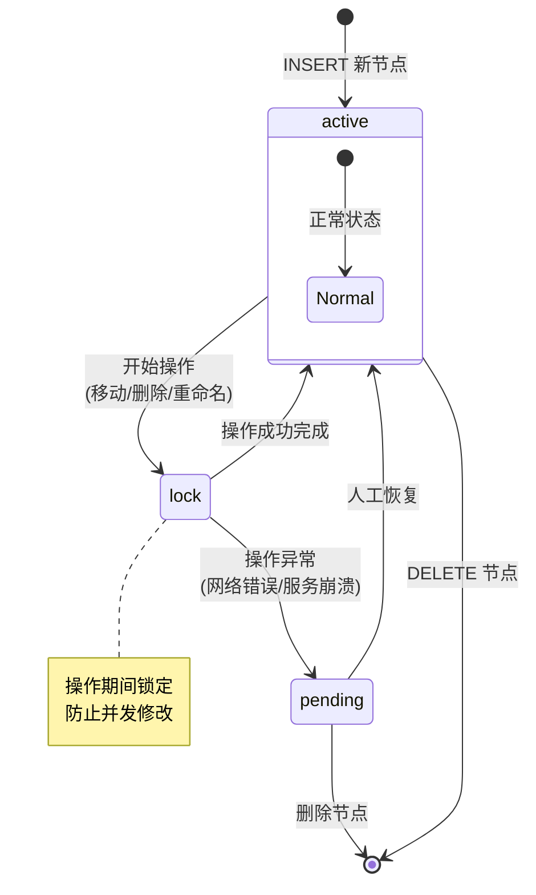
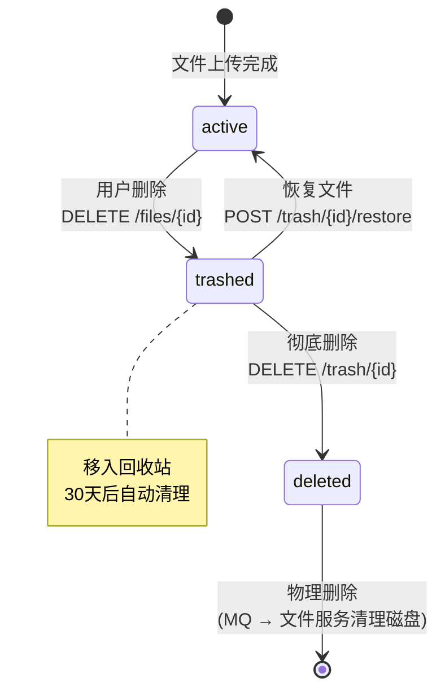
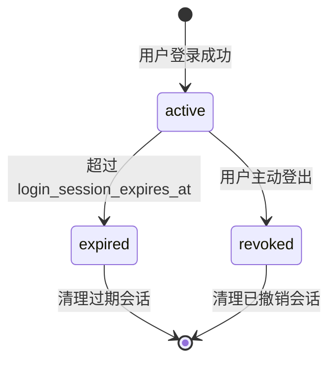
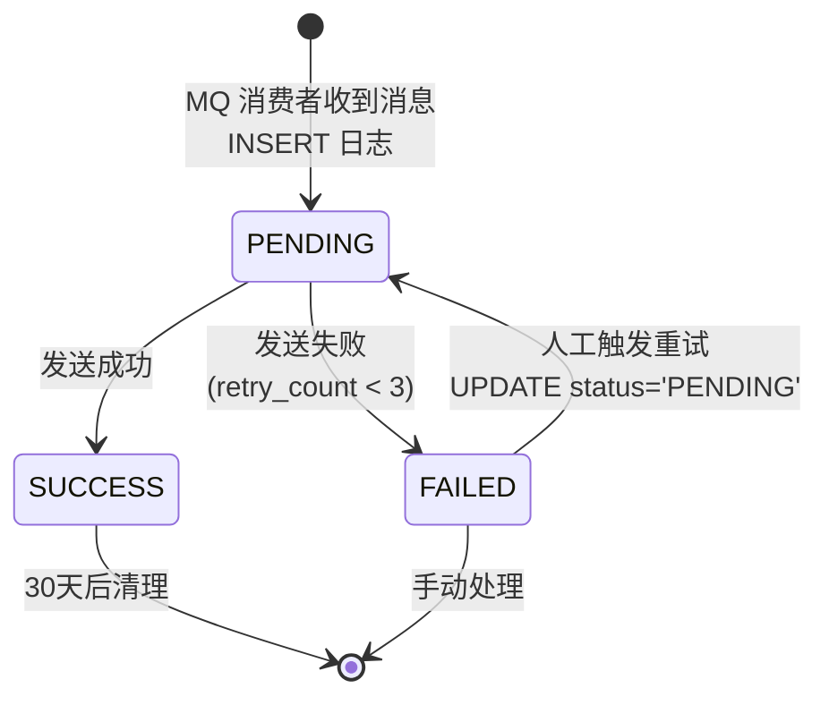

# PrivateCloudDisk-db

私有云盘系统数据库初始化脚本，包含完整的 MySQL 8.0 建表语句、索引定义、外键约束和注释说明。

---

## 数据库概览

- **数据库名**：`private_cloud_disk`
- **引擎**：InnoDB
- **字符集**：utf8mb4
- **主键策略**：全局使用 `BINARY(16)` 存储 UUID（不可遍历，安全性更高）
- **外键策略**：级联删除 (`ON DELETE CASCADE`)，保证数据一致性

---

## 表结构总览

数据库结构由基础初始化脚本和增量迁移共同组成，当前包含用户认证、文件目录、上传、分享、回收站、收藏、标签、配额、空间、预览资源、文件处理生命周期及自动化相关表。不要在文档中固化表数量；请以本目录 SQL 文件的执行顺序和实际迁移结果为准。

本次授权安全增量：`011_share_download_permission.sql` 为分享链接增加 `share_allow_download`（历史数据默认允许）；`012_recent_share_access.sql` 为最近访问增加 `ra_access_source` 与 `ra_share_resource_id`，用于区分普通空间下载和分享资源下载，且不把分享虚拟 ID 当作真实 file_id。

公开空间 Git 资源增量：`014_space_resource_type.sql` 为 `pcd_space_table` 增加 `resource_type`，历史空间回填 `file`；Git Service 的 `pcd_git_*` 表位于独立 `pcd_git` Schema，由 `PrivateCloudDisk-git-service/db/migration/V1__git_core.sql` 自管理，不与主业务库建立跨服务外键。

### 用户与认证

| 表名 | 说明 | 主键 | 关键索引 |
|------|------|------|----------|
| `pcd_user_info_table` | 用户信息表 | `user_id` (BINARY(16)) | `user_account` UNIQUE, `user_phone_number` UNIQUE, `user_email` UNIQUE |
| `pcd_user_device_table` | 用户登录设备表 | `device_id` (BINARY(16)) | `idx_device_user_status(device_user_id, device_status)` |
| `pcd_login_session_table` | 登录会话表 | `login_session_id` (BINARY(16)) | `idx_login_session_user_status`, `idx_login_session_device_status`, `idx_login_session_jti` |
| `pcd_login_audit_table` | 登录审计表 | `audit_id` (BIGINT AUTO_INCREMENT) | `idx_login_audit_user_time`, `idx_login_audit_account_time`, `idx_login_audit_ip_time` |

### 目录树与文件

| 表名 | 说明 | 主键 | 关键索引 |
|------|------|------|----------|
| `pcd_directory_tree_table` | 目录树节点表 | `node_id` (BINARY(16)) | `uk_directory_tree(node_id, node_user_id, node_parent_id)` UNIQUE |
| `pcd_directory_closure_table` | 目录树闭包表 | `(ancestor_id, descendant_id)` | `uk_descendant(user_id, descendant_id, ancestor_id)`, `idx_depth(depth)` |
| `pcd_file_info_table` | 文件信息表 | `file_id` (BINARY(16)) | `uk_file_info(file_id, file_author_id, file_node_id)` UNIQUE |

### 上传管理

| 表名 | 说明 | 主键 | 关键索引 |
|------|------|------|----------|
| `pcd_uploads_session_table` | 文件上传会话表 | `uploads_id` (BINARY(16)) | - |
| `pcd_upload_chunks_table` | 文件切片表 | `(chunk_uploads_id, chunk_index)` | - |

### 回收站与收藏

| 表名 | 说明 | 主键 | 关键索引 |
|------|------|------|----------|
| `pcd_trash_target_table` | 回收站表 | `trash_id` (BIGINT AUTO_INCREMENT) | `idx_user_deleted(trash_user_id, trash_deleted_at)`, `idx_expires(trash_expires_at)` |
| `pcd_file_star_table` | 文件收藏表 | `star_id` (BIGINT AUTO_INCREMENT) | `uk_user_file(star_user_id, star_file_id)` UNIQUE, `idx_user_starred` |

### 配额与分享

| 表名 | 说明 | 主键 | 关键索引 |
|------|------|------|----------|
| `pcd_user_quota_table` | 用户存储配额表 | `quota_id` (BIGINT AUTO_INCREMENT) | `quota_user_id` UNIQUE, `idx_user_id` |
| `pcd_user_quota_log_table` | 配额变更日志表 | `quota_log_id` (BIGINT AUTO_INCREMENT) | `idx_user_id_time` |
| `pcd_sharing_Link_mange_table` | 文件分享链接管理表 | `sharing_link_id` (BINARY(16)) | - |

### 通知

| 表名 | 说明 | 主键 | 关键索引 |
|------|------|------|----------|
| `pcd_notification_send_log_table` | 通知发送日志表 | `id` (BIGINT AUTO_INCREMENT) | `uk_event_channel_receiver` UNIQUE, `idx_status`, `idx_created_at` |

---

## 核心表详解

### 用户信息表 `pcd_user_info_table`

```sql
CREATE TABLE pcd_user_info_table (
    user_name               VARCHAR(120)    NOT NULL        COMMENT '用户名',
    user_id                 BINARY(16)     NOT NULL PRIMARY KEY,
    user_phone_number       VARCHAR(50)     NOT NULL UNIQUE,
    user_image_path         VARCHAR(512)                    COMMENT '用户头像路径',
    user_password           VARCHAR(70)     NOT NULL        COMMENT '用户密码 (BCrypt)',
    user_account            VARCHAR(70)     NOT NULL UNIQUE COMMENT '用户账号',
    user_email              VARCHAR(70)     UNIQUE          COMMENT '用户邮箱'
);
```

- `user_id` 使用 BINARY(16) 存储 UUID，防止 ID 遍历攻击
- `user_password` 存储 BCrypt 哈希值
- 账号、手机号、邮箱全局唯一

### 目录树表 `pcd_directory_tree_table`

```sql
CREATE TABLE pcd_directory_tree_table (
    node_id          BINARY(16)     NOT NULL PRIMARY KEY,
    node_user_id     BINARY(16)     NOT NULL,
    node_parent_id   BINARY(16)                       COMMENT '父节点ID，根节点为NULL',
    node_name        VARCHAR(200)    NOT NULL,
    node_create_time TIMESTAMP       NOT NULL DEFAULT NOW(),
    node_status      ENUM('lock', 'active', 'pending') DEFAULT 'active'
);
```

**设计亮点**：
- `node_parent_id` 自引用外键，形成树形结构
- `node_status` 状态机：`active` → `lock`(操作中) → `pending`(待确认)
- 联合唯一约束 `(node_id, node_user_id, node_parent_id)` 防止重复

### 闭包表 `pcd_directory_closure_table`

```sql
CREATE TABLE pcd_directory_closure_table (
    user_id          BINARY(16)     NOT NULL,
    ancestor_id      BINARY(16)     NOT NULL,
    descendant_id    BINARY(16)     NOT NULL,
    depth            INT             NOT NULL,
    PRIMARY KEY (ancestor_id, descendant_id)
);
```

**闭包表优势**：
- 查询某节点的所有后代（含深层）：`WHERE ancestor_id = ?` 一次查询
- 查询某节点的所有祖先：`WHERE descendant_id = ? ORDER BY depth DESC`
- 移动节点仅需更新受影响的闭包记录，无需遍历
- 注意：避免过深的目录层级（建议 ≤ 10 层），否则闭包表会变大

**示例数据**：
```
目录结构:  root → A → B → C

闭包记录:
(root, root, 0)
(A,    A, 0)
(B,    B, 0)
(C,    C, 0)
(root, A, 1), (root, B, 2), (root, C, 3)
(A,    B, 1), (A,    C, 2)
(B,    C, 1)
```

### 文件信息表 `pcd_file_info_table`

```sql
CREATE TABLE pcd_file_info_table (
    file_name               VARCHAR(150)    NOT NULL,
    file_uploaded_time      TIMESTAMP       NOT NULL DEFAULT NOW(),
    file_size               BIGINT          NOT NULL,
    file_type               VARCHAR(60)     NOT NULL,
    file_author_id          BINARY(16)     NOT NULL,
    file_id                 BINARY(16)     NOT NULL PRIMARY KEY,
    file_checksum           VARCHAR(256)    NOT NULL                COMMENT 'SHA-256 校验值',
    file_total_chunks       INT             NOT NULL                COMMENT '总分片数',
    file_node_id            BINARY(16)     NOT NULL                COMMENT '所在目录节点',
    file_storage_path       VARCHAR(512)    NOT NULL                COMMENT '物理存储路径',
    file_status             ENUM('active', 'deleted', 'trashed') NOT NULL DEFAULT 'active'
);
```

- `file_checksum` 存储文件 SHA-256，用于完整性校验和去重
- `file_storage_path` 指向文件服务的物理存储路径
- `file_status` 三态：`active` (正常) / `trashed` (回收站) / `deleted` (已彻底删除)

### 上传会话表 `pcd_uploads_session_table`

```sql
CREATE TABLE pcd_uploads_session_table (
    uploads_id              BINARY(16)     NOT NULL PRIMARY KEY,
    uploads_user_id         BINARY(16)     NOT NULL,
    uploads_total_chunks    INT             NOT NULL,
    uploads_starting_time   TIMESTAMP       NOT NULL DEFAULT NOW(),
    uploads_endding_time    TIMESTAMP       NOT NULL,
    uploads_file_size       BIGINT          NOT NULL,
    uploads_file_checksum   VARCHAR(256)    NOT NULL,
    uploads_chunks_max_size INT             NOT NULL,
    uploads_file_name       VARCHAR(150)    NOT NULL,
    uploads_file_type       VARCHAR(60)     NOT NULL,
    uploads_node_id         BINARY(16)     NOT NULL,
    uploads_status          ENUM('uploading','completed','canceled')
                            DEFAULT 'uploading'
                            COMMENT '仅跟踪分块接收与合并任务触发，不表示后处理状态'
);
```

上传会话只覆盖客户端到服务端的传输生命周期：创建会话后为 `uploading`；客户端调用合并接口成功、合并任务已发布后立即为 `completed`；用户取消或过期清理时为 `canceled`。文件合并、病毒扫描、内容预处理和增强状态由文件元数据及其任务流水线独立记录，不再写回上传会话。

### 回收站表 `pcd_trash_target_table`

```sql
CREATE TABLE pcd_trash_target_table (
    trash_id                BIGINT          PRIMARY KEY AUTO_INCREMENT,
    trash_target_id         BINARY(16)     NOT NULL COMMENT '原目标ID',
    trash_target_type       ENUM('file', 'folder') NOT NULL,
    trash_user_id           BINARY(16)     NOT NULL,
    trash_file_name         VARCHAR(150)    NOT NULL,
    trash_file_type         VARCHAR(60)     NOT NULL,
    trash_file_size         BIGINT          NOT NULL,
    trash_original_node_id  BINARY(16)     NOT NULL COMMENT '原节点ID',
    trash_deleted_at        DATETIME        NOT NULL DEFAULT CURRENT_TIMESTAMP,
    trash_expires_at        DATETIME        NOT NULL COMMENT '自动清理时间'
);
```

- 软删除机制：文件删除后移至回收站，保留原节点信息以便恢复
- `trash_expires_at` 自动清理时间（如 30 天后）
- 支持文件和文件夹两种目标类型

### 配额表 `pcd_user_quota_table`

```sql
CREATE TABLE pcd_user_quota_table (
    quota_id              BIGINT          PRIMARY KEY AUTO_INCREMENT,
    quota_user_id         BINARY(16)     NOT NULL UNIQUE,
    quota_total_capacity  BIGINT          NOT NULL DEFAULT 10737418240 COMMENT '10GB',
    quota_used_capacity   BIGINT          NOT NULL DEFAULT 0,
    quota_file_count      INT             NOT NULL DEFAULT 0,
    quota_version         INT             NOT NULL DEFAULT 0 COMMENT '乐观锁',
    ...
);
```

- 默认配额 10GB (10 * 1024^3)
- `quota_version` 乐观锁版本号，保证并发更新安全

### 通知发送日志表 `pcd_notification_send_log_table`

```sql
CREATE TABLE pcd_notification_send_log_table (
    id              BIGINT       NOT NULL AUTO_INCREMENT,
    event_id        VARCHAR(255) NOT NULL,
    channel         VARCHAR(20)  NOT NULL COMMENT 'EMAIL/SMS',
    receiver        VARCHAR(255) NOT NULL,
    user_id         BINARY(16) DEFAULT NULL,
    status          VARCHAR(20)  NOT NULL COMMENT 'PENDING/SUCCESS/FAILED',
    retry_count     INT          NOT NULL DEFAULT 0,
    error_message   VARCHAR(1000),
    ...
    UNIQUE KEY uk_event_channel_receiver (event_id, channel, receiver)
);
```

**幂等性设计**：`(event_id, channel, receiver)` 唯一索引保证同一消息不会被重复发送。

---

## Mermaid ER 关系图

```mermaid
erDiagram
    pcd_user_info_table ||--o{ pcd_user_device_table : "拥有"
    pcd_user_info_table ||--o{ pcd_login_session_table : "拥有"
    pcd_user_info_table ||--o{ pcd_login_audit_table : "审计"
    pcd_user_info_table ||--o{ pcd_file_info_table : "上传"
    pcd_user_info_table ||--o{ pcd_uploads_session_table : "发起"
    pcd_user_info_table ||--o{ pcd_user_quota_table : "分配"
    pcd_user_info_table ||--o{ pcd_user_quota_log_table : "记录"
    pcd_user_info_table ||--o{ pcd_trash_target_table : "产生"
    pcd_user_info_table ||--o{ pcd_file_star_table : "收藏"
    pcd_user_info_table ||--o{ pcd_directory_tree_table : "创建"
    pcd_user_info_table ||--o{ pcd_notification_send_log_table : "接收"

    pcd_user_device_table ||--o{ pcd_login_session_table : "关联"

    pcd_file_info_table ||--o{ pcd_sharing_Link_mange_table : "分享"
    pcd_file_info_table ||--o{ pcd_file_star_table : "被收藏"

    pcd_directory_tree_table ||--o| pcd_directory_tree_table : "parent → child"
    pcd_directory_tree_table ||--o{ pcd_directory_closure_table : "祖先/后代"
    pcd_directory_tree_table ||--o{ pcd_file_info_table : "包含"
    pcd_directory_tree_table ||--o{ pcd_uploads_session_table : "目标"

    pcd_uploads_session_table ||--o{ pcd_upload_chunks_table : "切片"

    pcd_user_info_table {
        BINARY16 user_id PK "UUID主键"
        VARCHAR user_name "用户名"
        VARCHAR user_phone_number UK "手机号"
        VARCHAR user_image_path "头像路径"
        VARCHAR user_password "BCrypt哈希"
        VARCHAR user_account UK "登录账号"
        VARCHAR user_email UK "邮箱"
    }

    pcd_user_device_table {
        BINARY16 device_id PK "设备UUID"
        BINARY16 device_user_id FK "用户ID"
        VARCHAR device_client_type "WEB/IOS/MACOS"
        VARCHAR device_client_name "设备名称"
        VARCHAR device_platform "系统平台"
        VARCHAR device_user_agent_hash "UA哈希"
        TEXT device_public_key "设备公钥"
        DATETIME device_created_at "创建时间"
        DATETIME device_last_seen_at "最后活跃"
        ENUM device_status "active/disabled/revoked"
    }

    pcd_login_session_table {
        BINARY16 login_session_id PK "会话UUID"
        BINARY16 login_session_user_id FK "用户ID"
        BINARY16 login_session_device_id FK "设备ID"
        BINARY16 login_session_token_jti "JWT jti"
        VARCHAR login_session_client_ip "客户端IP"
        VARCHAR login_session_user_agent "UA"
        DATETIME login_session_started_at "开始时间"
        DATETIME login_session_expires_at "过期时间"
        DATETIME login_session_revoked_at "撤销时间"
        ENUM login_session_status "active/expired/revoked"
    }

    pcd_login_audit_table {
        BIGINT audit_id PK "自增ID"
        BINARY16 audit_user_id FK "用户ID"
        VARCHAR audit_account "登录账号"
        VARCHAR audit_phone_number "登录手机号"
        TINYINT audit_success "是否成功"
        VARCHAR audit_failure_reason "失败原因"
        VARCHAR audit_client_ip "客户端IP"
        VARCHAR audit_user_agent "UA"
        DATETIME audit_created_at "审计时间"
    }

    pcd_file_info_table {
        BINARY16 file_id PK "文件UUID"
        VARCHAR file_name "文件名"
        TIMESTAMP file_uploaded_time "上传时间"
        BIGINT file_size "文件大小字节"
        VARCHAR file_type "MIME类型"
        BINARY16 file_author_id FK "作者用户ID"
        VARCHAR file_checksum "SHA-256"
        INT file_total_chunks "分片总数"
        BINARY16 file_node_id FK "所在目录节点"
        VARCHAR file_storage_path "物理存储路径"
        ENUM file_status "active/trashed/deleted"
    }

    pcd_sharing_Link_mange_table {
        BINARY16 sharing_link_id PK "分享链接UUID"
        VARCHAR sharing_link_path "链接路径"
        BINARY16 sharing_link_file_id FK "关联文件ID"
        TIMESTAMP sharing_link_valid_starting_time "有效期开始"
        TIMESTAMP sharing_link_valid_endding_time "有效期结束"
        VARCHAR sharing_link_password "访问密码"
    }

    pcd_uploads_session_table {
        BINARY16 uploads_id PK "会话UUID"
        BINARY16 uploads_user_id FK "用户ID"
        INT uploads_total_chunks "总分片数"
        TIMESTAMP uploads_starting_time "开始时间"
        TIMESTAMP uploads_endding_time "结束时间"
        BIGINT uploads_file_size "文件大小"
        VARCHAR uploads_file_checksum "SHA-256"
        INT uploads_chunks_max_size "分片最大大小"
        VARCHAR uploads_file_name "文件名"
        VARCHAR uploads_file_type "MIME类型"
        BINARY16 uploads_node_id FK "目标目录节点"
        ENUM uploads_status "状态机"
    }

    pcd_upload_chunks_table {
        BINARY16 chunk_uploads_id PK_FK "会话ID"
        INT chunk_index PK "分片序号"
        ENUM chunk_status "pending/uploading/uploaded/failed"
        VARCHAR chunk_storage_path "存储路径"
        TIMESTAMP chunk_uploaded_time "上传时间"
    }

    pcd_directory_tree_table {
        BINARY16 node_id PK "节点UUID"
        BINARY16 node_user_id FK "用户ID"
        BINARY16 node_parent_id FK "父节点ID(自引用)"
        VARCHAR node_name "节点名称"
        TIMESTAMP node_create_time "创建时间"
        ENUM node_status "lock/active/pending"
    }

    pcd_directory_closure_table {
        BINARY16 user_id FK "用户ID"
        BINARY16 ancestor_id PK_FK "祖先节点"
        BINARY16 descendant_id PK_FK "后代节点"
        INT depth "层级深度"
    }

    pcd_user_quota_table {
        BIGINT quota_id PK "自增ID"
        BINARY16 quota_user_id UK_FK "用户ID"
        BIGINT quota_total_capacity "总额度(默认10GB)"
        BIGINT quota_used_capacity "已用容量"
        INT quota_file_count "文件数量"
        INT quota_version "乐观锁版本号"
        DATETIME quota_created_at "创建时间"
        DATETIME quota_updated_at "更新时间"
    }

    pcd_user_quota_log_table {
        BIGINT quota_log_id PK "自增ID"
        BINARY16 quota_log_user_id FK "用户ID"
        VARCHAR quota_log_change_type "变更类型"
        BIGINT quota_log_change_bytes "变更字节数"
        BIGINT quota_log_before_total "变更前总额"
        BIGINT quota_log_after_total "变更后总额"
        BIGINT quota_log_before_used "变更前已用"
        BIGINT quota_log_after_used "变更后已用"
        VARCHAR quota_log_operator "操作人"
        DATETIME quota_log_created_at "创建时间"
    }

    pcd_file_star_table {
        BIGINT star_id PK "自增ID"
        BINARY16 star_user_id FK "用户ID"
        BINARY16 star_file_id FK "文件ID"
        DATETIME star_starred_at "收藏时间"
    }

    pcd_trash_target_table {
        BIGINT trash_id PK "自增ID"
        BINARY16 trash_target_id "原目标ID"
        ENUM trash_target_type "file/folder"
        BINARY16 trash_user_id FK "用户ID"
        VARCHAR trash_file_name "文件名"
        VARCHAR trash_file_type "文件类型"
        BIGINT trash_file_size "文件大小"
        BINARY16 trash_original_node_id "原始目录"
        DATETIME trash_deleted_at "删除时间"
        DATETIME trash_expires_at "过期(自动清理)"
    }

    pcd_notification_send_log_table {
        BIGINT id PK "自增ID"
        VARCHAR event_id UK "事件唯一ID"
        VARCHAR channel "EMAIL/SMS"
        VARCHAR receiver UK "接收者"
        BINARY16 user_id FK "关联用户ID"
        VARCHAR status "PENDING/SUCCESS/FAILED"
        INT retry_count "重试次数"
        VARCHAR error_message "错误信息"
        DATETIME created_at "创建时间"
        DATETIME updated_at "更新时间"
    }
```

---

## 完整表字段说明

### 1. `pcd_user_info_table` — 用户信息表

| 字段 | 类型 | 约束 | 说明 |
|------|------|------|------|
| `user_id` | BINARY(16) | PK | UUID 主键，不可遍历 |
| `user_name` | VARCHAR(120) | NOT NULL | 用户显示名称 (昵称) |
| `user_phone_number` | VARCHAR(50) | NOT NULL, UNIQUE | 手机号 (全局唯一) |
| `user_image_path` | VARCHAR(512) | - | 头像文件路径 |
| `user_password` | VARCHAR(70) | NOT NULL | BCrypt 密码哈希 (60字符 + 盐) |
| `user_account` | VARCHAR(70) | NOT NULL, UNIQUE | 登录账号 (全局唯一, 注册时自动生成) |
| `user_email` | VARCHAR(70) | UNIQUE | 邮箱地址 (全局唯一) |

**索引策略**:
- `user_id` (PRIMARY KEY) — 主键查询
- `user_account` (UNIQUE) — 账号登录查询
- `user_phone_number` (UNIQUE) — 手机号登录查询
- `user_email` (UNIQUE) — 邮箱登录查询

### 2. `pcd_user_device_table` — 用户登录设备表

| 字段 | 类型 | 约束 | 说明 |
|------|------|------|------|
| `device_id` | BINARY(16) | PK | 服务端生成的设备 UUID |
| `device_user_id` | BINARY(16) | FK, NOT NULL | 所属用户 ID (级联删除) |
| `device_client_type` | VARCHAR(50) | NOT NULL | 客户端类型: `WEB` / `IOS` / `MACOS` / `WECHAT` / `PC` |
| `device_client_name` | VARCHAR(120) | - | 客户端展示名称 (如 Chrome / Safari) |
| `device_platform` | VARCHAR(120) | - | 操作系统或平台信息 |
| `device_user_agent_hash` | VARCHAR(64) | - | User-Agent 规范化后的 SHA-256 哈希 |
| `device_public_key` | TEXT | - | 设备密钥绑定的公钥 (可选, 用于无密码认证) |
| `device_created_at` | DATETIME | NOT NULL, DEFAULT NOW() | 设备首次注册时间 |
| `device_last_seen_at` | DATETIME | NOT NULL, DEFAULT NOW() | 设备最后活跃时间 |
| `device_status` | ENUM | NOT NULL, DEFAULT 'active' | `active` / `disabled` / `revoked` |

**索引策略**:
- `idx_device_user_status(device_user_id, device_status)` — 查询用户所有活跃设备

### 3. `pcd_login_session_table` — 登录会话表

| 字段 | 类型 | 约束 | 说明 |
|------|------|------|------|
| `login_session_id` | BINARY(16) | PK | 服务端签发的会话 ID (sid) |
| `login_session_user_id` | BINARY(16) | FK, NOT NULL | 登录用户 ID |
| `login_session_device_id` | BINARY(16) | FK | 关联设备 ID (设备被删除时 SET NULL) |
| `login_session_token_jti` | BINARY(16) | - | 登录 JWT 的 jti (用于撤销单个令牌) |
| `login_session_client_ip` | VARCHAR(64) | - | 登录时的客户端 IP |
| `login_session_user_agent` | VARCHAR(512) | - | 登录时的 User-Agent |
| `login_session_started_at` | DATETIME | NOT NULL, DEFAULT NOW() | 会话开始时间 |
| `login_session_expires_at` | DATETIME | NOT NULL | 会话过期时间 |
| `login_session_revoked_at` | DATETIME | - | 会话撤销时间 (主动登出) |
| `login_session_status` | ENUM | NOT NULL, DEFAULT 'active' | `active` / `expired` / `revoked` |

**索引策略**:
- `idx_login_session_user_status(login_session_user_id, login_session_status)` — 查询用户活跃会话
- `idx_login_session_device_status(login_session_device_id, login_session_status)` — 按设备查询会话
- `idx_login_session_jti(login_session_token_jti)` — 按 JWT jti 查询 (撤销令牌)

### 4. `pcd_login_audit_table` — 登录审计表

| 字段 | 类型 | 约束 | 说明 |
|------|------|------|------|
| `audit_id` | BIGINT | PK, AUTO_INCREMENT | 自增主键 |
| `audit_user_id` | BINARY(16) | FK | 匹配到的用户 ID (登录失败时可为 NULL) |
| `audit_account` | VARCHAR(100) | - | 尝试登录的账号 |
| `audit_phone_number` | VARCHAR(50) | - | 尝试登录的手机号 |
| `audit_success` | TINYINT(1) | NOT NULL | 是否登录成功 (0/1) |
| `audit_failure_reason` | VARCHAR(120) | - | 失败原因 (如 "密码错误", "账号不存在") |
| `audit_client_ip` | VARCHAR(64) | - | 客户端 IP 地址 |
| `audit_user_agent` | VARCHAR(512) | - | User-Agent |
| `audit_created_at` | DATETIME | NOT NULL, DEFAULT NOW() | 审计记录时间 |

**索引策略**:
- `idx_login_audit_user_time(audit_user_id, audit_created_at)` — 按用户查询审计日志
- `idx_login_audit_account_time(audit_account, audit_created_at)` — 按账号查询审计日志
- `idx_login_audit_ip_time(audit_client_ip, audit_created_at)` — 按 IP 查询 (安全分析)

### 5. `pcd_file_info_table` — 文件信息表

| 字段 | 类型 | 约束 | 说明 |
|------|------|------|------|
| `file_id` | BINARY(16) | PK | 文件 UUID |
| `file_name` | VARCHAR(150) | NOT NULL | 文件名称 (含扩展名) |
| `file_uploaded_time` | TIMESTAMP | NOT NULL, DEFAULT NOW() | 文件上传时间 |
| `file_size` | BIGINT | NOT NULL | 文件大小 (字节) |
| `file_type` | VARCHAR(60) | NOT NULL | MIME 类型 (如 `image/png`, `application/pdf`) |
| `file_author_id` | BINARY(16) | FK, NOT NULL | 文件作者/上传者 ID |
| `file_checksum` | VARCHAR(256) | NOT NULL | SHA-256 文件校验值 (完整性 + 去重) |
| `file_total_chunks` | INT | NOT NULL | 上传时的总分片数 |
| `file_node_id` | BINARY(16) | FK, NOT NULL | 文件所在目录节点 ID |
| `file_storage_path` | VARCHAR(512) | NOT NULL | 物理存储路径 (文件服务可定位) |
| `file_status` | ENUM | NOT NULL, DEFAULT 'active' | `active` / `trashed` / `deleted` |

**索引策略**:
- `uk_file_info(file_id, file_author_id, file_node_id)` — 联合唯一约束

### 6. `pcd_sharing_Link_mange_table` — 文件分享链接管理表

| 字段 | 类型 | 约束 | 说明 |
|------|------|------|------|
| `sharing_link_id` | BINARY(16) | PK | 分享链接 UUID |
| `sharing_link_path` | VARCHAR(512) | NOT NULL | 分享链接路径 (用于生成分享 URL) |
| `sharing_link_file_id` | BINARY(16) | FK, NOT NULL | 关联的文件 ID |
| `sharing_link_valid_starting_time` | TIMESTAMP | NOT NULL, DEFAULT NOW() | 分享有效期开始时间 |
| `sharing_link_valid_endding_time` | TIMESTAMP | NOT NULL | 分享有效期结束时间 |
| `sharing_link_password` | VARCHAR(60) | - | 访问密码 (可选, BCrypt 哈希) |

### 7. `pcd_uploads_session_table` — 文件上传会话表

| 字段 | 类型 | 约束 | 说明 |
|------|------|------|------|
| `uploads_id` | BINARY(16) | PK | 上传会话 UUID |
| `uploads_user_id` | BINARY(16) | FK, NOT NULL | 上传用户 ID |
| `uploads_total_chunks` | INT | NOT NULL | 上传切片总数 |
| `uploads_starting_time` | TIMESTAMP | NOT NULL, DEFAULT NOW() | 上传开始时间 |
| `uploads_endding_time` | TIMESTAMP | NOT NULL | 上传截止时间 (超时时间) |
| `uploads_file_size` | BIGINT | NOT NULL | 文件总大小 (字节) |
| `uploads_file_checksum` | VARCHAR(256) | NOT NULL | SHA-256 文件校验值 |
| `uploads_chunks_max_size` | INT | NOT NULL | 每切片最大大小 (默认 5MB) |
| `uploads_file_name` | VARCHAR(150) | NOT NULL | 文件名称 |
| `uploads_file_type` | VARCHAR(60) | NOT NULL | MIME 类型 |
| `uploads_node_id` | BINARY(16) | FK, NOT NULL | 目标目录节点 ID |
| `uploads_status` | ENUM(`uploading`,`completed`,`canceled`) | DEFAULT 'uploading' | 仅跟踪传输与合并任务触发 |

### 8. `pcd_upload_chunks_table` — 文件切片表

| 字段 | 类型 | 约束 | 说明 |
|------|------|------|------|
| `chunk_uploads_id` | BINARY(16) | PK (联合), FK | 关联上传会话 ID |
| `chunk_index` | INT | PK (联合) | 切片索引 (从 1 开始) |
| `chunk_status` | ENUM | DEFAULT 'pending' | `pending` / `uploading` / `uploaded` / `failed` |
| `chunk_storage_path` | VARCHAR(512) | NOT NULL | 切片物理存储路径 |
| `chunk_uploaded_time` | TIMESTAMP | NOT NULL, DEFAULT NOW() | 切片上传完成时间 |

**设计原理**: 联合主键 `(chunk_uploads_id, chunk_index)` 保证同一会话的同一索引只有一条记录，支持断点续传查询。

### 9. `pcd_directory_tree_table` — 目录树节点表

| 字段 | 类型 | 约束 | 说明 |
|------|------|------|------|
| `node_id` | BINARY(16) | PK | 节点 UUID |
| `node_user_id` | BINARY(16) | FK, NOT NULL | 所属用户 ID |
| `node_parent_id` | BINARY(16) | FK (自引用) | 父节点 ID (根节点为 NULL) |
| `node_name` | VARCHAR(200) | NOT NULL | 节点名称 (文件/文件夹名) |
| `node_create_time` | TIMESTAMP | NOT NULL, DEFAULT NOW() | 节点创建时间 |
| `node_status` | ENUM | DEFAULT 'active' | `lock` / `active` / `pending` |

**索引策略**:
- `uk_directory_tree(node_id, node_user_id, node_parent_id)` — 联合唯一约束

### 10. `pcd_directory_closure_table` — 目录树闭包表

| 字段 | 类型 | 约束 | 说明 |
|------|------|------|------|
| `user_id` | BINARY(16) | FK, NOT NULL | 所属用户 ID |
| `ancestor_id` | BINARY(16) | PK (联合), FK | 祖先节点 ID |
| `descendant_id` | BINARY(16) | PK (联合), FK | 后代节点 ID |
| `depth` | INT | NOT NULL | 层级深度 (父子=1, 祖孙=2, …) |

**索引策略**:
- `PRIMARY KEY(ancestor_id, descendant_id)` — 核心查询
- `uk_descendant(user_id, descendant_id, ancestor_id)` — 查某节点的所有祖先
- `idx_depth(depth)` — 按深度过滤 (避免过深目录)

### 11. `pcd_user_quota_table` — 用户存储配额表

| 字段 | 类型 | 约束 | 说明 |
|------|------|------|------|
| `quota_id` | BIGINT | PK, AUTO_INCREMENT | 自增主键 |
| `quota_user_id` | BINARY(16) | FK, UNIQUE, NOT NULL | 用户 ID (一对一) |
| `quota_total_capacity` | BIGINT | NOT NULL, DEFAULT 10GB | 总额度 (字节) |
| `quota_used_capacity` | BIGINT | NOT NULL, DEFAULT 0 | 已用容量 (字节) |
| `quota_file_count` | INT | NOT NULL, DEFAULT 0 | 已上传文件数量 |
| `quota_version` | INT | NOT NULL, DEFAULT 0 | 乐观锁版本号 (并发控制) |
| `quota_created_at` | DATETIME | NOT NULL, DEFAULT NOW() | 配额创建时间 |
| `quota_updated_at` | DATETIME | NOT NULL, DEFAULT NOW() ON UPDATE | 配额更新时间 |

**乐观锁使用示例**:
```sql
UPDATE pcd_user_quota_table
SET quota_used_capacity = quota_used_capacity + 5242880,
    quota_file_count = quota_file_count + 1,
    quota_version = quota_version + 1
WHERE quota_user_id = ? AND quota_version = ?
-- 如果 affected_rows = 0，则发生并发冲突，需要重试
```

### 12. `pcd_user_quota_log_table` — 配额变更日志表

| 字段 | 类型 | 约束 | 说明 |
|------|------|------|------|
| `quota_log_id` | BIGINT | PK, AUTO_INCREMENT | 自增主键 |
| `quota_log_user_id` | BINARY(16) | FK, NOT NULL | 用户 ID |
| `quota_log_change_type` | VARCHAR(20) | NOT NULL | 变更类型: `EXPAND` / `REDUCE` / `FILE_UPLOAD` / `FILE_DELETE` |
| `quota_log_change_bytes` | BIGINT | NOT NULL | 变更字节数 (正=增加, 负=减少) |
| `quota_log_before_total` | BIGINT | - | 变更前总额度 |
| `quota_log_after_total` | BIGINT | - | 变更后总额度 |
| `quota_log_before_used` | BIGINT | - | 变更前已用 |
| `quota_log_after_used` | BIGINT | - | 变更后已用 |
| `quota_log_operator` | VARCHAR(50) | DEFAULT 'SYSTEM' | 操作人/系统 |
| `quota_log_created_at` | DATETIME | NOT NULL, DEFAULT NOW() | 日志时间 |

### 13. `pcd_file_star_table` — 文件收藏表

| 字段 | 类型 | 约束 | 说明 |
|------|------|------|------|
| `star_id` | BIGINT | PK, AUTO_INCREMENT | 自增主键 |
| `star_user_id` | BINARY(16) | FK, NOT NULL | 用户 ID |
| `star_file_id` | BINARY(16) | FK, NOT NULL | 文件 ID |
| `star_starred_at` | DATETIME | NOT NULL, DEFAULT NOW() | 收藏时间 |

**索引策略**:
- `uk_user_file(star_user_id, star_file_id)` UNIQUE — 同一用户不能重复收藏同一文件
- `idx_user_starred(star_user_id, star_starred_at)` — 按收藏时间排序

### 14. `pcd_trash_target_table` — 回收站表

| 字段 | 类型 | 约束 | 说明 |
|------|------|------|------|
| `trash_id` | BIGINT | PK, AUTO_INCREMENT | 自增主键 |
| `trash_target_id` | BINARY(16) | NOT NULL | 原文件/文件夹 ID |
| `trash_target_type` | ENUM | NOT NULL | `file` / `folder` |
| `trash_user_id` | BINARY(16) | FK, NOT NULL | 用户 ID |
| `trash_file_name` | VARCHAR(150) | NOT NULL | 文件名称 (用于展示) |
| `trash_file_type` | VARCHAR(60) | NOT NULL | 文件类型 |
| `trash_file_size` | BIGINT | NOT NULL | 文件大小 |
| `trash_original_node_id` | BINARY(16) | NOT NULL | 原始目录节点 ID (恢复时使用) |
| `trash_deleted_at` | DATETIME | NOT NULL, DEFAULT NOW() | 删除时间 |
| `trash_expires_at` | DATETIME | NOT NULL | 过期时间 (超期自动清理) |

**索引策略**:
- `idx_user_deleted(trash_user_id, trash_deleted_at)` — 查询用户回收站列表
- `idx_expires(trash_expires_at)` — 定时任务扫描过期条目

### 15. `pcd_notification_send_log_table` — 通知发送日志表

| 字段 | 类型 | 约束 | 说明 |
|------|------|------|------|
| `id` | BIGINT | PK, AUTO_INCREMENT | 自增主键 |
| `event_id` | VARCHAR(255) | NOT NULL | 事件唯一 ID (生产者生成) |
| `channel` | VARCHAR(20) | NOT NULL | 通道: `EMAIL` / `SMS` |
| `receiver` | VARCHAR(255) | NOT NULL | 接收者 (邮箱地址或手机号) |
| `user_id` | BINARY(16) | FK | 关联用户 ID (可为空) |
| `status` | VARCHAR(20) | NOT NULL | 状态: `PENDING` / `SUCCESS` / `FAILED` |
| `retry_count` | INT | NOT NULL, DEFAULT 0 | 重试次数 |
| `error_message` | VARCHAR(1000) | - | 失败时的错误信息 (截断至 1000 字符) |
| `created_at` | DATETIME | NOT NULL, DEFAULT NOW() | 创建时间 |
| `updated_at` | DATETIME | NOT NULL, DEFAULT NOW() ON UPDATE | 更新时间 |

**索引策略**:
- `uk_event_channel_receiver(event_id, channel, receiver)` UNIQUE — 幂等性核心: 同一事件+通道+接收者只有一条记录
- `idx_status(status)` — 查询所有 FAILED 记录进行人工重试
- `idx_created_at(created_at)` — 历史数据清理 (建议保留 30 天)

---

## 状态机设计

### 目录节点状态机 `node_status`



| 状态 | 含义 | 允许的操作 |
|------|------|-----------|
| `active` | 正常状态 | 读取、修改、删除 |
| `lock` | 操作中锁定 | 仅读取、等待解锁 |
| `pending` | 异常待处理 | 仅管理员操作 |

### 上传会话状态机 `uploads_status`

| 状态 | 含义 | 触发条件 |
|------|------|----------|
| `uploading` | 正在接收分块 | 创建会话、分块上传期间 |
| `completed` | 分块已保存且合并任务已触发 | `POST /business/uploads/{id}/complete` 成功返回后立即设置 |
| `canceled` | 用户取消或过期清理 | 取消接口、过期会话清理或合并失败后的分块清理 |

合并、扫描、内容预处理和增强失败不再写入上传会话状态；文件后处理状态由文件元数据接口/任务事件提供。合并成功或最终失败且分块已清理后，平台删除上传会话及其分块元数据记录。

### 文件状态机 `file_status`



| 状态 | 含义 | 说明 |
|------|------|------|
| `active` | 正常可访问 | 默认状态 |
| `trashed` | 在回收站中 | 软删除, 保留原数据 30 天 |
| `deleted` | 已彻底删除 | 仅元数据标记, MQ 异步清理物理文件 |

### 登录会话状态机 `login_session_status`



### 通知发送状态机 `notification_status`



---

## 索引设计原理

### 索引分类

| 索引类型 | 用途 | 示例 |
|----------|------|------|
| **主键索引** | 行级唯一标识 | `PRIMARY KEY (user_id)` |
| **唯一索引** | 业务唯一约束 + 查询加速 | `UNIQUE KEY uk_user_file (star_user_id, star_file_id)` |
| **联合索引** | 多条件查询优化 (最左前缀) | `INDEX idx_user_deleted (trash_user_id, trash_deleted_at)` |
| **外键索引** | 加速 JOIN 操作 | 外键自动创建索引 |

### 联合索引最左前缀法则

```sql
-- 索引定义
INDEX idx_login_audit_user_time (audit_user_id, audit_created_at)

-- 命中索引 ✅
WHERE audit_user_id = ?                          -- 最左列匹配
WHERE audit_user_id = ? AND audit_created_at > ? -- 两列都使用

-- 不命中索引 ❌
WHERE audit_created_at > ?                      -- 跳过了最左列
```

### 唯一索引与幂等性

```sql
-- 通知表幂等性设计
UNIQUE KEY uk_event_channel_receiver (event_id, channel, receiver)

-- 效果: MQ 重复投递时，第二次 INSERT 会触发 Duplicate Entry 错误
-- 消费者捕获错误后直接 ACK，不会重复发送
```

### 覆盖索引 (Covering Index)

```sql
-- 查询: 获取用户的收藏文件列表 (按时间排序)
-- 索引: idx_user_starred(star_user_id, star_starred_at)

SELECT star_file_id, star_starred_at
FROM pcd_file_star_table
WHERE star_user_id = ?
ORDER BY star_starred_at DESC;

-- 优化: 如果经常需要 file_id 和 starred_at 两个字段
-- 可以考虑包含列的索引: INDEX(star_user_id, star_starred_at, star_file_id)
-- 但注意索引大小和维护成本
```

### 索引设计权衡

| 因素 | 影响 |
|------|------|
| **查询速度** | 索引越多, 查询越快 (但边际递减) |
| **写入性能** | 每次 INSERT/UPDATE/DELETE 需维护索引, 索引越多越慢 |
| **存储空间** | 索引占用额外磁盘空间, 约为数据表的 20-50% |
| **优化器选择** | 索引过多可能导致 MySQL 选错索引 |

**本项目索引原则**:
- 每个表索引数控制在 3 个以内
- 优先建联合索引而非单列索引
- 利用唯一索引实现幂等性
- 外键自动建索引, 不重复创建

---

## ER 关系图 (核心表)

```
pcd_user_info_table (用户)
    │
    ├── 1:1 ── pcd_user_quota_table (配额)
    ├── 1:N ── pcd_user_device_table (设备)
    ├── 1:N ── pcd_login_session_table (会话)
    ├── 1:N ── pcd_login_audit_table (审计)
    ├── 1:N ── pcd_trash_target_table (回收站)
    ├── 1:N ── pcd_file_star_table (收藏)
    ├── 1:N ── pcd_notification_send_log_table (通知)
    │
    └── 1:N ── pcd_directory_tree_table (目录树)
                    │
                    ├── 自引用 (parent_id)
                    ├── 1:N ── pcd_directory_closure_table (闭包)
                    ├── 1:N ── pcd_file_info_table (文件)
                    │               │
                    │               └── 1:N ── pcd_sharing_Link_mange_table (分享)
                    │
                    └── 1:N ── pcd_uploads_session_table (上传会话)
                                    │
                                    └── 1:N ── pcd_upload_chunks_table (切片)
```

---

## 初始化方法

### 空间协作增量迁移

已初始化环境请按顺序执行 `010_space_collaboration.sql`。脚本会保留旧空间可见性、旧权限字段和旧接口兼容性，并新增加入策略、细粒度权限及哈希邀请链接表；上线前必须在生产数据副本演练。

### 完整初始化
```bash
mysql -u root -p < database_init.sql
```

### 仅清空非用户表数据

```sql
-- 保留用户信息表，清空其他所有表
SET FOREIGN_KEY_CHECKS = 0;
TRUNCATE TABLE pcd_user_device_table;
TRUNCATE TABLE pcd_login_session_table;
TRUNCATE TABLE pcd_login_audit_table;
TRUNCATE TABLE pcd_notification_send_log_table;
TRUNCATE TABLE pcd_user_quota_log_table;
TRUNCATE TABLE pcd_user_quota_table;
TRUNCATE TABLE pcd_file_star_table;
TRUNCATE TABLE pcd_trash_target_table;
TRUNCATE TABLE pcd_sharing_Link_mange_table;
TRUNCATE TABLE pcd_upload_chunks_table;
TRUNCATE TABLE pcd_uploads_session_table;
TRUNCATE TABLE pcd_file_info_table;
TRUNCATE TABLE pcd_directory_closure_table;
TRUNCATE TABLE pcd_directory_tree_table;
SET FOREIGN_KEY_CHECKS = 1;
```

---

## 设计原则

| 原则 | 实现 |
|------|------|
| **ID 安全** | 全局 BINARY(16) UUID，不可遍历 |
| **外键级联** | `ON DELETE CASCADE`，保证数据一致性 |
| **软删除** | 回收站两阶段删除（trash → permanent delete） |
| **乐观锁** | 配额表 `quota_version` 字段 |
| **闭包表** | 高效目录树层级查询 |
| **幂等性** | 通知表唯一约束 + 状态字段 |
| **审计追踪** | 登录审计表、配额变更日志表 |
| **状态机** | 节点状态、上传会话状态、文件状态 |
| **字符集** | 全局 utf8mb4，支持 emoji
