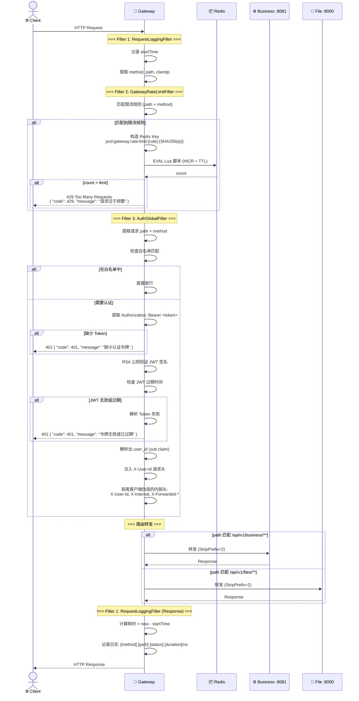
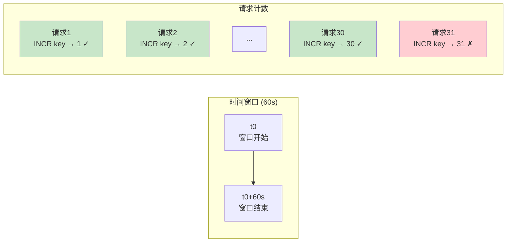
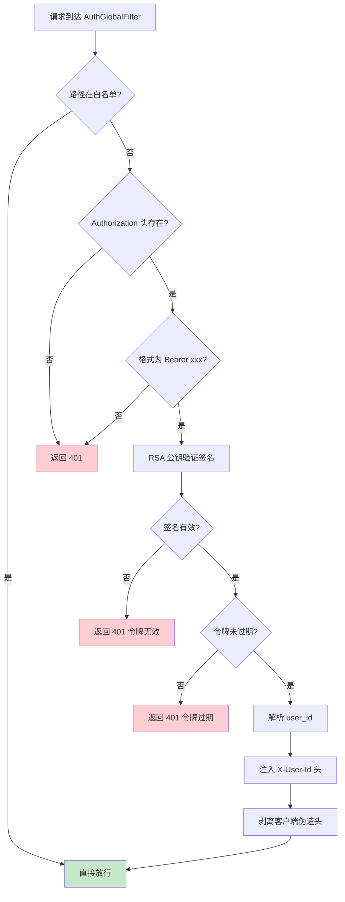
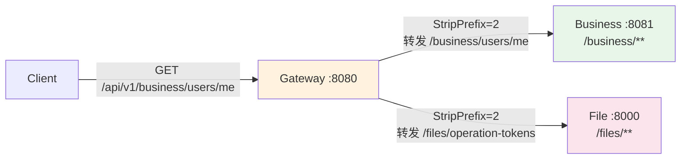
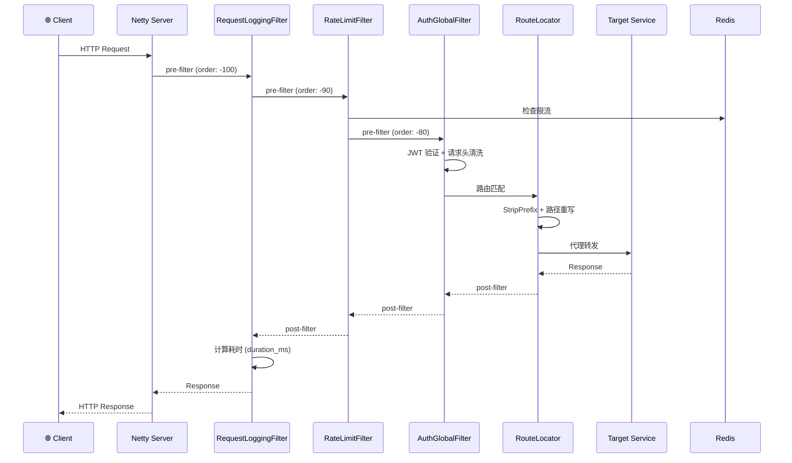
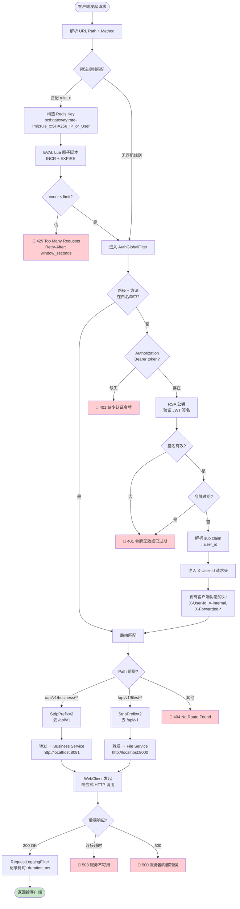
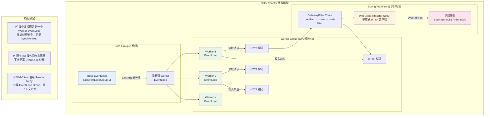
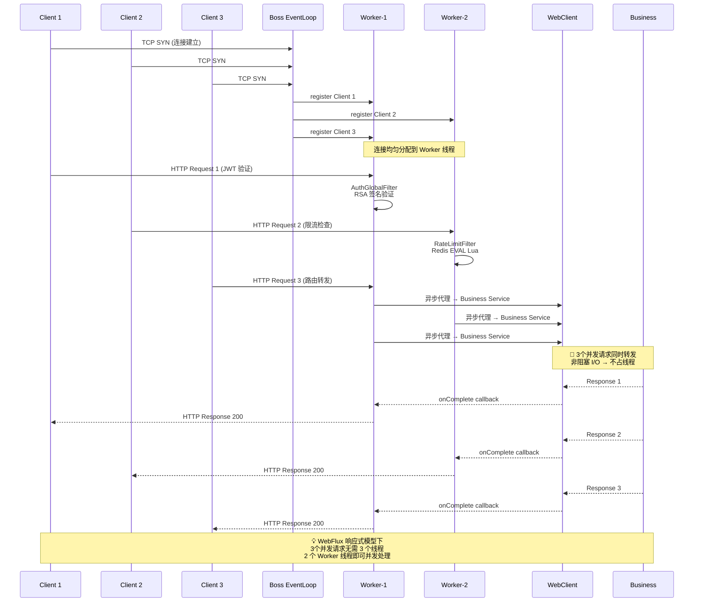

# PrivateCloudDisk-gateway-service

企业级 API 网关服务，基于 Spring Cloud Gateway (WebFlux) 构建，是整个私有云盘系统的统一入口，负责请求路由、JWT 认证鉴权、分布式限流和请求日志记录。

---

## 技术栈

| 技术 | 版本 | 用途 |
|------|------|------|
| Spring Boot | 4.0.6 | 应用框架 (WebFlux) |
| Spring Cloud Gateway | 2025.1.1 | API 网关 (响应式) |
| Spring Security | 6.x (WebFlux) | 安全框架 |
| Spring Data Redis Reactive | - | 响应式 Redis (限流计数) |
| JJWT | 0.13.0 | JWT 令牌解析与验证 |
| Lombok | - | 代码简化 |

---

## 项目结构

```
src/main/java/org/project/privateclouddiskgatewayservice/
├── PrivateCloudDiskGatewayServiceApplication.java  # 启动类
│
├── config/                               # 配置类
│   ├── SecurityConfig.java              # Spring Security WebFlux 配置 (放行网关)
│   ├── CorsConfig.java                  # CORS 跨域配置
│   └── properties/
│       └── GatewayRateLimitProperties.java # 网关限流规则属性类
│
├── filter/                               # 全局过滤器 (GlobalFilter)
│   └── global/
│       ├── AuthGlobalFilter.java        # JWT 认证过滤器
│       ├── GatewayRateLimitFilter.java  # 分布式限流过滤器 (固定窗口算法)
│       └── RequestLoggingFilter.java    # 请求日志过滤器
│
├── handler/                              # 异常处理器
│   ├── GlobalExceptionHandler.java      # 全局异常处理
│   └── AccessDeniedHandler.java         # 访问拒绝处理
│
├── dto/
│   └── ApiErrorResponse.java            # 统一错误响应体
│
└── utils/
    └── JwtUtil.java                     # JWT 解析工具 (验证签名/提取用户ID)
```

---

## 网关过滤器执行链全流程



---

## 认证白名单

以下路径 **跳过 JWT 认证**，直接放行：

| 路径 | HTTP 方法 | 说明 |
|------|-----------|------|
| `/api/v1/business/users/login` | POST | 用户登录 |
| `/api/v1/business/users/` | POST | 用户注册 |
| `/api/v1/business/users/email/verification-code` | POST | 获取邮箱验证码 |
| `/api/v1/business/internal/**` | * | 内部服务间通信 |

> **安全约束**：白名单限定 HTTP Method。例如 `/api/v1/business/users/login` 仅允许 POST，GET 请求仍需要认证。

---

## 限流算法详解

### 固定窗口计数器 (Fixed Window Counter)



**Redis Lua 原子脚本：**

```lua
-- KEYS[1]: 限流 key (如 pcd:gateway:rate-limit:public-login-ip:SHA256_HASH)
-- ARGV[1]: limit 值
-- ARGV[2]: window 秒数
local current = redis.call('INCR', KEYS[1])
if current == 1 then
    redis.call('EXPIRE', KEYS[1], ARGV[2])
end
if current > tonumber(ARGV[1]) then
    return 0  -- 限流触发
end
return 1  -- 允许通过
```

**Redis Key 结构：**

```
pcd:gateway:rate-limit:{ruleName}:{SHA256(identity)}

示例:
pcd:gateway:rate-limit:public-login-ip:3a2b1c...
pcd:gateway:rate-limit:upload-session-user:e5f6a7...
```

### 限流规则一览

| 规则名称 | 匹配路径 | 方法 | 维度 | 限制 | 窗口 | 业务含义 |
|----------|----------|------|------|------|------|----------|
| `public-login-ip` | `/**/users/login` | POST | IP | 30 | 60s | 防暴力破解 |
| `public-register-ip` | `/**/users/` | POST | IP | 10 | 1h | 防批量注册 |
| `upload-session-user` | `/**/uploads/` | POST | USER | 20 | 60s | 防止传会话创建 |
| `operation-token-issue-user` | `/**/operation-tokens` | POST | USER | 30 | 60s | 防凭证签发滥用 |
| `operation-token-issue-ip` | `/**/operation-tokens` | POST | IP | 120 | 60s | 防凭证签发滥用 |
| `operation-token-destroy-user` | `/**/operation-tokens` | DELETE | USER | 60 | 60s | 防凭证撤销滥用 |
| `operation-token-destroy-ip` | `/**/operation-tokens` | DELETE | IP | 180 | 60s | 防凭证撤销滥用 |

**Fail-Open 机制**：当 Redis 不可用时，`gateway.rate-limit.fail-open=true` 允许请求正常通过，保证系统可用性。

---

## JWT 认证流程



**请求头安全清洗：**

网关层会剥离以下客户端发送的请求头，防止身份伪造：

```
被剥离的请求头:
X-User-Id          ← 防止伪造用户ID
X-Internal         ← 防止伪造内部调用标识
X-Forwarded-For    ← 防止伪造来源IP
X-Forwarded-Proto  ← 防止伪造协议
```

---

## 路由配置



| 路由 ID | 匹配路径 | 转发目标 | StripPrefix | 说明 |
|----------|----------|----------|-------------|------|
| `business-service` | `/api/v1/business/**` | `http://localhost:8081` | 2 | 业务服务 |
| `file-service` | `/api/v1/files/**` | `http://localhost:8000` | 2 | 文件服务 |

**StripPrefix 说明**：

```
/api/v1/business/users/me  → (StripPrefix=2)  → /business/users/me
 ^^^^ ^^^                          去掉这2段        转发到 :8081 的路径
```

---

## 错误响应格式

### 认证错误

```json
// 401 - 缺少令牌
{
  "code": 401,
  "message": "缺少认证令牌",
  "timestamp": "2026-06-11T12:00:00"
}

// 401 - 令牌无效
{
  "code": 401,
  "message": "令牌无效或已过期",
  "timestamp": "2026-06-11T12:00:00"
}
```

### 限流错误

```json
// 429 - 请求频率过高
{
  "code": 429,
  "message": "请求过于频繁，请稍后再试",
  "timestamp": "2026-06-11T12:00:00"
}
```

### 路由错误

```json
// 503 - 服务不可用
{
  "code": 503,
  "message": "服务暂时不可用",
  "timestamp": "2026-06-11T12:00:00"
}
```

---

## 请求生命周期总览



---

## 核心架构图

### 请求路由选择全流程



### 异常处理全流程

```mermaid
flowchart TD
    subgraph "过滤器链异常"
        E1["限流检查失败<br/>Redis 连接超时"]
        E2["JWT 验证异常<br/>签名无效/格式错误"]
        E3["路由匹配失败<br/>无匹配路由规则"]
        E4["后端服务超时<br/>ReadTimeout / ConnectTimeout"]
        E5["后端服务错误<br/>HTTP 500"]
    end

    subgraph "GlobalExceptionHandler 处理"
        H1{异常类型判断}

        H1 -->|RateLimitException| HR1[构造 429 响应<br/>code: 429, message: '请求过于频繁'<br/>Retry-After 头]
        H1 -->|AuthenticationException| HR2[构造 401 响应<br/>code: 401, message: '令牌无效'<br/>WWW-Authenticate: Bearer]
        H1 -->|AccessDeniedException| HR3[构造 403 响应<br/>code: 403, message: '无权限操作']
        H1 -->|NotFoundException| HR4[构造 404 响应<br/>code: 404, message: '资源不存在']
        H1 -->|ConnectTimeoutException| HR5[构造 503 响应<br/>code: 503, message: '服务不可用']
        H1 -->|ReadTimeoutException| HR5
        H1 -->|UnknownException| HR6[构造 500 响应<br/>code: 500, message: '服务器内部错误']
    end

    E1 --> H1
    E2 --> H1
    E3 --> H1
    E4 --> H1
    E5 --> H1

    HR1 --> Return
    HR2 --> Return
    HR3 --> Return
    HR4 --> Return
    HR5 --> Return
    HR6 --> Return

    Return([统一 JSON 错误响应<br/>{code, message, timestamp}])

    style Return fill:#fff3e0

    subgraph "Fail-Open 机制"
        FO["⚠ Redis 不可用时<br/>gateway.rate-limit.fail-open=true<br/>→ 跳过限流检查，允许请求通过<br/>保证系统可用性"]
    end

    E1 -.->|fail-open=true| FO

    style FO fill:#e3f2fd
```

### Netty 线程模型



### 请求并发处理模型



---

## 配置说明

核心配置参见 `application.properties`：

```properties
server.port=8080

# 路由 - 业务服务
spring.cloud.gateway.server.webflux.routes[0].id=business-service
spring.cloud.gateway.server.webflux.routes[0].uri=http://localhost:8081
spring.cloud.gateway.server.webflux.routes[0].predicates[0]=Path=/api/v1/business/**
spring.cloud.gateway.server.webflux.routes[0].filters[0]=StripPrefix=2

# 路由 - 文件服务
spring.cloud.gateway.server.webflux.routes[1].id=file-service
spring.cloud.gateway.server.webflux.routes[1].uri=http://localhost:8000
spring.cloud.gateway.server.webflux.routes[1].predicates[0]=Path=/api/v1/files/**
spring.cloud.gateway.server.webflux.routes[1].filters[0]=StripPrefix=2

# JWT 公钥
jwt.public-key-path=classpath:keys/public.pem

# Redis
spring.data.redis.host=localhost
spring.data.redis.port=6379

# 限流
gateway.rate-limit.enabled=true
gateway.rate-limit.fail-open=true
```

---

## 开发指南

### 环境要求
- JDK 18+
- Redis

### 启动服务
```bash
./gradlew bootRun
```

### 构建 JAR
```bash
./gradlew bootJar
```

### Docker 部署
```bash
docker build -t privateclouddisk-gateway .
docker run -p 8080:8080 privateclouddisk-gateway
```