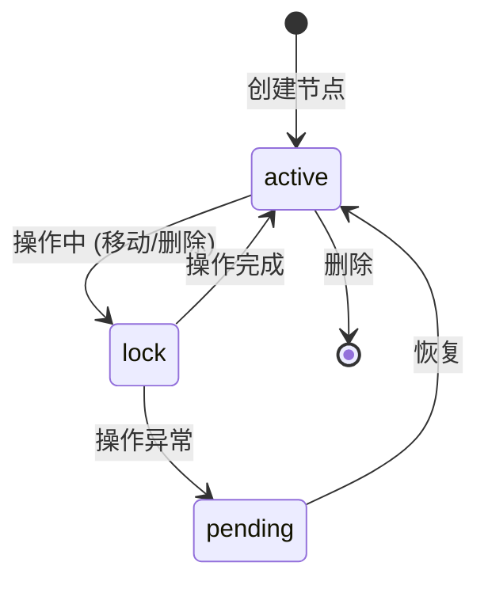
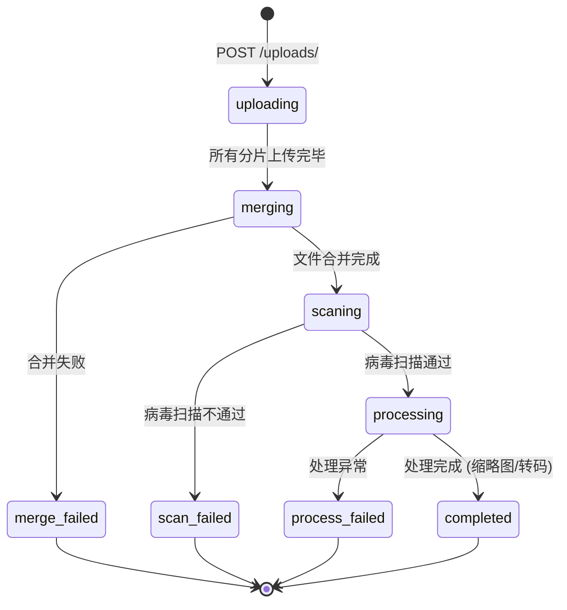
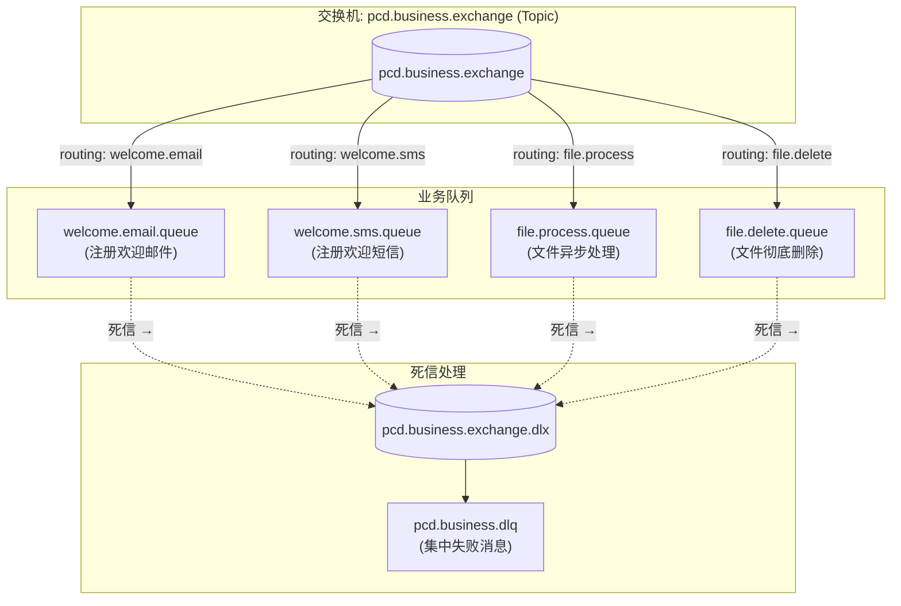
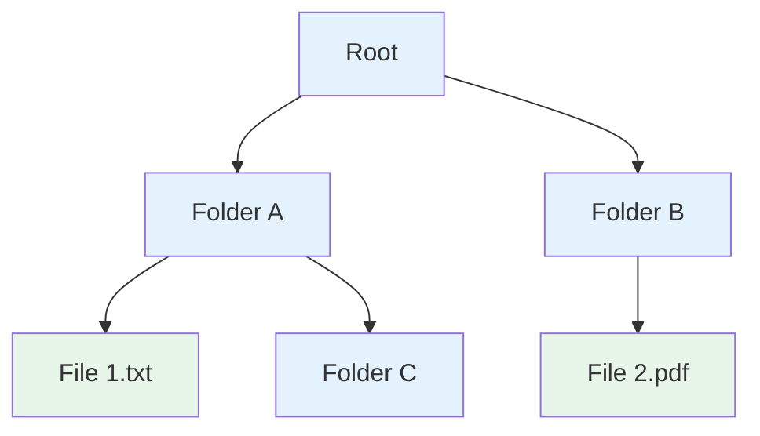
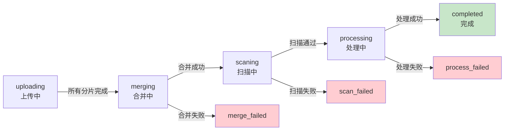
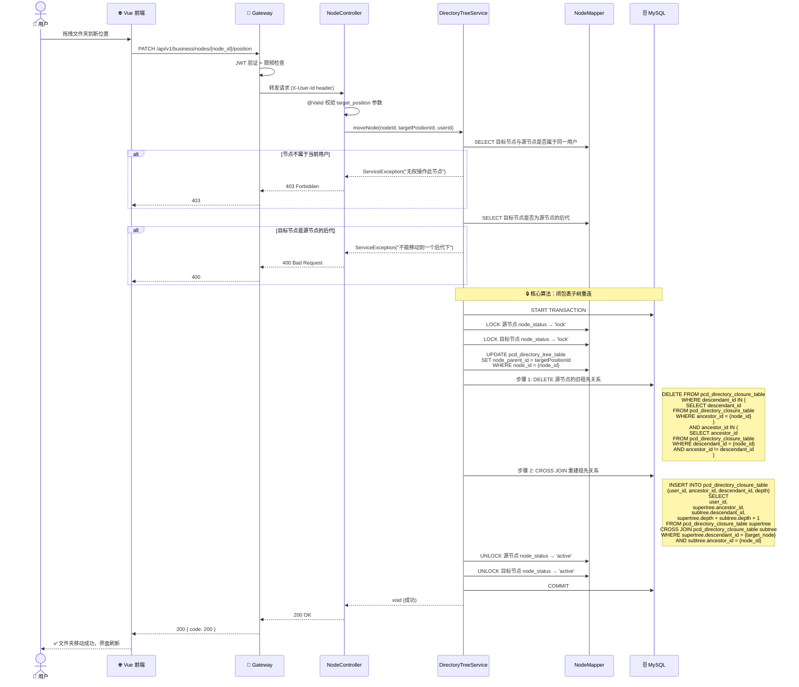
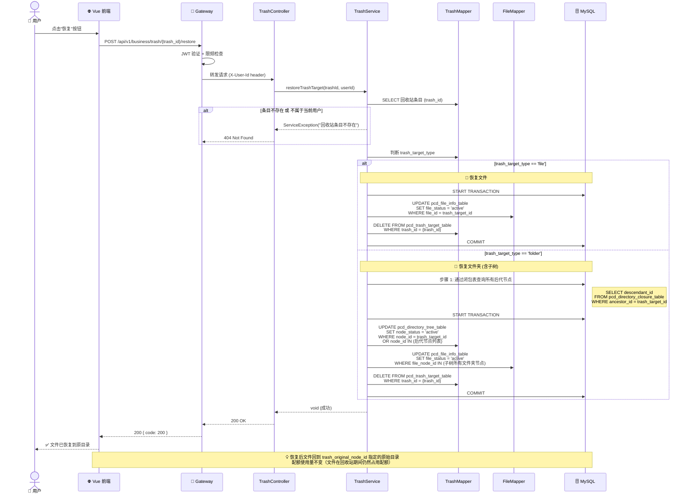
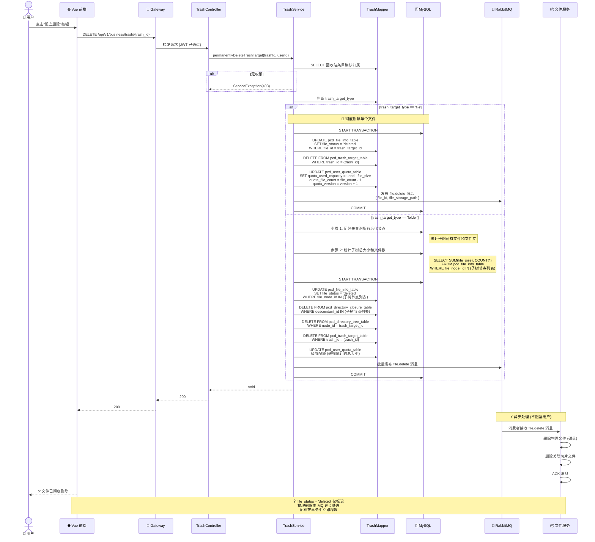
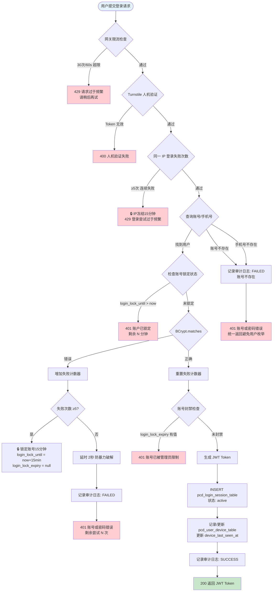
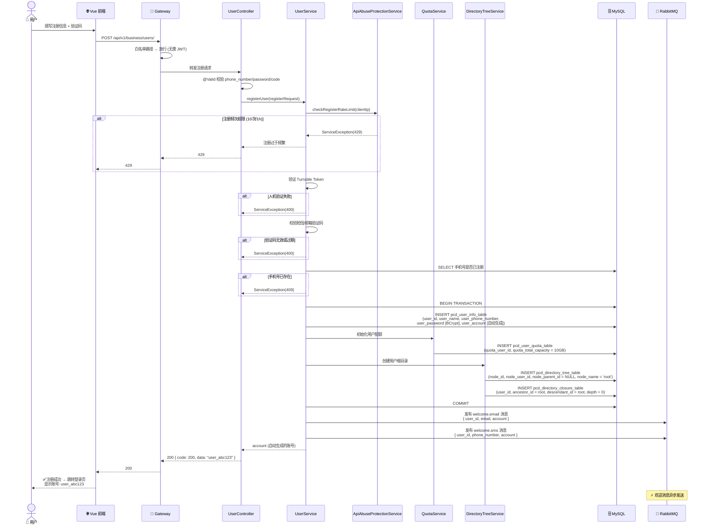

# PrivateCloudDisk-platform-service

核心业务服务，基于 Spring Boot + MyBatis 构建，提供用户管理、目录树管理、文件元数据管理、配额管理、回收站、收藏、内部存储协调等 RESTful API。

---

## 技术栈

| 技术 | 版本 | 用途 |
|------|------|------|
| Spring Boot | 4.0.6 | 应用框架 |
| MyBatis | 3.x | ORM + SQL 映射 |
| Spring AMQP | - | RabbitMQ 消息发布 |
| Spring Data Redis | - | Redis 缓存读写 |
| JJWT | 0.13.0 | RSA-256 JWT 签发 |
| BCrypt | - | 密码哈希 |
| Lombok | - | 代码简化 |
| Jakarta Validation | - | 参数校验 (JSR-380) |
| MySQL Connector | 8.x | 数据库连接 |

---

## 项目结构

```
src/main/java/org/project/
├── control/                              # 控制器层 (10个)
│   ├── UserController.java              # 用户相关 (9个端点)
│   ├── FileController.java              # 文件管理 (4个端点)
│   ├── NodeController.java              # 目录树管理 (6个端点)
│   ├── UploadsController.java           # 上传会话管理 (2个端点)
│   ├── TrashController.java             # 回收站管理 (6个端点)
│   ├── FileStarController.java          # 文件收藏 (5个端点)
│   ├── QuotaController.java             # 配额查询 (1个端点)
│   ├── InternalStorageController.java   # 内部存储协调 (5个端点)
│   ├── BaseController.java              # 基础控制器 (状态码常量)
│   └── result/JsonResult.java           # 统一响应体
│
├── service/                              # 业务服务层
│   ├── UserService.java                 # 用户业务逻辑
│   ├── DirectoryTreeService.java        # 目录树 + 闭包表管理
│   ├── FileService.java                 # 文件元数据管理
│   ├── UploadsService.java              # 上传会话管理
│   ├── TrashService.java                # 回收站逻辑
│   ├── FileStarService.java             # 收藏业务逻辑
│   └── ex/ServiceException.java         # 业务异常
│
├── mapper/                               # MyBatis Mapper 接口 (13个)
│   ├── UserMapper.java
│   ├── NodeMapper.java
│   ├── FileMapper.java
│   ├── UploadsMapper.java
│   ├── TrashMapper.java
│   ├── FileStarMapper.java
│   ├── QuotaMapper.java
│   └── ...
│
├── model/
│   ├── entity/                           # 数据实体 (与DB表一一对应)
│   ├── dto/                              # 请求体 DTO
│   └── vo/                               # 视图对象 VO + VoMapper
│
├── config/                               # Spring 配置
│   ├── RabbitMQConifgure.java           # RabbitMQ 交换机/队列/绑定
│   ├── RedisConfig.java                 # Redis 序列化配置
│   └── WebConfig.java                   # CORS / 拦截器
│
├── security/                             # 安全模块
│   ├── ApiAbuseProtectionService.java   # API 滥用防护 (登录/注册/上传限制)
│   ├── CaptchaVerifier.java             # Turnstile 人机验证
│   └── InternalRequestValidator.java    # 内部请求验证
│
├── handler/                              # 异常处理
│   └── GlobalExceptionHandler.java      # 全局统一异常处理
│
└── util/
    ├── JwtUtil.java                      # JWT 签发工具 (RSA-256)
    ├── UUIDBinaryTypeHandler.java        # MyBatis BINARY(16)↔UUID 转换
    └── ClientIpUtil.java                 # 客户端IP提取
```

---

## 统一响应格式

所有 API 返回统一 JSON 结构：

```json
{
  "code": 200,
  "message": null,
  "data": "xxx"
}
```

### 通用状态码

| 状态码 | 含义 |
|--------|------|
| `200` | 操作成功 (OK) |
| `400` | 请求参数校验失败 |
| `401` | 未认证 / 密码错误 |
| `403` | 无权限操作 |
| `404` | 资源不存在 |
| `409` | 资源冲突 (如账号已存在) |
| `413` | 上传文件过大 / 超出配额 |
| `429` | 请求频率过高 |
| `500` | 服务器内部错误 |

---

## 完整 API 接口文档

---

### 模块一：用户管理 `/business/users`

#### 1.1 用户登录

```http
POST /api/v1/business/users/login
```

| 属性 | 说明 |
|------|------|
| 认证 | **无需** (白名单) |
| 限流 | 网关层 IP 级: 30次/60s |

**请求体：**

```json
{
  "account": "myAccount",
  "phone_number": "13800138000",
  "password": "Abc12345",
  "captcha_token": "turnstile_token_string",
  "captcha_action": "login"
}
```

| 字段 | 类型 | 必填 | 校验规则 |
|------|------|------|----------|
| `account` | String | 条件必填 | `^[a-zA-Z0-9_]{4,16}$` |
| `phone_number` | String | 条件必填 | `^1[3-9]\d{9}$` |
| `password` | String | 是 | `^(?=.*[A-Za-z])(?=.*\d)[A-Za-z\d]{8,15}$` |
| `captcha_token` | String | 否 | Turnstile 验证 Token |
| `captcha_action` | String | 否 | Turnstile Action 标识 |

> **注意**：`account` 与 `phone_number` 至少一个不为空（`@AtLeastOneNotNull`）

**成功响应：**
```json
{
  "code": 200,
  "data": "eyJhbGciOiJSUzI1NiIsInR5cCI6IkpXVCJ9..."
}
```

**失败响应：**
```json
// 401 - 账号或密码错误
{ "code": 401, "message": "账号或密码错误" }

// 429 - 登录频率过高
{ "code": 429, "message": "登录尝试过于频繁，请15分钟后再试" }

// 400 - Turnstile 验证失败
{ "code": 400, "message": "人机验证失败，请重试" }
```

---

#### 1.2 用户注册

```http
POST /api/v1/business/users/
```

| 属性 | 说明 |
|------|------|
| 认证 | **无需** (白名单) |
| 限流 | 网关层 IP 级: 10次/1h |

**请求体：**
```json
{
  "phone_number": "13800138000",
  "password": "Abc12345",
  "code": "a1b2c3",
  "name": "John",
  "captcha_token": "turnstile_token_string",
  "captcha_action": "register"
}
```

| 字段 | 类型 | 必填 | 校验规则 |
|------|------|------|----------|
| `phone_number` | String | 是 | `^1[3-9]\d{9}$` |
| `password` | String | 是 | `^(?=.*[A-Za-z])(?=.*\d)[A-Za-z\d]{8,15}$` |
| `code` | String | 是 | `^[a-zA-Z0-9]{6,16}$` (短信/邮箱验证码) |
| `name` | String | 是 | `^[a-zA-Z0-9]{2,10}$` |

**成功响应：**
```json
{
  "code": 200,
  "data": "auto_generated_account_id"
}
```

**失败响应：**
```json
// 409 - 手机号已注册
{ "code": 409, "message": "该手机号已被注册" }

// 400 - 验证码错误
{ "code": 400, "message": "验证码错误或已过期" }
```

---

#### 1.3 查询当前用户信息

```http
GET /api/v1/business/users/me
```

| 属性 | 说明 |
|------|------|
| 认证 | **需要** JWT |
| 请求头 | `X-User-Id: <uuid>` |

**成功响应：**
```json
{
  "code": 200,
  "data": {
    "id": "415d3064-a465-4813-8f42-d6f1aa9b87c0",
    "account": "johnsmith",
    "phone_number": "13800138000",
    "email": "john@example.com",
    "name": "John",
    "image_path": "/avatars/415d3064.jpg"
  }
}
```

---

#### 1.4 修改用户信息

```http
PATCH /api/v1/business/users/me
```

| 属性 | 说明 |
|------|------|
| 认证 | **需要** JWT |
| 请求头 | `X-User-Id: <uuid>` |

**请求体：**
```json
{
  "new_email": "newemail@example.com",
  "new_phone_number": "13900139000",
  "new_username": "NewName"
}
```

| 字段 | 类型 | 必填 | 校验规则 |
|------|------|------|----------|
| `new_email` | String | 是 | Email 格式 |
| `new_phone_number` | String | 是 | `^1[3-9]\d{9}$` |
| `new_username` | String | 是 | `^[a-zA-Z0-9]{2,10}$` |

**成功响应：**
```json
{ "code": 200 }
```

---

#### 1.5 修改密码

```http
POST /api/v1/business/users/me/password
```

| 属性 | 说明 |
|------|------|
| 认证 | **需要** JWT |
| 请求头 | `X-User-Id: <uuid>` |

**请求体：**
```json
{
  "old_password": "OldPass123",
  "new_password": "NewPass456"
}
```

| 字段 | 类型 | 必填 | 校验规则 |
|------|------|------|----------|
| `user_password` | String | 是 | `^(?=.*[A-Za-z])(?=.*\d)[A-Za-z\d]{8,15}$` (别名 `old_password`) |
| `new_password` | String | 是 | 同上 |

**成功响应：**
```json
{ "code": 200 }
```

---

#### 1.6 上传用户头像

```http
PUT /api/v1/business/users/me/avatar
Content-Type: multipart/form-data
```

| 属性 | 说明 |
|------|------|
| 认证 | **需要** JWT |
| 请求头 | `X-User-Id: <uuid>` |
| 请求体 | `avator_file` (MultipartFile) |

**成功响应：**
```json
{ "code": 200 }
```

---

#### 1.7 用户注销

```http
DELETE /api/v1/business/users/me
```

| 属性 | 说明 |
|------|------|
| 认证 | **需要** JWT |
| 请求头 | `X-User-Id: <uuid>` |

**注意**：永久删除账号及所有数据，不可恢复。

**成功响应：**
```json
{ "code": 200 }
```

---

### 模块二：目录树管理 `/business/nodes`



#### 2.1 查询子节点列表

```http
GET /api/v1/business/nodes/{node_id}/children
```

| 属性 | 说明 |
|------|------|
| 认证 | **需要** JWT |
| 请求头 | `X-User-Id: <uuid>` |

**路径参数：**
| 参数 | 类型 | 校验 |
|------|------|------|
| `node_id` | String | UUID 格式 |

**成功响应：**
```json
{
  "code": 200,
  "data": [
    {
      "node_id": "abc-def-123",
      "node_type": "FOLDER",
      "node_name": "我的文档",
      "node_size": 0
    },
    {
      "node_id": "ghi-jkl-456",
      "node_type": "FILE",
      "node_name": "report.pdf",
      "node_size": 2048576
    }
  ]
}
```

#### 2.2 分页查询子节点（支持搜索/过滤/排序）

```http
GET /api/v1/business/nodes/{node_id}/children/paged
```

| 属性 | 说明 |
|------|------|
| 认证 | **需要** JWT |
| 请求头 | `X-User-Id: <uuid>` |

**查询参数：**

| 参数 | 类型 | 必填 | 默认值 | 说明 |
|------|------|------|--------|------|
| `keyword` | String | 否 | - | 搜索关键词 (模糊匹配) |
| `fileType` | String | 否 | - | 文件类型过滤 (如 `image`, `pdf`) |
| `sortBy` | String | 否 | `name` | 排序字段 (`name`, `size`, `uploaded_time`) |
| `sortOrder` | String | 否 | `asc` | 排序方向 (`asc`, `desc`) |
| `page` | Integer | 否 | `1` | 页码 |
| `pageSize` | Integer | 否 | `20` | 每页数量 |

**成功响应：**
```json
{
  "code": 200,
  "data": {
    "items": [
      { "node_id": "...", "node_type": "FOLDER", "node_name": "...", "node_size": 0 }
    ],
    "total": 42,
    "page": 1,
    "pageSize": 20,
    "totalPages": 3
  }
}
```

#### 2.3 创建文件夹

```http
POST /api/v1/business/nodes/
```

| 属性 | 说明 |
|------|------|
| 认证 | **需要** JWT |
| 请求头 | `X-User-Id: <uuid>` |

**请求体：**
```json
{
  "node_id": "parent-node-uuid",
  "folder_name": "新建文件夹"
}
```

| 字段 | 类型 | 必填 | 校验规则 | 别名 |
|------|------|------|----------|------|
| `node_id` | String | 是 | UUID 格式 | `position`, `parent_id` |
| `folder_name` | String | 是 | `^[^\\/:*?"<>|]{1,128}$` | `name`, `node_name` |

**成功响应：**
```json
{ "code": 200 }
```

#### 2.4 删除节点

```http
DELETE /api/v1/business/nodes/{node_id}
```

| 属性 | 说明 |
|------|------|
| 认证 | **需要** JWT |
| 请求头 | `X-User-Id: <uuid>` |

删除节点及其所有子节点 → 移入回收站（含闭包表级联记录）。

**成功响应：**
```json
{ "code": 200 }
```

#### 2.5 移动节点

```http
PATCH /api/v1/business/nodes/{node_id}/position
```

| 属性 | 说明 |
|------|------|
| 认证 | **需要** JWT |
| 请求头 | `X-User-Id: <uuid>` |

**请求体：**
```json
{
  "target_position": "new-parent-node-uuid"
}
```

| 字段 | 类型 | 必填 | 校验规则 | 别名 |
|------|------|------|----------|------|
| `target_position` | String | 是 | UUID 格式 | `target_node_id`, `parent_id` |

> 移动操作会更新目标子树在闭包表中的所有记录，时间复杂度 O(n)（n = 子树节点数）。

**成功响应：**
```json
{ "code": 200 }
```

#### 2.6 重命名节点

```http
PATCH /api/v1/business/nodes/{node_id}/name
```

| 属性 | 说明 |
|------|------|
| 认证 | **需要** JWT |
| 请求头 | `X-User-Id: <uuid>` |

**请求体：**
```json
{
  "new_node_name": "新名称"
}
```

| 字段 | 类型 | 必填 | 校验规则 | 别名 |
|------|------|------|----------|------|
| `new_node_name` | String | 是 | `^[^\\/:*?"<>|]{1,128}$` | `new_name`, `name` |

**成功响应：**
```json
{ "code": 200 }
```

---

### 模块三：文件管理 `/business/files`

#### 3.1 查询文件元数据

```http
GET /api/v1/business/files/{file_id}
```

| 属性 | 说明 |
|------|------|
| 认证 | **需要** JWT |
| 请求头 | `X-User-Id: <uuid>` |

**成功响应：**
```json
{
  "code": 200,
  "data": {
    "id": "file-uuid",
    "name": "report.pdf",
    "type": "application/pdf",
    "size": 2048576,
    "uploaded_time": "2026-06-11T10:30:00",
    "node_id": "parent-node-uuid",
    "total_chunks": 1
  }
}
```

#### 3.2 重命名文件

```http
PATCH /api/v1/business/files/{file_id}/name
```

| 属性 | 说明 |
|------|------|
| 认证 | **需要** JWT |
| 请求头 | `X-User-Id: <uuid>` |

**请求体：**
```json
{
  "file_new_name": "new_report.pdf"
}
```

| 字段 | 类型 | 必填 | 校验规则 | 别名 |
|------|------|------|----------|------|
| `file_new_name` | String | 是 | `^[^\\/:*?"<>|]{1,255}$` | `new_name`, `name` |

#### 3.3 移动文件

```http
PATCH /api/v1/business/files/{file_id}/position
```

| 属性 | 说明 |
|------|------|
| 认证 | **需要** JWT |
| 请求头 | `X-User-Id: <uuid>` |

**请求体：**
```json
{
  "target_node_id": "new-parent-node-uuid"
}
```

| 字段 | 类型 | 必填 | 校验规则 | 别名 |
|------|------|------|----------|------|
| `target_node_id` | String | 是 | UUID 格式 | `target_position`, `new_position` |

#### 3.4 删除文件（移入回收站）

```http
DELETE /api/v1/business/files/{file_id}
```

| 属性 | 说明 |
|------|------|
| 认证 | **需要** JWT |
| 请求头 | `X-User-Id: <uuid>` |

> 软删除：文件移入 `pcd_trash_target_table`，设置自动清理时间。

**成功响应：**
```json
{ "code": 200 }
```

---

### 模块四：上传会话管理 `/business/uploads`



#### 4.1 创建上传会话

```http
POST /api/v1/business/uploads/
```

| 属性 | 说明 |
|------|------|
| 认证 | **需要** JWT |
| 请求头 | `X-User-Id: <uuid>` |

**请求体：**
```json
{
  "total_chunks": 20,
  "file_size": 104857600,
  "file_checksum": "sha256hex...",
  "chunks_max_size": 5242880,
  "file_name": "vacation.mp4",
  "file_type": "video/mp4",
  "node_id": "target-folder-uuid"
}
```

| 字段 | 类型 | 必填 | 说明 |
|------|------|------|------|
| `total_chunks` | Integer | 是 | 总分片数 |
| `file_size` | Long | 是 | 文件总大小 (字节) |
| `file_checksum` | String | 是 | SHA-256 校验值 |
| `chunks_max_size` | Integer | 是 | 每分片最大大小 (默认 5MB) |
| `file_name` | String | 是 | 文件名 |
| `file_type` | String | 是 | MIME 类型 |
| `node_id` | String | 是 | 目标文件夹节点 UUID |

**成功响应：**
```json
{
  "code": 200,
  "data": "915d3064-b465-5813-9f42-d7f1ab9b87c0"
}
```

`data` 返回 `uploads_id` (UUID)，后续分片上传时使用。

---

### 模块五：回收站管理 `/business/trash`

#### 5.1 恢复文件

```http
POST /api/v1/business/trash/{trash_id}/restore
```

| 属性 | 说明 |
|------|------|
| 认证 | **需要** JWT |
| 请求头 | `X-User-Id: <uuid>` |

将回收站中的文件恢复到原目录。

#### 5.2 彻底删除

```http
DELETE /api/v1/business/trash/{trash_id}
```

| 属性 | 说明 |
|------|------|
| 认证 | **需要** JWT |
| 请求头 | `X-User-Id: <uuid>` |

物理删除文件，发布删除消息到 RabbitMQ。

#### 5.3 清空回收站

```http
DELETE /api/v1/business/trash/
```

批量彻底删除当前用户所有回收站条目。

#### 5.4 查询回收站列表

```http
GET /api/v1/business/trash/?page=1&pageSize=20
```

**成功响应：**
```json
{
  "code": 200,
  "data": [
    {
      "trash_id": 1,
      "file_id": "file-uuid",
      "file_name": "old_doc.pdf",
      "file_type": "application/pdf",
      "file_size": 1024000,
      "original_node_id": "original-folder-uuid",
      "deleted_at": "2026-06-10T15:30:00",
      "expires_at": "2026-07-10T15:30:00"
    }
  ]
}
```

#### 5.5 统计回收站数量

```http
GET /api/v1/business/trash/count
```

**成功响应：**
```json
{ "code": 200, "data": 5 }
```

---

### 模块六：文件收藏 `/business/stars`

#### 6.1 添加收藏

```http
POST /api/v1/business/stars/{file_id}
```

#### 6.2 取消收藏

```http
DELETE /api/v1/business/stars/{file_id}
```

#### 6.3 检查收藏状态

```http
GET /api/v1/business/stars/{file_id}/status
```

**成功响应：**
```json
{ "code": 200, "data": true }
```

#### 6.4 收藏列表

```http
GET /api/v1/business/stars/?page=1&pageSize=20
```

#### 6.5 统计收藏数

```http
GET /api/v1/business/stars/count
```

---

### 模块七：配额查询 `/business/quotas`

#### 7.1 查询我的配额

```http
GET /api/v1/business/quotas/me
```

| 属性 | 说明 |
|------|------|
| 认证 | **需要** JWT |
| 请求头 | `X-User-Id: <uuid>` |

**成功响应：**
```json
{
  "code": 200,
  "data": {
    "user_id": "user-uuid",
    "total_capacity": 10737418240,
    "used_capacity": 2147483648,
    "file_count": 156,
    "version": 3,
    "created_at": "2026-01-01T00:00:00",
    "updated_at": "2026-06-11T10:30:00"
  }
}
```

---

### 模块八：内部存储协调 `/business/internal/storage`

内部 API，通过 `X-Internal` 请求头认证，供文件服务调用。

| 方法 | 路径 | 说明 |
|------|------|------|
| POST | `/internal/storage/uploads/{uploads_id}/chunks/{chunk_index}/complete` | 通知分片上传完成 |
| GET | `/internal/storage/uploads/{uploads_id}` | 查询上传会话详情 |
| GET | `/internal/storage/uploads/{uploads_id}/chunks/{chunk_index}` | 查询分片状态 |
| GET | `/internal/storage/files/{file_id}/metadata` | 查询文件元数据 |
| PUT | `/internal/storage/files/{file_id}/status` | 更新文件状态 |

---

## RabbitMQ 消息架构



| 路由键 | 目标队列 | 生产者 | 消费者 | 说明 |
|--------|----------|--------|--------|------|
| `welcome.email` | `pcd.business.welcome.email` | UserService (注册) | 邮件服务 | 新用户注册成功发送欢迎邮件 |
| `welcome.sms` | `pcd.business.welcome.sms` | UserService (注册) | 短信服务 | 新用户注册成功发送欢迎短信 |
| `file.process` | `pcd.file.process.queue` | UploadsService (分片完成) | 文件服务 | 触发文件合并/扫描/转码 |
| `file.delete` | `pcd.file.delete.queue` | TrashService (彻底删除) | 文件服务 | 触发物理文件删除 |

---

## 核心设计详解

### 闭包表 (Closure Table) 算法

**数据结构：**



**闭包表记录：**

| ancestor_id | descendant_id | depth | 含义 |
|-------------|--------------|-------|------|
| Root | Root | 0 | 自引用 |
| A | A | 0 | 自引用 |
| B | B | 0 | 自引用 |
| C | C | 0 | 自引用 |
| Root | A | 1 | Root 是 A 的祖先 |
| Root | B | 1 | Root 是 B 的祖先 |
| Root | C | 1 | Root 是 C 的祖先 |
| A | C | 1 | A 是 C 的祖先 |
| Root | D | 1 | Root 是 File1 的祖先 |
| A | D | 1 | A 是 File1 的祖先 |

**查询某节点的所有子节点：**
```sql
SELECT descendant_id
FROM pcd_directory_closure_table
WHERE ancestor_id = ? AND depth > 0
```

**查询某节点的所有祖先：**
```sql
SELECT ancestor_id
FROM pcd_directory_closure_table
WHERE descendant_id = ? AND depth > 0
ORDER BY depth DESC
```

### 上传会话状态机



---

## 核心流程时序图

### 节点移动与闭包表更新

当用户移动一个文件夹节点到新位置时，闭包表需要级联更新所有子树节点的祖先关系。



### 回收站恢复文件



### 回收站彻底删除文件



### 登录安全防护全流程



### 用户注册全流程



---

## 开发指南

### 环境要求
- JDK 18+
- MySQL 8.0+
- Redis
- RabbitMQ

### 启动服务
```bash
./gradlew bootRun
```

### 构建 JAR
```bash
./gradlew bootJar
```

### Docker 部署
```bash
docker build -t privateclouddisk-business .
docker run -p 8081:8081 privateclouddisk-business
```

### 配置要点

核心配置在 `application.properties`：

```properties
server.port=8081
spring.datasource.url=jdbc:mysql://localhost:3306/private_cloud_disk
spring.data.redis.host=localhost
spring.rabbitmq.host=localhost

# JWT 私钥 (签发用)
jwt.private-key-path=classpath:keys/private.pem

# 文件存储路径
file.upload-dir=../Uploads

# 文件服务地址 (内部调用)
file-service.base-url=http://localhost:8000
```