# PrivateCloudDisk-storage-service

企业级文件处理服务，基于 FastAPI + Uvicorn (Python 3.11) 构建，负责文件的分片上传、流式下载、缩略图生成、操作凭证管理等核心文件 I/O 功能。

---

## 技术栈

| 技术 | 版本 | 用途 |
|------|------|------|
| FastAPI | latest | Web 框架 |
| Uvicorn | latest | ASGI 服务器 |
| Redis (async) | latest | 缓存 + 并发/速率控制 |
| PyJWT | latest | JWT 操作凭证签发/验证 (RSA-256) |
| aiofiles | latest | 异步文件 I/O |
| pyvips | latest | 高性能缩略图生成 (libvips 绑定) |
| aio-pika | latest | RabbitMQ 异步消费者 |
| aiohttp | latest | 异步 HTTP 客户端 |
| python-multipart | latest | 文件上传解析 |
| pydantic-settings | latest | 配置管理 |

---

## 项目结构

```
PrivateCloudDisk-storage-service/
├── server.py                              # FastAPI 应用主入口
│   ├── 操作凭证管理 (签发/撤销)
│   ├── 文件分片接收 (断点续传)
│   ├── 流式文件下载 (Range 请求)
│   ├── 缩略图生成与缓存
│   └── Redis Lua 原子并发控制
│
├── app/                                   # FastAPI 模块化应用
│   ├── main.py                            # 应用入口 + 生命周期管理
│   ├── api/v1/
│   │   ├── router.py                      # 路由聚合
│   │   └── endpoints/
│   │       ├── uploads.py                 # 文件分片上传
│   │       ├── downloads.py               # 授权下载 + Range
│   │       ├── files.py                   # 直接下载 + 缩略图
│   │       ├── operation_tokens.py        # 操作凭证签发/撤销
│   │       └── tasks.py                   # 任务状态查询
│   ├── core/
│   │   ├── redis_client.py               # 异步 Redis 客户端
│   │   ├── security.py                   # JWT 操作凭证验证
│   │   ├── rate_limiter.py               # 多维度限流器
│   │   ├── download_grant.py             # 下载授权管理 (Opaque Token)
│   │   └── logging_config.py             # 日志配置
│   ├── services/
│   │   └── thumbnail_service.py           # 缩略图生成服务 (libvips)
│   ├── models/
│   │   └── schemas.py                     # Pydantic 数据模型
│   ├── middleware/
│   │   └── timing.py                      # 请求耗时中间件
│   └── utils/
│       └── helpers.py                     # 辅助函数
│
├── core/                                  # 配置与消费者
│   ├── config.py                          # 全局配置 (Pydantic Settings)
│   ├── rabbitmq.py                        # RabbitMQ 异步服务
│   └── consumers/
│       ├── file_process_consumer.py        # 文件处理消费者
│       └── file_delete_consumer.py         # 文件删除消费者
│
├── requirements.txt                       # Python 依赖
├── Dockerfile                             # Docker 镜像构建
└── tests.py                               # 测试文件
```

---

## 完整 API 接口文档

### 基础信息

| 属性 | 值 |
|------|-----|
| 服务地址 | `http://localhost:8000` |
| 网关路径前缀 | `/api/v1/files` |

### 统一响应格式

```json
{
  "code": 200,
  "message": null,
  "data": {}
}
```

---

### 模块一：操作凭证 `/files/operation-tokens`

操作凭证 (Operation Token) 是执行文件上传/下载操作前的必要凭据，有效期 1 小时。

#### 1.1 签发操作凭证

```http
POST /api/v1/files/operation-tokens
```

| 属性 | 说明 |
|------|------|
| 认证 | **需要** JWT (网关透传 X-User-Id) |
| 限流 | 用户级: 30次/60s · IP级: 120次/60s |

**请求体：**

```json
{
  "file_id": "file-uuid",
  "operation_type": "download"
}
```

| 字段 | 类型 | 必填 | 说明 |
|------|------|------|------|
| `file_id` | String | 是 | 目标文件 UUID |
| `operation_type` | String | 是 | `download` / `preview` / `stream` / `upload` |

**操作凭证 JWT Payload：**

```json
{
  "jti": "unique-token-id",
  "sub": "user-uuid",
  "file_id": "file-uuid",
  "operation_type": "download",
  "rlimit": 300,
  "exp": 1768123456,
  "iat": 1768123456
}
```

| Claim | 说明 |
|-------|------|
| `jti` | 唯一凭证 ID（用于并发控制 Redis key） |
| `sub` | 用户 UUID |
| `file_id` | 文件 UUID |
| `operation_type` | 操作类型 |
| `rlimit` | 最大请求次数限制 (默认 300 次) |
| `exp` | 过期时间 (1 小时) |

**成功响应：**
```json
{
  "code": 200,
  "data": {
    "operation_token": "eyJhbGciOiJSUzI1NiIsInR5cCI6IkpXVCJ9..."
  },
  "message": null
}
```

**失败响应：**
```json
// 404 - 文件不存在
{ "code": 404, "message": "文件不存在或无权访问" }

// 429 - 请求频率过高
{ "code": 429, "message": "请求过于频繁，请稍后再试" }

// 503 - 业务服务不可用
{ "code": 503, "message": "服务暂时不可用" }
```

#### 1.2 撤销操作凭证

```http
DELETE /api/v1/files/operation-tokens
```

| 属性 | 说明 |
|------|------|
| 认证 | **需要** JWT |
| 限流 | 用户级: 60次/60s · IP级: 180次/60s |

**请求体：**
```json
{
  "operation_token": "eyJhbGciOiJSUzI1NiIs..."
}
```

**成功响应：**
```json
{ "code": 200, "message": null }
```

---

### 模块二：文件上传 `/files/uploads`

#### 2.1 上传文件分片

```http
POST /api/v1/files/uploads/{uploads_id}/chunks
```

| 属性 | 说明 |
|------|------|
| 认证 | **需要** 操作凭证 (X-Operation-Token) |
| 请求体 | `multipart/form-data` (二进制流) |

**请求头：**

| 请求头 | 必填 | 说明 |
|--------|------|------|
| `X-Operation-Token` | 是 | 操作凭证 JWT |
| `X-Chunk-Index` | 是 | 分片索引 (从 1 开始) |
| `X-User-Id` | 是 | 用户 UUID |
| `Content-Type` | 是 | `multipart/form-data` |

**流程：**

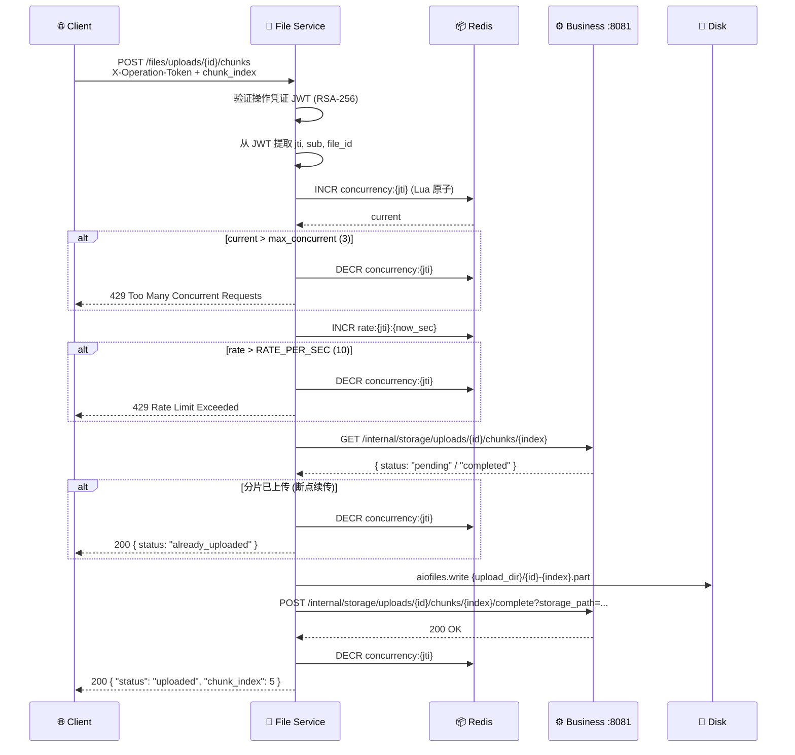

**成功响应：**
```json
{
  "code": 200,
  "data": {
    "status": "uploaded",
    "chunk_index": 5,
    "storage_path": "/Uploads/uploads_id-5.part"
  }
}
```

**断点续传响应：**
```json
{
  "code": 200,
  "data": {
    "status": "already_uploaded",
    "chunk_index": 5
  }
}
```

---

### 模块三：文件下载 `/files/files` `/downloads/files`

#### 3.1 直接下载 (操作凭证)

```http
GET /api/v1/files/files/{file_id}/content
```

| 属性 | 说明 |
|------|------|
| 认证 | **需要** 操作凭证 (X-Operation-Token) |
| 并发控制 | Redis Lua 原子脚本 |

**请求头：**

| 请求头 | 必填 | 说明 |
|--------|------|------|
| `X-Operation-Token` | 是 | 下载操作凭证 JWT |
| `X-User-Id` | 是 | 用户 UUID |
| `Range` | 否 | `bytes=start-end` |

**限制：**
- 最大并发连接数：3
- 每秒最大请求数：10
- 单凭证最大请求数：300
- Range 最大字节数：100MB

#### 3.2 授权下载 (Opaque Token)

```http
GET /api/v1/downloads/files/{file_id}/content
```

| 属性 | 说明 |
|------|------|
| 认证 | **需要** 下载授权 Token (X-Download-Token) |

> Opaque Token 是存储在 Redis 中的一次性或限次下载授权，适用于分享链接下载场景。

**Range 请求流程：**

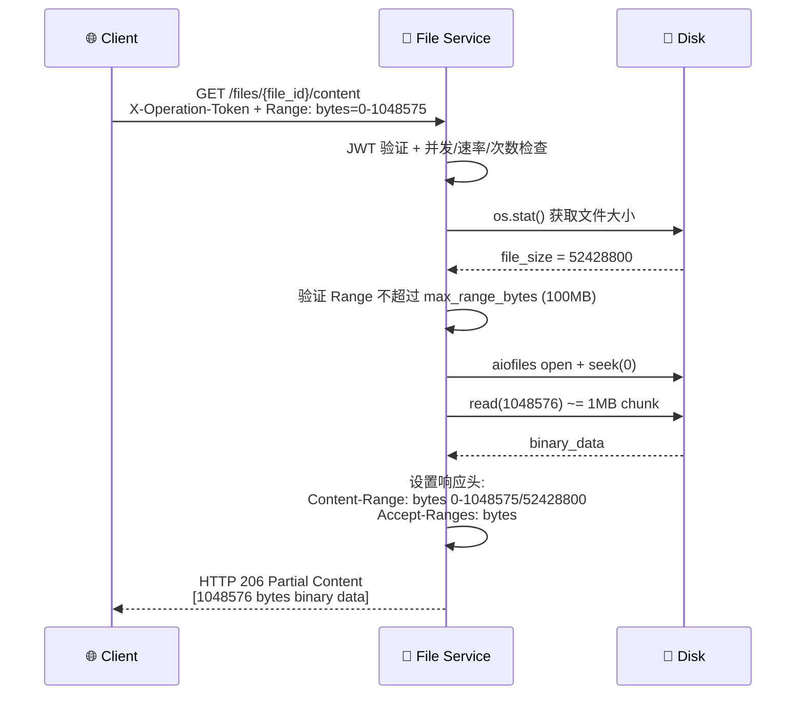

**成功响应头：**

```
HTTP 206 Partial Content
Content-Range: bytes 0-1048575/52428800
Content-Length: 1048576
Accept-Ranges: bytes
Content-Type: application/octet-stream
Cache-Control: no-cache
X-File-Checksum: sha256:abc123...
```

---

### 模块四：缩略图 `/files/thumbnails`

```http
GET /api/v1/files/thumbnails/{file_id}
```

| 属性 | 说明 |
|------|------|
| 认证 | **需要** JWT |
| 缓存 | Redis (TTL: 1 小时) |

**支持的图片格式：** JPEG, PNG, WebP, TIFF, GIF, BMP

**流程：**

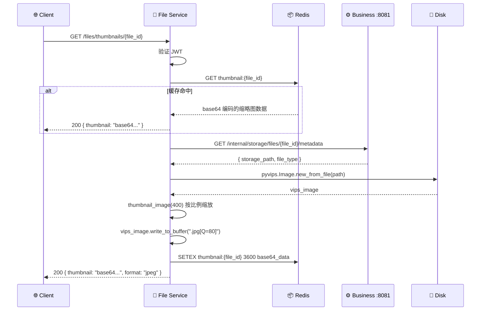

**成功响应：**
```json
{
  "code": 200,
  "data": {
    "thumbnail": "/9j/4AAQSkZJRgABAQAAAQABAAD/2wBD...",
    "format": "jpeg",
    "width": 400,
    "height": 300
  }
}
```

---

### 模块五：任务查询 `/files/tasks`

```http
GET /api/v1/files/tasks/{task_id}/status
```

**成功响应：**
```json
{
  "code": 200,
  "data": {
    "task_id": "task-uuid",
    "task_type": "file_process",
    "file_id": "file-uuid",
    "status": "processing",
    "progress": {
      "merge": "completed",
      "hash_calculate": "completed",
      "virus_scan": "processing",
      "thumbnail": "pending",
      "video_transcode": "pending"
    },
    "created_at": "2026-06-11T10:30:00",
    "updated_at": "2026-06-11T10:30:15"
  }
}
```

---

## 核心设计

### 操作凭证 (Operation Token) 机制全流程

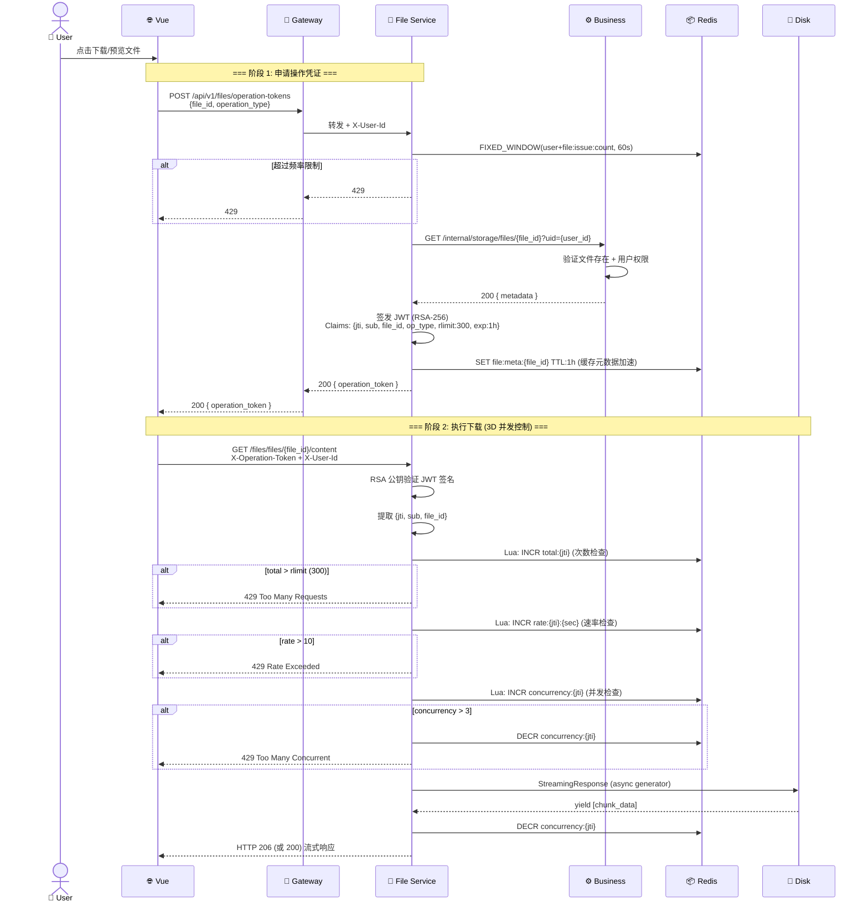

### 多维度并发控制 (3D Control)

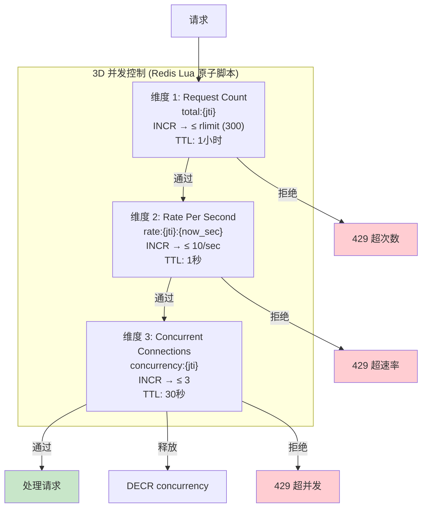

### 断点续传检查流程

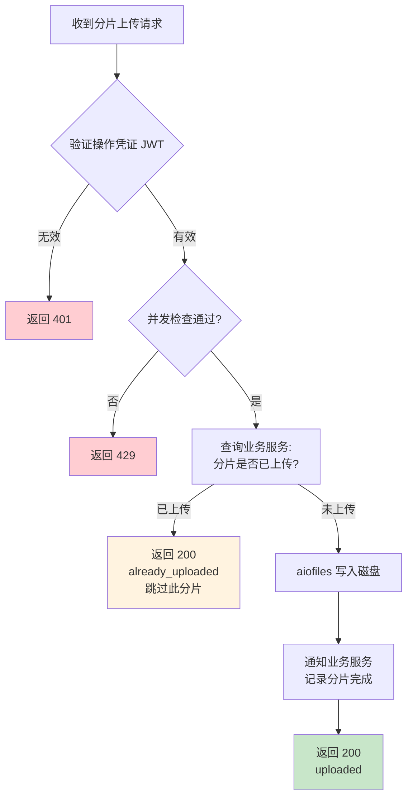

---

## RabbitMQ 消费者

### Backend Task Bus — 文件后台处理流水线

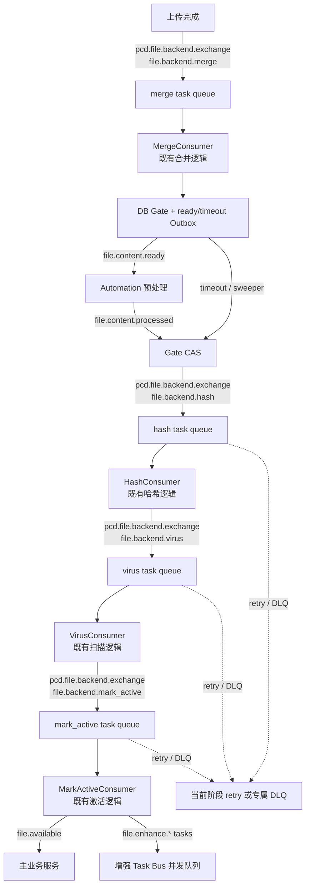

Backend Task Bus 交换机为 `pcd.file.backend.exchange`，DLX 为 `pcd.file.backend.dlx`。
Merge、Hash、Virus、Mark Active 的业务处理方法保持不变；消费者完成当前任务后直接投递
下一阶段任务。内容预处理仍通过独立的生命周期事件和 Gate CAS fail-open，不改变 Backend
Task Bus 的阶段路由。完整拓扑、重试、死信和降级流程见
[`docs/STORAGE_WORKER_TASK_BUS_AUDIT.md`](../docs/STORAGE_WORKER_TASK_BUS_AUDIT.md)。

### FileDeleteConsumer — 文件删除

监听 `pcd.file.delete.queue`：

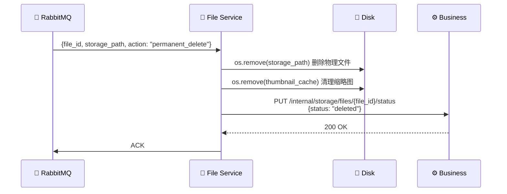

---

## 文件存储结构

```
Uploads/
├── storage/                                    # 已完成文件 (永久存储)
│   └── {yyyy}/{mm}/{dd}/{file_id}.ext          # 按日期分目录
├── {uploads_id}-{chunk_index}.part              # 上传中的临时分片
├── thumbnails/                                  # 缩略图缓存 (Redis 为主)
│   └── {file_id}_400x300.jpg
```

---

## 配置说明

核心配置通过环境变量 / `.env` 文件管理：

| 配置项 | 说明 | 默认值 |
|--------|------|--------|
| `redis_url` | Redis 连接 URL | `redis://localhost:6379/0` |
| `file_upload_dir` | 文件存储根目录 | `../Uploads` |
| `business_service_url` | 业务服务地址 | `http://127.0.0.1:8080` |
| `max_concurrent` | 单操作最大并发连接数 | `3` |
| `operation_token_expire_seconds` | 操作凭证有效期 | `3600` |
| `max_requests_per_operation_token` | 单凭证最大请求次数 | `300` |
| `rate_per_sec` | 单操作每秒最大请求数 | `10` |
| `max_range_bytes` | 单次 Range 最大字节数 | `104857600` (100MB) |
| `thumbnail_ttl` | 缩略图缓存 TTL (秒) | `3600` |
| `rabbitmq_host` | RabbitMQ 地址 | `localhost` |
| `private_key_path` | JWT 签发私钥路径 | `keys/private.pem` |
| `public_key_path` | JWT 验证公钥路径 | `keys/public.pem` |

---

## 核心流程时序图

### 完整断点续传与 Task Bus 后台处理

展示从创建上传会话、分片上传、合并，到内容预处理 Gate、哈希、病毒扫描、激活和增强
事件扇出的关键链路。后台阶段采用原有 file backend task 队列；内容预处理使用独立生命周期事件。

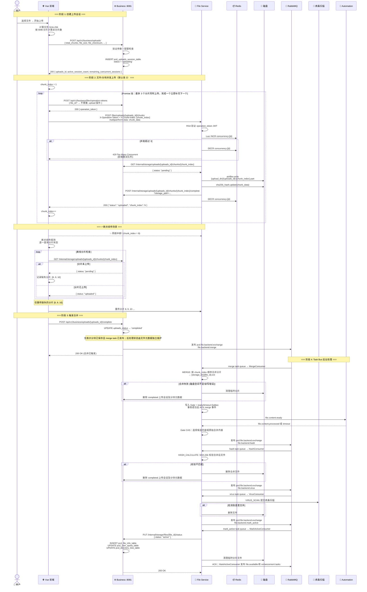

可重试错误先发布到当前事件路由的 `.retry` TTL 队列，发布确认成功后 ACK；不可重试、
未知异常或超过次数进入当前阶段专属 DLQ。内容预处理失败只触发 fail-open，核心文件仍
继续进入 hash → scan → active。完整拓扑和 DLQ 流程见
[`docs/STORAGE_WORKER_TASK_BUS_AUDIT.md`](../docs/STORAGE_WORKER_TASK_BUS_AUDIT.md)。

### 多分片并发上传流程

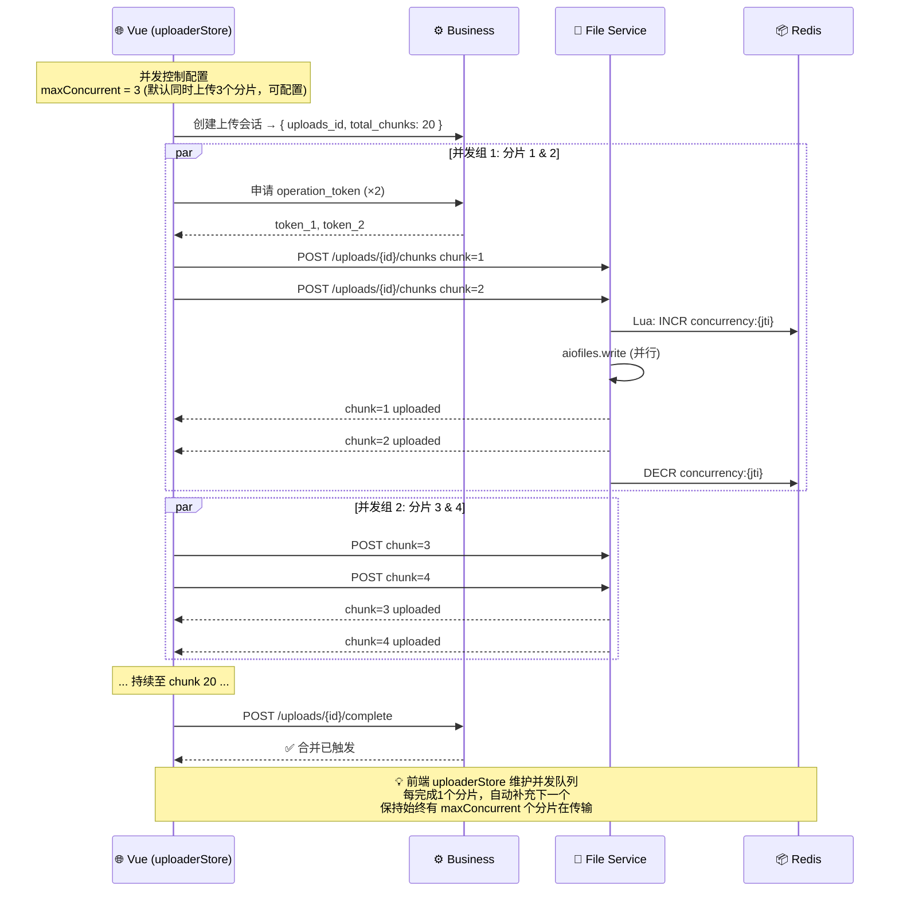

### 流式下载与 Range 请求

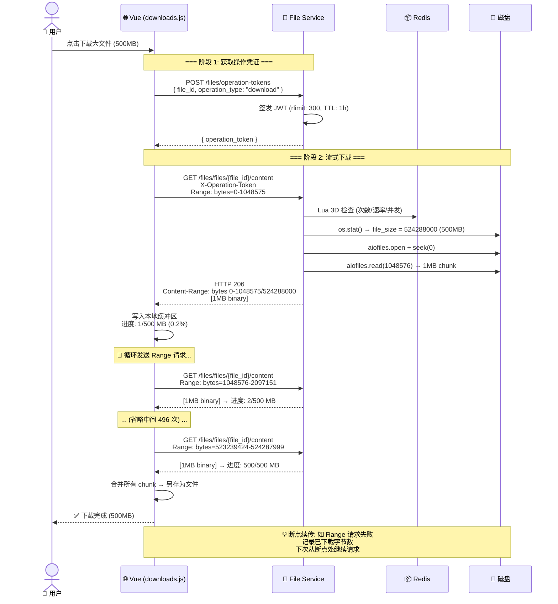

### 缩略图缓存策略

```mermaid
flowchart TD
    Start([GET /files/thumbnails/{file_id}]) --> Cache{Redis: GET<br/>thumbnail:{file_id}}

    Cache -->|命中| Hit[返回 base64 缓存数据<br/>响应时间: ~5ms]
    Cache -->|未命中| Type{检查文件类型}

    Type -->|图片 (JPEG/PNG/WebP/TIFF/GIF/BMP)| GetMeta[查询业务服务<br/>获取 storage_path]
    Type -->|非图片 (PDF/视频/其他)| NoThumb[返回 200<br/>thumbnail: null]

    GetMeta --> DiskRead[pyvips.Image.new_from_file<br/>读取原始文件]
    DiskRead --> Scale[thumbnail_image(400)<br/>按比例缩放至宽度 400px]
    Scale --> Convert[write_to_buffer<br/>'.jpg[Q=80]'<br/>JPEG 质量 80%]

    Convert --> StoreCache[Redis: SETEX<br/>thumbnail:{file_id} 3600<br/>base64_encoded_data]

    StoreCache --> Return[200 返回缩略图<br/>响应时间首次: ~500ms]

    Hit --> Return

    style Hit fill:#c8e6c9
    style Return fill:#c8e6c9
    style NoThumb fill:#fff3e0

    subgraph "缓存清除策略"
        Dir1[主动清除:<br/>DELETE /files/thumbnails/{file_id}]
        Dir2[被动过期:<br/>Redis TTL 3600s 自动删除]
        Dir3[文件变更清除:<br/>更新文件时 DEL thumbnail:{file_id}]
    end
```

### 并发控制架构全景

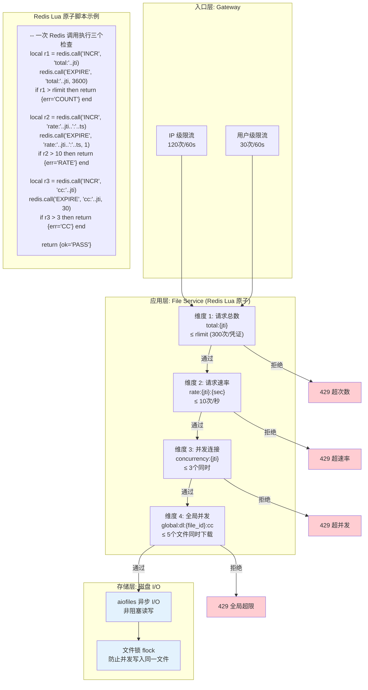

---

## 开发指南

### 环境要求
- Python 3.11+
- Redis
- RabbitMQ
- libvips (系统级)

### 安装依赖
```bash
python -m venv .venv
source .venv/bin/activate
pip install -r requirements.txt
```

macOS 安装 libvips：
```bash
brew install vips
```

### 启动服务
```bash
uvicorn server:app --host 0.0.0.0 --port 8000 --reload
```

### Docker 部署
```bash
docker build -t privateclouddisk-file-service .
docker run -p 8000:8000 -v /data/uploads:/Uploads privateclouddisk-file-service
```
