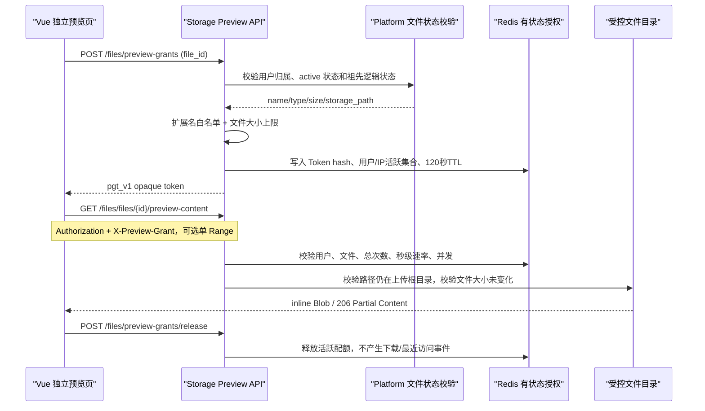
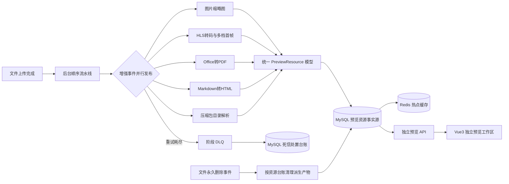

# PrivateCloudDisk Web / Storage 文件预览全栈审计与实施报告

> 审计日期：2026-07-23；专项复审与二次实施：2026-07-24；原始内容预览与认证专项：2026-07-25
> 审计范围：`PrivateCloudDisk-web` 文件浏览、独立预览、公开分享与标签链路；`PrivateCloudDisk-storage-service` 预览资源、HLS、播放记录、MQ 增强/删除/DLQ；`PrivateCloudDisk-platform-service` 标签接口；相关 MySQL 迁移与 Docker 编排。  
> 说明：90 项评分覆盖整个 Web 应用的发布质量；本轮代码修改严格集中在用户指定链路。营销页、计费页等非本轮业务范围的遗留问题会计入评分，但未进行破坏性重构。

## 〇-A、2026-07-25 原始内容预览、流水线与认证专项结论

> 本节是对下方历史结论的增量修订。若内容冲突，以本节为准：Markdown 后端转 HTML
> 流水线已移除；文件悬停默认延迟已由 3 秒调整为 1.8 秒；永久删除改为真正删除预览
> 资源记录，不再仅设置 `deleted` 状态。

### A.1 问题定位与严重程度

| 严重度 | 问题 | 根本原因 | 已实施结果 |
|---|---|---|---|
| CRITICAL | Monaco 永久显示“正在初始化” | 编辑器 DOM 被放在 `v-else` 中；`loading=true` 时容器没有挂载，初始化函数拿不到 ref，且旧分支未结束 loading | 工作区始终挂载，加载遮罩只覆盖其上方；容器缺失、CDN 超时和初始化异常均进入可重试错误态 |
| HIGH | Monaco CDN 类型无法被 TypeScript 校验 | `monaco-editor.d.ts` 被写成外部模块增强，但本地没有 npm 模块可增强，导致 `Cannot find module` | 改为真正的 ambient module shim；只声明项目使用的 API，运行时仍由 CDN 加载，不增加打包体积 |
| HIGH | Markdown 左侧大纲为空或首次不更新 | 大纲默认关闭，标题观察器在标题 ID 生成前初始化，重复标题也可能产生重复 ID | 桌面端默认显示大纲；DOM 更新后先提取标题并生成唯一 ID，再创建 IntersectionObserver；点击平滑定位 |
| HIGH | Markdown 代码块未高亮 | markdown-it 回调返回完整 `pre/code` 造成嵌套风险，且高亮发生在最终 DOM 挂载前 | markdown-it 只负责安全转义；最终 DOM 挂载后逐个调用 `highlightElement`，未知语言和单块异常安全降级 |
| CRITICAL | 预览行为被当成下载、缺少严格授权 | Markdown/代码/原图复用了 Download Grant 与下载接口，可能写下载事件和最近访问 | 新增有状态 `pgt_v1` Preview Token、独立颁发/释放接口和源内容接口，不发布下载事件、不写最近访问 |
| HIGH | 原预览接口职责混杂 | 同一路径同时返回源文件和 Office/PDF 派生产物，回退逻辑还会扫描/猜测资源路径 | `/preview-content` 只返回白名单源文件；Office/PDF 使用 `/document-content`；视频和压缩包保持专用接口 |
| HIGH | 首次进入图片页显示失败，重试才成功 | ImageLightbox 对 visible/fileId 的 watcher 非 immediate，组件以已打开状态挂载时不会触发加载 | 初次挂载与重试统一调用 Preview Token 内容事务；Blob URL 继续按 LRU/卸载回收 |
| HIGH | 30 秒视频素材入库被 HLS 阻塞 | 快速素材已生成，但资源台账由 HLS 整体完成后的消费者统一提交 | 流水线新增 ready callback；30 秒 MP4 完成即通过独立 DB 事务提交，HLS/VTT/雪碧图仍在整条链路完成后统一入库 |
| HIGH | 播放进度每次使用 INSERT 路径 | 心跳写入统一使用 INSERT/冲突更新，语义不清且增加数据库写放大 | Repository 先锁定主键：首条 INSERT，后续 UPDATE；进度和观看历史入口统一调用 `save` |
| CRITICAL | 永久删除可能留下台账或消息丢失 | 预览记录只软标记；通知/重试发布前 ACK；任意异常也被 ACK | 文件实体清理后，本地事务删除进度与预览台账；平台回调成功后 ACK；重试消息发布成功后才 ACK；异常进入 DLQ |
| HIGH | 登录入口只支持手机号 | 前端固定 `phone_number`，后端 DTO/Service 没有邮箱登录分支 | 单输入框实时识别 PCD 账号、手机号、邮箱，只发送对应一个字段；后端 DTO、限流身份和查询分支全部对齐 |
| MEDIUM | 未开放登录方式仍发送网络请求 | 验证码、扫码、OAuth UI 与占位接口直接绑定，QR 组件 mounted 即创建并轮询授权会话 | 保留布局和接入注释，点击只显示“开发中”；不创建 QR 会话、不轮询、不请求验证码或 OAuth |
| MEDIUM | Turnstile 首屏自动加载且失败后行为不统一 | 登录、注册和三个安全页面分别初始化，部分页面 mounted 即渲染且有额外包装 | 五处统一为首次表单交互后按需渲染、`interaction-only`；业务失败统一 reset；注册/安全页移除额外边框包装 |
| MEDIUM | 标签颜色仅能选择预设值且气泡视觉过重 | 前端没有自由颜色输入，DTO 只校验非空，文件项目使用微信气泡容器 | 保留预设色并增加调色盘/HEX 输入；DTO 使用六位 HEX 正则；移除气泡背景/箭头，动态折叠逻辑保留 |

### A.2 Preview Token 与原始内容数据流



安全边界：

1. 白名单仅包括 Markdown、常见图片、代码和纯文本；SVG、HTML 主动内容作为图片被拒绝，Office、视频、压缩包必须走专用接口。
2. 文本默认上限 10 MiB，图片默认上限 25 MiB，单次 Range 默认上限 8 MiB；均可通过 Compose 环境变量调整。
3. Token 默认 120 秒，用户最多 6 个活跃 Token，用户与 IP 组合最多 3 个；单 Token 还有总请求数、每秒速率和并发限制。
4. Token 只在客户端内存和 Redis 短期存在；Redis key 使用 Token SHA-256，不持久化完整 Token。
5. 源路径必须位于 `FILE_UPLOAD_DIR`，并在读取时再次核对实际大小与颁发时快照，防止授权后替换文件。

### A.3 Markdown 流水线退役

已从配置、任务枚举、失败原因、事件拓扑、RabbitMQ 声明、Worker 启动、消费者、处理器、
DLQ 映射、依赖和资源持久化分支中移除 `markdown_to_html`。对应 Python 流水线和消费者文件
已删除，数据库迁移 `006_tag_color_and_preview_resource_cleanup.sql` 会清理历史
`markdown/markdown_html/code` 派生资源记录。

部署注意：

- RabbitMQ 的 durable 旧队列不会因代码不再声明而自动消失。发布后先确认旧消息不再需要恢复，再由管理员在维护窗口删除
  `pcd.file.enhance.markdown_to_html.*` 队列/绑定；不在应用启动时自动做破坏性删除。
- 指定旧死信 `fab8a765` 属于已经退役的 Markdown 转换任务，不应重新投递到新流水线。文件自身仍可通过 Preview Token 读取并由浏览器渲染。
- 历史 HTML 实体不再被系统引用，可在数据库迁移和备份确认后，通过受控运维脚本按资源台账清理；不得使用宽泛目录删除命令。

### A.4 永久删除的一致性边界

Platform Service 的 `completeDeleteFileByFileId` 在一个 Spring/MySQL 事务中删除分享资源、
空分享、标签关联、收藏和文件元数据。Storage Service 在自己的 MySQL 事务中删除视频进度
与预览资源台账，文件系统删除是幂等步骤。两个数据库与文件系统无法组成真正的本地 ACID
事务，因此实现采用消息驱动 Saga：

```text
物理文件与派生资源幂等删除
  -> Storage DB 事务删除进度/资源台账
  -> Platform 内部接口事务删除业务关联
  -> 成功后 ACK
  -> 任一步失败：指数退避重试，耗尽后进入 DLQ 并保留审计记录
```

这保证“最终一致且可恢复”，但不能宣称跨服务、跨文件系统的单一 ACID 事务。发布环境必须监控
删除队列积压、DLQ 数量和孤儿资源巡检指标。

### A.5 本轮优化前后对比

| 场景 | 优化前 | 优化后 |
|---|---|---|
| JS/Python/Java 代码预览 | 内容已到达但编辑器容器未挂载，永久 loading | 编辑器容器常驻、只读模式固定、内容/扩展名 watcher 更新模型和语言 |
| Markdown 大纲 | 首次为空、标题 ID/Observer 时序错误 | 最终 DOM 驱动的 1–4 级标题树，重复标题唯一 ID，点击和滚动状态同步 |
| Markdown 高亮 | CDN/初始化时序导致普通文本代码块 | 最终 DOM 逐块 highlight.js，高亮失败不阻断正文 |
| 图片首次打开 | 初次不请求，点重试后才显示 | 初次与重试完全复用 Preview Token → Blob 路径 |
| 预览接口 | 下载授权、下载事件、源文件与派生资源混用 | 短期有状态 Preview Token；源内容与专用预览资源职责分离 |
| 视频快速素材 | 等整段 HLS 完成才可见 | 30 秒资源生成后立即独立提交并可查询 |
| 播放心跳 | 每次走 INSERT 语句 | 首次 INSERT，后续 UPDATE |
| 文件悬停 | 固定 3 秒 | 默认 1.8 秒，可通过 `VITE_FILE_HOVER_PREVIEW_DELAY_MS` 在 800–3000ms 内配置 |
| 登录账号 | 仅手机号 | 单输入框自动适配 PCD 账号、手机号、邮箱 |
| 未实现登录方式 | 点击后请求 404/占位服务 | 不发网络请求，明确友好提示并保留接入点 |
| 标签颜色 | 固定预设、容器呈微信气泡 | 预设 + 自由调色盘 + HEX 双端校验；简洁无气泡背景 |

### A.6 2026-07-25 验证记录与测试建议

已执行：

| 验证 | 结果 |
|---|---|
| `npm run build` | 通过；1830 个模块转换，代码/Markdown/图片预览页保持独立 chunk |
| 本次文件定向 `vue-tsc --noEmit` | 0 条关联错误；全仓仍有大量既有严格类型错误 |
| `python3 -m compileall -q app core tests scripts` | 通过 |
| Storage 单元测试 | 8/8 通过：DLQ 契约/1052 SQL 4 项，Preview Token 白名单/大小边界 4 项 |
| `./gradlew compileJava` | 通过 |
| MyBatis XML 解析 | 25/25 通过 |
| `docker compose config -q` | 通过；仅报告顶层 `version` 已废弃警告 |
| `git diff --check` | 通过 |

环境边界：

- 本机 Python 未安装 `aiomysql`，测试运行时使用了仅针对类型导入的临时 stub；业务 SQL/连接池仍需在包含
  `requirements.txt` 依赖的 Storage 镜像内再跑一次。
- 当前没有连接真实 MySQL、Redis、RabbitMQ、ffmpeg 和 uploads 数据，不能把单元测试替代端到端验证。
- 发布前至少使用 `.js/.py/.java`、含重复标题/多语言代码块的 Markdown、JPG/PNG/GIF、超限文本、非法 Range
  执行真实接口测试；并验证 429 页面有重试按钮、401 不会误清除登录 JWT。
- 视频需验证“30 秒资源先入库、HLS 后完成”的时间顺序；永久删除需分别覆盖手动删除与回收站过期事件，
  并核对 Platform 五类关联、Storage 两张表、原文件及全部派生产物。
- Turnstile 必须在正式 Site Key 域名下验证：首屏无脚本请求、首次输入后出现挑战、密码错误/注册失败/换绑失败后可再次验证。

## 〇、2026-07-24 专项复审、根因分析与二次实施

### 0.1 问题清单与严重度

| 严重度 | 审计发现 | 根因 | 二次实施结果 |
|---|---|---|---|
| CRITICAL | MySQL 1052：`retry_count` 列歧义 | `INSERT ... AS incoming ON DUPLICATE KEY UPDATE retry_count=retry_count+1` 中目标表与新行别名都有同名字段 | 右值显式改为 `pcd_mq_dead_letter_record_table.retry_count + 1`，并新增 SQL 契约单测 |
| CRITICAL | `markdown_to_html.dlq` 中 `task_type=unknown`、`failure_reason` 为空、`retry_count=0` | 增强生产者只发送 `stage`；公共 DLQ 只优先读 `task_type`；消费者未捕获异常时直接 `nack(requeue=false)`，RabbitMQ 转发的是未补全原消息 | 事件同时发布 `stage/task_type`；空字段规范化；所有异常统一进入有界重试；新增 `failure_detail` |
| HIGH | 重试过程阻塞消费者且进程崩溃可能丢任务 | 旧实现使用进程内 sleep，`processing` 重复消息直接 ACK，Redis 状态无处理租约 | 新增每阶段 durable retry queue + per-message TTL；发布成功后 ACK；NX 原子租约；处理中重复消息延迟复查 |
| HIGH | DLQ 只做降级，不能自动恢复或主动告警 | 没有 DLQ 二次恢复计数，也没有可选运维通知通道 | 增加最多 2 次 DLQ 自动恢复、独立计数、处置状态更新；耗尽后业务降级并调用可选 Webhook |
| HIGH | Markdown 插件 CDN 返回 404 后被 `nosniff` 拒绝执行 | `markdown-it-anchor@9.2.1` 不存在、UMD 文件名/全局名错误；TOC 包没有可直接使用的浏览器 UMD | 固定已发布版本和真实 UMD 文件；移除必定 404 的 TOC 注入，目录由最终 DOM 构建 |
| HIGH | Markdown 加载器可能无限等待或反复复用坏节点 | 超时后没有清理 script/link；已存在但永远不触发 load 的元素没有独立超时 | 超时/错误统一移除节点；已有节点也受超时约束；主渲染等待高亮资源并提供安全回退 |
| HIGH | Safari 公开分享页被 `.share-page {display:none}` 类规则误伤 | 仓库中没有该声明或 JS 隐藏逻辑；行为只在 Safari 出现，符合内容拦截器/扩展的通用元素隐藏规则特征；旧改名只是在绕过 | 保留原类名，同时增加稳定 ID 与高特异性根选择器，明确恢复 display/visibility；构建目标降为 Safari 13 |
| HIGH | 收藏、标签、分享可返回回收站/祖先已删除的文件 | 查询只验证关联行存在，没有复用“实际状态 + 祖先逻辑状态”设计 | 三类 Mapper 均加入统一有效状态判定；只影响可见性，不删除软删除关联 |
| HIGH | 永久删除后残留标签/分享资源孤儿数据 | 部分关联表没有 file 外键；业务方法只删除文件元数据 | 同一事务按分享资源、空分享、标签、收藏、文件元数据顺序显式清理 |
| HIGH | Office/PDF 只有单张低规格封面 | 150 DPI 单图同时承担列表、悬停和大屏场景 | 220 DPI 一次渲染，派生 original/large/medium/small 四档，无裁剪、无拉伸，逐档入库 |
| HIGH | 视频悬停预览会加载整段视频或无法实现 | 后端没有短时长专用媒体资源 | HLS 流水线新增前 30 秒 H.264/AAC faststart MP4，保持比例并限制边界尺寸 |
| MEDIUM | 网格/列表固定显示 2/3 个标签后立即 `+N` | 组件不知道容器宽度和允许行数 | 新增标签气泡组件，使用 ResizeObserver 和文本宽度预算动态展示，旧 Safari 有 resize 降级 |
| MEDIUM | 网格/列表没有统一 3 秒原位覆盖预览 | 两种视图没有共享悬停状态和媒体加载策略 | 新增一个共享组件；绝对定位覆盖、不参与文档流、视频 Blob 主动释放、移动端自动禁用 |
| MEDIUM | 历史 HLS/缩略图/Office/压缩包资源无数据库台账 | 新资源表只覆盖发布后的事件 | 新增默认 dry-run、显式 `--apply`、幂等 upsert 的历史回填脚本；按需求忽略 Markdown HTML |

### 0.2 指定死信的代码取证结论

指定消息：

- queue：`pcd.file.enhance.markdown_to_html.dlq`
- msg_id：`fab8a765`
- file_id：`82964eb6-88cb-46a7-880a-02a67f939e39`
- enhance_task_id：`fcc5d4dea2654c849e6d7e259329e202`

能够从旧代码确定的直接原因链：

1. `FileEnhanceEvent` 的消息契约原来只有 `stage=markdown_to_html`，公共 DLQ 日志读取 `task_type`，所以显示 `unknown`。
2. 未预期异常分支直接执行 `nack(requeue=False)`，没有构造新的失败消息。RabbitMQ DLX 因此转发原消息，原消息的 `failure_reason=""`、`retry_count=0` 被原样保留。
3. DLQ 持久层只读取 `task_id/event_id`，没有读取 `enhance_task_id`，同阶段空任务 ID 还可能错误合并记录。
4. 数据库 upsert 的 `retry_count=retry_count+1` 在 MySQL 新行别名语法下产生 1052，使本应记录原因的 DLQ 处置本身再次失败。

无法从历史消息反推出的部分：原始底层异常已经被旧链路丢弃，因此不能严谨断言是内存、文件缺失、编码还是 Markdown 转换器异常。新契约将标准 `failure_reason` 与原始 `failure_detail` 分开保存；再次发生时可直接得到异常摘要。当前 Markdown 转换本身是本地 CPU/IO 流程，不调用外部 API，因此不存在 API 调用额度风险；主要资源风险是超大文本、磁盘 IO、Worker 内存和依赖缺失，应通过容器限制与任务指标监控。

重试策略评估：

- `retry_count=0` 对首次失败是合理初值，但对已经位于 DLQ 的消息不合理，因为它说明旧消费者没有成功构造失败事件。
- 当前阶段内默认最多重试 3 次，基础退避 5 秒并受最大延迟上限控制；阶段重试耗尽后，DLQ 再进行最多 2 次独立恢复。
- 等待由 RabbitMQ durable retry queue 承担，不占用消费者协程；恢复计数与阶段计数分离，避免无限循环。
- 处理租约默认 1800 秒。Worker 崩溃后租约自动失效；重复消息先进入延迟队列，不再直接丢弃。

### 0.3 文件状态与删除事务

查询可见性采用下列统一语义：

```text
文件可见 = file_status = active
        且目录闭包中的任一祖先 node_status 都不属于 trashed/deleted

目录可见 = node_status = active
        且目录闭包中的任一祖先 node_status 都不属于 trashed/deleted
```

- 收藏列表、收藏计数和收藏 ID 集合使用同一判定。
- 标签列表统计、批量标签、按标签分页和计数使用同一判定。
- 分享 token 查询、分享列表、资源计数和资源读取使用同一判定。
- 回收站/软删除只改变文件或目录状态，收藏、标签、分享关联行保持不变；恢复后自动重新可见。
- 永久删除由 Platform Service 的事务完成关联清理。多资源分享只移除被删文件；仍含其他资源的分享链接保留，空分享才删除。

### 0.4 Office、视频和前端交互实现

Office/PDF：

1. Office 先由 LibreOffice 无头模式转 PDF；PDF 直接进入统一预览流程。
2. PyMuPDF 按 220 DPI 渲染第一页，Pillow 从同一原图用 LANCZOS 派生四档 JPEG。
3. 原图质量 97 且禁用色度降采样；其他档位质量分别按场景下降，全部保持页面比例。
4. 临时文件写完后使用原子替换，接口不会读到半成品。
5. `office_pdf` 和四条 `office_thumbnail` 记录在 MQ ACK 前写入数据库。
6. `/files/files/{file_id}/document-thumbnail?size=` 校验归属、读取资源台账、返回 ETag。

视频：

1. 保留原 HLS ABR 核心链路和播放器。
2. 新增前 30 秒 MP4：H.264、yuv420p、faststart、CRF 23，音频存在时转 AAC 96k。
3. 尺寸限定在 960×720 边界盒，使用 `force_original_aspect_ratio=decrease`，不裁剪、不拉伸。
4. `/files/video/stream/{file_id}/hover-preview` 校验归属并读取数据库资源，不扫描目录。
5. 网格/列表共用 `FileHoverPreview`：精确悬停 3 秒、原位缩放、内部层级覆盖、离开时中止请求并 revoke Blob URL。
6. 触控设备、窄屏和减少动态效果偏好都有明确降级。

标签：

1. 网格、列表、详情抽屉继续共享 Dashboard 的批量标签数据，避免 N+1。
2. `FileTagBubble` 根据真实容器宽度和允许行数计算展示数量，而非固定 2/3 个。
3. 气泡保留全部标签 title；超出预算才显示 `+N`。
4. 标签管理按钮保留在原操作区，没有大幅改变“我的网盘”布局。

### 0.5 历史资源回填

先 dry-run：

```bash
cd PrivateCloudDisk-storage-service
python scripts/backfill_preview_resources.py --root /data/uploads
```

核对日志中的文件归属与资源分类后再写入：

```bash
python scripts/backfill_preview_resources.py --root /data/uploads --apply
```

脚本扫描 HLS master/manifest、视频前 30 秒素材、旧视频转码、普通/视频/Office 缩略图、Office PDF 和压缩包树；Markdown HTML 暂时忽略。无法在主文件表找到归属用户的资源会告警并跳过，不会猜测 user_id。

### 0.6 发布实施顺序

1. 备份数据库，执行 `005_preview_resource_persistence.sql`；确认 MySQL 版本支持项目现用的 `INSERT ... AS incoming`。
2. 先发布 Storage Worker 与 HTTP 服务，使新 MQ 契约、retry queue、资源接口同时可用。
3. 检查 RabbitMQ 中每个增强阶段的主队列、`.retry` 队列和 DLQ 都是 durable，绑定键无误。
4. 配置 `OPS_ALERT_WEBHOOK_URL`；若暂不配置，确认日志采集能抓取 critical 且死信表已有告警查询。
5. 发布 Platform Service，验证收藏、标签、分享状态过滤与永久删除事务。
6. 对历史资源执行 dry-run 和人工抽样后再 `--apply`。
7. 发布 Web，清理 HTML 缓存但保留哈希静态资源长缓存。
8. 用真实 Word/PDF/Excel/PPT、横屏/竖屏视频和 7 层目录执行预发 E2E。

### 0.7 2026-07-24 实际验证记录

| 验证 | 结果 |
|---|---|
| `npm run build` | 通过；1829 个模块转换，独立预览页面继续按路由拆包 |
| 本次文件定向 `vue-tsc --noEmit` | 0 错误；全仓仍有历史严格类型错误，未越界修改 |
| `python -m compileall -q app core scripts tests` | 通过 |
| `python -m unittest discover -s tests -v` | 4/4 通过：消息契约、空字段规范化、先发布后 ACK、1052 SQL |
| `./gradlew compileJava --no-daemon` | 通过 |
| MyBatis XML 语法解析 | 4 个本次 Mapper XML 全部通过 |
| `docker compose config -q` | 通过；只有顶层 `version` 废弃警告 |
| `git diff --check` | 通过 |
| 深层目录纯函数测试 | 6 级祖先 + 第 7 级子目录，depth `0>1>2>3>4>5>6>7` |
| 浏览器默认 1280px | 根节点存在，`display:flex`、`visibility:visible`、无控制台错误、无横向溢出 |
| 390、767、768、1199、1200px | 全部根节点可见且无页面级横向溢出 |

验证边界：

- 当前自动浏览器不是 Safari/WebKit，不能把 CSS/构建兼容验证冒充 Safari 真机结果。发布前仍需在 Safari 13/15/17、iOS Safari 和微信 WebView 测试。
- 当前工作区没有连接运行中的 MySQL/RabbitMQ/真实 uploads 数据，因此 DLQ 端到端、Office 视觉相似度和永久删除事务仍需在预发环境执行。
- LibreOffice 的 Word/PPT/PDF 首页通常能达到高一致性；复杂 Excel 的打印区域、字体缺失、宏、外链和平台专有字体会影响“官方软件截图级”一致性。镜像必须安装业务字体并为 Excel 维护打印区域规范。

### 0.8 二次实施风险与规避

| 风险 | 影响 | 规避 |
|---|---|---|
| retry queue 在旧 RabbitMQ 拓扑中不存在 | 重试发布失败，原消息不会 ACK | 先发布声明拓扑的 Worker，确认队列后再放量生产者 |
| 处理租约过长 | 崩溃任务恢复延迟 | 按最大文件/视频耗时设置 `ENHANCE_PROCESSING_LEASE_SECONDS` 并监控 P99 |
| 本地磁盘多实例不可共享 | DB 有记录但当前实例读不到文件 | 使用共享卷/对象存储；`storage_backend` 已预留适配 |
| Office 字体或 LibreOffice 版本差异 | 封面与 Microsoft Office 不一致 | 固定镜像版本、安装字体、建立黄金文件像素差基线 |
| 视频 30 秒素材增加存储 | 大量视频产生额外容量 | 记录 size_bytes，加入资源生命周期/配额巡检；永久删除已统一清理 |
| Blob 视频占用浏览器内存 | 长时间悬停可能积累内存 | 组件离开/卸载立即 abort 和 revoke，不放入图片 LRU |
| 内容拦截器使用 `display:none!important` | 页面根仍可能被极端用户规则隐藏 | 高特异性 ID + `!important`；同时建议避免根类使用广告/分享通用词作为唯一选择器 |
| 动态微信分享卡片不执行 SPA meta | 卡片仍显示通用信息 | 在网关/SSR 输出 token 对应的服务端 OG HTML；不得输出提取码 |

## 一、执行结论

本轮已完成从“控制台内嵌预览 + 本地目录/Redis 临时状态”到“独立预览工作区 + MySQL 事实源 + Redis cache-aside + MQ 可审计台账”的核心升级。前端生产构建、Storage Python 编译、Platform Java 编译、Compose 配置解析与本次关联 TypeScript 检查均已通过。

最高风险问题及处置结果：

| 严重度 | 原问题 | 处置结果 |
|---|---|---|
| 严重 | 预览页嵌在 `/app` Layout，播放器与文档共享控制台菜单区域 | 已迁移为 `/preview/*/:fileId` 顶级懒加载路由 |
| 严重 | HLS/预览资源只依赖文件夹或 Redis，跨实例存在数据漂移 | 已新增统一预览资源表、Repository/Service、DB-first 写入和 cache-aside 查询 |
| 严重 | 视频缩略图流水线输出路径与 API 读取约定不一致，返回“视频文件不存在” | 已由数据库资源记录定位 small/medium/large/poster，并从业务服务获取真实源路径 |
| 高 | 播放进度事件未回写 Store，保存值可能始终为 0 | 已修复事件同步，并按 10 秒节流持久化；旧 Redis-only 记录读取时补写 MySQL |
| 高 | MQ 死信只保留 Redis 记录，无法长期审计 | 已新增死信台账表与幂等 Repository，数据库写入成功后再确认消息 |
| 高 | 文件永久删除未覆盖 HLS、Office、Markdown、压缩包等派生资源 | 已按数据库资源清单清理物理资源、软删除元数据并删除观看进度 |
| 高 | 标签在网格、列表、详情抽屉不可见且没有就近管理入口 | 已增加批量标签接口、标签徽标、右键/操作按钮和详情抽屉管理入口 |
| 高 | Safari 可能在解析 ES2020 产物阶段白屏 | 构建目标降至 `es2018/safari13`，补充 WebKit 背景模糊前缀与不透明降级 |

## 二、问题定位与优化前后对比

| 维度 | 优化前 | 优化后 |
|---|---|---|
| 页面结构 | 多类预览组件重复，部分路由不存在；预览占用控制台主区域 | 每类文件有独立顶级页面；统一类型分发器；旧 `FilePreview` 重复实现已移除 |
| 图片预览 | 点击链路未稳定触发灯箱；灯箱只加载 `large` 有损缩略图 | 图片点击进入独立灯箱页，加载原文件 Blob，大图可重试和回收 URL |
| 视频页面 | 只有播放器，播放历史/统计缺失 | 中央播放器、右侧历史列表、缩略图/时长/进度、账号可播放视频统计；中小屏自动下移 |
| 视频封面 | API 猜测本地路径，首帧只有单尺寸 | 流水线生成 4 档；poster 保持源画幅不裁剪，列表档位等比缩放并补画布 |
| 播放进度 | Redis TTL 是事实源；异常关闭时易丢失 | MySQL 主表持久化，Redis 仅热点缓存；定时、进度报告、pagehide、卸载均触发保存 |
| 预览资源 | 每种流水线各自返回路径，缺少统一生命周期 | 统一 `resource_type + variant + status + metadata_json` 模型，支持 upsert、查询、清理 |
| MQ 一致性 | 产物生成后即可 ACK，元数据可能未落库 | 先事务写入资源台账，再更新事件状态并 ACK；DLQ 同样先持久化 |
| HLS 安全 | 分片路径由固定目录拼接 | 令牌提取 userId，数据库定位 HLS 根目录，所有子路径做根目录边界校验 |
| 标签 | 详情与文件元素未集成，逐条查询会产生 N+1 | 一个目录一次批量查询，网格/列表/抽屉共享结果并可就近增删标签 |
| Safari 分享页 | 新语法或 backdrop-filter 可能导致旧 WebKit 白屏 | Safari 13 构建目标、WebKit 前缀与视觉降级；接口 500 时仍显示可恢复错误页 |

## 三、落地架构与事件拓扑



核心一致性约束：

1. 预览产物写入成功不代表任务完成；必须在资源元数据事务提交成功后才 ACK。
2. Redis 读取失败时降级访问 MySQL；Redis 写入失败只记录告警，不回滚已提交业务事实。
3. 文件存在性、归属和资源状态分别由主业务服务、用户 ID、预览资源表校验，禁止通过扫描实例本地目录推断。
4. 永久删除流程根据资源台账逐项清理，所有路径必须位于配置的上传根目录内。

## 四、数据库与部署实施步骤

1. 在停机窗口或兼容发布窗口执行 `PrivateCloudDisk-db/005_preview_resource_persistence.sql`。
2. 先发布数据库迁移，再发布 Storage HTTP/Worker；两类进程均会建立独立 aiomysql 连接池，并对 MySQL 启动延迟进行有上限重试。
3. 重建 Storage 镜像以安装 `aiomysql`，确认环境变量 `MYSQL_HOST/PORT/USER/PASSWORD/DATABASE` 已由密钥系统注入。
4. 发布 Platform Service，确认 `POST /business/tags/files/batch` 可用。
5. 发布 Web 静态资源，确保网关对 Vue History 路由回退到 `index.html`，并对哈希静态资源启用长期缓存。
6. 对历史视频重新投递 HLS 增强事件以生成资源台账及 4 档封面。旧播放进度会在首次读取时自动从 Redis 补写 MySQL。
7. 对 `ready` 资源抽样执行物理文件存在性巡检。若使用多 Storage 实例，本地卷必须升级为共享卷或对象存储；元数据持久化本身不能让各实例共享本地文件。

## 五、测试结果与建议

已执行：

- `npm run build`：通过，1823 个模块完成生产构建；所有预览页面均生成独立 chunk。
- `npx vue-tsc --noEmit` 定向过滤：本次修改链路 0 错误；全仓仍有 673 条历史 TypeScript 错误，主要集中在旧 IM、通用文件选择器和营销/设置组件，不应在本轮范围内伪装为已清零。
- `python3 -m compileall -q app core worker.py`：通过。
- `./gradlew compileJava --no-daemon`：通过。
- `docker compose config -q`：通过；仅有 Compose 顶层 `version` 已废弃警告。
- `git diff --check`：通过。
- 浏览器运行时：接口返回 500 时分享页仍显示友好错误态，不是白屏；390×844、820×900、1280×720 均无横向溢出。

发布前仍需在具备 MySQL/RabbitMQ/ffmpeg/真实文件数据的集成环境执行：

1. 对 mp4/mkv/webm 各上传一份，验证 HLS master、各清晰度、TS Range、poster 和 3 档列表图。
2. 播放至 30 秒后关闭页面并再次进入，验证续播误差不超过 10 秒；验证 Redis 清空后仍从数据库恢复。
3. 制造增强任务失败并耗尽重试，验证 DLQ 台账 `retry_count` 递增且消息不会因台账写入失败而丢失。
4. 永久删除包含 HLS、Office PDF、Markdown、压缩包树的文件，验证物理资源、缓存和进度全部清理。
5. 用两个账号交叉请求标签、预览、缩略图和 HLS Token，均应返回 401/403/404 且不得泄露资源状态。
6. 在真实 Safari 13/15/17 与 iOS 微信 WebView 做页面回归；当前自动化浏览器为 Chromium，不能替代 WebKit 真机矩阵。
7. 给公开分享目录构造至少 5 层嵌套和超长 Unicode 文件名，验证完整名称、滚动/换行和返回路径。

## 六、风险与规避

| 风险 | 影响 | 规避措施 |
|---|---|---|
| 现有数据库已有 volume 时 init SQL 不会自动重跑 | 新服务启动后表不存在 | 上线流水线显式执行 005 迁移，不依赖容器初始化目录 |
| 历史预览文件没有资源台账 | 新 API 显示 pending | 批量重投增强事件；上线前统计 ready 文件与资源表差异 |
| 多实例仍挂载各自本地磁盘 | DB 有记录但当前实例读不到文件 | 使用共享卷/MinIO，并逐步把 `storage_backend` 定位逻辑接入对象存储适配器 |
| MySQL 可用但 Redis 不可用 | 性能下降 | 新预览查询、进度写入已降级 DB；监控 Redis 告警并限时恢复 |
| 全仓 Vue 类型检查存在历史错误 | 后续迭代容易引入回归 | 将旧组件分批补类型，最终把 `vue-tsc --noEmit` 纳入 CI 门禁 |
| 默认开发密码/令牌密钥被误带到生产 | 数据库或 HLS Token 被伪造 | 生产启动时强制校验环境变量，密钥走 Secret Manager 并定期轮换 |

## 七、90 项发布质量评分

═══════════════════════════════════════════════════════════════════  
FULL-STACK AUDIT RESULTS  
═══════════════════════════════════════════════════════════════════

CATEGORY 1: VISUAL DESIGN & FRONTEND          SCORE: 4/5  
  1.1  Typography:             [PASS] — 分享页、视频页与预览工具栏具有明确标题/正文/辅助信息层级。  
  1.2  Colour System:          [FAIL] — 新旧页面仍混用 Tailwind token 与 scoped CSS 硬编码色值；应逐步收敛为语义化 CSS 变量。  
  1.3  Layout:                 [PASS] — 视频主从布局、独立文档工作区和分享双栏布局均采用明确网格与间距。  
  1.4  Depth:                  [PASS] — 卡片、面板、弹窗具有克制的边框、阴影和表面层级。  
  1.5  Motion:                 [PASS] — 关键交互有过渡，视频页与分享页覆盖 reduced-motion。

CATEGORY 2: USER FLOW & UX                   SCORE: 4/5  
  2.1  First Impression:       [PASS] — 官网与公开分享页能快速说明产品/分享状态并给出主操作。  
  2.2  Navigation:             [PASS] — 文件点击统一分发到专用预览路由，页面具备返回网盘能力。  
  2.3  CTAs:                   [PASS] — 提取文件、复制链接、重新加载等按钮描述具体动作。  
  2.4  Journey Completeness:   [PASS] — 分享、视频、预览和标签链路具有加载、空、成功或可恢复错误态。  
  2.5  Trust/Social Proof:     [FAIL] — 营销决策点附近缺少可验证客户案例或真实评价；需由业务提供真实来源后补充。

CATEGORY 3: RESPONSIVE & MOBILE              SCORE: 4/5  
  3.1  Breakpoints:            [PASS] — 390/820/1280 实测无横向溢出；视频侧栏在中屏下移。  
  3.2  Touch Targets:          [FAIL] — 若干旧文件工具按钮和标签 chip 小于 44px；需统一 touch target token。  
  3.3  Mobile Typography:      [PASS] — 主要正文和输入区无需缩放即可阅读。  
  3.4  Mobile Navigation:      [PASS] — 控制台与独立预览均提供移动端适配导航。  
  3.5  Mobile Performance:     [PASS] — 路由懒加载、缩略图 lazy/async 解码、分档图片已启用。

CATEGORY 4: PERFORMANCE & WEB VITALS         SCORE: 3/5  
  4.1  LCP:                    [FAIL] — 尚无真实生产 RUM/Lighthouse 数据，外部字体图标仍可能阻塞首屏；应建立性能预算。  
  4.2  INP:                    [PASS] — 标签批量查询消除 N+1，预览转换由异步流水线处理。  
  4.3  CLS:                    [PASS] — 视频播放器使用 aspect-ratio，缩略图与骨架屏预留尺寸。  
  4.4  Asset Optimisation:     [FAIL] — `vendor-utils` 构建后约 670KB，需继续拆分 PDF/编辑器/工具库。  
  4.5  Caching/CDN:            [PASS] — 哈希资源、gzip/brotli、缩略图 ETag 与 HLS 分片长期缓存已配置。

CATEGORY 5: ACCESSIBILITY                    SCORE: 3/5  
  5.1  Semantic HTML:          [PASS] — 新页面使用 header/main/section/aside 和语义化标题。  
  5.2  Keyboard Navigation:    [FAIL] — 部分旧弹窗缺少焦点陷阱与 Escape 关闭，图标按钮 focus-visible 不统一。  
  5.3  Screen Reader:          [FAIL] — 部分动态图标按钮、Toast 和异步状态尚未完整配置 aria-label/aria-live。  
  5.4  Colour Accessibility:   [PASS] — 主要正文与按钮对比度满足可读要求，状态不只依赖颜色。  
  5.5  Motion/Cognitive:       [PASS] — 支持 reduced-motion，视频不会无提示自动播放。

CATEGORY 6: SECURITY                         SCORE: 5/7 (3 N/A)  
  6.1  Secret Management:      [FAIL] — 配置仍含开发默认数据库密码和 HLS 默认密钥；生产必须无默认值并强制注入。  
  6.2  Client Secrets:         [PASS] — 本轮未发现新增 Vite 客户端私密凭证。  
  6.3  Input Sanitisation:     [PASS] — 富文本已消毒，SQL 参数化，HLS 子路径新增根目录边界校验。  
  6.4  Server Paywall:         [N/A] — 文件预览/分享链路不是付费内容解锁。  
  6.5  Payment Replay:         [N/A] — 本轮范围不包含支付验证。  
  6.6  Database Security:      [PASS] — 数据库不直接暴露给浏览器，资源查询同时约束 userId/fileId。  
  6.7  Security Headers:       [PASS] — 网关已集中配置关键安全响应头；生产需继续验证 HTTPS/HSTS。  
  6.8  API Protection:         [PASS] — 标签、预览、缩略图、HLS 签发均校验用户/文件归属；网关具有限流。  
  6.9  Webhook Verification:   [N/A] — 本轮链路没有第三方 webhook。  
  6.10 Console Cleanup:        [FAIL] — Web 旧模块仍存在较多 console 输出；需在生产构建或日志封装层分级移除。

CATEGORY 7: BACKEND & API QUALITY            SCORE: 5/5  
  7.1  API Design:             [PASS] — 预览、视频历史/统计和标签批量接口命名、方法与响应结构一致。  
  7.2  Rate Limiting:          [PASS] — 网关具备限流，Storage 的操作令牌和 Range 大小有约束。  
  7.3  Error Handling:         [PASS] — 服务端记录详细原因，客户端返回中文可恢复错误；Redis 失败可降级。  
  7.4  Data Handling:          [PASS] — MySQL 事实源、JSON 元数据、长度限制、参数化 SQL 和删除生命周期已落地。  
  7.5  Timeouts:               [PASS] — ffmpeg、业务服务和连接启动均有明确超时/重试上限。

CATEGORY 8: SEO & DISCOVERABILITY            SCORE: 2/5  
  8.1  Meta/Open Graph:        [PASS] — 公开分享入口包含 title、description、OG 与 Twitter 卡片元数据。  
  8.2  Structured Data:        [FAIL] — 尚未为产品/公开分享提供合适 JSON-LD。  
  8.3  Technical SEO:          [FAIL] — 需确认生产 canonical、robots.txt、sitemap.xml 和分享 URL 动态 canonical。  
  8.4  Heading Structure:      [PASS] — 新分享与视频页面具有单一主标题及逻辑层级。  
  8.5  Social Presence:        [FAIL] — 官网缺少可验证的官方社交媒体链接。

CATEGORY 9: PRIVACY, LEGAL & COMPLIANCE      SCORE: 3/4 (1 N/A)  
  9.1  Cookie Consent:         [PASS] — 当前未发现新增分析/广告追踪脚本；若后续接入监控必须先做同权重同意/拒绝。  
  9.2  Legal Pages:            [PASS] — 隐私政策与服务条款路由存在，并在公开页可访问。  
  9.3  Data Minimisation:      [PASS] — 提取码、标签和预览接口只收集业务必要字段。  
  9.4  Third-party Scripts:    [FAIL] — 外部 CDN 资源需完整清单、SRI 与隐私政策披露。  
  9.5  Registration:           [N/A] — 是否达到不同司法辖区登记阈值需由法务根据真实用户规模判定。

CATEGORY 10: INFRASTRUCTURE & POLISH         SCORE: 1/4 (1 N/A)  
  10.1 Error Pages:            [PASS] — 公开分享、预览和 404 有自定义错误/空状态。  
  10.2 Favicon/Manifest:       [FAIL] — 已有 manifest，但仍需补齐并实测 32/180/192/512 全套图标。  
  10.3 Dark Mode:              [N/A] — 当前为单主题产品，本轮没有宣称完整暗色模式。  
  10.4 Analytics/Monitoring:   [FAIL] — 后端有 SkyWalking，但 Web 缺少经同意后启用的错误监控和关键行为指标。  
  10.5 Content Quality:        [FAIL] — 部分旧页面仍含“功能开发中”等占位提示，需要产品逐页验收。

FULL-STACK TOTAL: 34/50（5 项 N/A 已从 55 个枚举检查点的分母中扣除）

═══════════════════════════════════════════════════════════════════  
UX AUDIT RESULTS  
═══════════════════════════════════════════════════════════════════

CATEGORY 1: SYSTEM STATUS & FEEDBACK         SCORE: 4/5  
  1.1  Loading States:         [PASS] — 视频、分享、二维码、预览和标签有加载或禁用反馈。  
  1.2  Success Confirmations:  [PASS] — 复制链接、标签、文件操作使用 Toast/状态提示。  
  1.3  Error Communication:    [FAIL] — 少数 Store 仍静默吞错，需统一可恢复提示与错误编号。  
  1.4  Progress Indicators:    [PASS] — 上传、视频进度和长时预览处理具有进度/状态。  
  1.5  Real-time Feedback:     [PASS] — 文件选择、提取码、标签和播放状态即时反馈。

CATEGORY 2: NAVIGATION & IA                  SCORE: 5/5  
  2.1  Primary Navigation:     [PASS] — 控制台导航清晰且具有选中态。  
  2.2  Mobile Navigation:      [PASS] — 小屏布局保留核心操作。  
  2.3  Search:                 [PASS] — 文件量较大场景提供搜索与无结果状态。  
  2.4  Breadcrumbs:            [PASS] — 控制台目录与分享目录提供路径导航，独立预览提供返回。  
  2.5  Footer:                 [PASS] — 公开页提供品牌、隐私、条款和安全中心入口。

CATEGORY 3: USER CONTROL & FREEDOM           SCORE: 2/5  
  3.1  Undo/Reversibility:     [FAIL] — Dashboard 单项删除仍缺少语义明确的二次确认。  
  3.2  Form Preservation:      [FAIL] — 标签新建与部分设置表单离开时没有未保存提醒。  
  3.3  Escape Hatches:         [FAIL] — 部分旧模态框不支持 Escape/焦点归还。  
  3.4  Settings Persistence:   [PASS] — 视图/账号等主要偏好已有持久化 Store/服务。  
  3.5  Logout/Sessions:        [PASS] — 控制台提供退出与认证守卫。

CATEGORY 4: CONSISTENCY & STANDARDS          SCORE: 4/5  
  4.1  Visual Consistency:     [PASS] — 标签、卡片、预览工具栏遵循现有组件风格。  
  4.2  Language Consistency:   [FAIL] — 少数旧错误消息仍混用 File/Folder 英文术语。  
  4.3  Platform Conventions:   [PASS] — 输入边框、焦点、链接和返回操作符合 Web 惯例。  
  4.4  Icon Usage:             [PASS] — 非通用操作大多同时提供中文标签或 title。  
  4.5  Responsive Consistency: [PASS] — 桌面核心功能在移动端仍可访问。

CATEGORY 5: ERROR PREVENTION & FORMS         SCORE: 2/5  
  5.1  Input Constraints:      [PASS] — 提取码、标签名和分页参数具有长度/范围限制。  
  5.2  Validation Timing:      [PASS] — 主要表单在提交时给出具体错误。  
  5.3  Error Recovery:         [FAIL] — 复杂旧表单尚未统一滚动到首个错误并保留全部错误。  
  5.4  Destructive Prevention: [FAIL] — 单项/批量删除确认需补齐。  
  5.5  Smart Defaults:         [FAIL] — 登录/联系等旧表单的 autocomplete 覆盖不完整。

CATEGORY 6: EMPTY STATES & ONBOARDING        SCORE: 4/4 (1 N/A)  
  6.1  First-time Experience: [PASS] — 文件、历史和分享空状态均提供说明。  
  6.2  Empty Data States:      [PASS] — 播放历史、标签和分享列表有设计化空状态。  
  6.3  Zero-data Dashboard:    [PASS] — 无文件时不会显示破损列表。  
  6.4  Onboarding:             [N/A] — 本轮链路没有强制多步 onboarding。  
  6.5  Help Access:            [PASS] — 官网和控制台具有文档/帮助入口。

CATEGORY 7: MICROCOPY & CONTENT UX           SCORE: 4/5  
  7.1  CTA Clarity:            [PASS] — “提取文件”“复制链接”“重新加载”等结果明确。  
  7.2  Labels/Placeholders:    [PASS] — 提取码与标签新建具备持久标签/上下文说明。  
  7.3  Error Message Quality:  [PASS] — 新增错误说明具体且给出重试/返回方式。  
  7.4  Consequence Copy:       [FAIL] — 删除链路缺少不可逆后果说明。  
  7.5  Microcopy Consistency:  [PASS] — 新页面中文语气统一，无技术堆栈泄露。

CATEGORY 8: TRUST & CREDIBILITY              SCORE: 3/5  
  8.1  Social Proof:           [FAIL] — 缺少可验证真实评价。  
  8.2  Transparency:           [PASS] — 关于、定价、隐私和条款入口可达。  
  8.3  Security Signals:       [PASS] — 分享页展示安全与有效期语义，敏感操作有清晰上下文。  
  8.4  Professional Polish:    [FAIL] — 旧页面仍有占位内容和少量中英混排。  
  8.5  Brand Consistency:      [PASS] — 独立预览、分享页和控制台保持同一品牌语言。

UX TOTAL: 28/39 (归一化 29/40)

═══════════════════════════════════════════════════════════════════  
COMBINED SCORE: 63/90

CRITICAL (blocks launch / loses money):  1 — Full 6.1  
HIGH (users will struggle):              0 — 无  
MEDIUM (users will notice):             26 — Full 1.2, 2.5, 3.2, 4.1, 4.4, 5.2, 5.3, 6.10, 8.2, 8.3, 8.5, 9.4, 10.2, 10.4, 10.5；UX 1.3, 3.1-3.3, 4.2, 5.3-5.5, 7.4, 8.1, 8.4  
LOW (nice to have):                      6 — N/A 相邻合规/支付/onboarding 项

TOP 5 PRIORITIES:  
  1. 移除生产默认密码与 HLS 默认密钥，接入 Secret Manager 并在启动时强校验。  
  2. 在真实 MySQL/RabbitMQ/ffmpeg 环境执行迁移、历史资源回填和端到端删除测试。  
  3. 清理全仓 Vue 类型债务并把 `vue-tsc --noEmit` 设为 CI 阻断门禁。  
  4. 补齐删除确认、模态框焦点陷阱/Escape、aria-live 和 44px 触控目标。  
  5. 拆分约 670KB `vendor-utils`，建立 Lighthouse/RUM 性能预算和经同意启用的 Web 错误监控。  
═══════════════════════════════════════════════════════════════════

## 八、变更清单（按优先级）

### 严重/高优先级

- 新增预览资源、视频进度、MQ 死信三张持久表和索引。
- 新增 Storage 数据库连接池、数据模型、Repository、领域服务与统一预览 API。
- 增强消费者改为资源落库后 ACK；删除消费者按资源台账清理；DLQ 建立长期台账。
- HLS 查询、令牌、分片与缩略图链路改为归属校验和数据库定位。
- 标签写操作增加目标/标签归属校验，防止跨用户 UUID 关联。

### 中优先级

- 所有文件类型使用独立预览页面和统一分发器，移除重复 FilePreview 实现。
- 重构视频页并接入播放历史、资源统计、断点续播和多档首帧。
- 修复图片原图灯箱、PDF.js 鉴权、压缩包 API 指向与 Safari 分享页兼容。
- 文件网格、列表、详情抽屉集成标签展示和管理。

### 低优先级/体验优化

- 缩略图启用 lazy loading 与 async decoding。
- 新页面覆盖响应式、空状态、骨架屏、错误恢复与 reduced-motion。
- 保留原有核心播放器、业务命名和无关代码注释，避免扩大改动面。
