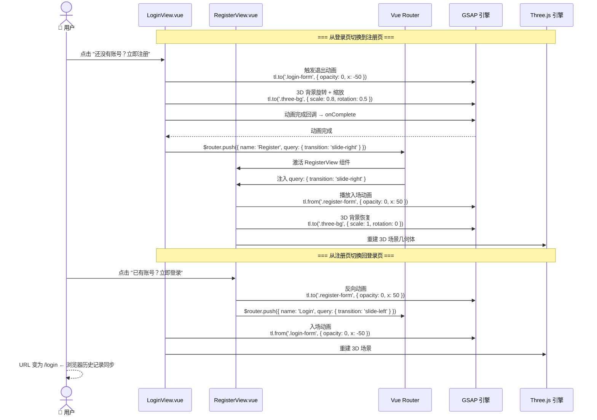
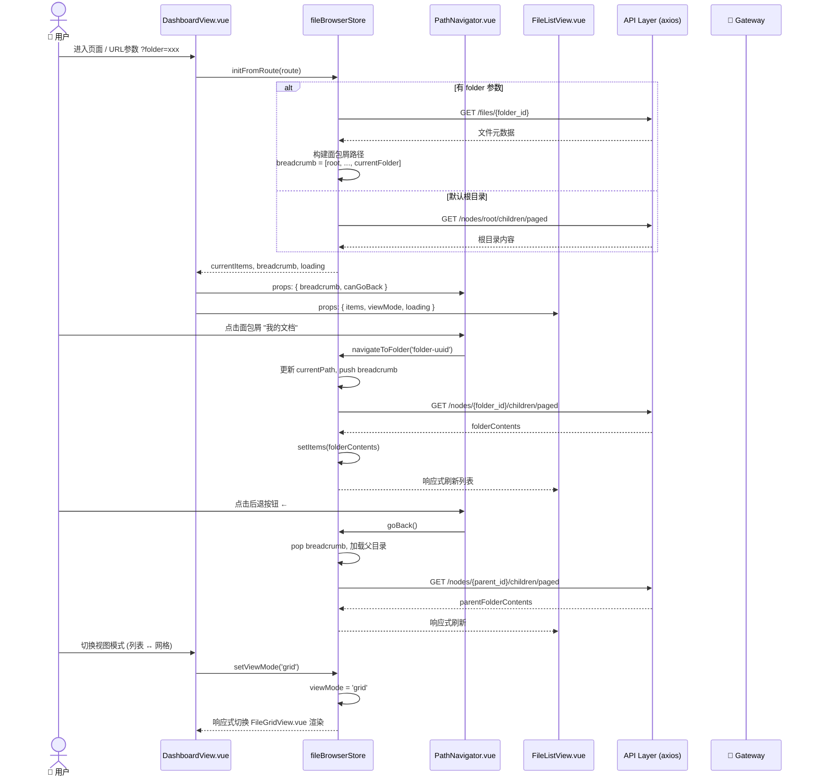
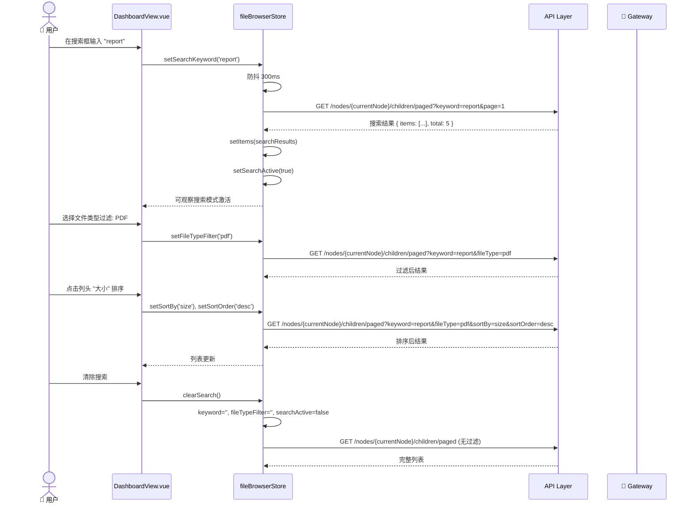
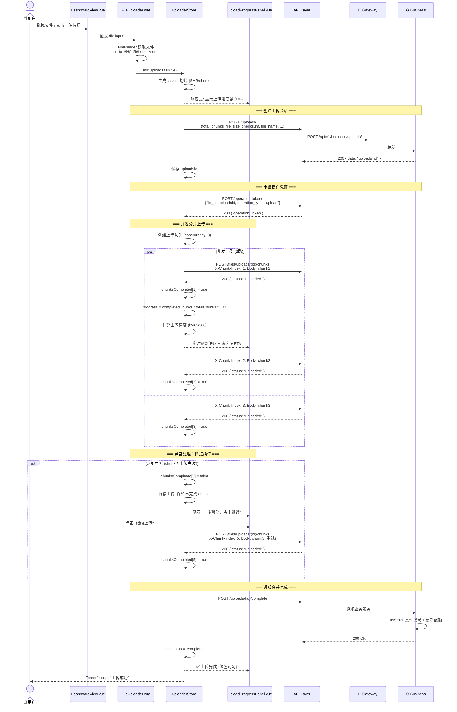
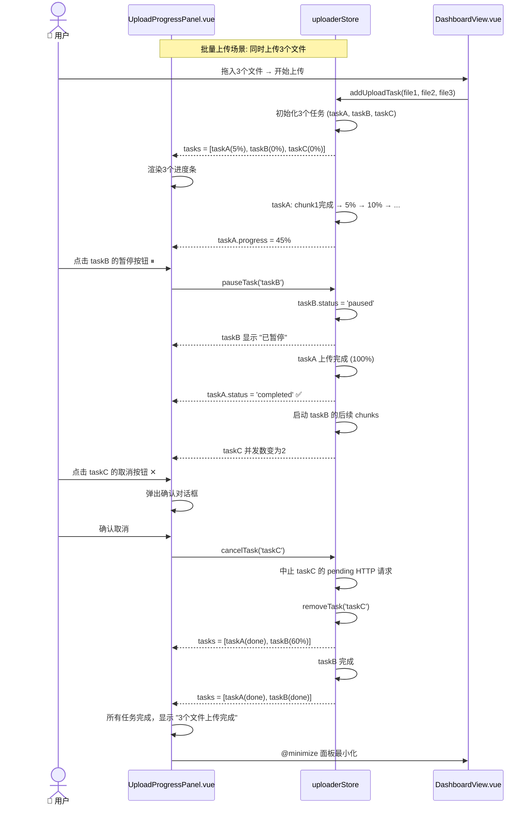
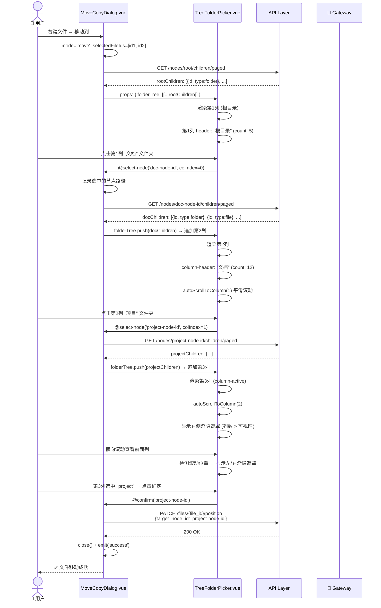
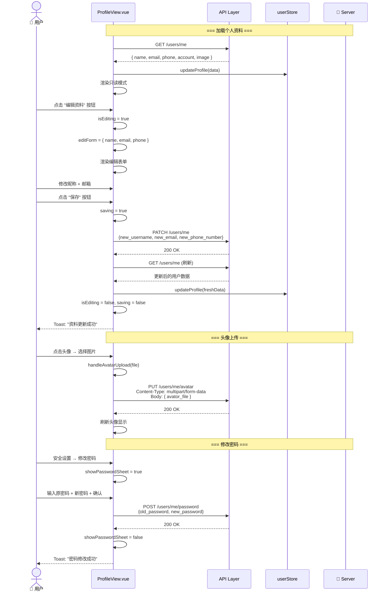
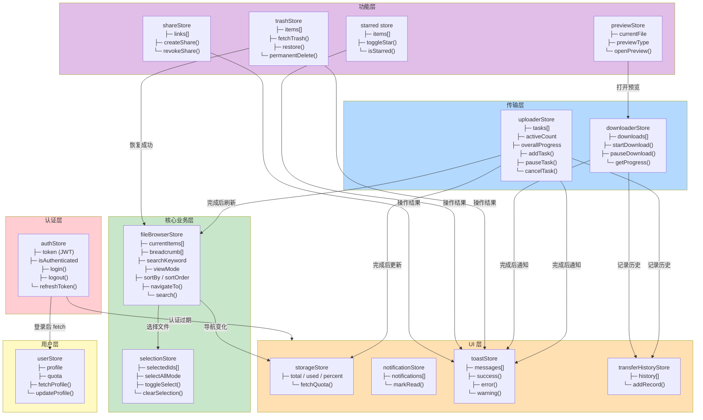
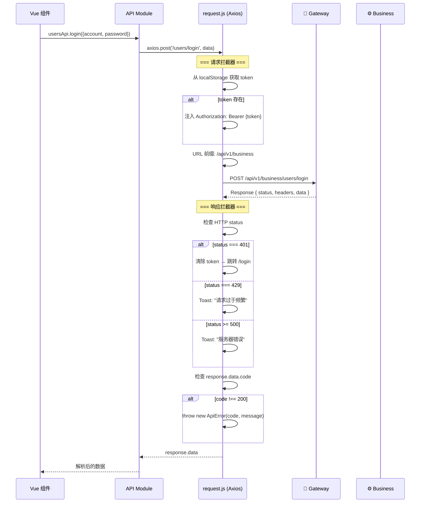
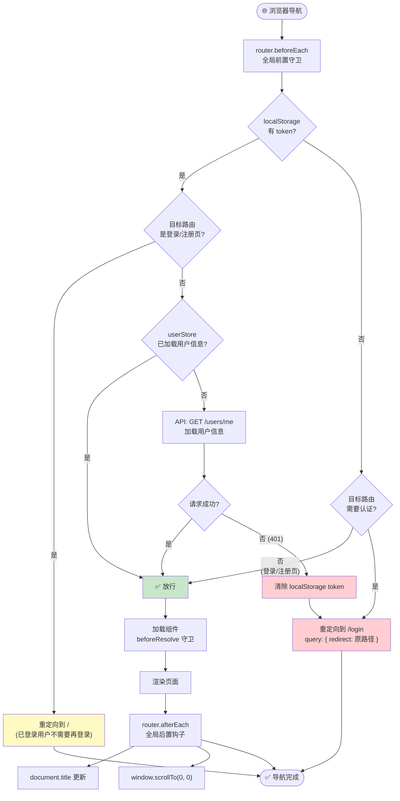

# PrivateCloudDisk-web

企业级私有云盘前端应用，基于 Vue 3 + Vite + Tailwind CSS 构建的单页面应用 (SPA)。

---

## 技术栈

| 技术 | 版本 | 用途 |
|------|------|------|
| Vue 3 | 3.5 | 前端框架 (Composition API) |
| Vite | 7.3 | 构建工具 |
| Tailwind CSS | 3.4 | 原子化 CSS 框架 |
| Element Plus | 2.14 | UI 组件库 (辅助) |
| Pinia | 3.0 | 状态管理 |
| Vue Router | 4.5 | 路由管理 |
| Axios | 1.16 | HTTP 客户端 |
| GSAP | 3.15 | 高级动画引擎 |
| Three.js | 0.184 | 3D 渲染 (登录页背景) |

---

## 项目结构

```
src/
├── api/                          # API 接口层
│   ├── index.js                  # 统一导出
│   └── modules/
│       ├── users.js              # 用户相关 API (登录/注册/信息/头像)
│       ├── files.js              # 文件操作 API (CRUD/移动/重命名)
│       ├── nodes.js              # 目录节点 API (查询/创建/分页)
│       ├── uploads.js            # 上传 API (会话/分片/合并)
│       ├── downloads.js          # 下载 API (凭证/内容/Range)
│       ├── quotas.js             # 配额 API
│       └── preview.js            # 预览 API
│
├── components/                   # 通用组件
│   ├── common/                   # 基础组件
│   │   ├── EmptyState.vue        # 空状态占位
│   │   ├── LoadingSpinner.vue    # 加载动画
│   │   ├── PageState.vue         # 页面状态 (加载/错误/空)
│   │   └── ToastNotification.vue # Toast 通知
│   │
│   ├── layout/                   # 布局组件
│   │   ├── Layout.vue            # 主布局 (侧边栏 + 内容区)
│   │   ├── Sidebar.vue           # 侧边栏导航
│   │   ├── UserDropdown.vue      # 用户下拉菜单
│   │   └── NotificationCenter.vue# 通知中心
│   │
│   ├── file/                     # 文件操作组件
│   │   ├── FileListView.vue      # 列表视图
│   │   ├── FileGridView.vue      # 网格视图
│   │   ├── PathNavigator.vue     # 路径导航 (面包屑)
│   │   ├── RenameDialog.vue      # 重命名对话框
│   │   ├── MoveCopyDialog.vue    # 移动/复制对话框
│   │   ├── TreeFolderPicker.vue  # 分栏目录选择器
│   │   ├── BatchActionsBar.vue   # 批量操作栏
│   │   ├── StorageInfo.vue       # 存储空间信息
│   │   └── FileDetailDrawer.vue  # 文件详情抽屉
│   │
│   ├── upload/                   # 上传组件
│   │   └── UploadProgressPanel.vue # 上传进度面板
│   │
│   ├── preview/                  # 文件预览组件
│   │   ├── FilePreview.vue       # 预览入口组件
│   │   ├── ImagePreview.vue      # 图片预览
│   │   ├── VideoPreview.vue      # 视频预览
│   │   ├── AudioPreview.vue      # 音频预览
│   │   ├── PdfPreview.vue        # PDF 预览
│   │   ├── CodePreview.vue       # 代码/文本预览 (语法高亮)
│   │   ├── TextPreview.vue       # 纯文本预览
│   │   └── OfficePreview.vue     # Office 文档预览
│   │
│   ├── modals/                   # 模态框
│   │   ├── CreateFolderModal.vue # 新建文件夹
│   │   ├── LoginModal.vue        # 登录弹窗
│   │   ├── UploadConfirmModal.vue# 上传确认
│   │   └── DownloadConfirmModal.vue# 下载确认
│   │
│   ├── share/                    # 分享组件
│   │   ├── CreateShareDialog.vue # 创建分享
│   │   └── ShareLinkItem.vue     # 分享链接项
│   │
│   ├── trash/                    # 回收站组件
│   │   └── TrashItem.vue         # 回收站项
│   │
│   ├── dashboard/                # 工作台组件
│   │   └── WorkspaceOverview.vue # 工作区概览
│   │
│   └── FileUploader.vue          # 文件上传器 (核心)
│
├── stores/                       # Pinia 状态管理 (14 个 Store)
│   ├── authStore.js              # 认证状态 (JWT Token 管理)
│   ├── userStore.js              # 用户信息状态
│   ├── fileBrowserStore.js       # 文件浏览状态 (目录导航/搜索/排序)
│   ├── uploaderStore.js          # 上传状态 (分片/并发/进度/速度)
│   ├── downloaderStore.js        # 下载状态 (凭证/并发/进度)
│   ├── previewStore.js           # 文件预览状态
│   ├── selectionStore.js         # 文件多选状态
│   ├── trashStore.js             # 回收站状态
│   ├── starred.js                # 收藏状态
│   ├── shareStore.js             # 分享状态
│   ├── storageStore.js           # 存储配额状态
│   ├── notificationStore.js      # 通知状态
│   ├── toastStore.js             # Toast 消息状态
│   └── transferHistoryStore.js   # 传输历史状态
│
├── views/                        # 页面视图
│   ├── LoginView.vue             # 登录页 (Three.js 3D 背景 + 动画切换)
│   ├── RegisterView.vue          # 注册页 (与登录页联动动画)
│   ├── DashboardView.vue         # 我的网盘 (主文件浏览页)
│   ├── StarredView.vue           # 收藏文件
│   ├── TrashView.vue             # 回收站
│   ├── SharesView.vue            # 我的分享
│   ├── TransfersView.vue         # 传输记录
│   ├── NotificationsView.vue     # 通知中心
│   ├── ProfileView.vue           # 个人中心 (企业级 UI)
│   └── FilePreviewView.vue       # 文件预览页
│
├── composables/                  # 组合式函数
│   └── useFilePreview.js         # 文件预览逻辑 Hook
│
├── utils/                        # 工具函数
│   ├── request.js                # Axios 实例 (拦截器/错误处理)
│   ├── helpers.js                # 通用辅助函数 (SHA-256/格式化)
│   ├── fileIcon.js               # 文件图标映射
│   ├── constants.js              # 常量配置
│   └── previewHelper.js          # 预览辅助函数
│
├── router/
│   └── index.js                  # 路由配置 (路由守卫)
│
├── App.vue                       # 根组件
├── main.js                       # 入口文件
└── style.css                     # 全局样式
```

---

## 页面路由

| 路径 | 页面 | 认证要求 | 说明 |
|------|------|----------|------|
| `/login` | LoginView | 游客 | 登录页面 |
| `/register` | RegisterView | 游客 | 注册页面 |
| `/` | DashboardView | 需登录 | 我的网盘（主文件浏览页） |
| `/starred` | StarredView | 需登录 | 收藏文件 |
| `/trash` | TrashView | 需登录 | 回收站 |
| `/shares` | SharesView | 需登录 | 我的分享 |
| `/transfers` | TransfersView | 需登录 | 传输记录 |
| `/notifications` | NotificationsView | 需登录 | 通知中心 |
| `/profile` | ProfileView | 需登录 | 个人中心 |

---

## 核心功能详解

### 登录/注册动画
- 使用 **GSAP** 实现页面切换的高阶过渡动画，非简单路由跳转
- 使用 **Three.js** 渲染动态 3D 几何体作为登录页背景
- Vue Router 保证浏览器 URL 同步变化
- 支持 Cloudflare Turnstile 人机验证

### 文件浏览器
- **双视图切换**：列表视图 / 网格视图
- **面包屑导航**：PathNavigator 组件，点击路径任意层级跳转
- **搜索过滤**：关键词搜索 + 文件类型过滤 + 多维度排序
- **分栏目录选择器**：TreeFolderPicker 组件，分栏展示目录层级，支持横向滚动

### 分片上传
- 前端计算文件 SHA-256 校验值
- 创建上传会话 → 并发分片上传 → 通知合并
- 实时进度条 + 上传速度显示
- 支持暂停/取消/断点续传
- 分片大小和并发数可配置

### 流式下载
- 操作凭证签发 → Range 请求分段下载
- 并发下载控制
- 下载进度跟踪

### 企业级 UI 风格
- **Tailwind CSS** 原子化设计，自定义主题色 `primary: #165DFF`
- 统一的 `shadow-card` / `shadow-hover` 阴影系统
- `responsive-panel` 响应式面板样式
- 自定义滚动条、边缘渐隐遮罩
- 移动端适配（响应式断点，侧边栏折叠等）

---

## 环境变量

| 变量 | 说明 | 默认值 |
|------|------|--------|
| `VITE_API_BASE_URL` | API 基础路径 | `/api/v1` |
| `VITE_TURNSTILE_SITE_KEY` | Turnstile 站点密钥 | - |
| `VITE_CHUNK_SIZE` | 上传分片大小 (字节) | `5242880` (5MB) |
| `VITE_MAX_CONCURRENT_UPLOADS` | 上传最大并发数 | `3` |
| `VITE_MAX_CONCURRENT_DOWNLOADS` | 下载最大并发数 | `4` |
| `VITE_UPLOAD_THRESHOLD` | 分片上传阈值 (字节) | `10485760` (10MB) |

---

## 开发指南

### 安装依赖
```bash
npm install
```

### 启动开发服务器
```bash
npm run dev
```
开发服务器默认运行在 `http://localhost:5500`，API 请求通过 Vite proxy 转发到 `http://127.0.0.1:8080`。

### 构建生产版本
```bash
npm run build
```
构建产物输出到 `dist/` 目录。

### Docker 部署
```bash
docker build -t privateclouddisk-web .
docker run -p 80:80 privateclouddisk-web
```
生产环境使用 Nginx 作为静态文件服务器，配置参见 `nginx/default.conf`。

---

## 组件交互时序图

### 登录/注册动画切换流程



### 文件浏览器导航流程



### 文件搜索与排序流程



### 分片上传进度追踪流程



### 上传进度面板交互



### 分栏目录选择器 (TreeFolderPicker) 交互



### 个人中心编辑流程



---

## 状态管理架构

### Pinia Store 依赖关系



### API 层请求拦截流程



### 路由守卫生命周期



---

## 组件设计原则

- **Composition API**：全部使用 `<script setup>` 语法
- **Pinia Store**：业务逻辑集中在 Store 中，组件保持简洁
- **响应式设计**：所有组件均适配桌面端和移动端
- **错误边界**：统一的 ApiError 类、Toast 通知、Loading/Empty/Error 三态组件
- **可访问性**：语义化 HTML + ARIA 属性