# PrivateCloudDisk — 企业级私有云盘系统

企业级私有云盘系统，支持文件的上传（断点续传）、下载（流式）、预览、分享、回收站，具备完善的安全认证、权限控制与分布式限流能力。

---

## 系统架构全景图

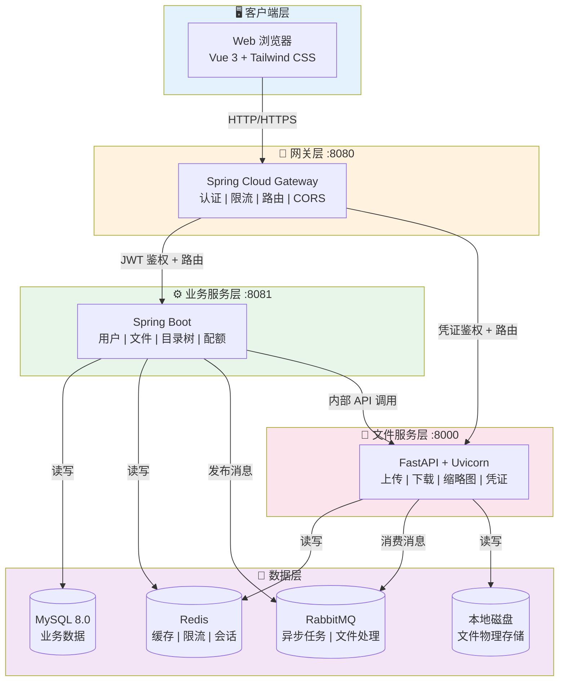

---

## 技术栈总览

| 层级 | 技术 | 说明 |
|------|------|------|
| **Web 前端** | Vue 3 + Vite + Tailwind CSS + Pinia | SPA 单页应用，主用户端 |
| **管理后台** | React 19 + TypeScript + Ant Design 6 | 超级管理员后台 |
| **桌面端** | Electron + React + macFUSE | macOS / Windows / Linux 桌面客户端 |
| **移动端-跨端** | uni-app (Vue 3) + uView Plus | iOS / Android / 微信小程序 / H5 |
| **移动端-原生** | SwiftUI (iOS) / Kotlin Compose (Android) | 原生 iOS / Android 客户端 |
| **桌面端-原生** | SwiftUI (macOS) / WPF+.NET (Windows) | 原生 macOS / Windows 客户端 |
| **网关** | Spring Cloud Gateway + WebFlux + Spring Security | 响应式 API 网关 |
| **业务服务** | Spring Boot 4.0.6 + MyBatis + Spring AMQP | RESTful API 核心业务 |
| **文件服务** | FastAPI + Uvicorn (Python 3.11) | 文件 I/O 处理 |
| **即时通讯** | Spring Boot + Netty + WebRTC | 实时消息 + 音视频通话 |
| **数据库** | MySQL 8.0 (InnoDB, utf8mb4) | 业务数据持久化 |
| **缓存** | Redis 7 | 缓存 / 限流 / 分布式锁 |
| **消息队列** | RabbitMQ (AMQP 0-9-1) | 异步任务处理 |
| **全文检索** | OpenSearch 2.10 | 文件内容搜索 |
| **对象存储** | MinIO (S3 兼容) | 文件物理存储 |
| **认证** | JWT (RSA-256) + BCrypt | 无状态认证 |
| **图片处理** | libvips (via pyvips) | 缩略图生成 |
| **部署** | Docker + Docker Compose | 容器化部署 |
| **监控** | Prometheus + Grafana + SkyWalking | 指标 + 链路追踪 |

---

## 核心业务流程

### 用户登录全流程

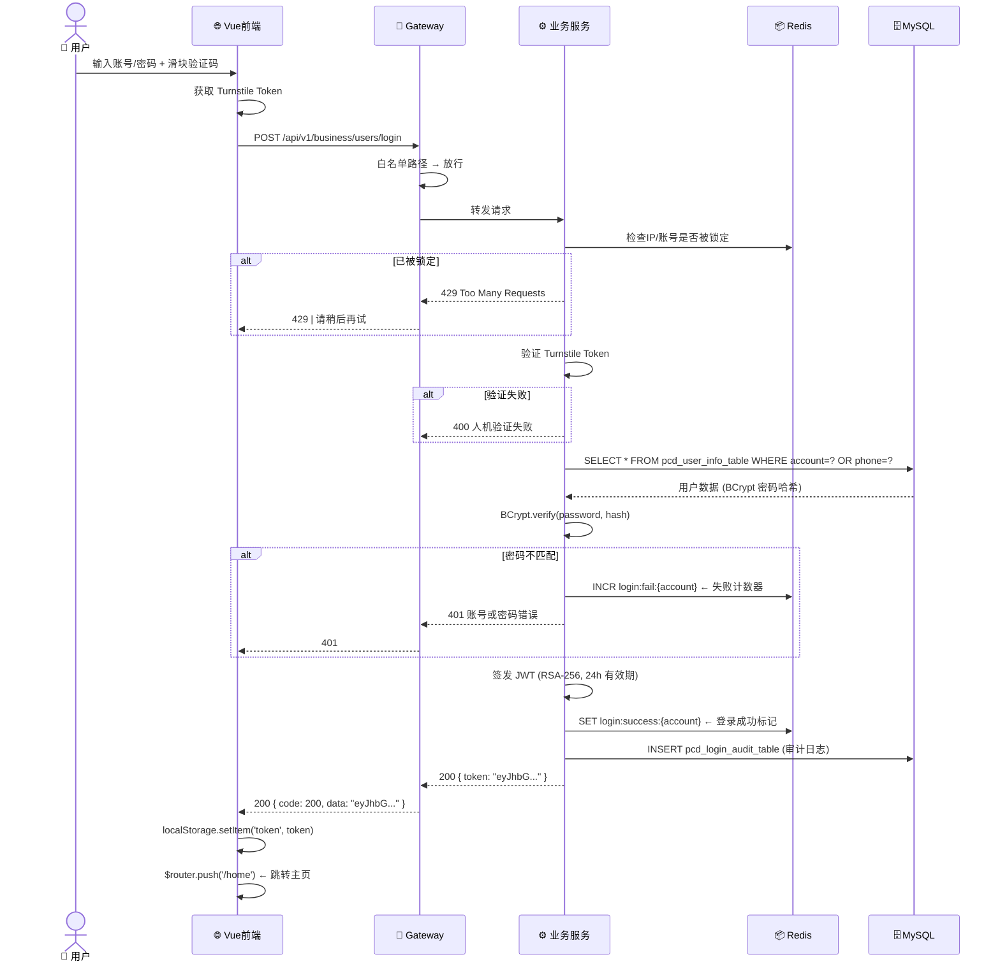

### 文件分片上传全流程

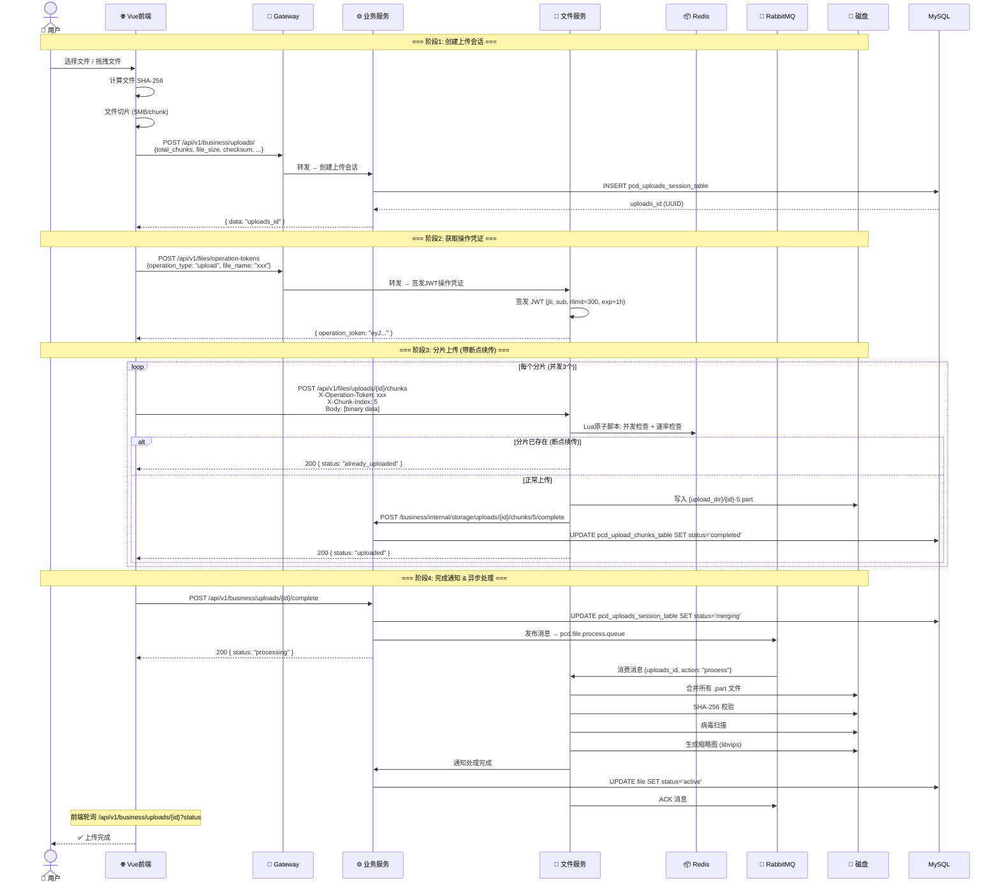

### 目录树闭包表查询

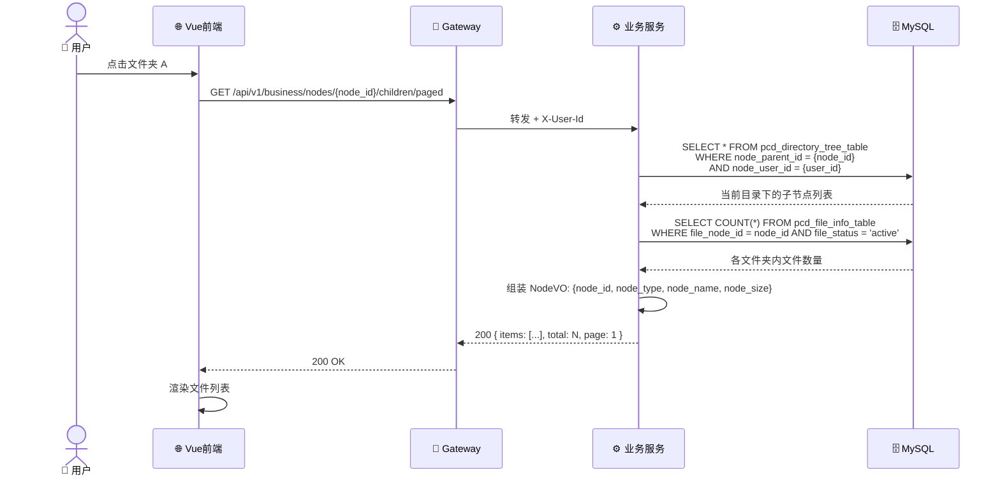

### 用户注册全流程

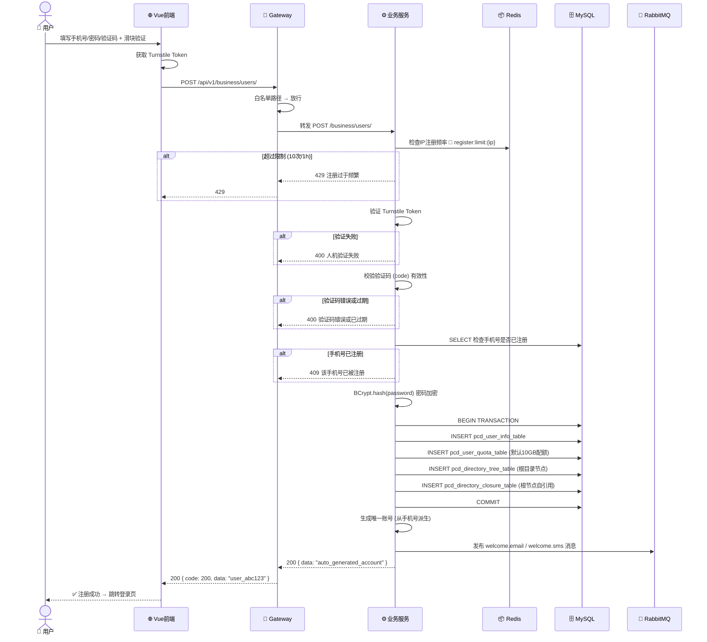

### 文件删除与回收站恢复

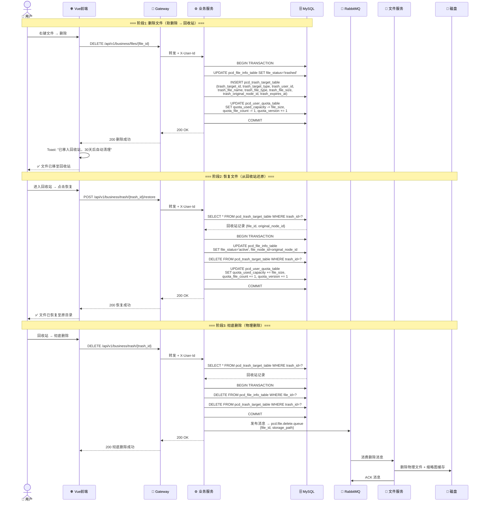

### 文件预览全流程

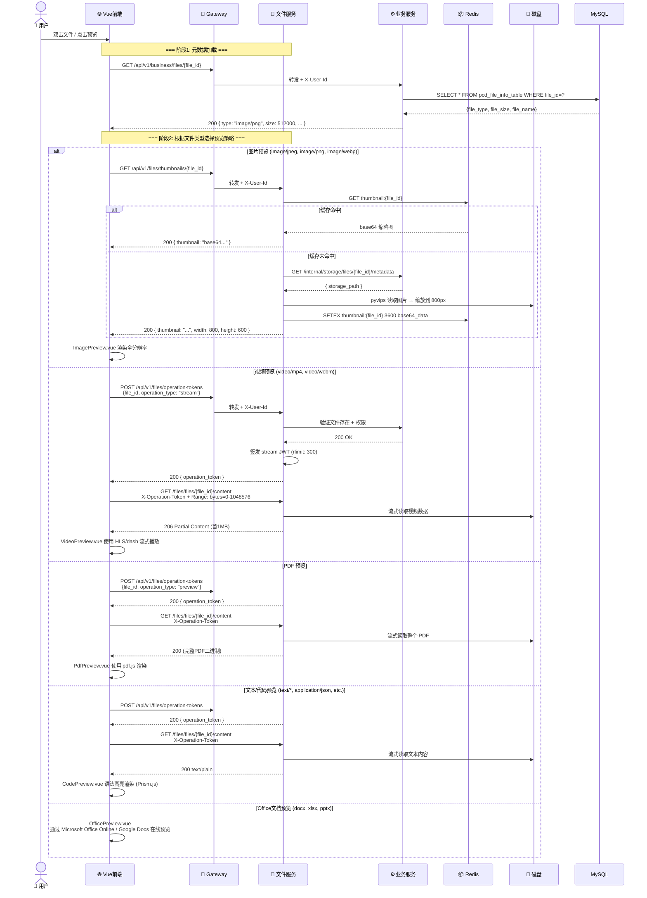

### 文件移动/复制流程

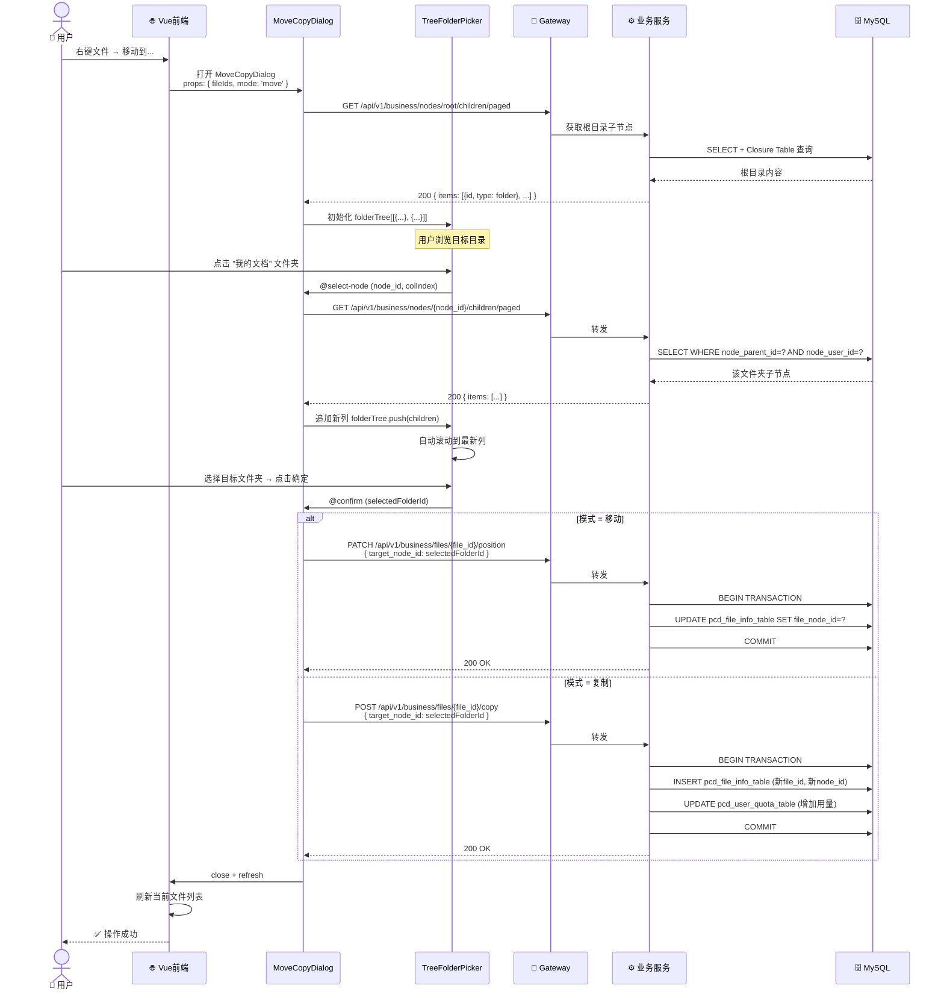

### 流式下载（支持断点续传）

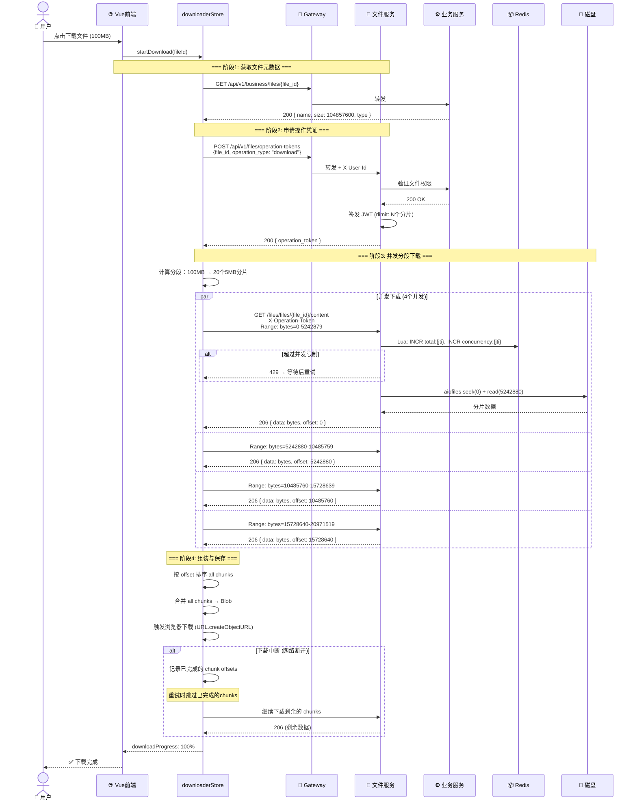

### Docker Compose 部署架构

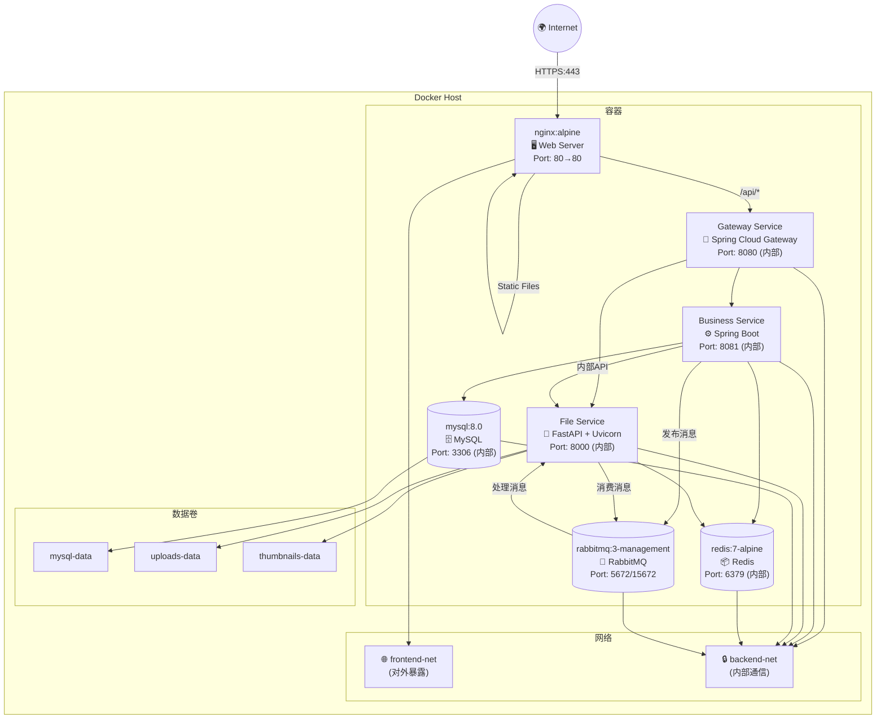

### 前端组件架构全景

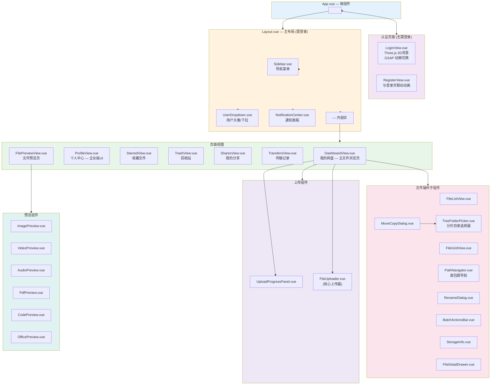

---

## 微服务间通信

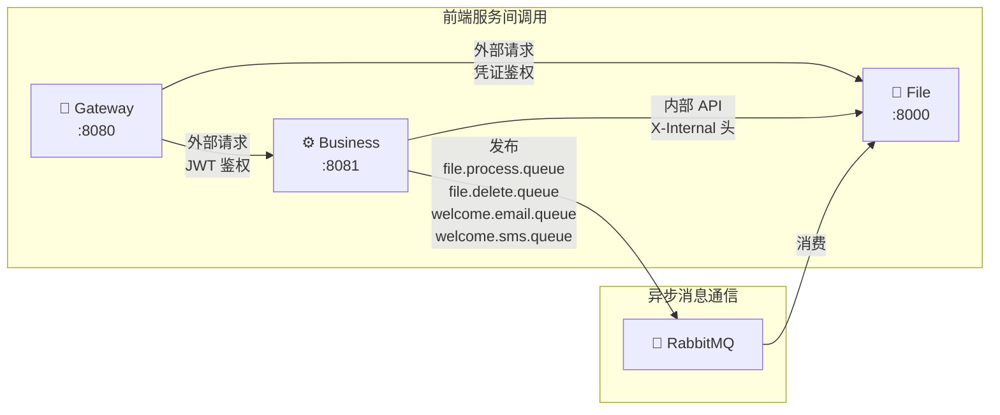

---

## 安全性设计全景

```mermaid
graph TB
    subgraph "安全防线"
        L1["🛡 第一道防线<br/>网关层"]
        L2["🛡 第二道防线<br/>业务服务层"]
        L3["🛡 第三道防线<br/>文件服务层"]
        L4["🛡 第四道防线<br/>数据层"]
    end

    L1 --> L1A["JWT 签名验证 (RSA-256)"]
    L1 --> L1B["分布式限流 (7条规则)"]
    L1 --> L1C["请求头清洗 (防伪造)"]
    L1 --> L1D["CORS 跨域控制"]

    L2 --> L2A["BCrypt 密码哈希"]
    L2 --> L2B["登录失败锁定"]
    L2 --> L2C["注册频率限制"]
    L2 --> L2D["Turnstile 人机验证"]
    L2 --> L2E["API 滥用防护"]
    L2 --> L2F["UUID 主键 (防遍历)"]
    L2 --> L2G["参数校验 (JSR-380)"]

    L3 --> L3A["操作凭证 JWT"]
    L3 --> L3B["多维度并发控制 (Lua)"]
    L3 --> L3C["下载授权 Opaque Token"]
    L3 --> L3D["文件完整性校验 (SHA-256)"]

    L4 --> L4A["外键级联约束"]
    L4 --> L4B["乐观锁 (版本号)"]
    L4 --> L4C["软删除 (回收站)"]
    L4 --> L4D["审计日志"]
```

---

## 项目结构

```
PrivateCloudDisk-project/
│
├── PrivateCloudDisk-web/                    # 🌐 Web 前端 (Vue 3 + Vite)
│   └── README.md
│
├── PrivateCloudDisk-admin-web/              # 🔧 管理后台 (React 19 + Ant Design)
│   └── README.md
│
├── PrivateCloudDisk-desktop/                # 💻 桌面客户端 (Electron + React)
│   └── README.md
│
├── PrivateCloudDisk-uni-app/                # 📱 跨端移动端 (uni-app + Vue 3)
│   └── README.md
│
├── PrivateCloudDisk-android/                # 🤖 Android 原生客户端 (Kotlin + Compose)
│   └── README.md
│
├── PrivateCloudDisk-ios/                    # 🍎 iOS 原生客户端 (SwiftUI)
│   └── README.md
│
├── PrivateCloudDisk-macos/                  # 🖥 macOS 原生客户端 (SwiftUI)
│   └── README.md
│
├── PrivateCloudDisk-win/                    # 🪟 Windows 原生客户端 (WPF + .NET)
│   └── README.md
│
├── PrivateCloudDisk-gateway-service/         # 🚪 API 网关 (Spring Cloud Gateway)
│   └── README.md
│
├── PrivateCloudDisk-platform-service/        # ⚙ 业务服务 (Spring Boot)
│   └── README.md
│
├── PrivateCloudDisk-shortage-service/        # 📁 文件服务 (FastAPI + Python)
│   └── README.md
│
├── PrivateCloudDisk-im/                      # 💬 即时通讯 (Spring Boot + Netty)
│   └── README.md
│
├── PrivateCloudDisk-db/                      # 🗄 数据库脚本 (MySQL)
│   ├── database_init.sql
│   └── README.md
│
├── PrivateCloudDisk-infra/                   # 🏗 基础设施配置 (Docker 中间件)
│   └── README.md
│
├── scripts/                                  # 🔨 脚本工具集
│   ├── init_database.sql                    #    完整数据库初始化 (19张表)
│   ├── generate_admin_password.py           #    密码哈希生成工具
│   ├── deploy.sh                            #    一键部署
│   ├── backup.sh                            #    数据备份
│   ├── rollback.sh                          #    备份回滚
│   └── README.md
│
├── docs/                                     # 📚 项目文档
│
├── docker-compose.yml                       # Docker Compose 编排
├── Makefile                                 # 常用命令快捷操作
├── .env.example                             # 环境变量模板
├── DEPLOYMENT.md                            # 部署文档
└── README.md                                # 📋 本文件
```

---

## 快速开始

### 环境要求

| 组件 | 版本要求 |
|------|----------|
| JDK | 18+ |
| Python | 3.11+ |
| Node.js | 18+ |
| MySQL | 8.0+ |
| Redis | 6.0+ |
| RabbitMQ | 3.10+ |
| libvips | 8.10+ |

### 本地开发

```bash
# 1. 初始化数据库
mysql -u root -p < PrivateCloudDisk-db/database_init.sql

# 2. 启动 Redis & RabbitMQ
brew services start redis
brew services start rabbitmq

# 3. 启动业务服务 (:8081)
cd PrivateCloudDisk-platform-service
./gradlew bootRun

# 4. 启动文件服务 (:8000)
cd PrivateCloudDisk-shortage-service
uvicorn server:app --host 0.0.0.0 --port 8000 --reload

# 5. 启动网关 (:8080)
cd PrivateCloudDisk-gateway-service
./gradlew bootRun

# 6. 启动前端
cd PrivateCloudDisk-web
npm install && npm run dev
```

访问 `http://localhost:5173` 即可。

### Docker 一键部署

```bash
docker compose up -d
```

---

## 各子项目导航

| 子项目 | 技术栈 | 端口 | 说明 |
|--------|--------|------|------|
| [PrivateCloudDisk-web](./PrivateCloudDisk-web/) | Vue 3 + Vite + Tailwind CSS + Pinia | 5173 | Web 前端，文件浏览器/上传管理/个人中心 |
| [PrivateCloudDisk-admin-web](./PrivateCloudDisk-admin-web/) | React 19 + TypeScript + Ant Design 6 | 5174 | 管理后台，用户管理/审计/安全/系统配置 |
| [PrivateCloudDisk-desktop](./PrivateCloudDisk-desktop/) | Electron + React + macFUSE | - | 桌面客户端，虚拟磁盘挂载/文件管理 |
| [PrivateCloudDisk-uni-app](./PrivateCloudDisk-uni-app/) | uni-app (Vue 3) + uView Plus | - | 跨端移动端，iOS/Android/小程序/H5 |
| [PrivateCloudDisk-android](./PrivateCloudDisk-android/) | Kotlin + Jetpack Compose | - | Android 原生客户端 |
| [PrivateCloudDisk-ios](./PrivateCloudDisk-ios/) | SwiftUI + Combine | - | iOS 原生客户端 |
| [PrivateCloudDisk-macos](./PrivateCloudDisk-macos/) | SwiftUI + AppKit | - | macOS 原生客户端，虚拟磁盘/系统集成 |
| [PrivateCloudDisk-win](./PrivateCloudDisk-win/) | WPF + .NET 8.0 | - | Windows 原生客户端，虚拟磁盘/系统托盘 |
| [PrivateCloudDisk-gateway-service](./PrivateCloudDisk-gateway-service/) | Spring Cloud Gateway + WebFlux | 8080 | API 网关，JWT 认证/限流/路由 |
| [PrivateCloudDisk-platform-service](./PrivateCloudDisk-platform-service/) | Spring Boot 4.0.6 + MyBatis | 8081 | 核心业务，用户/文件/目录树/配额 |
| [PrivateCloudDisk-shortage-service](./PrivateCloudDisk-shortage-service/) | FastAPI + Uvicorn (Python) | 8000 | 文件处理，分片上传/流式下载/缩略图 |
| [PrivateCloudDisk-im](./PrivateCloudDisk-im/) | Spring Boot + Netty + WebRTC | - | 即时通讯，消息推送/音视频通话 |
| [PrivateCloudDisk-db](./PrivateCloudDisk-db/) | MySQL 8.0 DDL Scripts | 3306 | 数据库初始化脚本 |
| [PrivateCloudDisk-infra](./PrivateCloudDisk-infra/) | Docker 中间件配置 | - | 基础设施，MySQL/Redis/RabbitMQ 等 |
| [scripts](./scripts/) | Bash + Python + SQL | - | 运维工具集，部署/备份/密码生成 |