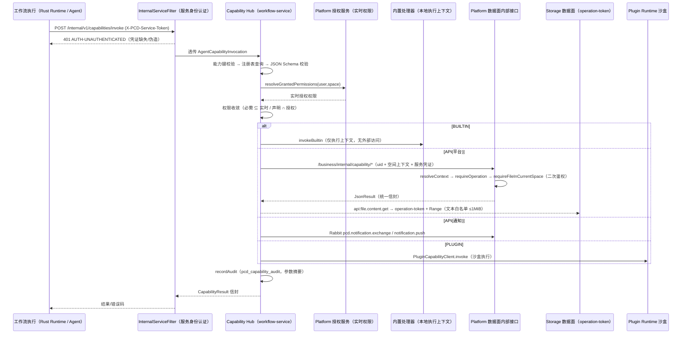

# CloudFlow Capability Hub（能力中心）设计、注册表与调用文档

> 适用范围：`PrivateCloudDisk-workflow-service`（Java Spring Boot 3.4.7）中的能力中心模块，
> 以及 `PrivateCloudDisk-platform-service` 新增的数据面内部接口（`/business/internal/capability/*`）。
> 对应需求清单：能力中心审计与扩展 §1–§8（内置能力不扩展、平台 API 能力扩展 11 项、权限边界强化、统一解析调用、Java 测试与文档）。

---

## 1. 定位与铁律

能力中心是 **workflow-service 内部唯一的动作能力统一出口**：

- **注册**：能力注册表 `pcd_capability_registry`（含能力键、类型、服务名、输入/输出 JSON Schema、权限要求、可用性策略）。
- **解析**：统一能力键格式校验（`CapabilityKeyValidator`，防能力键注入）。
- **校验**：输入按注册表 JSON Schema 校验（`CapabilitySchemaValidator`，一次收集多条错误）。
- **权限**：最小权限校验，空间级授权由 Platform 数据面二次复核（防横向/纵向越权）。
- **分发**：按来源类型路由到「内置处理器 / 平台数据面调用器 / 插件 Runtime」。
- **审计**：统一写入 `pcd_capability_audit`，记录调用者服务、用户/空间、参数摘要、结果与耗时。

架构铁律：

- CloudFlow Runtime Agent 只作为调用入口（**透传**），不解析能力注册表、不缓存能力键、不访问数据库。
- 控制面（workflow-service）不直接读取业务数据，所有数据经数据面 **内部接口** 获取。
- 执行面（Platform/Storage/Plugin 数据面）不在能力中心内直接访问数据库/文件系统。
- 内置能力不访问任何外部资源，仅操作当前工作流执行上下文。

---

## 2. 能力键命名规范

格式：`{namespace}:{service}.{method}`，另支持插件键 `plugin:{plugin_id}:{capability_name}@{major}`。

| 命名空间 | 含义 | 示例 |
|----------|------|------|
| `builtin` | 内置能力（仅操作执行上下文） | `builtin:date.now`、`builtin:text.transform` |
| `api` | 平台数据面 API 能力 | `api:file.metadata.get`、`api:space.info` |
| `plugin` | 插件能力（Plugin Runtime 沙盒） | `plugin:88d5b0e1-...:generate_report@1` |
| `local_plugin` | 本地客户端插件（需本地在线） | `local_plugin:...` |

校验规则（`CapabilityKeyValidator`）：仅允许大小写字母数字、点、下划线、冒号和连字符；
长度 ≤ 255；拒绝空格、引号、反斜杠、`${}` 等，杜绝 SQL / 表达式 / REST 路径注入。

---

## 3. 能力注册表

### 3.1 数据模型（`pcd_capability_registry`）

| 字段 | 含义 |
|------|------|
| `capability_key` | 能力键（唯一） |
| `source_type` | `BUILTIN` / `API` / `PLUGIN` / `LOCAL_PLUGIN` |
| `source_id` | 目标数据面服务名（`platform` / `storage` / 插件 ID），基址由配置解析，**不来自调用方**（防 SSRF） |
| `source_version` | 能力/插件版本 |
| `input_schema_json` / `output_schema_json` | 参数 JSON Schema |
| `required_permissions_json` | 所需权限列表 |
| `availability_policy_json` | 超时、并发、熔断、幂等策略 |
| `status` | `ACTIVE` / `DISABLED` |
| `revision` | 版本号 |

初始化数据来源：Flyway 迁移 `V1__workflow_core.sql`（内置 + `api:user.notify`）与
`V4__cloudflow_capability_ext.sql`（11 项平台 API 能力 + 审计表）。

### 3.2 已注册能力清单

**内置能力（BUILTIN，权限 `[]`，不访问外部资源）**

| 能力键 | 输入要点 | 输出 | 说明 |
|--------|----------|------|------|
| `builtin:date.now` | `timezone`（默认 UTC） | `iso`、`timezone` | 返回指定时区当前时间 |
| `builtin:text.transform` | `text`（≤65536）、`operation: upper/lower/trim` | `text` | 长度受限的大小写/去空白转换 |

**平台 API 能力（API，V4 新增，共 11 项）**

| 能力键 | 目标数据面端点 | 所需权限 | 说明 |
|--------|----------------|----------|------|
| `api:file.metadata.get` | Platform `GET /business/internal/storage/files/{file_id}` | `file.read` | 文件名称/大小/类型/创建时间等元数据 |
| `api:file.scan` | Platform `POST /business/internal/capability/files/{file_id}/scan` | `file.read` | 异步触发安全扫描，返回 `task_id`（发 `file.scan.requested` 事件） |
| `api:file.content.get` | Platform 元数据 → Storage operation-token + Range 取文本 | `file.read` | 仅文本/代码/Markdown 可预览类型，≤1MiB，`max_bytes` 限制 |
| `api:file.list` | Platform `GET /business/internal/capability/files/list` | `file.read` | 空间/目录文件列表 |
| `api:file.search` | Platform `GET /business/internal/capability/files/search` | `file.read` | 按关键词搜索文件元数据 |
| `api:space.info` | Platform `GET /business/internal/capability/spaces/{space_id}/info` | `space.read` | 空间基本信息 |
| `api:space.members.list` | Platform `GET /business/internal/capability/spaces/{space_id}/members` | `space.read` | 空间成员与角色（不返回敏感资料） |
| `api:user.info` | Platform `GET /business/internal/capability/users/{user_id}/info` | `user.profile.read` | 用户信息**脱敏**（不返回手机号/邮箱） |
| `api:notification.send` | Rabbit `pcd.notification.exchange` / `notification.push` | `notification.send` | 站内通知（兼容旧 `api:user.notify`） |
| `api:tag.list` | Platform `GET /business/internal/capability/files/{file_id}/tags` | `file.read` | 文件标签列表 |
| `api:share.create` | Platform `POST /business/internal/capability/shares` | `file.share` | 创建分享链接（校验资源权限与分享策略） |

旧版平台 API 能力 `api:user.notify` 保留并继续可用（`invokeLegacyPlatformApi` 回落）。

**插件能力（PLUGIN）**：`plugin:{plugin_id}:{capability_name}@{major}`，经
`PluginCapabilityClient` 调用 Plugin Runtime 沙盒，权限按「插件清单声明 ∩ 安装授予 ∩ 空间实时权限」取值。

---

## 4. 调用链与统一解析流程

### 4.0 交互图




### 4.1 统一调用接口

CloudFlow Runtime Agent 调用的内部入口（由 `InternalServiceFilter` 服务身份认证保护）：

```
POST /internal/v1/capabilities/invoke
Header: X-PCD-Service-Token: <pcd.internal-service-token>
Body:
{
  "capabilityKey": "api:file.metadata.get",
  "executionId": "<uuid>", "stepId": "collect_files", "attempt": 1,
  "userId": "<uuid>", "spaceId": "<uuid>",
  "input": { "file_id": "<uuid>" },
  "declaredPermissions": ["file.read"], "grantedPermissions": ["file.read"],
  "traceId": "trace-1", "idempotencyKey": "<executionId>:<stepId>:<attempt>"
}
```

响应统一信封：`{ "code": "OK", "message": "操作成功", "data": CapabilityResult, "requestId": "" }`
（`CapabilityResult`：`success` / `output` / `errorCode` / `errorSummary` / `retryable`）。

凭证校验失败统一返回 `AUTH-UNAUTHENTICATED`（401），不暴露能力存在性。

### 4.2 统一解析管线（`CapabilityHubService`）

```
能力键格式校验（WF-CAPABILITY-KEY）
  → 注册表查询 + 状态（WF-CAPABILITY-NOT-FOUND）
  → 输入 JSON Schema 校验（WF-CAPABILITY-INPUT）
  → 权限校验：
      · invoke()    : 注册表 required ∩ Platform 实时授权 resolveGrantedPermissions（WF-CAPABILITY-FORBIDDEN / WF-CAPABILITY-AUTH-UNAVAILABLE）
      · invokeAgent(): 声明权限 ∩ 当前授权权限 = 有效集合（WF-CAPABILITY-FORBIDDEN）
  → dispatch() 按 source_type 分发
  → recordAudit() 统一审计（失败不阻断调用）
```

`invokeAgent`（Agent 面）保留幂等 claim/complete（`pcd_capability_invocation`）。能力键格式校验
发生在 claim 之前，非法键不会写入幂等台账；同一 `idempotencyKey` 重复调用只有在能力键一致时才
返回首次结果（`WF-CAPABILITY-IN-PROGRESS` / 已存结果）。如果调用方用一个已绑定其他能力的 key
发起请求，返回 `WF-CAPABILITY-IDEMPOTENCY-CONFLICT`，避免把旧的数据面错误误认为新能力的结果。

### 4.3 分发（`dispatch`）

| source_type | 分发处理 | 外部依赖 |
|-------------|----------|----------|
| `BUILTIN` | `invokeBuiltin`（仅执行上下文） | 无 |
| `API` | `ApiCapabilityInvoker`（白名单路由 → Platform/Storage/通知事件） | 数据面内部接口 |
| `PLUGIN` | `PluginCapabilityClient.invoke` | Plugin Runtime 沙盒 |
| `LOCAL_PLUGIN` | `WF-LOCAL-CLIENT-OFFLINE` | 本地客户端在线 |

---

## 5. 权限模型与矩阵

### 5.1 权限计算

有效权限 = 用户在空间实时权限 ∩ 插件清单声明权限 ∩ 安装授予权限 ∩ 触发器允许权限 ∩ 平台全局策略。

- `invoke()` 使用 "注册表必需权限 ⊆ 实时授权权限" 的包含关系校验；
- `invokeAgent()` 使用 "有效权限 = 声明 ∩ 授权，且 ⊇ 必需权限" 的交集校验（CLOUDFLOW-SEC-004）；
- 任何一层未授权即拒绝，默认拒绝。

### 5.2 权限矩阵

| 能力 | 必需权限 | 资源级复核 | 备注 |
|------|----------|-----------|------|
| `builtin:*` | 无 | 无 | 仅执行上下文 |
| `api:file.metadata.get` | `file.read` | 空间 READ + 文件归属 | — |
| `api:file.scan` | `file.read` | 空间 READ + 文件归属 | 禁止扫描任意文件 |
| `api:file.content.get` | `file.read` | 空间 READ + 文件归属 + 文本类型 + 1MiB | 内容读取权限边界 |
| `api:file.list` / `api:file.search` | `file.read` | 空间 READ | 仅返回有权节点 |
| `api:space.info` / `api:space.members.list` | `space.read` | 空间 READ | 成员仅身份/角色 |
| `api:user.info` | `user.profile.read` | 空间 READ | 脱敏 |
| `api:notification.send` | `notification.send` | 接收范围受控 | 与旧 `api:user.notify` 同权限 |
| `api:tag.list` | `file.read` | 空间 READ + 文件归属 | — |
| `api:share.create` | `file.share` | 空间 READ/SHARE + 资源归属 + 分享策略 | 仅可分享有权资源 |

## 6. 审计日志

`pcd_capability_audit`（V4 新建）：

| 字段 | 内容 |
|------|------|
| `capability_key` / `caller_service` | 能力键 / 调用方（`workflow-service` / `cloudflow-runtime-agent`） |
| `execution_id` / `step_id` / `trace_id` | 执行链路 |
| `user_id` / `space_id` | 调用者身份（UUID） |
| `param_summary_json` | **参数摘要**：只记录键名、类型、长度（如 `s(5)`、`array(3)`），不落实参值 |
| `success` / `result_code` / `target_service` / `duration_ms` | 结果状态与耗时 |

审计写入失败仅忽略告警，不阻断能力调用。

---

## 7. 安全边界

- **服务身份认证**：`InternalServiceFilter` 用常量时间比较校验 `X-PCD-Service-Token`（配置 `pcd.internal-service-token`），仅 `/internal/**` 生效，其余接口不受影响。
- **防 SSRF**：平台目标路径来自代码内白名单路由表，基址来自配置（`platformUrl` / `storageUrl`），调用方无法指定目标地址。
- **参数防注入**：能力键正则白名单；参数按 JSON Schema 校验类型/长度/范围/枚举；`param_summary` 不落原始值。
- **内容边界**：`api:file.content.get` 仅允许文本/代码/Markdown 类型，文件 ≤ 1 MiB，`max_bytes` 二次限制；`api:file.scan` 仅对当前用户有读取权限的文件触发。
- **能力级熔断与超时**：`SimpleCapabilityBreaker` 连续失败短期断开；超时取注册表 `timeout_seconds`（默认 30s）；仅幂等能力重试（最多 2 次）。
- **错误不泄露内部信息**：错误文案脱敏（`token/password/secret=` 打码）并截断，统一错误码。
- **数据面二次鉴权**：Platform 每个内部端点重新 `resolveContext(uid, spaceId)` → `requireOperation` → `requireFileInCurrentSpace`，防止横向越权。

---

## 8. 数据面内部接口（Platform 新增）

`PrivateCloudDisk-platform-service` → `org/project/control/InternalCapabilityController.java`，
路径前缀 `/business/internal/capability`（Gateway 不透出），统一 `JsonResult` 信封
（`{ code: 200, data, message }`）：

| 方法 | 路径 | 鉴权 |
|------|------|------|
| GET | `/files/{file_id}/metadata` | `uid` 查询参数 + `X-Space-Id`（可选） |
| GET | `/files/list` | `uid` + `space_id` |
| GET | `/files/search` | `uid` + `keyword` |
| GET | `/files/{file_id}/tags` | `uid` + `X-Space-Id` |
| POST | `/files/{file_id}/scan` | `uid` + `X-Space-Id`（发布 `file.scan.requested`） |
| GET | `/spaces/{space_id}/info` | `uid` |
| GET | `/spaces/{space_id}/members` | `uid` |
| GET | `/users/{user_id}/info` | `uid`（脱敏） |
| POST | `/shares` | `uid` + `X-Space-Id` + 资源归属复核 |

`ApiCapabilityInvoker` 以 `uid` 查询参数 + `X-PCD-User-Id` / `X-PCD-Space-Id` / `X-Space-Id` 头透传
调用者与空间上下文（4.14/6.14）。

---

## 9. 错误码

| 错误码 | HTTP | 说明 | 重试 |
|--------|------|------|------|
| `AUTH-UNAUTHENTICATED` | 401 | 内部服务凭证缺失/伪造 | 否 |
| `WF-CAPABILITY-KEY` | 200(能力信封) | 能力键格式非法 | 否 |
| `WF-CAPABILITY-NOT-FOUND` | 200 | 能力不存在或已下架 | 否 |
| `WF-CAPABILITY-INPUT` | 200 | 输入参数违反 Schema | 否 |
| `WF-CAPABILITY-FORBIDDEN` | 200 | 权限不足（声明/授权交集或实时授权缺失） | 否 |
| `WF-CAPABILITY-AUTH-UNAVAILABLE` | 200 | 权限服务暂不可用 | 是 |
| `WF-CAPABILITY-CIRCUIT-OPEN` | 200 | 能力熔断中 | 是 |
| `WF-CAPABILITY-DATAPLANE-UNAVAILABLE` | 200 | 数据面不可达/传输错误 | 是 |
| `WF-CAPABILITY-DATAPLANE-EMPTY` / `-ERROR` | 200 | 数据面空结果 / 业务错误码 | 否 |
| `WF-CAPABILITY-CONTENT-TYPE` / `-TOO-LARGE` / `-LIMIT` | 200 | 文件类型/大小边界拒绝 | 否 |
| `WF-CAPABILITY-CONTENT-UNAVAILABLE` | 200 | 存储读取内容失败 | 是 |
| `WF-CAPABILITY-IN-PROGRESS` | 200 | 相同调用处理中（幂等） | 是 |
| `WF-CAPABILITY-IDEMPOTENCY-CONFLICT` | 200 | 幂等键已经绑定另一能力，禁止跨能力复用 | 否 |
| `WF-CAPABILITY-AGENT-FAILED` / `-RESULT-CORRUPTED` | 200 | Agent 面异常 | 部分 |
| `WF-LOCAL-CLIENT-OFFLINE` | 200 | 本地插件客户端离线 | 否 |

---

## 10. 调用示例（curl）

```bash
TOKEN=your-internal-service-token
curl -s -X POST http://<workflow-service>/internal/v1/capabilities/invoke \
  -H "Content-Type: application/json" -H "X-PCD-Service-Token: $TOKEN" \
  -d '{
    "capabilityKey": "api:file.metadata.get",
    "executionId": "00000000-0000-0000-0000-000000000001",
    "stepId": "collect_files", "attempt": 1,
    "userId": "00000000-0000-0000-0000-000000000002",
    "spaceId": "00000000-0000-0000-0000-000000000004",
    "input": {"file_id": "00000000-0000-0000-0000-000000000003"},
    "declaredPermissions": ["file.read"],
    "grantedPermissions": ["file.read"],
    "traceId": "trace-1",
    "idempotencyKey": "00000000-0000-0000-0000-000000000001:collect_files:1"
  }'
```

能力发现（公开，无需服务凭证）：

```bash
curl -s http://<workflow-service>/capabilities                       # 全部能力
curl -s http://<workflow-service>/capabilities?query=file             # 搜索
curl -s http://<workflow-service>/capabilities/api:file.content.get   # 单能力 Schema
```

---

## 11. 测试清单

- `CapabilityKeyValidatorTest`：键格式/注入拒绝。
- `CapabilitySchemaValidatorTest`：必填、类型、范围、枚举、数组、UUID 正则。
- `SimpleCapabilityBreakerTest`：熔断开关。
- `ApiCapabilityInvokerTest`：路由、上下文头、下游错误映射、幂等重试、通知事件、未知键。
- `CapabilityHubServiceExtTest`：统一管线（key/schema/权限/分发/审计）、内置免权限。
- `CapabilityHubServiceTest`：Agent 面权限交集 + 幂等持久化。
- `CapabilityInvokeWebTest`：`/internal/v1/capabilities/invoke` 无凭证/伪造凭证 401、合法凭证通路、能力发现公开。

运行：`cd PrivateCloudDisk-workflow-service && ./gradlew test`。

---

## 12. 如何扩展能力

### 12.1 新增内置能力

1. `CapabilityHubService#invokeBuiltin` 增加分支（仅操作执行上下文，不得访问外部资源）。
2. Flyway 新增迁移在 `pcd_capability_registry` 插入 `SOURCE_TYPE=BUILTIN` 记录。
3. 补 `CapabilityHubServiceExtTest`/`CapabilityInvokeWebTest` 用例。

### 12.2 新增平台 API 能力

1. `ApiCapabilityInvoker#invoke` 增加白名单路由（代码内，防 SSRF）。
2. Platform `InternalCapabilityController` 增加内部端点，并做 `resolveContext/requireOperation/requireFileInCurrentSpace` 复核。
3. Flyway 新增 `pcd_capability_registry` 记录（含权限、Schema、可用性策略）。
4. 补 `ApiCapabilityInvokerTest` 路由/错误用例。

### 12.3 新增插件能力

1. 插件清单 `@capability` 导出函数 + Schema。
2. `PluginCapabilityClient` 透传至 Plugin Runtime 沙盒。
3. 权限按「清单声明 ∩ 安装授予 ∩ 空间实时权限」校验。

---

## 13. CloudFlow MCP Server 私网适配契约

`cloudflow-mcp-server` 是面向第三方 Agent 的服务端 Integration Plane，不是 Runtime 或新的
数据面调用者。它只能以 `X-PCD-Service-Token` 访问下列 `InternalServiceFilter` 保护的私网端点：

| 方法 | 路径 | 职责 |
| --- | --- | --- |
| POST | `/internal/v1/capabilities/mcp/tools` | 按用户/tenant/space 查询 ACTIVE 且实时可见的能力页。 |
| POST | `/internal/v1/capabilities/mcp/invoke` | 对审核导出的能力执行 Hub 的完整状态、权限、Schema、分发、幂等和审计管线。 |
| POST | `/internal/v1/capabilities/mcp/audit` | 持久化初始化、发现、资源、提示、取消、限流等协议层摘要审计。 |

这三个端点不经公网 Gateway 暴露。`McpCapabilityExportPolicy` 是额外的外部安全出口：它只允许
文件只读、空间信息和经过审核的工作流工具映射为 `cloudflow.*`；内部 `tenantId`、`userId`、
`permissionContext`、storage node、执行/步骤和幂等字段不会出现在 MCP tool schema。`invokeMcp`
会忽略 Agent 参数中的上述字段，改用 Gateway 签名链路提供的可信上下文，再调用已有
`CapabilityHubService` 分发和 `pcd_capability_audit`。这确保 MCP 不会绕过本文件描述的权限和
数据面二次鉴权。

详细协议、安全、部署、接入和测试见：
[MCP 架构](./CLOUDFLOW_MCP_SERVER_DESIGN.md)、[协议](./CLOUDFLOW_MCP_PROTOCOL.md)、
[安全](./CLOUDFLOW_MCP_SECURITY.md)、[部署](./CLOUDFLOW_MCP_DEPLOYMENT.md)。
