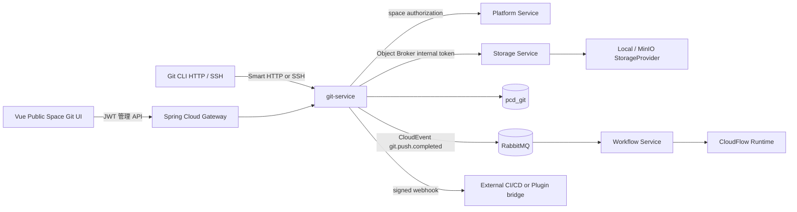

# Git Repository Service 与 Space Resource Provider 架构

## 目标与原则

Space 是租户、所有者、可见性和权限的上层业务抽象；`resource_type` 选择具体资源实现。当前实现有 `file` 和 `git`，Provider 接口预留 `dataset/docker/model`，不会把未来仓库类型硬编码到 Space Service。

Git Service 是独立微服务。它拥有自己的数据库、仓库索引、引用、权限、MR、PAT、SSH Key、Webhook 和 Outbox；裸仓库仅作为协议热缓存。Git Object 的权威物理文件由 Storage Service 的 Provider 写入本地磁盘或 MinIO，Git Service 只通过内部 Broker 访问。

## 组件与数据流

## 服务模块对应关系

| 需求模块 | 当前代码位置 | 职责 |
| --- | --- | --- |
| git-common | `internal/domain` | DTO、权限、Ref、Commit、MR、事件模型 |
| git-repo-manager | `internal/gitrepo`, `internal/api` | bare cache、仓库 CRUD、分支、Tag、MR、Diff、Blame |
| git-http | `internal/gitproto` | 认证、授权、并发限制，委托系统 `git http-backend` |
| git-ssh | `internal/sshserver` | ED25519 host key、上传公钥认证、命令白名单 |
| git-object-store | `internal/storage` + Storage Broker | Object PUT/HEAD/GET/DELETE、压缩内容寻址、Range |
| git-index | `internal/store`, `git_ref`, `git_object`, `git_commit_index` | 引用、对象映射、引用计数、提交查询索引 |
| git-hooks | bare `pre-receive` + Outbox | 分支保护、push 事件、Webhook、工作流触发 |

## Smart HTTP 与 SSH

标准 clone 地址为 `https://<domain>/git/<repo-slug>.git`；管理 API 使用 `/api/v1/git/**`。Gateway 还保留 `/api/v1/git/*.git/...` 兼容入口。协议端点只有：

- `GET /git/{repo}.git/info/refs?service=git-upload-pack`
- `GET /git/{repo}.git/info/refs?service=git-receive-pack`
- `POST /git/{repo}.git/git-upload-pack`
- `POST /git/{repo}.git/git-receive-pack`

Git 原生 `http-backend/upload-pack/receive-pack` 处理 capability negotiation、packfile、浅克隆和增量压缩；服务层只负责身份、权限、并发、超时、对象同步、审计和事件。SSH 监听 `2222`，只接受上传公钥对应的 session exec，并严格限制为 `git-upload-pack` 或 `git-receive-pack`。

## Object 生命周期

1. push 由 Git 原生 receive-pack 解包到 bare cache。
2. Git Service 枚举 reachable objects，生成 Git 原生 zlib loose object；按 canonical header+content 校验 SHA-1/SHA-256。
3. Storage Broker 在 Git Object 命名空间做去重写入，传输过程额外校验 SHA-256。
4. `pcd_git_object` 保存对象类型、压缩大小、逻辑路径和全局引用计数；`pcd_git_repo_object` 保存仓库独立映射。
5. refs、commit index 和 repository 统计在同步过程中更新。
6. 仓库删除/对象不再可达时先递减引用计数；物理删除应由后续 GC 任务按零引用、保留期和审计策略执行。

## 权限与安全边界

Platform authorization 是总闸门：空间必须 active 且 `resource_type=git`。Git 仓库作为公开空间的一种资源实现，拥有独立 `PUBLIC`、`HIDDEN`、`PRIVATE` 可见性：只有 `PUBLIC` 且同时开启 `allow_public_browse`、`allow_public_download` 时允许匿名 fetch；HIDDEN/PRIVATE 必须由仓库/空间 Read 权限读取。`allow_public_upload` 只决定普通公开文件资源的上传开关，**不**授予 Git push；任何 receive-pack 都要求 PAT 或 SSH 身份以及仓库/空间 Write。仓库级 Read/Write/Admin 可对已认证用户增加权限但不能绕过空间下线。仓库 `TEAM` 主体使用团队/企业空间 ID，Git Service 每次授权通过 Platform 内部成员接口实时确认，不复制成员表。

PAT 只存 hash，明文只在创建响应返回一次；SSH 只存规范化公钥和 SHA-256 fingerprint。Webhook secret 使用 AES-256-GCM 密文保存，并限制 HTTPS、公网 DNS 解析和非私网目标，避免 SSRF。Smart HTTP 不由 Gateway 自动 Retry，防止 receive-pack 重复提交。

## CI/CD 接入

Git Service 发布 `pcd.git.push.completed.v1`，路由键为 `git.push.completed`，payload 包含 repository、space、actor、changed refs 和 workflow bindings。Workflow Service 为每个绑定独立消费队列，按 ref glob 过滤后复用既有 DSL 发布/执行链路；CloudFlow Runtime 负责 DSL 编译与运行，Plugin Runtime 负责插件沙箱。该设计提供 GitHub Actions 类触发入口，但不把任意脚本执行器塞进 Git Service。

## 扩展新资源类型

新增资源类型只需新增 `SpaceResourceProvider` 实现、资源服务和前端渲染器，并复用空间身份/租户/权限边界。Dataset 可挂载数据湖版本索引，Docker 可实现 Registry V2，Model 可挂载模型版本和评估元数据；不得直接复用 Git 的 ref/object 表作为业务事实源。
