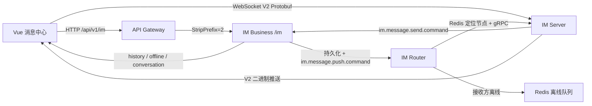

# 前端消息中心重构审计与实施矩阵

> 审计日期：2026-08-09  
> 关联需求：IM-WEB-ENTERPRISE-20260809  
> 审计范围：`PrivateCloudDisk-web`、`PrivateCloudDisk-im/im-common`、`im-server`、`im-platform`、`im-router`、网关路由与 Docker 前端构建变量。

## 1. 审计结论

现有消息中心不是可以直接扩展的企业级 IM 页面。页面、状态、通知、好友、通话和协议逻辑集中在单个页面与单个 Store 中，并且混入了演示数据和后端尚不存在的接口。重构必须先修正数据契约，再替换页面外壳；否则新界面会掩盖实际发送、回执和查询失败。

本次实施遵守以下边界：

- 真实能力：会话 CRUD、历史消息游标分页、离线消息、消息发送/撤回/已读、群组管理、WebSocket V2、消息回执和 WebRTC 信令，继续对接 IM Business / IM Server / IM Router。
- 可复用能力：平台服务的脱敏用户搜索接口用于“新建聊天”用户选择，不把搜索结果伪装为好友关系。
- 后端缺口：好友关系、好友申请、黑名单、IM 通知、服务端消息全文搜索和多端消息中心设置目前无 Controller、Service、Mapper 或表结构。本次前端不再调用虚构接口，不再显示伪造成功；相关入口以明确的能力状态和预留扩展点呈现。
- 浏览器限制：系统剪贴板历史、系统级 3D Touch、原生电话/短信级推送不是普通 Web 页面可无权限实现的能力，仅提供浏览器允许范围内的降级入口。

## 2. 当前代码与数据流

### 2.1 前端结构

| 层级 | 当前实现 | 审计结果 |
|---|---|---|
| 路由 | `/app/notifications` → `NotificationsView.vue` | 位于控制面板子路由，主菜单可保留；路由标题仍是“通知中心” |
| 页面 | `NotificationsView.vue`，约 1600 行 | 固定三列，顶部统计卡占用空间；无可调宽度、右栏折叠、移动端面板状态、系统性暗色变量 |
| 状态 | `notificationStore.ts`，约 1000 行 | 通知、好友、会话、消息和通话耦合；存在演示数据和失败后假成功 |
| HTTP | `api/im/imApi.ts` | 会话/消息/群组端点大部分存在；置顶与免打扰方法错误；DELETE 参数封装错误；好友/通知端点不存在 |
| WebSocket | `ImWebSocketClient.ts` | 已具备 V2 握手、加密、心跳、重连和回执；附件编码与部分事件身份字段不完整 |
| 本地缓存 | `utils/messageCache.ts` | 仅缓存消息；无会话、草稿、布局和通知偏好；默认清理周期与需求不一致 |
| 主题 | Layout 与 settingsStore 分别维护主题 | 存在双状态源；消息页硬编码浅色颜色，暗色模式不完整 |

### 2.2 服务端链路

职责边界是合理的：IM Server 负责长连接和协议，IM Business 负责业务校验与持久化，IM Router 负责跨节点路由和离线补偿。前端不得绕过该链路直接伪造“已送达”状态。

## 3. 关键缺陷

### 3.1 阻断级

1. `notificationStore` 使用 `account/name` 作为 `userId`，而 IM Business Controller 按 UUID 校验，真实请求会失败。
2. REST 状态与 WebSocket 状态被同一个枚举表达。数据库/REST 当前是 `0 PREPARING / 1 DELIVERED / 2 READ / 3 FAILED / 5 RECALLED / 6 DELETED`；V2 Protobuf 是 `1 SENDING / 2 SENT / 3 DELIVERED / 4 READ / 5 FAILED / 6 RECALLED`。
3. 浏览器 `.proto` 仅包含 182 行，后端协议为 585 行；浏览器代码引用的 Voice、Video、Sticker、Location、Reply、Call 和 Auth Payload 在副本中缺失。
4. `sendReadReceipt`、`sendTyping`、撤回和离线同步消息把 `senderId` 置空，IM Server 的防伪校验会拒绝。
5. WebSocket 附件消息默认被重新编码为文本，消息类型与负载不一致。
6. WebSocket `send()` 后立即标记“已发送/已同步”，未等待 IM Business 持久化或 Router 回执。

### 3.2 高优先级

1. 会话置顶、免打扰前端使用 PATCH，后端是 PUT。
2. DELETE 请求的 query 参数套了一层 `params`，与统一请求封装签名不匹配。
3. 页面展示内置姓名、消息、文件和通知；接口失败时继续展示，属于误导性数据。
4. 好友申请失败后生成“待发送队列”通知并返回成功，后端实际没有该队列。
5. 重试消息依赖当前活动会话，切换会话后可能发送到错误接收者。
6. 消息到达后无稳定去重、顺序队列和游标状态；列表总是强制滚到底部。
7. 输入法组合阶段按 Enter 可能误发送中文；无草稿、附件队列和粘贴/拖拽处理。
8. Docker 默认 `VITE_IM_WS_URL` 缺少 `//`，会产生无效地址。

### 3.3 UX、可访问性和性能

- 三栏不能调宽、不能折叠，移动端没有真正的单栏导航状态。
- 缺少焦点环、ARIA 标签、键盘区域快捷键、44px 触摸目标和减少动态效果适配。
- 会话与消息均为普通 `v-for`；万级数据会产生过量 DOM。
- 无浏览器通知、标签页未读标题、断网横幅、可控自动滚动、回到底部按钮。
- 无消息类型组件化渲染、引用、多选、右键菜单、共享文件和会话内搜索面板。
- 暗色主题仅依赖零散全局选择器，不能覆盖消息气泡、侧栏和编辑器。

## 4. 需求实施矩阵

| 需求组 | 本次落地 | 后端依赖/降级 |
|---|---|---|
| 2 整体布局 | 响应式三栏、可调宽、可折叠、宽度记忆、键盘切换、移动端底栏、网络横幅、骨架、动态标题、主题/字号/密度 | 独立浏览器窗口使用标准 `window.open` |
| 3 会话列表 | 排序、置顶、免打扰、搜索、高亮、摘要、草稿、未读、右键、批量模式、增量更新、空/离线状态 | 服务端无会话分页，前端仅对已返回列表做窗口化渲染 |
| 4 顶部栏 | 头像、名称、在线/输入/同步状态、搜索、详情、响应式操作 | 群主/公告从现有群组接口加载；加密图标仅表示传输层 V2，不宣称 E2E |
| 5 消息列表 | 类型化气泡、日期分隔、状态、失败重试、引用、长文折叠、URL、懒加载、历史游标、回到底部 | 转发/举报/群已读成员需要后端接口，保留显式不可用态 |
| 6/10 输入区 | 自适应输入、IME、草稿、Markdown、Emoji、附件拖拽/粘贴/排序/删除/重命名/说明、链接预览、超大文件提示 | 文件发送复用网盘上传能力的接入接口；浏览器剪贴板历史不可无权限读取 |
| 7 右侧面板 | 详情、联系人、共享文件、搜索四 Tab，可折叠、可调宽、移动抽屉 | 好友关系尚无后端；联系人显示真实会话对象和平台搜索结果 |
| 8 好友管理 | 用户搜索、新建私聊、缺失能力提示 | 好友请求/黑名单/备注/分组需新增 IM Business 领域模型，不伪造成功 |
| 9 全局搜索 | 会话、已加载消息、附件的 300ms 防抖搜索、键盘导航、历史 | 服务端全文检索不存在时明确标记“当前设备范围” |
| 11 状态通知 | WebSocket 回执、失败重试、桌面通知、Toast、动态未读、离线同步、免打扰偏好 | 群聊已读成员列表与多端设置同步待后端支持 |
| 12 性能异常 | 列表窗口化、图片懒加载、重连状态、去重、发送队列、IndexedDB、AbortController、错误边界 | 性能目标通过构建和可重复的前端基准脚本验证；真实低端设备验收需部署环境 |
| 13 设置 | 主题、字号、密度、发送键、通知、已读回执、自动清理和面板宽度本地持久化 | 多设备设置同步接口不存在，使用本地设置并标记同步状态 |
| 14 后端对接 | 修复 UUID、HTTP 方法、DELETE 参数、V2 Payload 和身份字段；统一错误处理 | 不调用不存在的 `/friends`、`/friend-requests`、`/notifications`、`/messages/search` |
| 15 移动端 | 单栏、底部导航、返回、抽屉、触摸目标、安全区、深色、PWA 兼容布局 | 系统原生推送/振动按浏览器能力检测 |

## 5. 兼容性原则

- 不删除现有 WebRTC 通话组件与信令层；新页面继续复用 `useCall`、`IncomingCallDialog` 和 `FloatingCallWindow`。
- REST 数据库存储状态和 V2 传输状态分开建模，避免改变后端四态设计。
- 前端生成的 `clientMessageId` 只用于本地关联；服务端持久化后使用 Snowflake `messageId`，回执通过原始消息 ID 映射。
- 旧消息缓存采用兼容读取，新字段均为可选；缓存损坏不阻断在线消息链路。
- 所有新增注释标注需求编号、改动原因和影响范围；原有实现保留为可回溯的独立页面文件，不在未确认业务迁移时直接删除。

## 6. 验证计划

1. Protobuf schema 与后端源文件做字段/枚举契约比较。
2. Vue 生产构建；对本次涉及文件执行过滤后的 `vue-tsc` 检查。
3. Store 单元测试：排序、去重、状态映射、重试目标、草稿恢复。
4. 组件测试：桌面三栏、中屏折叠、移动单栏、暗色、键盘与 IME。
5. 协议测试：文本、图片、文件、语音、视频、位置、引用、已读、输入状态的编码/解码。
6. 集成环境验收：连接 IM Server、发送命令入 MQ、IM Business 持久化、Router 推送、离线补偿和回执更新。

## 7. 本次实际落地结果

### 7.1 前端

- `/app/notifications` 已切换到独立 `MessageCenterView.vue`；旧 `NotificationsView.vue` 未删除，保留回溯入口与原注释。
- 页面拆为 `ConversationList`、`MessageList`、`MessageComposer`、`DetailPanel` 四个职责组件，采用桌面三栏、中屏抽屉、小屏单栏 + 底部 Tab。
- 新增 `messageCenterStore`，只使用真实 IM 会话/消息端点和平台脱敏用户搜索，不再依赖演示好友、通知或假成功分支。
- 会话列表实现窗口化渲染；消息列表使用 `content-visibility`、历史游标、媒体懒加载和受控自动滚动，避免一次性布局所有不可见消息。
- 支持草稿、串行发送队列、失败重试、消息 ID 去重、IndexedDB、会话切换请求取消、桌面通知、未读标题、断网/重连反馈。
- 输入器支持 IME、安全快捷键、自适应/手调高度、Emoji、Markdown、引用、录音、拖拽/粘贴/排序附件、分片上传与本地持久化定时发送。
- 附件消息只持久化稳定的 `diskFileId`，不把短期下载/预览令牌写入 Protobuf；图片进入可视区后申请预览授权，音视频播放和文件下载按需申请下载授权，并在结束后释放或取消授权。
- 权威浏览器 Protobuf 已与后端完整 schema 对齐；HTTP/REST 的 `MessageType` 也改用同一编号，删除 6/7/8/9 与 11/50/100 的双重解释。
- 修复 DELETE query、PUT/PATCH、真实 UUID、WebSocket sender 身份字段和 `ws://`/`wss://` 配置格式。

### 7.2 后端协议链路

- IM Server 校验 Envelope sender 与已认证会话用户一致，阻止客户端伪造发送者。
- IM Platform 新增富媒体编解码器：TEXT、IMAGE、FILE、VOICE、VIDEO、STICKER、LOCATION、REPLY、SYSTEM_NOTICE、CUSTOM 均可在 Protobuf → 数据库 JSON → Protobuf 之间往返。
- 修复 `batchUpdateRead` 把 READ 错写为 FAILED 的枚举错位。
- typing 从“只打日志”改为 Router 跨节点推送；临时通知不写离线队列、不产生回执。
- 单聊 READ_MESSAGE 在数据库更新之外同步推送给原发送方；群聊成员级已读仍需专门的聚合表与查询接口。

### 7.3 验证证据（2026-08-09）

| 验证项 | 结果 |
|---|---|
| Vue/Vite 生产构建 | 通过；消息中心独立 chunk 正常生成 |
| 前端消息中心契约测试 | 4/4 通过（枚举、真实路由/接口、四组件关键交互、附件短期授权） |
| 本次前端文件过滤 `vue-tsc` | 无错误；全仓仍有账单、搜索、旧通知页等历史类型错误 |
| IM Common + Platform + Server 编译打包 | `mvn ... -DskipTests package` 通过 |
| 富媒体持久化往返测试 | 2/2 通过（文件、引用消息） |
| IM Router 策略测试 | 通过，包含临时通知不落离线队列 |
| IM Platform 全量 Mockito 测试 | 未执行成功；JDK 23 禁止 ByteBuddy self-attach，34 个用例均在 MockMaker 初始化前失败，不是断言失败 |
| 浏览器 UI 路由检查 | 本地站点可渲染，受保护路由正确跳转登录页；浏览器无项目登录态，未伪造 Token，因此三断点 UAT 未标记通过 |
| 真实 MQ/Redis/gRPC/WebSocket 联调 | 本地依赖未启动，本次不能据此宣称通过 |

## 8. Full-stack audit 阶段评分

这是基于源码、构建与单元测试的阶段评分，不等同于部署后的 UAT：

| 维度 | 分数 | 主要扣分原因 |
|---|---:|---|
| 交互与响应式 | 86/100 | 尚未在 320/428/折叠屏真机验收 |
| 可访问性 | 81/100 | 主路径有 ARIA/键盘/焦点；复杂消息菜单仍需屏幕阅读器走查 |
| 性能 | 79/100 | 会话已窗口化，消息采用浏览器跳过布局；尚未完成万级真实数据与低端机基准 |
| 安全与协议 | 84/100 | sender 防伪与 Protobuf 对齐已修复；HTTP Controller 的 userId 仍需统一从认证主体派生 |
| 数据真实性 | 90/100 | 新页面不再伪造好友/搜索/通知成功；缺失能力明确降级 |
| 可运营性 | 72/100 | 缺少客户端错误上报端点和真实性能采集后端 |

## 9. 明确未伪装为“已实现”的服务端能力

以下项目不能仅靠前端安全完成，当前代码以禁用入口、当前设备搜索或“待后端”说明降级：好友申请/同意/拒绝/黑名单/备注/标签/推荐好友、服务端全文检索、群聊成员级已读列表、跨设备设置同步、审核举报、服务端定时消息、系统剪贴板历史、原生移动推送、语音识别与翻译服务。后续应先补 IM Business 的领域模型、迁移表、鉴权 Controller 和事件协议，再开放对应 UI；否则会重新引入本次审计已移除的虚构能力。

IM 附件还有一个明确的服务端权限边界：现有上传接口把文件写入发送方网盘，接收方能否使用 `diskFileId` 申请预览/下载授权取决于文件服务是否已有“会话参与者附件 ACL”。前端现在会真实发起授权并显示 403 等失败，但不会绕过鉴权。若文件服务尚未实现该 ACL，应新增 IM 附件授权记录（会话 ID、消息 ID、文件 ID、发送者、可访问成员、撤回/过期状态），由预览和下载授权接口校验；不能通过发送永久公开 URL 规避权限模型。
