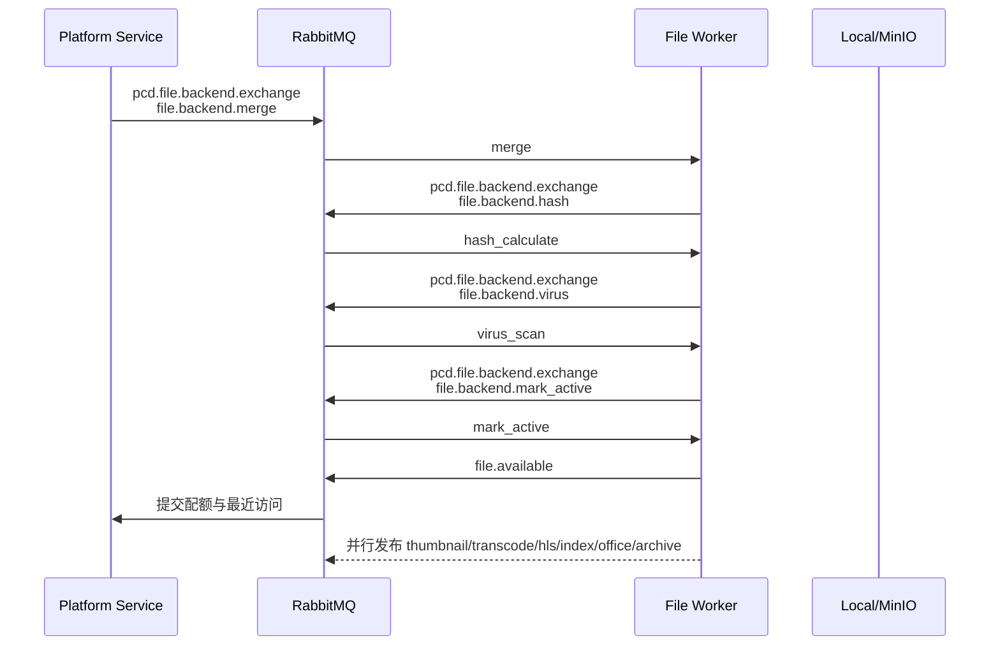
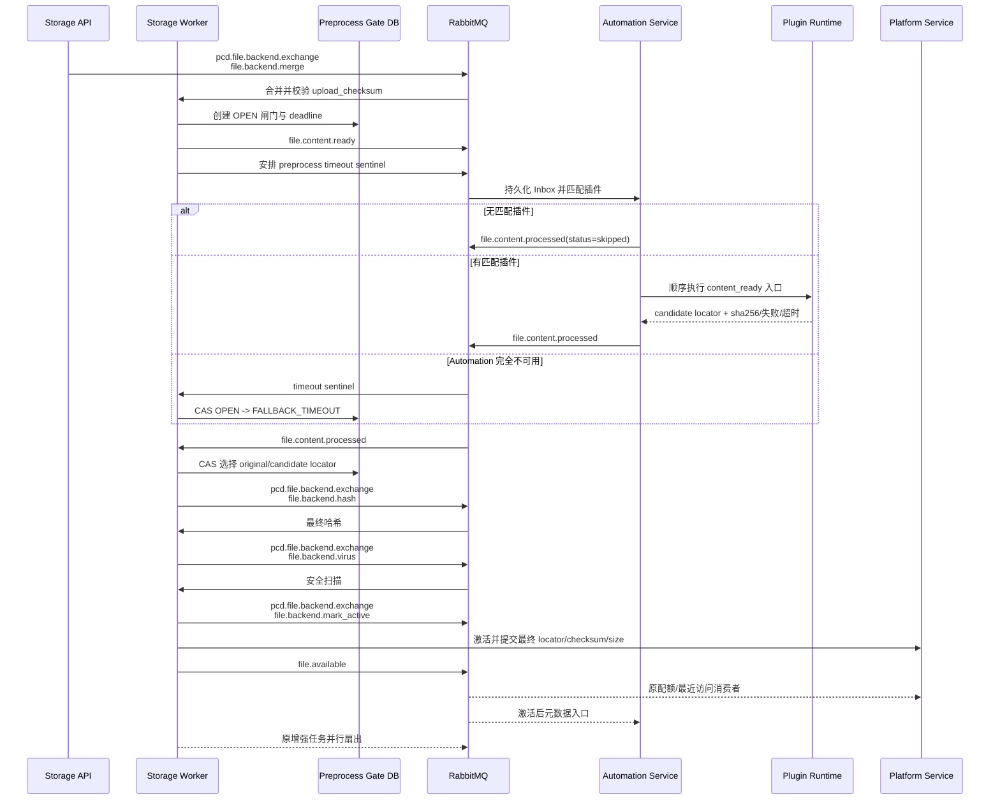
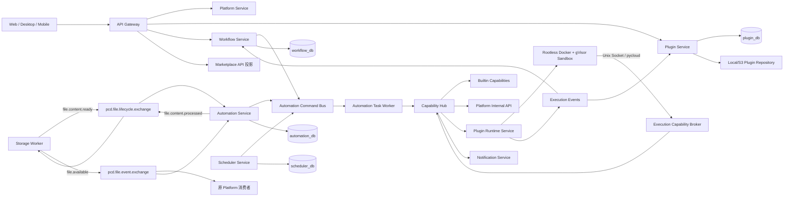

# PrivateCloudDisk 插件生态与自动化工作流平台

> 文档状态：`APPROVED-FOR-IMPLEMENTATION`
> 版本：`v0.4.0`
> 日期：`2026-07-29`
> 适用范围：插件服务、自动化服务、工作流服务、任务调度服务、插件运行时、Python 沙箱、Web/桌面/移动客户端插件运行时、插件/工作流市场及开发者文档
> 代码实施状态：**设计已批准；Storage Worker 文件后台与增强流水线使用 Task Bus，内容预处理保留独立生命周期事件和 Gate fail-open；Web IDE 设计增补完成，云/本地/工作流/市场服务按追踪矩阵继续验收。**

---

## 0. 评审结论摘要

### 0.1 推荐结论

本项目可以在现有文件协作平台上建设插件生态，但不能把用户脚本直接加入
`PrivateCloudDisk-storage-service` 的 FastAPI 进程或文件增强 Worker。推荐采用以下控制面与执行面分离设计：

1. 新建 `plugin-service`：管理插件元数据、版本、安装、空间绑定、市场、权限声明、审计和执行记录投影。
2. 新建 `automation-service`：订阅文件事件、完成触发条件匹配、持久化事件收件箱、生成执行任务。
3. 新建 `workflow-service`：管理 DSL、工作流版本、执行状态机和能力调用中心。
4. 新建 `scheduler-service`：负责 cron 计算、分布式抢占、误触发策略与定时任务投递。
5. 新建 `plugin-runtime-service`：只负责校验、分配沙箱、回收资源和上报资源用量；不读取业务数据库。
6. 新建不可变 `plugin-sandbox-python` 镜像：通过 rootless Docker + gVisor（生产必选）运行受限 Python。
7. 插件只能经 `pycloud` 和执行专属 Unix Domain Socket 调用平台能力，不持有用户 JWT、数据库凭证、对象存储凭证或物理文件路径。
8. 在合并与最终哈希之间新增 `file.content.ready` / `file.content.processed` 预处理闸门；
   现有 `file.available` 事件、原消费者和激活后增强流水线保持兼容。

### 0.2 必须先解决的上线阻断项

| 编号 | 严重度 | 现状 | 对插件平台的影响 | 处理门禁 |
|---|---|---|---|---|
| AUD-P0-01 | P0 | 多个配置文件和 Compose 中存在默认或硬编码数据库、RabbitMQ、Turnstile、内部调用及分享加密密钥 | 用户代码执行平台一旦被攻破会扩大密钥泄漏半径 | 第一阶段任何生产部署前完成密钥轮换、Secret 管理和提交历史扫描 |
| AUD-P0-02 | P0 | 网关白名单包含 `/api/v1/client/internal/**`，客户端注册服务内部查询/吊销接口可从外部路由到达 | 插件分发所依赖的客户端身份可被枚举或吊销 | 内部 API 不再进入公网路由；使用服务网络 + mTLS/SPIFFE |
| AUD-P0-03 | P0 | 现有 `file.available` 消费者先在 Redis 写幂等键，再执行数据库业务；失败后重投可能被当成已完成 | 自动化事件可能永久丢失 | 自动化服务必须使用数据库 Inbox/Outbox；Redis 只能加速，不能作为事实源 |
| AUD-P0-04 | P0 | Electron 主窗口 `sandbox:false`，预加载层暴露任意路径文件读写 IPC | 本地插件可借客户端桥接越权读取或覆盖本机文件 | 第二阶段前完成插件专属进程、权限代理、路径句柄和 Electron Fuses 加固 |
| AUD-P0-05 | P0 | 当前没有不可信代码运行设施；文件 Worker 与 HTTP 分进程不等于用户脚本沙箱 | 直接复用会产生容器逃逸、数据串读和服务阻塞风险 | 必须使用独立 Runtime、专用沙箱节点和无网络临时容器 |
| AUD-P0-06 | P0 | 当前 CI 构建矩阵中的 `file-service`、`frontend` 目录名与仓库实际目录不一致，且部署前没有测试/扫描门禁 | 新服务可能未经验证直接部署 | 第一阶段编码前先建立可运行的 CI 模板和强制门禁 |
| AUD-P1-01 | P1 | 空间权限仅有 read/write/delete/share/invite/manage，没有“插件管理”和“执行自动化” | 无法表达空间管理员与自动化操作者的最小权限 | 数据迁移新增权限，公共权限服务统一校验 |
| AUD-P1-02 | P1 | 实际事件名为 `file.available`，不是需求文案中的 `file.active`，消息缺少文件版本号和因果链 | 事件重放、插件写回和循环触发难以控制 | 保留 routing key `file.available`，标准事件类型统一为 `pcd.file.available.v1`，并新增激活前 `pcd.file.content.ready.v1` |
| AUD-P0-07 | P0 | Backend 阶段状态与顺序判断以 Redis 为事实源，消费者内使用 `asyncio.sleep` 完成重试 | Redis 丢失、Worker 重启或插件系统不可用时可能卡住文件激活 | 新预处理闸门以 MySQL 为事实源，使用 TTL 重试队列、持久化超时哨兵和定时巡检双重逃生 |
| AUD-P0-08 | P0 | 合并阶段已经按客户端 checksum 校验，后续 hash 阶段仍比较同一 checksum | 插件合法修改内容后必然触发 `HASH_MISMATCH` | 分离 `upload_checksum` 与 `final_checksum`；合并验证上传完整性，预处理后 Hash 独立验证最终候选内容 |
| AUD-P1-03 | P1 | 通知事件没有 `space_id`、工作流/执行关联字段 | 无法正确审计空间级失败通知 | 扩展通知事件契约，不允许插件直接写通知库 |
| AUD-P1-04 | P1 | 客户端注册模型默认 macOS，且 `client_id` 未与登录用户建立可信绑定 | 不能安全分发空间本地插件或验证客户端日志 | 第二阶段增加用户绑定、平台能力与签名日志契约 |
| AUD-P1-05 | P1 | Monaco 通过 jsDelivr + AMD + `data:` Worker 加载，CSP 含 `unsafe-eval` | 私有化/离线环境不稳定，扩大编辑器页面脚本攻击面 | 插件开发页改为自托管、固定版本的 ESM Worker |
| AUD-P2-01 | P2 | README 与实际构建版本、服务名存在漂移，例如文档写 Spring Boot 4.0.6，构建实际为 3.4.7 | 开发者文档和 SDK 兼容性判断会失真 | 文档从 OpenAPI/Schema/构建元数据生成并纳入 CI |

### 0.3 必须由产品负责人确认的设计决策

1. **激活前内容预处理语义（已确认）**：在 `merge` 与最终 `hash_calculate` 之间增加
   `file.content.ready` / `file.content.processed`。内容插件只写候选暂存对象，存储服务在持久化闸门中
   原子选择原始对象或候选对象；随后统一执行最终哈希、扫毒和 `file.available`。文件可用后内容冻结，
   `file.available` 入口只开放元数据、逻辑目录、通知和工作流能力。
2. **生产沙箱强度**：推荐 Docker rootless + gVisor 为生产最低标准；普通 Docker/runc 只允许开发环境。
   如果未来允许公开市场中的匿名第三方插件，应升级为 Kata Containers 或 Firecracker 微虚机。
3. **服务数据隔离**：推荐插件、工作流、自动化、调度各自使用独立数据库/schema 和独立账号；
   不允许直接为新服务开放 `private_cloud_disk` 主业务库写权限。
4. **第一阶段范围**：先完成云插件、基础工作流能力中心、空间绑定、激活前/后事件触发和执行记录；
   本地多端运行时、可视化编排和市场按第二至第四阶段推进，但数据库/API 从第一阶段开始保持向前兼容。

### 0.4 Storage Worker Task Bus 与生命周期闸门（2026-07-30）

本轮根据 `docs/STORAGE_WORKER_TASK_BUS_AUDIT.md` 完成任务总线回滚和重复实现清理：

1. merge/hash/virus/mark_active、增强、永久删除的业务 Pipeline 和原有日志字段保持不变；
   阶段编排恢复为 `pcd.file.backend.exchange`、`file.backend.*` 任务路由以及独立阶段队列。
2. backend/enhancement 重试统一进入持久化 `.retry` 队列，消息 TTL 到期后由 DLX 回流原任务路由；
   发布确认成功后才 ACK，消费者不再 sleep 或把延迟消息直接投递主队列。
3. 删除 backend Event Bus 适配消费者、统一 Event Bus 契约包和对应审计/运维文档；
   `file.content.*` 仍是 Automation 与 Storage 之间的生命周期事件，不承担 backend 阶段编排。
4. 内容预处理 Gate 保留 15 秒 timeout sentinel、3 秒 sweeper、processed 固定 TTL 重试和 DLQ
   fail-open；插件目录匹配默认 500ms，运行时默认 8 秒，避免无服务/无匹配阻塞 hash。
5. Worker 启动探测 OpenSearch 失败后，本进程禁用内容索引增强并返回 skipped，不再在后续任务中
   重复连接并抛异常；其他文件后台阶段继续运行。

详细发现、路由映射、重试回流、死信和降级验收见
[`STORAGE_WORKER_TASK_BUS_AUDIT.md`](STORAGE_WORKER_TASK_BUS_AUDIT.md)。

---

## 1. 审计范围与方法

### 1.1 本次实际核对的代码范围

本次不是仅依据需求文字画新架构，而是核对了以下现有实现：

| 范围 | 重点文件/目录 | 核对结论 |
|---|---|---|
| 主业务服务 | `PrivateCloudDisk-platform-service/src/main/java/org/project`、MyBatis XML、`build.gradle` | Spring Boot 3.4.7、Java 18、MyBatis；已有统一响应、空间上下文和文件业务 |
| 空间体系 | `SpaceContextHolder`、`SpaceContextInterceptor`、`SpacePermissionServiceImpl`、空间 SQL | `X-Space-Id` 已能回退个人空间，角色为 owner/admin/editor/viewer |
| 文件事件 | `RabbitMQConifgure`、`FileAvailableConsumer`、Python `mark_active_consumer.py` | 实际生命周期事件为 `file.available`，消息已有 user_id/space_id；Java 消费者仍是 Redis 先占幂等键 |
| 文件服务/Worker | `core/config.py`、`core/rabbitmq.py`、`worker.py`、Backend/Enhancement/DLQ 消费者与上传任务 API | HTTP 与 Worker 已分进程；Backend/Enhancement 使用 Task Bus、阶段专属 DLQ、TTL retry、幂等抢占和多进程健康入口；Gate DB 仍是激活前事实源 |
| 合并与存储 | `merge_pipeline.py`、`hash_pipeline.py`、`core/storage/*`、Platform 合并/激活内部接口 | 合并时已校验客户端 checksum 并把 storage_path 写入主库；Local/MinIO 抽象尚未完整贯穿合并流水线 |
| 上传进度 | `tasks.py`、Web `uploaderStore.ts`、`uploads.ts` | 前端轮询固定四阶段且最多 5 分钟；需新增云插件预处理阶段和降级结果 |
| 存储抽象 | `core/storage`、本地/MinIO 配置 | 已有 local/MinIO 思路，但插件包应使用独立存储命名空间和凭证 |
| 网关 | 路由配置、JWT 过滤器、设备身份过滤器、CORS | 当前只路由 business/files/im/client；需要新增插件/工作流路由和内部服务隔离 |
| 通知服务 | Go 领域模型、MQ 消费、模板和持久层 | 支持邮件/短信/推送/站内/WebSocket，可作为工作流失败通知后端 |
| 客户端注册 | Go 设备证明、Redis challenge、客户端身份表 | 有设备公钥基础，但仅面向 macOS 且未绑定登录用户 |
| Web | Vue Router、Sidebar、Pinia 空间状态、Axios 拦截器、Monaco 组件 | `X-Space-Id` 已全局注入；已有独立预览工作区模式，可复用为开发工作区 |
| Electron | BrowserWindow、preload、IPC | contextIsolation 已开，但 sandbox 关闭，文件 IPC 权限过宽 |
| 多端客户端 | Electron、iOS、Android、macOS、Windows、uni-app 的工程边界 | 工程存在，但没有统一 Local Plugin Runtime |
| 部署与安全 | 根 Compose、Dockerfile、Nginx CSP/安全头、`.env.example` | 有容器化和观测基础；密钥、网络分区、CI 门禁需先加固 |
| 文档与官网 | `docs/`、官网 `/docs/*` 路由 | 已有文档入口，但内容多为手写页面，和实际版本存在漂移 |

### 1.2 v0.2 设计修订前未执行事项

- v0.2 生命周期设计修订完成前未修改业务代码、数据库脚本、部署文件或前端页面。
- 未启动线上环境；没有用户提供的可访问测试 URL，因此本次浏览器和真实负载结论标记为待验证。
- 未对用户已有的未提交改动进行格式化、重排或清理。

---

## 2. 现有数据流与可复用基础

### 2.1 审计确认的原文件激活链



原 `file.available` 消费者及其队列继续保留。激活后的自动化为同一个 topic exchange
增加自己的队列：

```text
pcd.file.event.exchange
  routing_key=file.available
    ├── pcd.file.available.queue                 # 原 Platform 消费者
    └── pcd.automation.file.available.ingress.q  # 新 Automation 消费者
```

RabbitMQ 的一个消息可以路由到多个独立队列，因此不会形成竞争消费。

### 2.2 目标文件激活链

事件命名遵循仓库现有的 `file.<noun>.<state>` 小写点分规则。RabbitMQ routing key
保持不带版本，消息体通过 `schemaVersion` 和 CloudEvents `type` 版本化：



更新后的 Backend 阶段顺序：

```text
merge
  -> content_preprocess
  -> hash_calculate
  -> virus_scan
  -> mark_active
```

`content_preprocess` 是 Storage Worker 持有的“等待闸门”，不是在文件 Worker 中执行用户代码。
Automation 和 Runtime 故障只会使闸门进入 `skipped`、`failed`、`timeout` 或
`fallback_unavailable`，不会把 Backend 总任务标记为失败。

### 2.3 上传 checksum 与最终 checksum

- `upload_checksum`：客户端上传前提供，由 merge 边写边计算并校验，证明分片上传完整。
- `candidate_checksum`：Runtime 完成候选对象写入后由可信 Broker 计算并签名返回。
- `final_checksum`：Storage Hash Worker 对闸门选定对象独立计算；候选对象场景与
  `candidate_checksum` 比较，回退原始对象场景与 `upload_checksum` 比较。
- `file.available` 必须携带最终 `fileSize`、`checksum`、`contentRevision` 和
  `contentModified` 可选字段；老消费者忽略新增字段。

该拆分避免合法插件修改后仍拿客户端原始 checksum 比较而被误判为损坏。

### 2.4 预处理闸门与不可变暂存对象

不把宿主机绝对路径、MinIO 凭证或可写原始文件传给 Automation/Sandbox。事件中的
“临时存储路径”定义为不透明的 `stagingLocator`，例如
`pcd-staging://<gate_id>/original`；插件通过执行专属 content lease 和 `pycloud`
读取内容、写入候选对象：

```text
original locator 只读且不可变
  -> plugin-1 candidate
  -> plugin-2 candidate
  -> ...（按确定顺序，最多受空间策略限制）
  -> final candidate
```

预处理链默认是全有或全无：

- 所有匹配入口成功：选择最终 candidate。
- 任一入口失败、超时、安全违规或输出校验失败：丢弃整条候选链，选择 original。
- 无匹配入口：立即选择 original，状态 `skipped`。
- 到达总 deadline：存储侧 CAS 选择 original，状态 `fallback_timeout`；迟到结果被幂等忽略。

存储服务数据库新增 `pcd_file_preprocess_gate`：

| 字段 | 类型/约束 | 说明 |
|---|---|---|
| `gate_id` | BINARY(16) PK | 闸门 ID |
| `ready_event_id` | BINARY(16) UNIQUE NOT NULL | ready 事件幂等 |
| `processed_event_id` | BINARY(16) NULL UNIQUE | 最终 processed 事件 |
| `backend_task_id` | BINARY(16) UNIQUE NOT NULL | 与上传后台任务一一对应 |
| `file_id/user_id/space_id` | BINARY(16) | 多空间定位 |
| `continuation_json` | JSON NOT NULL | 仅 Storage 可读的 Backend 事件快照，用于宕机恢复后重建 hash 命令 |
| `content_lease_hash` | CHAR(64) NOT NULL | 一次性候选内容 Lease 摘要，数据库不保存明文能力凭证 |
| `original_locator` | VARCHAR(1024) NOT NULL | 只读原始暂存对象 |
| `candidate_id` | VARCHAR(128) NULL | Runtime/Broker 可回传的不透明候选 ID |
| `candidate_locator/selected_locator` | VARCHAR(1024) NULL | 仅 Storage 可读的候选和最终选择 |
| `upload_checksum/candidate_checksum/final_checksum` | CHAR(64) | 三类 checksum |
| `original_size/candidate_size/final_size` | BIGINT UNSIGNED | 配额和边界校验 |
| `status` | VARCHAR(32) | OPEN/COMMITTING/SELECTED/FALLBACK/EXPIRED/CLEANED |
| `result_status` | VARCHAR(32) | success/skipped/failed/timeout/fallback_unavailable |
| `content_modified` | BOOLEAN NOT NULL DEFAULT 0 | 是否选择候选 |
| `deadline_at/selected_at/created_at/updated_at` | DATETIME(3) | 超时和审计 |
| `row_version` | BIGINT UNSIGNED | CAS 乐观锁 |
| `failure_code/failure_summary` | VARCHAR | 脱敏失败摘要 |

索引：`UNIQUE(backend_task_id)`、`UNIQUE(ready_event_id)`、
`INDEX(status,deadline_at)`、`INDEX(space_id,file_id)`。

本地文件使用同目录临时文件、`fsync` 和原子 rename 完成 candidate 封存；
MinIO/S3 使用不可变对象 key、SHA-256 元数据和条件写。最终选择是数据库 CAS + locator
指针切换，不允许沙箱覆盖 original。`mark_active` 成功后才清理未选择对象；
清理任务失败不回滚已激活文件，但必须进入可重试清理台账。

### 2.5 双重逃生与故障收敛

1. 创建闸门与 ready Outbox 必须同一数据库事务提交。
2. Outbox publisher confirm 后发布 ready；即使 Automation 未消费，闸门 deadline 仍存在。
3. 同时发布固定 TTL timeout sentinel；其消费只执行 `OPEN -> FALLBACK` CAS。
4. Storage Worker 每 15 秒扫描 `status=OPEN AND deadline_at<=NOW()`，作为 MQ sentinel 的第二兜底。
5. `file.content.processed` 主队列按 5s/30s/120s 重试三次后进专属 DLQ。
6. processed DLQ 消费者不把 Backend 标记为 failed，而是执行相同 fallback CAS 并告警。
7. Worker 重启后依据 Gate DB 恢复；Redis 只作为进度查询投影。
8. Automation/Runtime 恢复后产生的迟到 processed 事件发现 Gate 已关闭，记录
   `LATE_RESULT_IGNORED` 后 ACK。

因此插件系统故障不会阻止文件继续进入 Hash/Scan；真正的合并损坏、最终哈希不匹配或病毒命中
仍沿用原安全失败策略，不能被“插件降级”绕过。

### 2.6 当前空间上下文

现有 Web Axios 拦截器已注入 `X-Space-Id`；Platform 通过拦截器解析后保存到
`SpaceContextHolder`。这可以继续作为公网 API 的空间入口，但异步任务不能依赖 ThreadLocal。
所有插件、工作流、调度与通知事件必须显式携带：

- `space_id`
- `actor_user_id`
- `installation_id`
- `execution_id`
- `correlation_id`
- `causation_id`

### 2.7 可复用但不能直接暴露给插件的能力

| 现有能力 | 复用方式 | 禁止方式 |
|---|---|---|
| 文件元数据/目录 API | 由 Capability Hub 或 pycloud Broker 以服务身份调用 | 插件直接访问 Platform Service |
| 文件内容/Range/预览授权 | Broker 申请单次、单文件、单执行的内部能力凭证 | 把用户 JWT、下载 Token 或物理路径放入沙箱 |
| 通知服务 | Capability Hub 发布标准通知事件 | 插件直接访问通知数据库或 SMTP |
| 空间权限 | Platform 内部权限 API 返回授权判定 | 在插件服务复制 owner/admin 判断 |
| MinIO/本地存储 | PluginStorageAdapter 保存插件包和日志 | 插件获得 S3 Key、Access Key 或宿主机目录 |
| RabbitMQ | 服务间可靠事件和命令 | 用户脚本连接 RabbitMQ |

---

## 3. 目标架构



### 3.1 控制面与执行面

- **控制面**：Plugin、Workflow、Automation、Scheduler、Gateway、数据库。
- **执行面**：Task Worker、Runtime、Sandbox、Capability Broker。
- **数据面**：Platform/File Service、对象存储、通知服务。
- 控制面不执行用户代码；执行面不读取业务数据库；沙箱不持有平台凭证。

### 3.2 服务技术选型

| 服务 | 推荐技术 | 原因 |
|---|---|---|
| Plugin Service | Java 21 LTS + Spring Boot 3.4.x + MyBatis | 与主业务分层规范一致，适合元数据、权限、审计和事务 |
| Automation Service | Java 21 LTS + Spring Boot + MyBatis + Spring AMQP | 复用现有 AMQP 经验，负责 Inbox/Outbox 和触发匹配 |
| Workflow Service/Worker | Java 21 LTS + Spring Boot + MyBatis | DSL 验证、状态机和事务边界清晰 |
| Scheduler Service | Go 1.22+ 或 Java 21 | 轻量常驻调度；团队若统一维护可选 Java |
| Plugin Runtime Service | Go 1.22+ | 容器生命周期、资源监控、低内存常驻更适合 Go |
| Python Sandbox | Python 3.11 slim，固定 digest | 与需求兼容；包集合可审计、不可运行时安装 |
| Web | Vue 3.5 + Pinia + Vue Router + Monaco ESM Worker | 延续现有栈，不复制另一套控制台 |

新 Java 服务统一使用 Java 21 LTS；不继续扩大当前 Java 18 非 LTS 的维护面。

---

## 4. 服务职责边界

### 4.1 Plugin Service

负责：

- 插件 Draft/Create/Update/Delete/Publish。
- 插件版本不可变发布、SemVer 校验、回滚安装版本。
- 云插件、本地插件、工作流插件的统一元数据。
- 包上传、哈希、扫描、签名、分发和存储适配。
- 用户安装、空间安装、启停、配置和授权权限快照。
- 云插件导出能力函数注册。
- 运行统计、脱敏摘要、完整日志授权下载。
- 市场列表、分类、评论、评分和审核状态。
- 审计事件和 Outbox。

不负责：

- 不执行用户代码。
- 不直接操作文件元数据或文件实体。
- 不判断具体文件操作权限；调用 Platform 权限 API。
- 不持有 Docker Socket。

分层：

```text
Controller
  -> Application Service
    -> Domain Service / Policy
      -> Repository / MyBatis Mapper
      -> PluginStoragePort
      -> RuntimeValidationClient
      -> SpaceAuthorizationClient
```

### 4.2 Automation Service

负责：

- 订阅 `file.content.ready`，匹配同一用户/空间安装中声明该入口的云插件。
- 按 `priority ASC, installed_at ASC, installation_id ASC` 确定预处理执行顺序。
- 预处理链结束后无论 success/skipped/failed/timeout 都通过 Outbox 发布
  `file.content.processed`；不得静默结束。
- 为现有 `file.available` 声明独立队列，调度同一插件包中的激活后入口。
- 把旧 `file.available` 适配为标准 `pcd.file.available.v1`。
- 数据库 Inbox 去重、触发器检索与条件匹配。
- 生成插件执行或工作流执行命令。
- 记录因果链、自动化深度、循环抑制和速率配额。
- 失败重试、DLQ、人工重放和事件审计。

不负责运行用户代码，也不直接修改文件或决定超时逃生。是否选择候选内容由 Storage 的
Preprocess Gate Service 决定，避免 Automation 故障阻塞核心生命周期。

### 4.3 Workflow Service

负责：

- DSL/图模型的创建、版本、发布和空间绑定。
- JSON Schema + 语义校验。
- 工作流执行状态机、步骤编排、重试、取消、失败重跑。
- Capability Hub 注册表和调用路由。
- 工作流市场模板。
- 每一步输入/输出摘要与脱敏日志。

### 4.4 Scheduler Service

负责：

- 五段 cron、时区、启停、下次触发时间计算。
- 集群 Leader/Lease 抢占。
- misfire 策略：`SKIP`、`FIRE_ONCE`、`CATCH_UP_LIMITED`。
- 向任务队列发布 `workflow.schedule.fire.v1`。
- 调度幂等键：`schedule_id + scheduled_at`。

Scheduler 不直接调用工作流执行 API，也不执行步骤。

### 4.5 Plugin Runtime Service

负责：

- Python/JavaScript/DSL 静态语法与安全规则校验。
- 校验通过后创建不可变 Validation Report。
- 接收内部执行命令，验证调用方服务身份。
- 创建沙箱容器、挂载最小输入、连接能力 Broker。
- 采集 stdout/stderr、资源用量、退出码和超时原因。
- 强制回收容器、临时卷、socket、cgroup 和执行 Lease。
- 发布执行完成事件。
- 对 `file.content.ready` 执行创建隔离 candidate lease；只有 pycloud Broker 能读原始
  staging locator 和写候选对象。
- Runtime 结束时返回候选对象摘要，不自行修改 Platform 文件状态或已登记的原始对象。

Runtime 不允许：

- 访问 Plugin/Workflow/Platform 数据库。
- 访问公网。
- 将 Docker API 暴露给沙箱。
- 在 Runtime 自身进程 `exec()` 用户 Python。

### 4.6 Capability Hub

第一阶段作为 Workflow Service 中的独立模块和独立包实现，接口稳定后可拆成服务。

命名空间：

- `builtin:file.list`
- `builtin:file.copy`
- `builtin:file.save`
- `builtin:text.transform`
- `builtin:date.now`
- `api:user.notify`
- `api:space.members.list`
- `plugin:{plugin_id}:{capability_name}@{major}`

职责：

- 注册与发现。
- JSON Schema 输入/输出校验。
- 权限求交。
- 速率、并发、超时和熔断。
- 调用路由。
- 审计和 trace 传播。

---

## 5. 多空间隔离与权限模型

### 5.1 有效权限计算

每次执行的有效权限必须是以下集合的交集：

```text
用户在空间中的实时权限
∩ 插件清单声明权限
∩ 安装时用户/管理员明确授予权限
∩ 当前触发器允许权限
∩ 平台全局策略
∩ 客户端平台可用能力
```

任何一层未授权即拒绝，默认拒绝。

同一个云插件版本可以声明多个事件入口，不新增“预处理插件/后处理插件”类型。权限按本次入口再次收窄：

| 入口 | 可申请能力 | 强制禁止 |
|---|---|---|
| `file.content.ready` | `file.content.read_staging`、`file.content.write_pre_activation`、受限日志 | 修改激活状态、访问其他文件、通知外网 |
| `file.available` | `file.content.read`、`file.metadata.write`、`file.location.move`、`notification.send`、触发工作流 | 写入/覆盖文件原始字节 |
| capability export | 以能力声明的 input/output 与权限为准 | 继承其他入口的隐式权限 |

即使插件清单同时声明了内容写和元数据写，`file.available` 执行 Lease 也绝不会包含
`file.content.write_pre_activation`。这是运行时强制策略，不依赖插件代码自律。

### 5.2 新增空间权限

在现有 `pcd_space_permission_table` 上新增：

| 字段 | 含义 |
|---|---|
| `can_manage_plugins` | 安装、卸载、升级、启停和修改空间插件配置 |
| `can_run_automation` | 手动运行插件/工作流 |
| `can_manage_workflows` | 创建、编辑、发布、绑定和删除空间工作流 |
| `can_view_automation_logs` | 查看空间内插件/工作流执行摘要 |
| `can_view_sensitive_logs` | 查看管理员级完整日志授权入口，默认仅 owner |

角色默认值：

| 角色 | 管理插件 | 运行自动化 | 管理工作流 | 查看日志 | 敏感日志 |
|---|---:|---:|---:|---:|---:|
| owner | 1 | 1 | 1 | 1 | 1 |
| admin | 1 | 1 | 1 | 1 | 0 |
| editor | 0 | 1 | 0 | 1 | 0 |
| viewer | 0 | 0 | 0 | 0 | 0 |

具体资源访问仍由现有文件权限判断，不因“可运行插件”自动获得文件写权限。

### 5.3 异步身份

异步任务必须保存触发时的 `actor_user_id`，但执行时重新检查：

1. 用户仍是空间成员。
2. 空间和安装仍启用。
3. 用户当前仍拥有相应文件权限。
4. 插件版本仍未撤销。

不使用“安装者永久权限”；避免成员离职后任务继续越权。

### 5.4 空间绑定

- 个人安装记录保存在 `pcd_user_plugin`。
- 空间安装记录保存在 `pcd_space_plugin`。
- 空间成员无需复制安装记录，查询时通过空间成员关系合并返回。
- 用户个人禁用只能影响个人 UI 使用偏好，不能绕过空间管理员设置停用空间插件。
- 触发执行必须携带唯一 `installation_id`，禁止只凭 `plugin_id` 执行。

---

## 6. 数据库设计

### 6.1 总体原则

- 每个新微服务使用独立 schema、独立数据库账号和最小权限。
- UUID 使用 `BINARY(16)`；时间使用 UTC `DATETIME(3)`。
- JSON 只保存可演进配置，不把检索关键字段藏进 JSON。
- 跨服务只保存 UUID 快照，不创建跨 schema 外键。
- 所有可变主表包含 `row_version` 做乐观锁。
- 发布后的版本记录不可修改，只能撤销或创建新版本。
- 审计日志 append-only；业务删除不物理删除审计证据。
- Secret 配置只保存 Vault/KMS 引用，不把明文写入 JSON。

### 6.2 `pcd_plugin`（plugin_db）

| 字段 | 类型 | 约束/说明 |
|---|---|---|
| `plugin_id` | BINARY(16) | PK |
| `owner_user_id` | BINARY(16) | NOT NULL，作者 |
| `name` | VARCHAR(120) | NOT NULL |
| `slug` | VARCHAR(120) | NOT NULL，发布命名 |
| `description` | TEXT | 脱敏后的公开说明 |
| `plugin_type` | VARCHAR(32) | CLOUD_PLUGIN/LOCAL_PLUGIN/WORKFLOW_PLUGIN |
| `visibility` | VARCHAR(24) | PRIVATE/SPACE/PUBLIC/UNLISTED |
| `status` | VARCHAR(24) | DRAFT/VALIDATING/READY/PUBLISHED/SUSPENDED/DELETED |
| `latest_version_id` | BINARY(16) | 可空，当前稳定版 |
| `author_display_name` | VARCHAR(120) | 市场展示快照 |
| `category_code` | VARCHAR(64) | 可空 |
| `created_at/updated_at/deleted_at` | DATETIME(3) | 生命周期 |
| `row_version` | BIGINT | 乐观锁 |

索引与约束：

- PK `plugin_id`
- UK `(owner_user_id, slug)`；删除时 slug 改为 `{slug}~deleted~{plugin_id}`
- IDX `(owner_user_id, status, updated_at)`
- IDX `(visibility, status, category_code, updated_at)`
- CHECK `plugin_type`、`status`、`visibility` 白名单

### 6.3 `pcd_plugin_version`

| 字段 | 类型 | 约束/说明 |
|---|---|---|
| `version_id` | BINARY(16) | PK |
| `plugin_id` | BINARY(16) | NOT NULL |
| `version` | VARCHAR(32) | SemVer |
| `runtime` | VARCHAR(32) | PYTHON_3_11/JAVASCRIPT_ES2022/PCD_WORKFLOW_V1 |
| `entrypoint` | VARCHAR(255) | 必须为包内相对路径 |
| `manifest_json` | JSON | 完整清单 |
| `permission_config` | JSON | 权限声明 |
| `supported_platforms` | JSON | web/windows/macos/linux/ios/android |
| `client_types` | JSON | web/desktop/mobile |
| `package_object_key` | VARCHAR(512) | 不存绝对物理路径 |
| `package_sha256` | BINARY(32) | 包内容摘要 |
| `package_size` | BIGINT | 上限校验 |
| `signature` | VARBINARY(1024) | 平台签名 |
| `signing_key_id` | VARCHAR(128) | 签名密钥版本 |
| `validation_status` | VARCHAR(24) | PENDING/PASSED/FAILED/EXPIRED |
| `validation_report_json` | JSON | 静态分析报告，不含内部路径 |
| `published_at/revoked_at/created_at` | DATETIME(3) | 生命周期 |
| `immutable` | TINYINT(1) | 发布后固定为 1 |

索引与约束：

- UK `(plugin_id, version)`
- UK `package_sha256`
- IDX `(plugin_id, published_at)`
- IDX `(validation_status, created_at)`
- CHECK `package_size BETWEEN 1 AND configured_max`

#### 6.3.1 `pcd_plugin_event_entrypoint`

一个插件版本可监听多个生命周期时机，入口函数必须独立登记：

| 字段 | 类型/约束 | 说明 |
|---|---|---|
| `entrypoint_id` | BINARY(16) PK | 入口 ID |
| `version_id` | BINARY(16) NOT NULL | 不可变插件版本 |
| `event_type` | VARCHAR(128) NOT NULL | `pcd.file.content.ready.v1` / `pcd.file.available.v1` |
| `module_path` | VARCHAR(255) NOT NULL | 包内相对 Python 模块 |
| `function_name` | VARCHAR(100) NOT NULL | 入口函数 |
| `priority` | INT NOT NULL DEFAULT 100 | 空间内执行顺序 |
| `conditions_json` | JSON NOT NULL | MIME、名称、目录、大小条件 |
| `required_permissions_json` | JSON NOT NULL | 此入口权限子集 |
| `timeout_seconds` | INT NOT NULL | 不超过 Runtime Profile |
| `enabled` | TINYINT(1) NOT NULL | 版本内启用状态 |

约束：

- UK `(version_id,event_type,module_path,function_name)`
- IDX `(event_type,enabled,priority)`
- `file.content.ready` 必须声明 `file.content.write_pre_activation` 才允许返回候选内容；
  只读预检入口可以不声明写权限，但不能产生 candidate。
- `file.available` 的 `required_permissions_json` 中出现
  `file.content.write_pre_activation` 时发布校验直接拒绝。

### 6.4 `pcd_plugin_capability`

| 字段 | 类型 | 说明 |
|---|---|---|
| `capability_id` | BINARY(16) PK | 能力 ID |
| `version_id` | BINARY(16) | 所属不可变插件版本 |
| `capability_name` | VARCHAR(100) | 函数名 |
| `display_name/description` | VARCHAR/TEXT | UI |
| `input_schema_json` | JSON | JSON Schema Draft 2020-12 |
| `output_schema_json` | JSON | JSON Schema |
| `required_permissions_json` | JSON | 调用权限 |
| `timeout_seconds` | INT | 不大于插件版本限制 |
| `status` | VARCHAR(20) | ACTIVE/DEPRECATED/REVOKED |

- UK `(version_id, capability_name)`
- IDX `(capability_name, status)`

### 6.5 `pcd_user_plugin`

| 字段 | 类型 | 说明 |
|---|---|---|
| `installation_id` | BINARY(16) PK | 安装实例 |
| `user_id` | BINARY(16) | 安装目标用户 |
| `plugin_id/version_id` | BINARY(16) | 插件和固定版本 |
| `enabled` | TINYINT(1) | 是否启用 |
| `granted_permissions_json` | JSON | 明确授权快照 |
| `config_json` | JSON | 非敏感配置 |
| `secret_ref_json` | JSON | 仅密钥引用 |
| `auto_update_policy` | VARCHAR(20) | PINNED/PATCH/MINOR/MANUAL |
| `installed_at/updated_at/uninstalled_at` | DATETIME(3) | 生命周期 |
| `row_version` | BIGINT | 乐观锁 |

- UK `(user_id, plugin_id)`（未卸载唯一）
- IDX `(user_id, enabled, updated_at)`

### 6.6 `pcd_space_plugin`

字段同用户安装，另包含：

- `space_id BINARY(16) NOT NULL`
- `installed_by BINARY(16) NOT NULL`
- `config_scope VARCHAR(20)`：SPACE_DEFAULT/MEMBER_OVERRIDE_DENIED

索引：

- UK `(space_id, plugin_id)`（未卸载唯一）
- IDX `(space_id, enabled, updated_at)`
- IDX `(installed_by, installed_at)`

### 6.7 `pcd_plugin_execution_log`

满足需求中的执行记录，同时避免把无限日志放进 MySQL：

| 字段 | 类型 | 说明 |
|---|---|---|
| `execution_id` | BINARY(16) PK | 执行 ID |
| `plugin_id/version_id/installation_id` | BINARY(16) | 执行目标 |
| `user_id/space_id` | BINARY(16) | 触发上下文，space 可空 |
| `source_type` | VARCHAR(24) | EVENT/WORKFLOW/PLUGIN/MANUAL/CLIENT |
| `source_id` | VARCHAR(128) | 事件/工作流/父执行 |
| `trigger_event` | VARCHAR(128) | 如 pcd.file.content.ready.v1 / pcd.file.available.v1 |
| `status` | VARCHAR(24) | QUEUED/RUNNING/SUCCEEDED/FAILED/TIMEOUT/CANCELLED/REJECTED |
| `attempt` | INT | 当前尝试 |
| `started_at/ended_at/created_at` | DATETIME(3) | 时间 |
| `duration_ms` | BIGINT | 耗时 |
| `output_summary` | VARCHAR(4096) | 脱敏摘要 |
| `error_code` | VARCHAR(64) | 稳定错误码 |
| `full_log_object_key` | VARCHAR(512) | gzip JSONL 日志 |
| `log_sha256` | BINARY(32) | 完整性 |
| `stdout_bytes/stderr_bytes` | INT | 截断统计 |
| `cpu_millis/memory_peak_bytes/io_bytes` | BIGINT | 资源用量 |
| `trace_id/correlation_id/causation_id` | VARCHAR(64) | 链路 |
| `idempotency_key` | VARCHAR(160) | 唯一执行语义 |

索引：

- UK `idempotency_key`
- IDX `(plugin_id, created_at DESC)`
- IDX `(space_id, created_at DESC)`
- IDX `(user_id, created_at DESC)`
- IDX `(status, created_at)`
- IDX `(source_type, source_id)`

日志正文保存到专用存储并按保留策略删除；MySQL 只保留摘要和索引。

### 6.8 市场与审计表

| 表 | 核心字段 | 关键约束 |
|---|---|---|
| `pcd_plugin_marketplace_listing` | plugin_id、review_status、pricing_model、billing_product_id、published_by、published_at | UK plugin_id；PUBLIC 前必须 APPROVED |
| `pcd_plugin_review` | review_id、plugin_id、user_id、rating、comment、status、created_at | UK(plugin_id,user_id)；rating 1..5 |
| `pcd_plugin_audit_log` | audit_id、actor、space、action、resource、before_hash、after_hash、ip、trace、created_at | append-only；按月分区 |
| `pcd_plugin_outbox` | event_id、aggregate_id、event_type、payload、status、attempt、next_retry_at | UK event_id；IDX(status,next_retry_at) |

### 6.9 Workflow 数据库

#### `pcd_workflow`

- `workflow_id` PK
- `owner_user_id`
- `owner_scope_type` USER/SPACE
- `owner_scope_id`
- `name/slug/description`
- `status` DRAFT/PUBLISHED/PAUSED/ARCHIVED
- `latest_version_id`
- `created_at/updated_at/deleted_at/row_version`
- UK `(owner_scope_type, owner_scope_id, slug)`
- IDX `(owner_scope_type, owner_scope_id, status, updated_at)`

#### `pcd_workflow_version`

- `version_id` PK、`workflow_id`
- `version INT`
- `dsl_text MEDIUMTEXT`
- `dsl_sha256 BINARY(32)`
- `graph_json JSON`
- `schema_version VARCHAR(32)`
- `validation_report_json JSON`
- `published_at/created_at`
- UK `(workflow_id, version)`
- 发布后不可修改。

#### `pcd_workflow_trigger`

- `trigger_id` PK、`workflow_id/version_id`
- `trigger_type` MANUAL/EVENT/SCHEDULE
- `event_type`、`filter_json`
- `schedule_id`（仅引用，不跨库外键）
- `enabled`
- IDX `(trigger_type,event_type,enabled)`

#### `pcd_workflow_execution`

- `execution_id` PK
- `workflow_id/version_id`
- `user_id/space_id`
- `trigger_type/trigger_ref`
- `status`
- `started_at/ended_at`
- `current_step`
- `input_summary_json/output_summary_json`
- `error_code/error_summary`
- `trace_id/correlation_id/causation_id`
- `idempotency_key` UK
- `retry_of_execution_id`
- IDX `(workflow_id,created_at)`、`(space_id,created_at)`、`(status,created_at)`

#### `pcd_workflow_step_execution`

- `step_execution_id` PK
- `workflow_execution_id`
- `step_id/step_name/capability_key`
- `attempt/status`
- `input_summary_json/output_summary_json`
- `plugin_execution_id` 可空
- `started_at/ended_at/duration_ms`
- `error_code/error_summary`
- UK `(workflow_execution_id,step_id,attempt)`
- IDX `(workflow_execution_id,created_at)`

#### `pcd_capability_registry`

- `capability_key` PK
- `source_type` BUILTIN/API/PLUGIN/LOCAL_PLUGIN
- `source_id/source_version`
- `display_name/description`
- `input_schema_json/output_schema_json`
- `required_permissions_json`
- `availability_policy_json`
- `status`
- `revision`
- IDX `(source_type,status)`；注册事件以 revision 幂等更新。

#### 其他表

- `pcd_workflow_inbox`
- `pcd_workflow_outbox`
- `pcd_workflow_marketplace_listing`
- `pcd_workflow_review`

均采用与插件 Inbox/Outbox/市场表相同的幂等、索引与审计原则。

### 6.10 Automation 数据库

#### `pcd_automation_event_inbox`

| 字段 | 说明 |
|---|---|
| `event_id` PK | 原事件唯一 ID |
| `event_type/event_version/source` | 事件契约 |
| `user_id/space_id/file_id` | 查询维度 |
| `payload_json` | 原始消息，敏感字段脱敏 |
| `payload_sha256` | 防篡改 |
| `status` | RECEIVED/MATCHING/DISPATCHED/IGNORED/FAILED/DEAD |
| `attempt/next_retry_at` | 重试 |
| `received_at/processed_at` | 时间 |
| `trace_id/correlation_id/causation_id` | 链路 |

- PK/UK `event_id`
- IDX `(status,next_retry_at)`
- IDX `(space_id,event_type,received_at)`
- 按月归档。

#### `pcd_automation_dispatch`

- `dispatch_id` PK
- `event_id`
- `target_type` PLUGIN/WORKFLOW
- `target_id/installation_id/version_id`
- `status`
- `idempotency_key` UK
- `matched_rule_snapshot_json`
- `created_at/dispatched_at`
- IDX `(event_id,status)`、`(target_type,target_id,created_at)`

#### `pcd_automation_outbox`

和插件 Outbox 一致；Automation 在同一个本地事务中写 Inbox 状态、Dispatch 和 Outbox，
由独立 Publisher 在 RabbitMQ publisher confirm 后标记发送完成。

### 6.11 Scheduler 数据库

#### `pcd_schedule_job`

- `schedule_id` PK
- `workflow_id/workflow_version_id/trigger_id`
- `user_id/space_id`
- `cron_expression`
- `timezone`
- `misfire_policy`
- `catch_up_limit`
- `enabled`
- `next_fire_at/last_fire_at`
- `lease_owner/lease_until`
- `row_version`
- IDX `(enabled,next_fire_at)`
- CHECK cron 仅允许五段语法且最小间隔不低于平台策略。

#### `pcd_schedule_fire_log`

- `fire_id` PK
- `schedule_id`
- `scheduled_at/actual_fired_at`
- `status`
- `event_id`
- `idempotency_key` UK：`schedule_id:scheduled_at`
- `error_summary`
- IDX `(schedule_id,scheduled_at)`

---

## 7. 插件包、存储与分发

### 7.1 包格式

扩展名：`.pcdpkg`，本质为受约束 ZIP。

```text
plugin.pcdpkg
├── manifest.yaml
├── src/
│   └── main.py
├── schemas/
│   ├── config.schema.json
│   └── capability.generate_report.input.json
├── README.md
├── LICENSE
└── assets/
```

禁止：

- 绝对路径、`..`、符号链接、硬链接、设备文件。
- ZIP 解压后文件数超过 1,000。
- 解压后超过 20 MiB（MVP 可配置）。
- 单脚本超过 1 MiB、5,000 行或 20,000 AST 节点。
- 包含 `.env`、私钥、二进制可执行文件、动态库。

### 7.2 清单示例

```yaml
manifest_version: 1
plugin:
  id: 8ae47c8d-41c5-4b9d-87e7-2f93b74d34d7
  name: image-compressor
  type: CLOUD_PLUGIN
  version: 1.0.0
runtime:
  language: python
  version: "3.11"
permissions:
  - file.content.read_staging
  - file.content.write_pre_activation
  - file.content.read
  - file.metadata.write
  - file.location.move
  - notification.send
entrypoints:
  events:
  - event: pcd.file.content.ready.v1
    module: src/main.py
    function: preprocess
    priority: 100
    conditions:
      mime_types: ["image/jpeg", "image/png"]
      max_size_bytes: 52428800
    permissions:
      - file.content.read_staging
      - file.content.write_pre_activation
  - event: pcd.file.available.v1
    module: src/main.py
    function: after_available
    conditions:
      mime_types: ["image/jpeg", "image/png"]
    permissions:
      - file.content.read
      - file.metadata.write
      - file.location.move
      - notification.send
exports:
  - name: compress
    description: 压缩指定图片并返回新版本
    input_schema: schemas/capability.compress.input.json
    output_schema: schemas/capability.compress.output.json
limits:
  timeout_seconds: 120
  memory_mb: 256
```

平台会忽略插件申请中高于全局上限的资源，不能由插件自行扩大配额。
同一 `src/main.py` 可以同时定义 `preprocess(context)`、`after_available(context)` 和若干
`@capability` 函数；它们共享插件版本但获得不同的执行 Lease。

### 7.3 目录规范

本地后端：

```text
${PLUGIN_STORAGE_PATH}/
├── quarantine/
│   └── <upload_id>/package.upload
├── packages/
│   ├── cloud/<shard>/<plugin_id>/<version>/<sha256>/plugin.pcdpkg
│   ├── local/<shard>/<plugin_id>/<version>/<sha256>/plugin.pcdpkg
│   └── workflow/<shard>/<plugin_id>/<version>/<sha256>/plugin.pcdpkg
├── manifests/<plugin_id>/<version>/manifest.normalized.json
├── reports/<plugin_id>/<version>/validation-report.json
├── logs/YYYY/MM/DD/<execution_id>.jsonl.gz
└── tmp/<operation_id>/
```

`<shard>` 为 plugin_id 前两位，仅用于避免单目录过多文件。数据库只保存 object key，不保存
`/data/...` 绝对路径。

### 7.4 存储后端

统一接口：

```text
PluginStoragePort
  putImmutable(key, stream, expectedSha256)
  open(key, byteRange)
  exists(key, sha256)
  deleteTombstoned(key)
  issueDownloadGrant(key, subject, ttl, constraints)
```

- `PLUGIN_STORAGE_BACKEND=local|s3`
- local：临时文件写入、fsync、校验哈希、原子 rename。
- S3：开启版本化、SSE-KMS、私有 Bucket、对象标签和生命周期。
- 包发布后不可覆盖；相同版本上传不同哈希返回冲突。
- 删除先写 tombstone，等待市场/安装引用清零和保留期后异步清理。

### 7.5 下载令牌

- Opaque、一次性、Redis 有状态。
- TTL 默认 60 秒。
- 绑定 user_id/client_id/plugin_id/version_id/platform/client_type/IP 风险摘要。
- 只返回流，不暴露对象存储地址。
- 支持 Range，但设置单次和总字节数上限。
- 包响应强制 `Content-Disposition: attachment`、正确 MIME、`nosniff`。

---

## 8. Python 沙箱与运行时安全

### 8.1 安全边界

AST/导入白名单不是沙箱，只是预检。真正边界由以下多层组成：

```text
包扫描
  -> AST/语义校验
    -> Runtime 服务身份校验
      -> Rootless Docker
        -> gVisor runsc
          -> Linux namespaces/cgroups/seccomp/AppArmor
            -> Restricted Python
              -> pycloud 能力代理
```

### 8.2 容器限制

| 项目 | MVP 默认 | 强制规则 |
|---|---:|---|
| CPU | 1 vCPU | `--cpus=1`，平台可下调 |
| 内存 | 512 MiB | 无 swap，OOM 标记 RESOURCE_EXHAUSTED |
| 时间 | 120 秒 | Runtime 超时后 SIGTERM 2 秒再 SIGKILL |
| PIDs | 64 | 防 fork bomb |
| 文件描述符 | 128 | nofile ulimit |
| 临时磁盘 | 256 MiB tmpfs | 满额立即失败 |
| stdout+stderr | 100 KiB | 超出截断并记录 truncated |
| 网络 | none | 独立 network namespace，无 DNS、无出站 |
| RootFS | read-only | 只挂载只读 SDK、只读输入、tmpfs work |
| 用户 | UID/GID 65532 | user namespace remap，禁止 root |
| Capability | 全部删除 | `cap-drop=ALL` |
| 权限提升 | 禁止 | `no-new-privileges` |
| 设备 | 无 | 不挂载 `/dev` 特权设备和 GPU |
| 宿主信息 | 隐藏 | 不共享 host PID/IPC/network |

生产 Runtime 使用专用节点和 rootless Docker daemon。应用容器绝不挂载
`/var/run/docker.sock`；Runtime 通过 mTLS 访问隔离节点上的受限容器 API 代理。

### 8.3 seccomp/AppArmor

seccomp 默认拒绝至少：

- mount/umount/pivot_root
- ptrace/process_vm_readv/process_vm_writev
- bpf/perf_event_open
- keyctl/add_key/request_key
- setns/unshare
- clone3 及未批准 namespace clone
- kexec/reboot
- raw socket 相关调用

AppArmor/SELinux：

- 只读访问 `/opt/pcd-sdk`、`/workspace/input`。
- 读写仅 `/workspace/work`。
- 拒绝 `/proc/sys`、`/sys`、宿主设备和其他挂载。

### 8.4 Python 限制

MVP 仅允许：

- `pycloud`
- `math`
- `json`
- `datetime`
- `collections`
- `itertools`
- `functools`
- `statistics`
- `decimal`

默认禁止：

- `os`、`sys`、`subprocess`、`socket`、`shutil`、`pathlib`、`ctypes`
- `multiprocessing`、`threading`、`asyncio`（MVP）
- `pickle`、`marshal`、`shelve`
- `importlib`、`inspect`
- 运行时安装包

禁止内置调用：

- `eval`、`exec`、`compile`
- `open`、`input`
- `globals`、`locals`、`vars`
- `getattr`/`setattr`/`delattr` 的动态敏感属性访问
- `breakpoint`、`help`

静态限制：

- AST 深度、节点数、字符串/bytes 常量大小。
- 整数位数、幂运算常量规模。
- 嵌套容器字面量数量。
- 禁止访问 `__class__`、`__subclasses__`、`__globals__` 等双下划线逃逸链。
- 正则和循环仍由 CPU/时间限制兜底。

`numpy` 不在 MVP 默认镜像中。若未来开放，必须作为经过审核的 Runtime Profile，
单独镜像、单独配额和单独安全基线。

### 8.5 pycloud 连接方式

沙箱网络为 none。`pycloud` 通过仅挂载给本次执行的 Unix Domain Socket
`/.pcd/bridge.sock` 和 Execution Capability Broker 通信：

- Socket 只对应一个 execution_id。
- Broker 不信任请求中的 user_id/space_id，以服务端 Lease 为准。
- 每个方法有 JSON Schema、权限、速率、字节数和次数限制。
- Broker 返回逻辑文件句柄，不返回物理路径、JWT 或对象存储凭证。
- 容器退出立即删除 socket 和 Lease。

### 8.6 生命周期与资源释放

```text
ALLOCATING -> STARTING -> RUNNING -> TERMINATING -> CLEANED
                                 \-> TIMED_OUT
                                 \-> OOM_KILLED
                                 \-> POLICY_REJECTED
```

Runtime 定期扫描超过 Lease 的容器；即使进程崩溃，reaper 也会按 execution label 回收。
容器、tmpfs、socket、日志流和输入文件引用必须全部完成清理后才发布终态。

---

## 9. pycloud SDK

### 9.1 API 范围

```python
import pycloud

def preprocess(context):
    """file.content.ready 入口：只能读取本次暂存内容并提交候选内容。"""
    source = pycloud.staging.open_input()
    transformed = compress_without_changing_format(source.read())
    candidate = pycloud.staging.write_candidate(
        transformed,
        content_type=context.file.content_type,
    )
    return {
        "content_modified": True,
        "candidate_id": candidate.id,
        "sha256": candidate.sha256,
        "size": candidate.size,
    }


def after_available(context):
    """file.available 入口：内容已经冻结，只允许元数据/目录/通知操作。"""
    metadata = pycloud.file.metadata(context.file.id)
    pycloud.file.update_metadata(
        file_id=context.file.id,
        summary="图片已完成自动压缩与安全扫描",
        expected_revision=metadata.revision,
    )
    pycloud.notification.send(title="处理完成", body="文件已经可以安全访问")
    pycloud.log.info("激活后处理完成", file_id=context.file.id)
```

### 9.2 权限映射

| SDK | 权限 |
|---|---|
| `staging.open_input` | `file.content.read_staging`，仅 content.ready Lease |
| `staging.write_candidate` | `file.content.write_pre_activation`，仅 content.ready Lease |
| `file.metadata/list/read` | `file.content.read` 或 `file.metadata.read` |
| `file.update_metadata` | `file.metadata.write` |
| `file.move/rename` | `file.location.move` |
| `user.current` | `user.basic.read` |
| `space.current` | `space.basic.read` |
| `space.members.list` | `space.members.read` |
| `notification.send` | `notification.send` |
| `ai.invoke` | `ai.invoke`，未来开放 |
| `log.*` | 默认允许但限长和脱敏 |

### 9.3 激活前内容写回事务

插件不能直接改物理文件。`staging.write_candidate` 执行：

1. Broker 校验 execution、gate、space、user、installation、entrypoint 与事件作用域权限。
2. Storage Gate Service 校验闸门仍是 OPEN 且未过 deadline。
3. Broker 以限长流写入独立 candidate；沙箱不能得到 locator。
4. Storage 计算 size/SHA-256，封存 candidate 并返回逻辑 candidate_id。
5. 多入口串行时，下一入口只读上一入口候选；任何入口失败则整链回滚 original。
6. Automation 通过 Outbox 发布 processed 结果；Storage CAS 选择 locator。
7. Hash Worker 对选定内容重新计算 final checksum，随后才允许扫描和激活。
8. 写入 `causation_id`、`automation_depth` 和每个入口执行记录。

`file.available` 之后 `pycloud.staging.*` 固定返回 `PCD-PLUGIN-4034 CONTENT_FROZEN`。
激活后移动逻辑目录不会改变原始字节；若底层存储需要迁移对象，Storage 必须执行 checksum 保持验证和
原子指针切换。

插件输出的元数据事件默认不会再次触发同一个安装实例；允许链式自动化时最大深度为 8，
并用 `(root_event_id, installation_id, file_revision, entrypoint_id)` 去重。

### 9.4 能力函数导出

```python
from pycloud import capability

@capability(
    name="generate_report",
    input_schema="schemas/generate_report.input.json",
    output_schema="schemas/generate_report.output.json",
)
def generate_report(args):
    ...
    return {"file_id": result_file.id}
```

Runtime 只允许调用清单声明的函数。动态发现 Python 对象不作为注册依据，防止未审核函数被暴露。

---

## 10. 语法校验与供应链安全

### 10.1 云插件校验流水线

```text
上传隔离区
 -> ZIP 路径/炸弹/文件类型检查
 -> SHA-256
 -> ClamAV
 -> manifest JSON Schema
 -> Python ast.parse
 -> 禁止模块/调用/dunder/资源规则
 -> pycloud API 版本检查
 -> 能力函数 schema 检查
 -> 临时沙箱 dry-run（无业务能力）
 -> 生成 SBOM/校验报告
 -> 平台签名
 -> 不可变发布目录
```

校验失败不把包移出 quarantine，保留短期取证后自动删除。

### 10.2 本地插件校验

- acorn/esprima 解析 ES2022。
- ESLint 安全规则。
- 禁止 `eval`、`new Function`、字符串形式定时器、`document.write`。
- Web 插件禁止 top navigation、任意 fetch、Service Worker 注册。
- 权限清单和 API 调用静态比对。
- 包签名、SBOM、恶意代码扫描。

### 10.3 校验响应

```json
{
  "code": "PLG-VALIDATION-422",
  "message": "插件校验未通过",
  "request_id": "req_01...",
  "data": {
    "validation_id": "d7d5...",
    "errors": [
      {
        "type": "SECURITY_VIOLATION",
        "rule": "PY-DANGEROUS-IMPORT",
        "line": 4,
        "column": 1,
        "message": "不允许导入模块 os",
        "suggestion": "请通过 pycloud.file API 访问平台文件"
      }
    ]
  }
}
```

不返回宿主机路径、容器 ID、内部包名或完整堆栈。

---

## 11. 本地插件运行时

### 11.1 Web

- 插件 UI 运行于 `<iframe sandbox="allow-scripts">`，不设置 `allow-same-origin`。
- 每个插件使用独立 opaque origin 和严格 CSP。
- 通过 MessageChannel 调用权限 Broker。
- 不把 DOM、Cookie、localStorage、用户 JWT 暴露给插件。
- `plugin.ui.show()` 只能渲染平台定义的声明式组件 Schema；MVP 不接受任意 HTML。
- 浏览器 API 由 Broker 白名单代理。

### 11.2 Electron

不能把现有 `electronAPI.readFile/writeFile` 直接交给插件。新 Runtime：

- 插件在 `sandbox:true` 的独立 renderer 或 Electron `utilityProcess` 中运行。
- 每插件独立 session partition，无 Cookie、Cache 和 Service Worker。
- `nodeIntegration:false`、`contextIsolation:true`。
- Electron Fuses 禁止 RunAsNode、NODE_OPTIONS、非 ASAR 加载等。
- 文件权限使用用户选择产生的不可伪造 Handle；Broker 校验 realpath、防符号链接穿越。
- 每个 API 参数、大小、速率和目标均校验。
- 主进程拒绝来自非插件 frame/process 的插件 IPC。
- 包签名、客户端版本、plugin_id、version、sha256 四方一致后才加载。
- 进程崩溃/内存异常由 watchdog 回收。

### 11.3 原生桌面与移动端

| 平台 | 隔离方案 |
|---|---|
| macOS | App Sandbox + XPC Service；必要能力用 Security Scoped Bookmark |
| Windows | AppContainer/Low Integrity + Job Object + Broker |
| Linux | bubblewrap/Flatpak sandbox + D-Bus 权限代理 |
| iOS | 平台签名内置 Runtime + App Extension；不下载执行任意原生代码 |
| Android | 独立 isolatedProcess/WebView/JS 引擎；不加载任意 native `.so` |

iOS/Android 只分发解释型 DSL/JavaScript 和声明式 UI，不能下载执行原生机器码。

### 11.4 客户端身份与日志

第二阶段扩展 `pcd_client_identities`：

- 增加 `user_id`、`client_type`、`app_version`、`capabilities_json`。
- 登录后完成 client_id 与 user_id 的绑定挑战。
- Local Plugin 执行摘要由设备私钥签名。
- 服务端校验签名、用户绑定、时间窗、nonce 和插件包哈希。
- 客户端完整日志默认保存在本地；上传前脱敏并经用户/管理员策略许可。

### 11.5 Local Plugin SDK

所有平台保持相同命名空间，能力是否可用由 `plugin.capabilities()` 返回，不允许插件靠异常探测：

| API | Web | Desktop | Mobile | 权限 |
|---|---:|---:|---:|---|
| `plugin.file.pick()` | 是 | 是 | 是 | `local.file.pick` |
| `plugin.file.read(handle, range)` | 用户选择后 | 用户选择后 | 用户选择后 | `local.file.read` |
| `plugin.file.upload(handle, targetNode)` | 是 | 是 | 是 | `cloud.file.upload` |
| `plugin.ui.show(viewSchema)` | 声明式 iframe | 声明式独立视图 | 声明式原生容器 | `ui.render` |
| `plugin.ai.call(model, input)` | 策略开放 | 本地/云端 | 云端/端侧 | `ai.invoke` |
| `plugin.clipboard.write(text)` | 浏览器授权 | 是 | 平台允许时 | `clipboard.write` |
| `plugin.system.notify(message)` | Web Notification | 系统通知 | 系统通知 | `system.notify` |
| `plugin.camera.capture()` | 浏览器授权 | 平台授权 | 系统授权 | `camera.capture` |
| `plugin.location.current()` | 浏览器授权 | 可选 | 系统授权 | `location.read` |

```javascript
export async function run(plugin) {
  const fileHandle = await plugin.file.pick({
    accept: [".jpg", ".png"]
  })
  const preview = await plugin.file.read(fileHandle, {
    maxBytes: 8 * 1024 * 1024
  })
  await plugin.file.upload(preview, {
    targetNodeId: plugin.context.space.rootNodeId
  })
  await plugin.system.notify({
    title: "上传完成",
    body: "文件已保存到当前空间"
  })
}
```

SDK 返回的 handle 是当前安装实例、当前客户端和当前用户绑定的 opaque handle，不能序列化后在另一台设备复用。

### 11.6 分发筛选

插件服务返回本地插件前同时校验：

1. 用户个人安装或其当前空间绑定。
2. 用户仍为空间成员。
3. client_id 已绑定当前用户且状态 active。
4. `supported_platforms` 匹配规范化平台：windows/macos/linux/ios/android/web。
5. `client_type` 匹配 web/desktop/mobile。
6. 客户端版本满足 `min_client_version`，且插件 SDK 主版本兼容。
7. 插件版本未撤销，包签名和 sha256 可验证。

不兼容插件保留在管理列表中，但标记“当前设备不可用”，不下发执行包。

---

## 12. Workflow DSL（CloudFlow）

### 12.1 正式格式

```text
workflow "weekly_sales_report" {
    metadata { display_name = "销售周报" version = "1.0" }
    trigger { schedule { cron = "0 8 * * 1" timezone = "Asia/Shanghai" } }
    runtime { timeout = 30m max_parallel = 4 retry_policy { max_attempts = 3 strategy = "exponential" } }
    step collect_files {
        action file.list { node = vars.sales_node_id filter { extension = "xlsx" } }
        output excel_files
    }
    step aggregate_data {
        depends_on collect_files
        action data.aggregate_excel { input { files = collect_files.output } group_by = "region" }
        output report_data
    }
    step generate_report {
        depends_on aggregate_data
        condition { aggregate_data.output.row_count > 0 }
        action plugin { id = "8ae47c8d-41c5-4b9d-87e7-2f93b74d34d7" function = "generate_report" version = "1" }
        retry { max_attempts = 2 backoff = exponential }
        output report_file
    }
    step save_report { depends_on generate_report action file.save { source = generate_report.output.file_id target = vars.report_node_id } }
}
```

CloudFlow 是块结构语言，不再接受 `automation.pcd/v1` YAML。前端可视化画布和 Monaco 源码模式
都以此格式为唯一真源；后端控制面与 Rust Runtime 使用同一套规范化执行计划。

### 12.2 表达式安全

`${...}` 使用受限引用解析器，不使用 Java/Python/JavaScript `eval`：

- 允许字段访问、比较、布尔、基础算术、数组索引和白名单函数。
- 禁止反射、方法调用、文件/网络、动态代码。
- 最大表达式 8 KiB、AST 500 节点、执行 50 ms。
- 变量不存在返回明确验证错误，不隐式变为 null。

### 12.3 控制结构

- `if`：条件执行。
- `catch`：指定失败后的能力步骤，由执行计划记录补偿关系。
- `for_each`：由后续 CloudFlow 版本扩展；MVP 禁止隐式循环，避免图模型与运行计划不一致。
- `needs`：声明依赖，形成 DAG。
- 最大 200 个步骤，最大 DAG 深度 50。
- 循环引用在保存时拒绝。

### 12.4 状态机

```text
CREATED -> QUEUED -> RUNNING -> SUCCEEDED
                     |  |  |
                     |  |  +-> CANCELLED
                     |  +----> TIMED_OUT
                     +-------> FAILED -> RETRY_QUEUED
```

每一步单独持久化；Worker 崩溃后从最后一个已提交步骤恢复。跨服务操作不使用全局数据库事务，
采用幂等命令 + Saga 补偿。具有副作用的能力必须声明 `idempotency_key` 和可选 compensation。

### 12.5 失败重跑

- 默认从失败节点继续，已成功且输出仍有效的节点不重跑。
- 用户可选择整条重跑。
- 新执行记录 `retry_of_execution_id`。
- 重跑前重新校验权限、安装状态和文件版本。

---

## 13. 可视化编排

### 13.1 页面布局

```text
┌─────────────────────────────────────────────────────────────────────┐
│ 名称 / 空间 / 保存状态 / 校验 / 运行 / 源码-画布切换 / 全屏        │
├───────────────┬──────────────────────────────────┬──────────────────┤
│ 能力面板       │ 画布                              │ 属性面板          │
│ 搜索           │ Trigger -> Condition -> Action   │ 参数/权限/重试     │
│ 内置函数       │            -> Result             │ Schema 表单       │
│ 平台 API       │                                  │ 输入映射          │
│ 我的插件       │                                  │                  │
├───────────────┴──────────────────────────────────┴──────────────────┤
│ 校验问题 / 运行日志 / DSL 预览                                    │
└─────────────────────────────────────────────────────────────────────┘
```

### 13.2 图与 DSL 一致性

- 数据库以已规范化 DSL 为发布事实源。
- 编辑态同时维护规范化 Graph JSON。
- 图转 DSL 使用确定性序列化：相同图生成相同文本哈希。
- 从源码切回画布前必须解析成功；不能表示的未来 DSL 节点以“源码专属节点”只读显示，禁止静默丢失。
- 保存使用 ETag/row_version，冲突显示差异而非覆盖。

### 13.3 交互要求

- 拖拽、键盘添加、复制、撤销/重做。
- 非法连线立即提示，不能生成非法 DSL。
- 右侧表单从 Capability Schema 动态生成。
- 自动保存 Draft，发布必须显式确认。
- 加载、空状态、离线、冲突、后端校验失败均有恢复入口。
- 支持 `prefers-reduced-motion`、完整键盘操作和屏幕阅读器标签。

---

## 14. MQ 事件与任务拓扑

### 14.1 标准事件信封

采用 CloudEvents 1.0 兼容字段并保留项目当前 JSON 风格：

```json
{
  "specversion": "1.0",
  "id": "01J...",
  "source": "pcd.storage-service",
  "type": "pcd.file.content.ready.v1",
  "subject": "spaces/9a.../files/8e...",
  "time": "2026-07-27T10:30:00.123Z",
  "datacontenttype": "application/json",
  "traceparent": "00-...",
  "correlation_id": "corr_...",
  "causation_id": "event_...",
  "actor": {
    "user_id": "415d...",
    "client_id": "optional"
  },
  "space_id": "9a...",
  "data": {
    "gate_id": "7d...",
    "backend_task_id": "fcc...",
    "pipeline_id": "a12...",
    "file_id": "8e...",
    "uploads_session_id": "fcc...",
    "name": "report.xlsx",
    "mime_type": "application/vnd.openxmlformats-officedocument.spreadsheetml.sheet",
    "size": 1048576,
    "upload_checksum": "sha256...",
    "staging_locator": "pcd-staging://7d.../original",
    "content_lease_ref": "lease_opaque_ref",
    "preprocess_deadline_at": "2026-07-27T10:33:00.123Z",
    "content_revision": 0,
    "automation_depth": 0
  }
}
```

`content_lease_ref` 不是读取令牌；Automation 只能把它原样交给 Runtime，Runtime 再以 mTLS 服务身份
向 Broker 换取本次执行的 UDS Lease。事件不得含宿主绝对路径、MinIO 凭证或用户 JWT。

`file.content.processed` 的 data 契约：

```json
{
  "gate_id": "7d...",
  "backend_task_id": "fcc...",
  "ready_event_id": "01J...",
  "status": "success",
  "content_modified": true,
  "candidate_id": "candidate_...",
  "candidate_checksum": "sha256...",
  "candidate_size": 998877,
  "matched_entrypoints": 2,
  "completed_entrypoints": 2,
  "failure_code": null,
  "failure_summary": null,
  "finished_at": "2026-07-27T10:31:02.000Z"
}
```

`status` 只能是 `success/skipped/failed/timeout`。Automation 不发送物理 candidate locator；
Storage 根据受信 candidate_id 解析。失败摘要最多 1,000 字符且已经脱敏。

现有 `file.available` 消息字段全部保留，仅追加可选字段：
`checksum`、`storagePath`、`contentRevision`、`contentModified`、
`preprocessStatus`、`correlationId`。Java 老消费者可忽略新增 JSON 字段；Automation
适配器将其标准化为 `pcd.file.available.v1`。若文件已删除、回收或空间无效，则标记 Inbox 为
IGNORED。

### 14.2 交换机

| Exchange | 类型 | 路由示例 |
|---|---|---|
| `pcd.file.event.exchange` | 现有 Topic | `file.available` |
| `pcd.file.lifecycle.exchange` | 新增 Topic | `file.content.ready`、`file.content.processed`、`file.content.timeout` |
| `pcd.file.lifecycle.dlx` | 新增 Topic | `file.content.ready.dlq`、`file.content.processed.dlq` |
| `pcd.file.backend.exchange` | Direct | `file.backend.merge`、`file.backend.hash`、`file.backend.virus`、`file.backend.mark_active` |
| `pcd.file.backend.dlx` | Direct | backend 阶段不可重试失败 DLQ |
| `pcd.automation.event.exchange` | Topic | `automation.file.available.v1` |
| `pcd.automation.command.exchange` | Direct | `plugin.execute`、`workflow.execute` |
| `pcd.plugin.event.exchange` | Topic | `plugin.version.published.v1`、`plugin.execution.finished.v1` |
| `pcd.workflow.event.exchange` | Topic | `workflow.published.v1`、`workflow.execution.failed.v1` |
| `pcd.scheduler.command.exchange` | Direct | `schedule.upsert`、`schedule.delete` |
| `pcd.notification.exchange` | 复用/适配 | `automation.notification` |

### 14.3 队列

| 队列 | 消费者 | 说明 |
|---|---|---|
| `pcd.automation.file.content.ready.q` | Automation | 绑定 `file.content.ready`，三次退避后入专属 DLQ |
| `pcd.storage.file.content.processed.q` | Storage Worker | 绑定 `file.content.processed`，完成 Gate CAS 后发 hash |
| `pcd.storage.file.content.timeout.delay.q` | RabbitMQ TTL | 固定 TTL 后 dead-letter 到 timeout queue |
| `pcd.storage.file.content.timeout.q` | Storage Worker | 执行 OPEN → FALLBACK CAS |
| `pcd.automation.file.content.ready.dlq` | Automation DLQ Worker | 持久化故障并请求/等待存储侧降级 |
| `pcd.storage.file.content.processed.dlq` | Storage DLQ Worker | 立即触发 fallback，不把 Backend 标记失败 |
| `pcd.file.backend.merge.queue` | Storage Worker | 消费 `file.backend.merge` 任务并执行既有 merge 业务逻辑 |
| `pcd.file.backend.hash.queue` | Storage Worker | 消费 `file.backend.hash` 任务并执行既有 hash 业务逻辑 |
| `pcd.file.backend.virus.queue` | Storage Worker | 消费 `file.backend.virus` 任务并执行既有 virus 业务逻辑 |
| `pcd.file.backend.mark_active.queue` | Storage Worker | 消费 `file.backend.mark_active` 任务并执行既有 mark_active 业务逻辑 |
| `pcd.automation.file.available.ingress.q` | Automation | 绑定现有 `file.available`，只调度激活后入口 |
| `pcd.automation.plugin.execute.q` | Automation Worker | 插件任务 |
| `pcd.automation.workflow.execute.q` | Workflow Worker | 工作流任务 |
| `pcd.plugin.execution.result.q` | Plugin Service | 执行记录落库 |
| `pcd.workflow.execution.result.q` | Workflow Service | 步骤状态 |
| `pcd.capability.registry.sync.q` | Workflow Service | 插件能力注册投影 |
| `pcd.scheduler.fire.q` | Workflow Service | 定时触发 |

生产队列使用 durable quorum queue、persistent message、publisher confirm。

### 14.4 重试与 DLQ

不依赖 RabbitMQ delayed-message 插件，使用 TTL retry queues：

```text
main
  -> retry.5s
  -> retry.30s
  -> retry.2m
  -> retry.10m
  -> dlq
```

- 临时错误：网络超时、服务 503、数据库死锁。
- 永久错误：权限拒绝、插件撤销、Schema 错误、资源不存在。
- 永久错误不重试。
- DLQ 记录 `failure_code`、`failure_summary`、`first_failed_at`、`last_failed_at`、`attempt`。
- 人工重放必须有管理员权限、原因和审计日志。
- Backend/Enhancement/文件删除/上传事件重试已在 Sprint 0 改成阶段专属 TTL retry queue，
  避免占住 prefetch/concurrency 槽位；发布确认后才 ACK 原消息，retry_count 与 message_id
  在 JSON/header 中保持稳定。
- `file.content.ready` 进入 DLQ 不得等人工处理才继续文件流程；Storage Gate deadline
  到达后自动选择 original。
- `file.content.processed` 进入 DLQ 时专属消费者立即执行 fallback CAS；人工重放只用于补齐
  Automation 执行审计，不可重新覆盖已经关闭的 Gate。

### 14.5 Inbox/Outbox

正确处理顺序：

1. 开启本地数据库事务。
2. `INSERT Inbox(event_id)`；重复键则 ACK。
3. 执行业务匹配。
4. 写 Dispatch 和 Outbox。
5. 提交事务。
6. ACK 原消息。
7. Outbox Publisher 发布并等待 confirm。
8. 标记 Outbox SENT。

Redis 只缓存触发器和热点去重结果，不决定消息是否已经完成。

### 14.6 Storage Gate Inbox/Outbox

Storage 侧不能继续沿用 Redis-only 阶段状态：

1. merge 成功后，在 Storage DB 本地事务创建 Gate、`file.content.ready` Outbox 和
   timeout sentinel Outbox。
2. 提交后才 ACK merge 消息。
3. processed 消费者 `INSERT gate_inbox(processed_event_id)` 并锁定 Gate。
4. 对 success candidate 做 owner/gate/size/checksum/locator 边界校验。
5. CAS 选择 candidate 或 original，并写 `file.backend.hash` Task Bus Outbox。
6. 提交后 ACK processed；Outbox publisher confirm 后投递 `pcd.file.backend.exchange/file.backend.hash`。
7. timeout consumer、DLQ consumer、15 秒 sweeper 都调用同一个幂等
   `fallbackAndContinue(gateId, reason)`，不会重复发布 hash。
8. Hash/Scan/Mark Active 完成后更新 Gate final checksum 和 CLEANED 状态，并异步清理未选择对象。

这套协议保证消息至少一次交付时业务效果恰好一次，并把 Redis 降级为 UI 进度投影。

---

## 15. API 契约

### 15.1 网关路由

| 外部路径 | 下游 | 下游路径 |
|---|---|---|
| `/api/v1/plugins/**` | plugin-service | `/plugins/**` |
| `/api/v1/workflows/**` | workflow-service | `/workflows/**` |
| `/api/v1/capabilities/**` | workflow-service | `/capabilities/**` |
| `/api/v1/automation/**` | automation-service/workflow-service | `/automation/**` |
| `/api/v1/marketplace/plugins/**` | plugin-service | `/marketplace/plugins/**` |
| `/api/v1/marketplace/workflows/**` | workflow-service | `/marketplace/workflows/**` |

`/internal/v1/**` 不配置公网 Gateway 路由，只允许服务网络 mTLS。

### 15.2 通用请求头

| Header | 说明 |
|---|---|
| `Authorization: Bearer` | 用户会话 |
| `X-Space-Id` | 可选；空间安装/工作流时必须 |
| `X-Request-Id` | 可选；网关缺失时生成 |
| `Idempotency-Key` | 创建、安装、发布、运行等副作用请求必填 |
| `If-Match` | Draft 更新的 ETag/row_version |
| `X-Client-Id` | 本地插件分发/日志上报时由可信客户端使用 |

### 15.3 通用响应

```json
{
  "code": "OK",
  "message": "操作成功",
  "data": {},
  "request_id": "req_01J..."
}
```

兼容现有客户端时，`code` 可在网关/SDK 过渡期同时提供数值 `http_code`；新服务内部使用稳定字符串错误码。

### 15.4 Plugin API

| 方法 | 路径 | 权限 |
|---|---|---|
| POST | `/plugins` | 登录用户 |
| GET | `/plugins` | 当前用户/当前空间可见 |
| GET/PATCH/DELETE | `/plugins/{pluginId}` | 作者或管理员 |
| POST | `/plugins/{pluginId}/versions` | 作者 |
| PUT | `/plugins/{pluginId}/versions/{version}/source` | 作者，Draft |
| POST | `/plugins/{pluginId}/versions/{version}/validate` | 作者 |
| POST | `/plugins/{pluginId}/versions/{version}/publish` | 作者/审核 |
| GET | `/plugins/{pluginId}/versions` | 可见性规则 |
| POST | `/plugins/{pluginId}/installations/user` | 用户 |
| POST | `/plugins/{pluginId}/installations/space` | can_manage_plugins |
| PATCH/DELETE | `/plugins/installations/{installationId}` | 安装主体管理员 |
| GET | `/plugins/{pluginId}/executions` | 作者或安装主体 |
| GET | `/plugins/executions/{executionId}` | 上下文权限 |
| POST | `/plugins/executions/{executionId}/log-grant` | 敏感日志权限 |

创建示例：

```json
{
  "name": "图片自动压缩",
  "slug": "image-compressor",
  "description": "上传图片后创建压缩版本",
  "type": "CLOUD_PLUGIN",
  "visibility": "PRIVATE"
}
```

空间安装示例：

```json
{
  "version": "1.0.0",
  "granted_permissions": [
    "file.content.read_staging",
    "file.content.write_pre_activation",
    "file.content.read",
    "file.metadata.write",
    "notification.send"
  ],
  "config": {
    "quality": 85
  },
  "auto_update_policy": "PATCH"
}
```

空间 ID 只从 `X-Space-Id` 读取，服务端调用 Platform 再次校验 `can_manage_plugins`。

### 15.5 Workflow API

| 方法 | 路径 | 说明 |
|---|---|---|
| POST/GET | `/workflows` | 创建/列表 |
| GET/PATCH/DELETE | `/workflows/{id}` | Draft 管理 |
| POST | `/workflows/validate` | 校验 DSL/Graph |
| POST | `/workflows/{id}/versions` | 创建版本 |
| POST | `/workflows/{id}/versions/{version}/publish` | 发布 |
| POST | `/workflows/{id}/run` | 手动运行 |
| GET | `/workflows/{id}/executions` | 历史 |
| GET | `/workflows/executions/{executionId}` | 节点详情 |
| POST | `/workflows/executions/{executionId}/retry` | 重跑 |
| POST | `/workflows/executions/{executionId}/cancel` | 取消 |
| GET | `/capabilities` | 能力搜索/筛选 |
| GET | `/capabilities/{key}` | Schema |

运行示例：

```json
{
  "version": 3,
  "inputs": {
    "sales_node_id": "d1b...",
    "report_node_id": "e2c..."
  }
}
```

响应为 `202 Accepted`：

```json
{
  "code": "WF-ACCEPTED",
  "message": "工作流已进入执行队列",
  "data": {
    "execution_id": "01J...",
    "status": "QUEUED"
  },
  "request_id": "req_..."
}
```

### 15.6 Runtime 内部 API

仅 mTLS 服务身份可访问：

| 方法 | 路径 | 说明 |
|---|---|---|
| POST | `/internal/v1/validation/python` | Python 静态/沙箱校验 |
| POST | `/internal/v1/validation/javascript` | JS 校验 |
| POST | `/internal/v1/executions` | 创建执行 |
| GET | `/internal/v1/executions/{id}` | Runtime 状态 |
| POST | `/internal/v1/executions/{id}/cancel` | 取消 |
| GET | `/internal/v1/health/capacity` | 调度容量 |

Runtime 不接受公网用户 JWT，也不信任用户传入的 user_id/space_id。

预处理执行请求只能引用 `gate_id/content_lease_ref/entrypoint_id`，不能携带物理路径。
Runtime/Broker 使用以下 Storage 内部 API：

| 方法 | 路径 | 说明 |
|---|---|---|
| POST | `/internal/v1/preprocess-gates/{gateId}/lease-exchange` | mTLS + 请求体中的 opaque ref 换取绑定 execution_id 的单执行 Lease；引用不进入 URL/访问日志 |
| GET | `/internal/v1/preprocess-gates/{gateId}/content` | 受限 Range 读取当前链输入 |
| POST | `/internal/v1/preprocess-gates/{gateId}/candidates` | 创建候选写入会话 |
| PUT | `/internal/v1/preprocess-candidates/{candidateId}/content` | 限长流式写入 |
| POST | `/internal/v1/preprocess-candidates/{candidateId}/complete` | fsync/封存并返回 SHA-256 |
| DELETE | `/internal/v1/preprocess-candidates/{candidateId}` | 取消候选 |

所有内容读写 API 同时校验 workload identity、`X-PCD-Execution-Id`、gate_id、deadline、
字节配额和一次性 nonce。MQ 中的 `content_lease_ref` 兑换成功后立即失效，执行 Lease
最长不超过 Gate 剩余时间且默认不超过 120 秒。

### 15.7 错误码

| 错误码 | HTTP | 含义 |
|---|---:|---|
| `AUTH-UNAUTHENTICATED` | 401 | 未登录 |
| `SPACE-NOT-FOUND` | 404 | 空间不可用，避免泄漏成员关系 |
| `SPACE-PLUGIN-MANAGE-DENIED` | 403 | 无插件管理权限 |
| `PLG-NOT-FOUND` | 404 | 插件不可见 |
| `PLG-VERSION-CONFLICT` | 409 | 版本已存在或哈希不同 |
| `PLG-VALIDATION-FAILED` | 422 | 语法/安全校验失败 |
| `PLG-PERMISSION-NOT-GRANTED` | 403 | 安装权限不足 |
| `PLG-PACKAGE-TOO-LARGE` | 413 | 包或解压结果超限 |
| `RUNTIME-CAPACITY-EXHAUSTED` | 429 | 并发配额满 |
| `RUNTIME-TIMEOUT` | 504 | 执行超时 |
| `RUNTIME-POLICY-REJECTED` | 422 | 沙箱策略拒绝 |
| `WF-DSL-INVALID` | 422 | DSL 无效 |
| `WF-CAPABILITY-NOT-FOUND` | 422 | 动作不存在 |
| `WF-CYCLE-DETECTED` | 422 | DAG 有环 |
| `WF-EXECUTION-CONFLICT` | 409 | 幂等键或并发冲突 |
| `AUTOMATION-LOOP-BLOCKED` | 409 | 因果链循环被阻止 |
| `PREPROCESS-GATE-CLOSED` | 409 | 闸门已选择或超时，迟到结果不能写回 |
| `PREPROCESS-CONTENT-FROZEN` | 403 | 文件已激活，禁止修改内容 |
| `PREPROCESS-CANDIDATE-INVALID` | 422 | 候选大小、哈希或归属校验失败 |
| `PREPROCESS-DEADLINE-EXCEEDED` | 409 | 已超过预处理总时限 |
| `RATE-LIMITED` | 429 | 限流，返回 Retry-After |

### 15.8 Platform 标准化内部能力 API

插件、工作流、Automation 和 Runtime 均不得直接连接主业务数据库。为 pycloud 和 Capability Hub 增加
窄接口内部控制器，仍严格遵循 Platform 的 Controller → Service → Mapper：

| 方法 | 内部路径 | 作用 |
|---|---|---|
| POST | `/internal/v1/automation/authorizations/check` | 校验 actor、space、安装、操作和资源归属 |
| POST | `/internal/v1/automation/authorizations/batch-check` | 工作流批量预检，单批最多 100 项 |
| GET | `/internal/v1/automation/files/{fileId}/metadata` | 读取最小文件元数据 |
| GET | `/internal/v1/automation/nodes/{nodeId}/children` | 分页读取目录 |
| POST | `/internal/v1/automation/files/{fileId}/derived-file-intents` | 显式创建派生文件，不覆盖已激活原文件 |
| POST | `/internal/v1/automation/derived-file-intents/{intentId}/commit` | 校验对象哈希后提交为新文件 |
| DELETE | `/internal/v1/automation/derived-file-intents/{intentId}` | 取消并清理 |
| POST | `/internal/v1/automation/files/{fileId}/move-intents` | 乐观锁移动 |
| GET | `/internal/v1/automation/users/{userId}/summary` | 返回非敏感用户摘要 |
| GET | `/internal/v1/automation/spaces/{spaceId}/members` | 权限允许时分页返回成员摘要 |

内部授权请求：

```json
{
  "execution_id": "01J...",
  "actor_user_id": "415d...",
  "space_id": "9a...",
  "installation_id": "ad7...",
  "plugin_version_id": "ca8...",
  "action": "file.content.write_pre_activation",
  "resource": {
    "type": "file",
    "id": "8e..."
  },
  "declared_permissions": ["file.content.read_staging", "file.content.write_pre_activation"],
  "granted_permissions": ["file.content.read_staging", "file.content.write_pre_activation"],
  "issued_at": "2026-07-27T10:30:00Z",
  "expires_at": "2026-07-27T10:32:00Z"
}
```

请求由 Automation Service 的工作负载私钥签名；Platform 同时验证：

- mTLS 服务身份。
- execution context 签名、有效期、nonce。
- 用户和空间实时权限。
- 资源实时归属和逻辑状态。
- 权限声明与安装授权交集。
- execution 是否仍为 RUNNING。

响应只返回授权结论和最小资源快照：

```json
{
  "code": "OK",
  "data": {
    "allowed": true,
    "space_id": "9a...",
    "resource_revision": 18,
    "constraints": {
      "max_read_bytes": 8388608,
      "max_write_bytes": 52428800
    }
  },
  "request_id": "req_..."
}
```

不能把现有公开 JWT 当成服务身份，也不能只信任 `X-User-Id`。内部接口不进入 Gateway 公网路由。

### 15.9 File Service 派生对象意图 API

`file.available` 入口不能修改已激活文件内容。若工作流或用户显式需要转换结果，只能创建新的派生文件，
且由 Storage Service 执行、只接受 Platform 创建的短期 Intent：

| 方法 | 路径 | 说明 |
|---|---|---|
| PUT | `/internal/v1/automation/derived-file-intents/{intentId}/content` | 流式写临时对象，支持受限 Range/分块 |
| POST | `/internal/v1/automation/derived-file-intents/{intentId}/complete` | 完成哈希并返回 object_ref |
| DELETE | `/internal/v1/automation/derived-file-intents/{intentId}` | 回滚临时对象 |

Intent 绑定 execution_id、space_id、file_id、max_bytes、expected_revision 和过期时间。Storage Service
不根据沙箱传入的物理路径写文件，也不能把 object_ref 当作公开 URL。
激活前原文件替换必须走 14.6 的 Preprocess Gate，不复用派生文件 Intent。

---

## 16. 前端 Web 设计

> **v0.4.0 设计增补（Web IDE）**：本节在既有插件页面、Monaco 封装、Vue Flow 画布、Pinia
> 空间上下文和 API SDK 审计结果之上，补充专业插件开发 IDE 的页面契约。实施时保留现有
> `PluginMonacoEditor.vue` 的安全校验与补全逻辑，并通过新增工作区组件承载多文件、调试、版本
> 和配置能力；不直接破坏现有只读预览编辑器或控制台布局。

### 16.0 前端现状审计与本次设计变更对比

本轮编码前实际核对的前端文件：

| 范围 | 现状证据 | 设计结论 |
|---|---|---|
| 路由 | `src/router/index.ts` 已有 `/app/plugins/new/:type`、`/app/workflows/new`、`/app/workflows/:workflowId/edit`、市场和空间工具路由 | 保留旧路径兼容；补充独立编辑/执行记录路由，并让 IDE 位于控制台 Layout 之外或使用全屏工作区容器 |
| 编辑器 | `src/components/plugins/PluginMonacoEditor.vue` 已有 Monaco、自定义补全、CloudFlow 标记、危险 API 标记和全屏按钮 | 抽取 `MonacoEditorWrapper` 作为能力更完整的底层组件；原组件保留兼容包装，新增 CloudFlow 模型、问题、快捷键和主题同步 |
| 云/本地页面 | `src/views/plugins/PluginEditorView.vue` 以单个代码字符串和右侧表单为主 | 改为 IDE 工作区：文件树、多标签、片段/模板、底部面板、属性面板、保存/运行/发布状态 |
| 工作流页面 | `src/views/workflows/WorkflowEditorView.vue` 已接入 Vue Flow 与 DSL，但撤销、节点校验、画布状态和双向同步不完整 | 抽取 `WorkflowCanvas`，增加节点库、参数 schema、Undo/Redo、小地图、DSL 双向同步与问题定位 |
| API/状态 | `src/api/modules/plugins.ts`、`workflows.ts` 已封装基础 CRUD/校验/发布/执行；空间请求头由 `request.ts` 注入 | 新增版本、执行记录、草稿/校验、模板和文件树 API 的薄封装；IDE 状态由独立 Pinia store 管理，避免页面级 ref 互相耦合 |
| 响应式 | 现有页面使用 Tailwind 断点，但没有 IDE 的平板/移动降维策略 | ≥1280 完整三栏；768–1279 抽屉化侧栏；<768 默认编辑器全屏，其他面板改为底部 Tab |

**v0.3 → v0.4 变更对比：**

| 方面 | 原设计 | v0.4 新设计 |
|---|---|---|
| 云/本地插件开发页 | 编辑器 + 表单 | 可恢复的多面板 IDE，支持项目文件、片段、模板、调试、版本、日志和配置 |
| 工作流编辑 | Vue Flow 与源码切换 | 节点库/画布/属性面板/小地图/撤销重做/连接校验/DSL 无损往返 |
| 编辑状态 | 页面内局部变量 | `pluginIdeStore` / `workflowIdeStore`，支持草稿、dirty、自动保存、请求竞态保护 |
| 反馈 | 校验结果区块 | BottomPanel 的 Problems/Output/Execution/Debug 四类统一输出，Toast 只做摘要 |
| 可靠性 | 保存后调用 API | 保存→后端校验→版本草稿→发布的显式状态机，离开前 dirty 守卫，失败可重试 |
| 移动端 | 仅“源码为主”描述 | 明确只保留编辑器主区，文件树/属性/底部面板通过 Sheet/Tab 打开，画布提供节点列表降级视图 |

### 16.1 路由

```text
/app/plugins                         插件管理
/app/plugins/:id                     插件详情/统计/执行记录
/developer/plugins/new               独立插件开发工作区
/developer/plugins/:id/edit          独立编辑工作区
/app/workflows                       工作流管理
/workflow-editor/new                 独立工作流编辑器
/workflow-editor/:id                 源码/画布双模式
/app/spaces/:spaceId/automation      空间插件与工作流
/marketplace/plugins                 插件市场
/marketplace/plugins/:id             插件详情
/marketplace/workflows               工作流市场
/docs/plugins                        插件文档中心
/docs/plugins/cloud/*
/docs/plugins/local/*
/docs/plugins/workflows/*
/docs/plugins/spaces/*
```

开发工作区位于控制台 Layout 之外，复用独立预览页面的全视口路由模式；提供明确返回控制台入口。

### 16.2 Monaco

不修改现有只读 `MonacoPreview.vue` 的职责，新建可编辑工作区组件：

```text
PluginEditorWorkspace.vue
  ├── MonacoCodeEditor.vue
  ├── PluginMetadataPanel.vue
  ├── PermissionManifestEditor.vue
  ├── TriggerConditionEditor.vue
  ├── CapabilityExportEditor.vue
  ├── ValidationProblemsPanel.vue
  └── SandboxLimitsPanel.vue
```

技术策略：

- Monaco 固定版本 ESM、自托管 Worker，不依赖运行时 CDN。
- Cloud Plugin：自托管 Pyodide 仅在 Web Worker 中运行 `ast.parse`，400 ms debounce，
  2 秒超时后 terminate Worker；后端结果为最终依据。
- pycloud 补全从 SDK Schema 生成：方法、参数、权限、示例、deprecated 标记。
- Local Plugin：Monaco TypeScript Worker + Web Worker ESLint。
- Workflow：CloudFlow 自定义语言注册 + Capability Hub 动态补全；不再加载 `monaco-yaml`。
- 保存前执行完整本地校验；发布前必须通过后端校验。
- Draft 内容自动保存，离开前提示未同步变更。

### 16.3 插件管理

- 个人安装与空间继承分组。
- 状态、版本、平台、权限、更新、配置、启停、卸载。
- 卡片显示总执行、成功率、失败率、P95 耗时、最近运行。
- 最近 5 次执行状态；详情支持分页日志和字段脱敏说明。
- 安装时权限确认不能预勾高风险权限。

### 16.4 市场

- 搜索、分类、类型、平台、价格、评分筛选。
- 详情展示权限、版本、兼容平台、更新日志、能力函数、评分评论、安全审核。
- “安装到个人”与“安装到当前空间”分开；空间按钮显示当前空间名和权限结果。
- 更新前展示新增权限差异；新增权限必须重新确认。

### 16.5 响应式与无障碍

- ≥1200：三栏编辑/编排。
- 768–1199：能力面板抽屉 + 画布 + 属性侧栏。
- <768：源码编辑为主；画布提供只读预览或逐节点编辑，不强行缩小完整桌面画布。
- 触控目标不低于 44 px。
- 所有异步动作有 loading、成功、错误、重试。
- 运行状态通过 aria-live 提示；颜色不是唯一状态表达。
- 动画支持 reduced-motion。

### 16.6 三种创建页面

#### 云插件

- 左侧：名称、描述、事件入口列表、文件类型/名称/目录/大小条件。
- 一个插件可同时添加“内容就绪（激活前）”和“文件可用（激活后）”两个入口，并分别选择函数名；
  UI 不把它们建模为两种插件类型。
- 选择“内容就绪”时醒目提示“可修改暂存内容；失败或超时将回退原文件；最终仍会重新哈希和扫毒”，
  并自动要求 `file.content.write_pre_activation`。
- 选择“文件可用”时提示“内容已冻结；只允许元数据、逻辑目录、通知和工作流”，内容写权限
  必须禁用且后端再次校验。
- 中间：Python Monaco，可一键全屏。
- 右侧：权限、导出能力函数、沙箱模块和资源配额。
- 底部：Problems、后端校验、dry-run、执行输出。

#### 本地插件

- 中间：JavaScript Monaco 和客户端 SDK 补全。
- 右侧：supported_platforms、client_type、最低客户端版本、权限清单。
- 预览：Web iframe 或当前客户端受限预览；Web 页面不能模拟桌面文件系统权限成功。
- 发布前展示各平台不支持的 API。

#### 工作流插件

- 源码/画布模式切换。
- 能力面板实时读取 Capability Hub。
- 变量映射、Schema 表单、权限总览和预估资源。
- 切换模式时先校验并显示不可逆转换风险；不得静默丢节点。

### 16.7 空间自动化页面

空间设置增加“插件与自动化”页签：

- 已绑定云插件、本地插件、工作流。
- 来源：个人开发/市场/企业私有。
- 安装者、固定版本、更新策略、启用状态。
- 空间权限检查结果。
- 最近失败和配额。
- 添加、移除、配置、升级均要求 `can_manage_plugins` 或 `can_manage_workflows`。

普通成员只看到有权使用的能力；无日志权限时不显示执行详情入口。

### 16.8 上传后台处理进度

保持上传 API 异步响应不变，任务查询的 `stages` 扩展为：

```text
merge -> content_preprocess -> hash_calculate -> virus_scan -> mark_active
```

Web `uploaderStore` 增加中文状态：

- `content_preprocess/processing`：`正在执行空间云插件`
- `content_preprocess/skipped`：`未匹配预处理插件，继续安全检查`
- `content_preprocess/completed + content_modified=true`：`云插件处理完成，正在校验最终内容`
- `content_preprocess/degraded`：`云插件未完成，已安全回退原文件`

进度响应增加：

```json
{
  "stage": "content_preprocess",
  "status": "processing",
  "summary": "正在执行 1/2 个云插件",
  "detail": {
    "matched": 2,
    "completed": 1,
    "deadline_at": "2026-07-27T10:33:00Z",
    "result_status": null,
    "content_modified": false
  }
}
```

前端不展示插件内部异常或路径；只展示脱敏摘要和“文件会自动回退并继续处理”的恢复说明。
轮询上限不得再固定为 5 分钟，而应使用服务端 `deadline_at + hash/scan SLA`，同时设置客户端
绝对上限并支持“转到后台处理/稍后查看”。刷新页面后可由 transfer 记录恢复 task_id。

### 16.9 前端插件开发 IDE（Plugin Development IDE）

> 本节是 v0.4.0 的前端设计增补。它建立在本轮实际核对的 `src/router/index.ts`、
> `src/views/plugins/PluginEditorView.vue`、`src/views/workflows/WorkflowEditorView.vue`、
> `src/components/plugins/PluginMonacoEditor.vue`、`src/api/modules/plugins.ts`、
> `src/api/modules/workflows.ts` 和 `src/stores/*` 之上。实现时保留现有只读预览编辑器和
> 危险 API marker 逻辑，通过兼容包装升级为 IDE 能力，不破坏既有路由和注释。

#### 16.9.1 现状审计与变更对比

| 范围 | 已核对现状 | v0.4.0 设计 |
|---|---|---|
| 路由 | 已有 `/app/plugins/new/:type`、工作流新建/编辑、市场和空间工具路由 | 保留旧路径；增加独立 IDE/执行记录入口，开发工作区支持全视口模式 |
| 编辑器 | `PluginMonacoEditor.vue` 已有 Monaco、补全、CloudFlow 标记、危险 API 标记、局部全屏 | 抽取 `MonacoEditorWrapper` 管理模型、marker、快捷键、格式化、主题和尺寸；原组件保留兼容 API |
| 插件页 | `PluginEditorView.vue` 是单代码字符串 + 右侧表单 | 升级为文件树、多标签、片段/模板、BottomPanel、调试状态和属性面板 |
| 工作流页 | Vue Flow 与 DSL 已可切换，但缺少完整历史、节点 schema 和问题定位 | 抽取 `WorkflowCanvas`，增加节点库、小地图、连接校验、Undo/Redo 和 DSL 无损往返 |
| 状态/API | 基础 CRUD、校验、发布、执行 API 已封装；请求拦截器注入空间头 | 增加版本/项目文件/执行记录薄封装；独立 Pinia IDE store 管理 dirty、竞态、自动保存 |
| 响应式 | 普通 Tailwind 断点，无 IDE 降维策略 | `>=1280` 三栏；`768–1279` 抽屉化；`<768` 编辑器优先、面板改为 Sheet/Tab |

#### 16.9.2 总体布局与职责

```text
┌────────────────────────────────────────────────────────────────────────────┐
│ TopBar ←返回 | 名称/dirty | 保存/校验 | 运行/停止 | 版本 | 发布 | 更多      │
├───────────────┬──────────────────────────────────────────────┬───────────────┤
│ Left Sidebar  │ Editor Area                                  │ Right Sidebar │
│ Files         │ Breadcrumb + Tabs                            │ Metadata      │
│ Snippets      │ Monaco 多模型（每文件一个 model）              │ Triggers      │
│ Templates     │ 代码补全、marker、折叠、查找、格式化             │ Permissions   │
│               │ Editor StatusBar                             │ Capabilities  │
├───────────────┴──────────────────────────────────────────────┴───────────────┤
│ BottomPanel: Output | Problems | Execution | Debug（可拖拽/最小化）          │
└────────────────────────────────────────────────────────────────────────────┘
```

- **TopBar**：可编辑插件名称、返回控制台、保存（`Ctrl/Cmd+S`）、校验、运行/停止、版本选择、发布、
  导入/导出/克隆；状态必须区分未保存、保存中、已保存和失败。
- **LeftSidebar**：`FileTree` 支持多文件树、新建/重命名/删除/拖拽、按需加载和虚拟滚动；
  `SnippetLibrary` 提供 pycloud/客户端 SDK 片段；`TemplateLibrary` 支持预览、替换或追加。
- **EditorArea**：多标签模型、拖拽排序、关闭 dirty 提示、右键关闭其他/全部；面包屑显示文件和函数/类。
- **BottomPanel**：Output（本地/后端校验）、Problems（错误/警告/建议，点击跳转）、Execution（异步运行日志）、
  Debug（请求、事件、重试诊断）；统一 loading/error/empty 与 `aria-live`。
- **RightSidebar**：名称/描述/作者/版本、生命周期入口与条件、权限、能力函数、平台兼容性、沙箱资源限制；折叠不销毁编辑器模型。

#### 16.9.3 组件树与复用约束

```text
PluginIdeView (cloud/local)
└── IdeShell
    ├── IdeTopBar / IdeActivityBar
    ├── FileTreePanel / SnippetLibraryPanel / TemplateLibraryPanel
    ├── EditorWorkspace
    │   ├── EditorTabBar / EditorBreadcrumbs
    │   ├── MonacoEditorWrapper
    │   └── EditorStatusBar
    ├── PluginPropertiesPanel
    └── BottomPanel(Output/Problems/Execution/Debug)

WorkflowIdeView
└── IdeShell
    ├── WorkflowModeToolbar
    ├── CapabilityNodeLibrary
    ├── WorkflowCanvas(Vue Flow adapter)
    ├── WorkflowNodePropertiesPanel
    ├── DslPreviewPane
    └── BottomPanel
```

`MonacoEditorWrapper` 只负责 Monaco 生命周期、模型、语言服务、marker、补全、格式化、快捷键、主题和尺寸，
不直接调用保存/发布 API；现有 `PluginMonacoEditor.vue` 作为兼容包装。`FileTree` 使用 `fileId/path` 稳定键并对
节点数、路径和拖拽目标做后端校验。`BottomPanel` 通过 typed slots/events 接收内容。`WorkflowCanvas` 把 Vue Flow
Node/Edge 映射为平台最小 DTO，连接先过能力 schema 和权限校验。

#### 16.9.4 Pinia 状态、交互状态机与快捷键

```ts
interface IdeState {
  projectId: string | null
  projectType: 'CLOUD_PLUGIN' | 'LOCAL_PLUGIN' | 'WORKFLOW'
  files: ProjectFile[]
  openFileIds: string[]
  activeFileId: string | null
  drafts: Record<string, string>
  dirtyFileIds: string[]
  saveState: 'idle' | 'saving' | 'saved' | 'error'
  validation: { local: Problem[]; server: Problem[]; requestId?: string }
  run: { status: 'idle' | 'queued' | 'running' | 'success' | 'failed' | 'timeout'; executionId?: string }
  panel: { left: 'files' | 'snippets' | 'templates'; bottom: 'output' | 'problems' | 'execution' | 'debug'; rightOpen: boolean; bottomOpen: boolean }
  editor: { theme: 'pcd-light' | 'pcd-dark'; fullscreen: boolean; autoSave: boolean; fontSize: number }
}
```

- 打开文件优先命中本地 draft，随后懒加载服务端内容；标签切换不重建 Monaco model。
- 编辑后 500ms 防抖本地校验；后端校验请求带 requestId，旧响应必须丢弃，避免竞态覆盖 marker。
- 保存状态为 `dirty → saving → saved/error`；保存前强制本地校验，后端失败仍保留 draft 和 Problems。
- 运行状态为 `idle → queued → running → success/failed/timeout`；停止只取消当前执行，不撤销版本。
- 发布要求后端校验通过、不可变版本号和权限确认；已发布版本只读，继续编辑创建新 draft。
- `onBeforeRouteLeave` 与 `beforeunload` 双守卫保护未保存更改；自动保存（每 30 秒或失焦）失败必须可见。
- 注册 `Ctrl/Cmd+S`、`Ctrl/Cmd+Shift+P`、`Ctrl/Cmd+F`、`Ctrl/Cmd+Z`/`Shift+Z` 命令；命令面板只调用白名单命令。

#### 16.9.5 云插件 IDE

- 初始项目：`manifest.yaml`、`src/main.py`、`pycloud.yaml`、`README.md`，入口必须与版本清单一致。
- 生命周期入口可同时配置 `pcd.file.content.ready.v1`（激活前可写暂存内容）和 `pcd.file.available.v1`（内容冻结，
  只能元数据/通知/工作流）；入口函数、优先级、条件和权限可分别编辑。
- 选择预处理自动要求 `file.content.read_staging` + `file.content.write_pre_activation`，并提示失败/超时回退原内容；
  选择后处理时禁用内容写权限，后端再次校验。
- 能力函数编辑器提供函数名、输入/输出 JSON Schema、描述和权限，保存前调用 Capability Hub 校验。
- 补全来自受版本约束的 pycloud schema；禁止高危模块、动态执行和反射逃逸，marker 包含行列、错误类型和修复建议。
- 运行/测试仅调用 Runtime 的 dry-run/异步执行接口，不在浏览器执行用户 Python，不把 Token/物理路径注入代码。

#### 16.9.6 本地插件 IDE

- 初始项目：`manifest.yaml`、`src/plugin.ts`、`README.md`；TypeScript/JavaScript Worker 提供语法和 SDK 补全。
- 属性面板配置 `supported_platforms`、`client_type`、最低客户端版本和权限；发布前展示平台不支持的 API。
- Web 测试只允许受限 iframe/Worker 模拟；桌面文件、摄像头、GPU 等能力必须提示在兼容桌面客户端测试。
- 后端使用 JS AST 解析和危险调用规则，客户端只展示脱敏错误，不暴露服务器路径。

#### 16.9.7 工作流 IDE 双模式

- 源码模式为 Monaco CloudFlow + Capability Hub 补全；可视化模式为 `WorkflowCanvas`。
- 节点库按触发器、内置函数、平台 API、云插件函数、本地在线能力分组，支持搜索、拖拽、键盘添加。
- 画布支持缩放、平移、小地图、框选、复制粘贴、端口吸附、箭头连线、正常/选中/错误状态和 Undo/Redo。
- 节点属性按能力输入 schema 生成表单，变量引用只能选择上游输出，错误处理含重试/超时策略。
- 图操作实时生成 DSL；源码修改切回画布时先解析并提示无法无损转换的节点，禁止静默丢节点。
- 测试运行提交后端模拟执行，BottomPanel 展示节点状态、耗时、脱敏输入/输出和可重跑入口。

#### 16.9.8 管理、执行记录与空间插件页面

- 插件管理展示类型图标、名称、版本、启停、个人/继承空间来源、总执行、成功率、最近运行；操作含编辑、配置、执行记录、卸载和升级。
- 执行记录独立路由 `/app/plugins/:pluginId/executions`，支持时间/状态筛选、分页、stdout 前 100 行、脱敏错误、短时日志下载令牌和事件重放（需权限）。
- 空间设置 `/app/spaces/:spaceId/automation` 增加插件管理 Tab：绑定/解绑、强制启用、成员自选、来源和版本锁定；操作携带 `X-Space-Id` 并做服务端权限校验。
- 市场安装前展示权限差异；个人安装和当前空间安装按钮分离，新增高风险权限必须重新确认。

#### 16.9.9 响应式、主题、无障碍与性能

- `>=1280px`：左 280px、右 320px、底部 240px，面板可拖拽并设置最小/最大尺寸。
- `768–1279px`：右侧默认抽屉，左侧可切换，底部不超过视口 35%。
- `<768px`：编辑器优先全屏，顶部保留返回/保存/运行，文件树/属性/Problems 改为底部 Tab/Sheet；画布降级为节点列表+逐节点编辑。
- 使用 `pcd-light`/`pcd-dark` token 同步 Monaco、画布、代码块和状态色；支持系统主题与 `prefers-reduced-motion`。
- 按钮、Tab、树节点触控目标 ≥44px；焦点可见；保存/运行/错误使用 `aria-live`；颜色不是唯一状态表达。
- 文件树采用虚拟滚动，Monaco 多模型按需创建/释放；模板、能力和 Pyodide/Linter Worker 懒加载，慢网请求可取消/重试。

#### 16.9.10 前后端 API 交互时序

```text
打开：GET /plugins/{id} 或 /workflows/{id}
  → GET /versions/latest
  → GET /project-files/tree（目录按需懒加载）
  → 面板打开时 GET /capabilities、GET /templates

编辑：本地 Worker 校验 → POST /plugins/{id}/versions/{v}/validate（500ms 防抖、requestId）
保存：PUT/PATCH draft（If-Match/rowVersion）→ 后端 AST/Schema/权限校验 → 返回问题或 sha256
运行：POST /runtime/executions（异步）→ GET /executions/{executionId} 或 SSE/WebSocket → BottomPanel
发布：POST /versions/{v}/publish（签名、不可变版本、权限确认）→ 刷新版本和安装状态
```

所有请求继承 `request.ts` 的认证、设备身份和 `X-Space-Id`；服务端必须再次校验空间/插件权限。错误响应为
`code/message/requestId/details[]`，details 只允许 schema 错误、行列和建议，禁止返回 Token、绝对路径、容器日志和物理存储位置。

### 16.10 前端 IDE 实施门禁

1. 组件测试：文件树 CRUD/拖拽、dirty 守卫、面板切换、Monaco marker 和快捷键。
2. 契约测试：插件/工作流 API 的请求头、If-Match、版本、校验问题和执行状态机。
3. E2E：云插件创建→片段插入→本地/后端校验→保存→运行→日志→发布；本地平台过滤；工作流 DSL↔画布往返。
4. 性能：1000 节点树、50 个 Monaco 模型、100 节点画布、慢网重试和自动保存竞态。
5. 安全：编辑器、模板、命令面板不能执行任意 JS/Python；CSP 不新增 `unsafe-eval`；日志下载使用短时令牌。

---

## 17. 通知、日志与异常脱敏

### 17.1 通知

扩展现有通知事件：

```json
{
  "event_id": "01J...",
  "event_type": "workflow_execution_failed",
  "user_id": "415d...",
  "space_id": "9a...",
  "channels": ["in_app", "ws"],
  "template_code": "workflow_failed",
  "variables": {
    "workflow_name": "销售周报",
    "execution_id": "01J...",
    "failed_step": "generate_report"
  }
}
```

- 默认站内信/WebSocket。
- 邮件需用户偏好允许。
- 同一工作流连续失败使用聚合窗口，防告警风暴。
- 插件不能指定任意收件地址，只能通知当前用户或空间授权成员。

### 17.2 日志

沙箱输出转换为 JSONL：

```json
{
  "timestamp": "2026-07-27T10:30:01.123Z",
  "level": "INFO",
  "source": "plugin",
  "message": "处理完成",
  "fields": {
    "file_id": "8e..."
  }
}
```

自动脱敏：

- JWT、Cookie、API Key、Authorization。
- 邮箱/手机号按策略部分掩码。
- 宿主路径、容器 ID、内部域名。
- pycloud 返回中的 secret 字段。
- 超过 100 KiB 截断。

完整日志只允许平台管理员或空间 `can_view_sensitive_logs` 用户通过短期下载授权读取，并记录审计。

### 17.3 用户错误

用户只看到：

- 用户代码行号/列号。
- 稳定错误码。
- 可执行的修复建议。
- 本次 execution_id。

不显示 Runtime 堆栈、数据库异常、Docker 命令、宿主路径或其他租户标识。

---

## 18. 部署设计

### 18.1 网络

```text
edge-net        Nginx/Gateway
service-net     Gateway + 各 API 服务
data-net        各服务到自己的 DB/Redis/RabbitMQ
runtime-net     Automation Worker -> Runtime API
sandbox-control Runtime -> 隔离容器节点 API
sandbox         每次执行 network=none
```

MySQL、Redis、RabbitMQ、Runtime 内部 API 不暴露公网端口。

### 18.2 容器

新增：

- `plugin-service`
- `automation-service`
- `workflow-service`
- `workflow-worker`
- `scheduler-service`
- `plugin-runtime-service`
- `plugin-runtime-reaper`
- `plugin-sandbox-python:3.11-v1`

API 和 Worker 同代码库可采用不同启动 profile，但部署单元、资源和扩缩容独立。

### 18.3 关键环境变量

```text
PLUGIN_STORAGE_BACKEND=local|s3
PLUGIN_STORAGE_PATH=/data/plugin-repo
PLUGIN_STORAGE_BUCKET=pcd-plugin-repo
PLUGIN_PACKAGE_MAX_BYTES=10485760
PLUGIN_PACKAGE_MAX_EXPANDED_BYTES=20971520
PLUGIN_LOG_MAX_BYTES=102400

RUNTIME_ENDPOINT=https://plugin-runtime.service:8443
RUNTIME_SANDBOX_ENGINE=docker
RUNTIME_OCI_RUNTIME=runsc
RUNTIME_CPU_LIMIT=1
RUNTIME_MEMORY_MB=512
RUNTIME_TIMEOUT_SECONDS=120
RUNTIME_PIDS_LIMIT=64
RUNTIME_TMPFS_MB=256
RUNTIME_MAX_CONCURRENT_GLOBAL=100
RUNTIME_MAX_CONCURRENT_USER=3
RUNTIME_MAX_CONCURRENT_SPACE=20

AUTOMATION_MAX_DEPTH=8
AUTOMATION_EVENT_RETENTION_DAYS=30
WORKFLOW_MAX_STEPS=200
WORKFLOW_MAX_RUNTIME_SECONDS=1800
SCHEDULER_MIN_INTERVAL_SECONDS=60
```

数据库密码、RabbitMQ 密码、KMS、签名私钥、mTLS 私钥不放在普通环境文件中，使用 Docker Secret、
Kubernetes Secret + Vault/External Secrets。

### 18.4 高可用

- Plugin/Workflow/Automation API 无状态，至少 2 实例。
- Worker 按队列深度水平扩缩。
- Scheduler 多实例，数据库 Lease 只允许一个实例发出同一 fire。
- RabbitMQ 使用 quorum queue。
- MySQL 主从/托管 HA，服务各自连接池。
- Redis 仅缓存/Lease/短期 token，Redis 丢失不能丢业务事实。
- 插件包使用 S3/MinIO 版本化；local 只适合单机开发。
- Runtime 节点池与核心服务节点隔离。

### 18.5 迁移

- 使用 Flyway/Liquibase（Java）和版本化 SQL。
- 先 expand、再双读/双写、最后 contract。
- 新服务库初始化与主库迁移分离。
- 所有迁移支持 dry-run、备份检查和失败回滚说明。

---

## 19. 可观测性与 SLO

### 19.1 Trace

统一 OpenTelemetry/W3C Trace Context：

- HTTP `traceparent`
- MQ header `traceparent`
- execution/workflow/capability 调用延续同一 trace
- 日志包含 user_id 的不可逆审计摘要、space_id、plugin_id、execution_id

禁止把用户代码、文件内容、Token 写入 trace attribute。

### 19.2 指标

- API QPS、P50/P95/P99、错误码。
- Inbox lag、Outbox lag、队列深度、DLQ 数。
- 触发匹配耗时。
- Runtime 冷启动、运行耗时、超时、OOM、策略拒绝。
- 每用户/空间并发、CPU 秒、内存峰值。
- 工作流成功率、步骤失败率、重试率。
- Scheduler jitter/misfire。
- 包扫描和校验失败规则分布。

### 19.3 告警

- DLQ 连续增长。
- Inbox 超过 2 分钟未处理。
- Outbox 未确认超过 1 分钟。
- Preprocess Gate OPEN 超过 deadline、fallback 比例突增或迟到结果持续增长。
- `file.content.ready` 到 processed/fallback 的 P95 接近总 deadline。
- Runtime 可用容量低于 20%。
- 沙箱异常退出或策略违规激增。
- 同一插件 5 分钟失败率超过 50% 且样本数 ≥10。
- Scheduler 未产生心跳或 jitter 超阈值。

### 19.4 目标

| 指标 | MVP 目标 |
|---|---|
| 控制面可用性 | 按部署、监控接入和压测结果验证，不在文档中固化 SLA 数值 |
| 非执行 API P95 | <300 ms |
| file.content.ready 无匹配时跳过 P95 | <1 s |
| file.content.ready 有匹配时调度 P95 | <2 s |
| Preprocess Gate 最长阻塞 | 默认 180 s，配置硬上限 300 s |
| file.available 激活后任务入队 P95 | <2 s |
| Scheduler jitter P95 | <5 s |
| Runtime 冷启动 P95 | <3 s（预热节点） |
| 事件事实 RPO | 0（数据库 Inbox/Outbox） |
| 插件日志 RPO | ≤5 min |

---

## 20. 测试与质量门禁

### 20.1 单元测试

- 每个 Controller/Service/Mapper。
- SemVer、Manifest、权限交集、触发器匹配。
- DSL Parser、表达式、DAG 环检测、Schema。
- cron/时区/DST/misfire。
- 日志脱敏。
- 存储路径、zip-slip、包哈希。

### 20.2 集成测试

- Testcontainers：MySQL、Redis、RabbitMQ、MinIO。
- Inbox/Outbox 在消费者崩溃、数据库提交失败、publisher confirm 超时下不丢不重。
- Storage Preprocess Gate 在 ready/processed 重复、乱序、迟到、DLQ 和 Worker 重启后只发布一次 hash。
- 插件成功修改内容：final checksum/size 指向 candidate，扫描与 file.available 使用最终内容。
- 插件异常、超时、OOM、安全拒绝：选择 original，后续 hash/scan/available 正常。
- Automation 完全停止、ready 无消费者、processed 发布失败：deadline/sweeper 自动回退。
- 无匹配插件：P95 一秒内 skipped，不额外启动 Runtime。
- Local 与 MinIO 两种存储下 candidate 封存、选择和未选对象清理。
- Plugin Service 与 Runtime mTLS。
- Platform 权限 API 合约。
- 通知事件与模板。

### 20.3 契约测试

- CloudEvents JSON Schema。
- pycloud SDK 与 Capability Broker。
- Capability Registry 的 input/output Schema。
- Web API OpenAPI。
- 客户端插件 SDK 版本兼容矩阵。

### 20.4 端到端

1. 用户创建 Cloud Plugin。
2. 前后端校验危险 import。
3. 发布并安装到个人。
4. 上传匹配文件。
5. 自动化消费 `file.content.ready`，调用同一插件的 `preprocess` 入口。
6. 沙箱通过 pycloud 写 candidate；Storage 选择后重新 hash/scan。
7. 文件激活并发布原 `file.available`；原 Platform 消费者正常提交配额。
8. 自动化消费 `file.available`，调用同一插件的 `after_available` 入口。
9. 激活后尝试写内容返回 `PREPROCESS-CONTENT-FROZEN`，元数据/移动/通知成功。
10. 执行记录、日志、通知和预处理结果完整。
11. 重复/迟到事件不产生重复 hash 或覆盖。
12. 禁用/卸载后不再触发。

容错用例：

1. `preprocess` 成功且修改字节。
2. `preprocess` 抛异常。
3. 运行超过 120 秒被 SIGKILL。
4. 多入口中第二个失败，整条候选链回滚 original。
5. Automation 在 ready 前、执行中、processed Outbox 提交前后分别崩溃。
6. Storage processed consumer 在 CAS 前后分别崩溃。
7. RabbitMQ 投递 ready/processed/timeout 各 100 次，hash 只触发一次。
8. Gate deadline 与成功结果并发到达，只允许一个终态。

空间用例：

- owner 安装成功。
- viewer 安装失败。
- editor 可运行但不能改无写权限文件。
- A 空间插件不能读取 B 空间。
- 成员被移除后排队任务执行前失败。

### 20.5 沙箱安全测试

- import os/subprocess/socket/ctypes。
- dunder/object subclass 逃逸。
- fork bomb、线程炸弹、内存炸弹、大整数/大容器。
- 无限循环和睡眠。
- 读取 `/etc/passwd`、`/proc`、其他输入。
- 创建 raw socket、出网、DNS。
- symlink/hardlink/zip-slip。
- stdout 洪泛。
- 尝试访问 Docker socket/Unix Broker 非授权方法。
- 容器退出后临时资源和 socket 全部消失。

安全测试未通过，禁止开放 PUBLIC 插件发布。

### 20.6 性能

参考环境需记录 CPU/内存/磁盘：

- 1,000 file.content.ready/s 持续 10 分钟的 Inbox/匹配/快速 skipped 测试。
- 1,000 file.available/s 持续 10 分钟的激活后匹配测试。
- 100 并发短插件执行，观察冷启动、队列和节点资源。
- 按实际能力注册规模和压测结果验证搜索与补全。
- 单工作流 200 节点、100 项循环上限。
- 按实际执行记录规模验证分页和统计。
- 按实际 schedule 规模验证同分钟触发策略。

### 20.7 CI/CD 门禁

```text
format/lint
 -> unit test
 -> integration/contract test
 -> migration validate
 -> SAST
 -> secret scan
 -> dependency/SBOM
 -> container scan
 -> sandbox escape suite
 -> image sign (Cosign)
 -> staging E2E
 -> canary
 -> production
```

当前根 CI 的服务目录名和仓库不一致，且缺少上述测试门禁；这是第一阶段 Sprint 0 的必修项。

---

## 21. 开发者文档

### 21.1 文档源

```text
docs/plugins/
├── index.md
├── cloud/
│   ├── quick-start.md
│   ├── manifest.md
│   ├── file-lifecycle.md
│   ├── preprocess-and-fallback.md
│   ├── pycloud-api.md
│   ├── sandbox.md
│   ├── capabilities.md
│   └── validation-errors.md
├── local/
│   ├── quick-start.md
│   ├── permissions.md
│   ├── web-sdk.md
│   ├── desktop-sdk.md
│   └── mobile-sdk.md
├── workflows/
│   ├── quick-start.md
│   ├── dsl-reference.md
│   ├── expressions.md
│   ├── capability-hub.md
│   ├── visual-editor.md
│   └── debugging.md
├── spaces/
│   ├── binding.md
│   ├── permissions.md
│   └── best-practices.md
├── marketplace/
│   ├── publishing.md
│   └── review-policy.md
└── examples/
    ├── image-compressor/
    ├── encrypted-upload-local/
    ├── weekly-report/
    ├── contract-approval/
    └── file-classification/
```

官网 `/docs/plugins` 通过构建时 Markdown 导入渲染，不在运行时依赖 CDN。

### 21.2 自动生成

- OpenAPI 生成 API Reference。
- pycloud 类型注解生成 SDK Reference 和 Monaco 补全数据。
- DSL JSON Schema 生成字段参考。
- Capability Registry 导出内置能力文档。
- 示例在 CI 沙箱中执行。
- 每个 SDK/DSL 版本有版本化路径和兼容说明。
- 生命周期文档明确 `file.content.ready` 与 `file.available` 可在同一插件中声明不同入口，
  给出成功、失败、超时、回退和内容冻结示例。
- 文档中的 content-ready 示例必须在 CI 中验证最终 checksum 来自 candidate；
  failure/timeout 示例必须验证原文件最终仍能 available。

---

## 22. 分阶段实施

### Sprint 0：安全与工程基线

- 修复密钥、内部接口、CI 路径、测试门禁。
- 建立新服务模板、Java 21、数据库账号、mTLS。
- 建立事件 Schema Registry、Inbox/Outbox 基础库。
- 在 Storage 建立 Preprocess Gate 表、Outbox/Inbox、TTL timeout queue、sweeper 和契约测试。
- 把 Backend、Enhancement、删除、上传事件阶段重试从消费者内 sleep 迁移到 TTL retry queue；
  统一异常分类、幂等键、retry_count 递增、独立 DLQ 消费者和手动重放白名单。
- Storage Worker 入口支持多进程/协程并发、独立连接、优雅关闭、worker 健康端点和结构化指标。
- Backend 阶段发布完成事实事件，监听器转换下游 command；旧 task route 在兼容窗口保留。
- 建立 rootless Docker + gVisor 沙箱测试环境。

退出条件：安全阻断项关闭；即使 Automation 不启动，上传文件仍在 deadline 后完成
hash/scan/available；逃逸测试基线通过，CI 可重复。

### 第一阶段：云插件 MVP

- Plugin Service 全生命周期、local/S3 存储、版本、安装、空间绑定。
- Runtime + Python Sandbox + pycloud。
- Automation 同时订阅 file.content.ready 与 file.available，支持同一插件多入口。
- content-ready 候选写入、全链回滚、超时降级、最终 checksum 和内容冻结。
- 基础 Capability Hub 和 Workflow Service 源码 DSL。
- Web Cloud Plugin 编辑器、管理、执行记录。
- 空间插件基础管理。
- 通知和审计。

退出条件：个人/空间 E2E、重复事件、权限撤销、超时/OOM/DLQ 全部通过。

### 第二阶段：Local Plugin

- Electron/Web Runtime 和权限 Broker。
- 客户端身份用户绑定、包签名、兼容分发、日志签名。
- iOS/Android/macOS/Windows/Linux 平台适配。
- 本地插件编辑、安装、更新和空间自动分发。

退出条件：各平台安全模型评审通过，不能访问未授权文件或 Token。

### 第三阶段：可视化工作流

- DAG 画布、源码双向、Capability 面板。
- 完整 if/else/for_each、调度、失败重跑。
- 云插件函数和在线客户端本地能力节点。
- 开发者文档第一期。

退出条件：图/DSL 无损往返、调度/权限/恢复测试通过。

### 第四阶段：生态与商业化

- 插件/工作流市场、评论评分、审核、企业治理。
- Billing 产品绑定、收费、退款/下架策略。
- 第三方开发者门户、签名和发布流水线。
- 外部 Webhook/AI 能力。

退出条件：市场安全审核、供应链、计费和合规评审通过。

---

## 23. 需求逐项追踪矩阵

| 需求 | 设计章节 | 状态 |
|---|---|---|
| 插件独立微服务与生命周期 | 3、4、6、15 | 已批准，待实施 |
| 云/本地/工作流统一管理 | 4、6、7 | 已批准，待实施 |
| 多版本、平台、客户端类型 | 6、7、11 | 已批准，待实施 |
| 本地/S3 存储与目录 | 7 | 已批准，待实施 |
| Python 沙箱与资源限制 | 8 | 已批准，待实施 |
| pycloud SDK | 9 | 已批准，待实施 |
| file.content.ready 激活前触发 | 2.2–2.5、14 | 已批准，进入 Sprint 0/第一阶段 |
| Storage Worker Task Bus / 专属 DLQ / TTL retry | 0.4、14.2–14.4、25.1 | 已实现；需按 Task Bus 审计文档完成 Broker 队列验收 |
| file.available 激活后触发 | 2、14 | 保留原 routing key，标准化为 pcd.file.available.v1 |
| 同一云插件多事件入口 | 5.1、6.3.1、7.2、16.6 | 已批准，非新增插件类型 |
| 插件决定激活前内容 | 2.3–2.5、9.3、14.6 | candidate + Gate 原子选择，失败/超时回退原始内容 |
| 激活后内容冻结 | 5.1、9.3、15.7 | 运行时权限剥离 + Storage 强制拒绝 |
| 插件故障逃生路径 | 2.5、14.4/14.6、20 | TTL sentinel + DB sweeper + DLQ fallback |
| 上传进度增加云插件阶段 | 16.8 | 已设计，Web 已接入阶段投影，待真实 E2E 验收 |
| 能力函数导出 | 6.4、9.4 | 已批准，待实施 |
| 前后端语法校验 | 10、16.2 | 已批准，待实施 |
| 执行日志/异常脱敏 | 6.7、17 | 已批准，待实施 |
| Local Plugin 多端与安全 | 11 | 已设计，第二阶段 |
| Workflow DSL | 12 | 已批准，待实施 |
| 可视化编排 | 13 | 已设计，第三阶段 |
| Capability Hub | 4.6、12、15 | 已批准，待实施 |
| 工作流日志与重跑 | 6.9、12.4、15.5 | 已批准，待实施 |
| 失败通知 | 17.1 | 已批准，待实施 |
| Task Scheduler | 4.4、6.11、14 | 已批准，待实施 |
| 空间插件/工作流绑定 | 5、6、16 | 已批准，待实施 |
| 插件权限和最小交集 | 5、9.2 | 已批准，待实施 |
| 插件市场 | 6.8、15、16.4 | 已设计，第四阶段 |
| Web 新页面 | 16 | 已批准，待实施 |
| Monaco 智能补全/校验 | 16.2 | 已批准，待实施 |
| 官网开发者文档 | 21 | 已批准，待实施 |
| 数据库迁移 | 6、18.5 | 已批准，待实施 |
| Dockerfile/环境变量 | 8、18 | 已批准，待实施 |
| API 文档/开发者指南 | 15、21 | 已批准，待实施 |

---

## 24. 风险与规避

| 风险 | 影响 | 规避 |
|---|---|---|
| 普通容器共享内核 | 容器逃逸 | rootless + gVisor，公开生态升级微虚机 |
| 预处理延长激活时间 | 上传后等待变长 | 总 deadline、无匹配快速跳过、进度展示、后台处理恢复入口 |
| Automation 完全不可用 | 文件卡在合并后 | Gate DB + timeout sentinel + sweeper 自动选择 original |
| 插件修改后 checksum 语义混乱 | 合法内容被判损坏或安全绕过 | upload/candidate/final checksum 分离，Hash Worker 独立复核 |
| processed 与 timeout 竞态 | 候选迟到覆盖原文件 | Gate 行锁/CAS，关闭后迟到结果只审计不写回 |
| 插件自触发循环 | 资源耗尽/文件反复修改 | causation、depth、同安装抑制、配额 |
| 跨服务事务 | 一半成功 | Inbox/Outbox、幂等、Saga、补偿 |
| 权限变化 | 排队任务越权 | 执行前实时再校验 |
| 插件包投毒 | 客户端/服务受害 | quarantine、扫描、SBOM、签名、不可变存储 |
| 日志泄密 | Token/用户数据泄露 | SDK 结构化日志、脱敏、限长、授权下载 |
| 本地插件劫持客户端 | 本机数据泄漏 | 独立进程、Broker、签名、Fuses、无原始 Token |
| Capability 版本漂移 | 工作流突然失效 | 发布版本固定 major、Schema 兼容检查、弃用期 |
| 定时任务重复 | 重复副作用 | schedule fire 幂等键和能力幂等 |
| Redis 故障 | 重复或丢任务 | Redis 不作为事实源 |
| CDN/离线 | 编辑器不可用 | Monaco/Pyodide/Schema 自托管 |

---

## 25. 开发实施步骤与交付检查表

### 25.0 激活前内容预处理生命周期

1. 为 Storage 增加 Gate/Inbox/Outbox 迁移、Repository、Service 和恢复扫描器。
2. 新增 `file.content.ready`、`file.content.processed`、timeout、retry、DLX/DLQ 拓扑与 JSON Schema。
3. 在 merge 成功后创建 immutable original + Gate，不再直接发布 hash。
4. 实现 processed/timeout/DLQ 三个入口共用的 CAS 选择与 `continueHashOnce`。
5. 分离 upload/candidate/final checksum；Hash 结果贯穿 virus、mark_active 和 file.available。
6. Platform 内部激活接口原子更新最终 storage_path/checksum/size/status；原接口保持兼容。
7. Task API 与 Web 上传 Store 增加 content_preprocess 阶段、deadline 和 degraded 文案。
8. 编写正常、无匹配、失败、超时、服务不可用、重复、乱序、重启和竞态测试。

验收：

- 未部署 Automation 时，上传最多在 Gate deadline 后继续并最终可访问。
- 插件成功修改时，Hash/Scan/available 均针对 candidate。
- 插件失败/超时时，original 内容、checksum 与 size 保持不变。
- processed/timeout 重复 100 次只产生一个 `file.backend.hash` 任务。
- 原 `file.available` 队列、Platform 消费者和增强任务回归通过。

### 25.1 Sprint 0-A：安全前置

1. 生成当前仓库 secret inventory，吊销并轮换已经写入默认配置的真实密钥。
2. 把 MySQL、RabbitMQ、Redis、分享加密、Turnstile、内部调用凭证迁移到 Secret 管理。
3. 取消 Gateway 对内部路由的公开白名单；建立 service-net 与 mTLS。
4. 修复 CI 服务目录和镜像名称；加入基础测试、secret scan、SAST、依赖扫描。
5. 为 Platform、Storage、Notification 和 Client Registration 建立契约测试基线。

验收：

- 仓库 secret scan 无高危命中。
- 公网无法访问 `/internal/**`。
- 旧客户端关键文件业务回归通过。
- CI 对错误目录、失败测试和高危镜像均阻止部署。

### 25.2 Sprint 0-B：工程骨架

1. 创建四个服务目录和统一工程模板。
2. 配置 Java 21、Go 版本、日志、OpenTelemetry、健康检查。
3. 创建独立数据库、用户和 Flyway 迁移。
4. 建立通用 API 响应、错误码、Request ID、Idempotency-Key。
5. 建立事件 Schema 仓库、Inbox/Outbox 公共实现和契约测试。
6. 为 Gateway 新增公开服务路由，为内部服务建立独立网络发现。

验收：

- 每个服务健康检查、优雅关闭、迁移和空库启动通过。
- OpenAPI 与事件 Schema 可在 CI 生成。
- 新服务数据库账号不能访问主业务表。

### 25.3 Plugin Service

1. 实现 plugin/version/capability/user_plugin/space_plugin 分层。
2. 实现 Draft、版本、校验、发布、撤销状态机。
3. 实现 local/S3 StorageAdapter 和 quarantine。
4. 实现包哈希、ZIP 安全、ClamAV、签名和下载 grant。
5. 接入 Platform 空间权限内部 API。
6. 实现执行记录、统计、脱敏日志 grant。
7. 实现市场投影、评论和评分基础接口（第四阶段再开放收费）。

验收：

- 发布版本不可覆盖。
- 跨用户/空间不可读。
- 包路径穿越和篡改被拒绝。
- 升级新增权限时强制重新授权。

### 25.4 Runtime 与 Sandbox

1. 构建固定 digest 的 sandbox 镜像和非 root SDK。
2. 实现 Python AST/资源策略校验。
3. 部署 rootless Docker API 代理和 runsc。
4. 实现 Runtime 执行状态机、Lease、Reaper。
5. 实现 UDS Capability Broker 协议。
6. 实现日志流、截断、脱敏和资源指标。
7. 执行逃逸、OOM、fork、超时、网络和文件系统测试。

验收：

- 沙箱无网络、无宿主路径、无 Docker socket。
- Runtime 崩溃后资源可自动回收。
- 120 秒、512 MiB、PIDs、tmpfs、日志上限可重复验证。
- 所有安全回归加入 CI。

### 25.5 pycloud 与 Platform/File API

1. 先定义 pycloud 类型、JSON Schema 和权限映射。
2. 在 Platform 增加内部 Automation Controller/Service，统一复用现有权限服务。
3. 在 Storage 增加 Gate-scoped candidate 流式写入接口。
4. 实现 deadline、candidate hash、complete/cancel 和 Gate 关闭拒绝。
5. 实现 SDK 文件、用户、空间、通知和日志模块。
6. 生成 SDK 文档、stub 和 Monaco 补全。

验收：

- SDK 无用户 JWT、数据库或对象存储凭证。
- Gate/Lease 过期或执行结束后不能再提交。
- file.available Lease 不能调用 staging write。
- 所有写入均留审计和因果链。

### 25.6 Automation Service

1. 声明自己的 file.content.ready 与 file.available 队列，不改原 available 队列。
2. 实现 ready/processed/available CloudEvents 契约和旧 available 适配。
3. 实现 Inbox/Outbox、入口查询和触发器缓存。
4. 实现文件类型、文件名、目录、大小条件与确定性入口顺序。
5. 实现用户/空间/安装实时校验和事件作用域权限。
6. 实现 preprocess 全链执行，任何终态都发布 processed。
7. 实现插件命令、TTL 重试、DLQ、人工重放。
8. 实现 causation/depth/配额/循环抑制。

验收：

- 相同事件重复 100 次只产生一次 dispatch。
- Redis 清空不丢事件。
- Platform/Plugin Service 短暂不可用后自动恢复。
- 无效文件和撤销安装不会执行。
- 无匹配 ready 事件 P95 一秒内发布 skipped。
- Runtime 超时或 Automation 崩溃不阻止 Storage fallback。

### 25.7 Workflow、Capability Hub 与 Scheduler

1. 固化 DSL v1 Schema、表达式 AST 和规范化序列化。
2. 实现 Workflow/Version/Trigger/Execution/Step 分层。
3. 注册 builtin/api/plugin 能力。
4. 实现 DAG、if/else、for_each、重试、取消、失败重跑。
5. 实现 Scheduler cron、时区、misfire、Lease、fire 幂等。
6. 实现通知和执行日志。
7. 实现 Local Plugin 在线能力的占位协议，第三阶段开放。

验收：

- 循环 DAG、非法表达式、Schema 不匹配无法发布。
- Worker 中断后从已提交步骤恢复。
- 同一 schedule fire 不重复产生副作用。
- 能力下架有明确兼容/弃用错误。

### 25.8 Web

1. 自托管 Monaco、Pyodide、CloudFlow Language Worker（不执行用户代码）。
2. 实现 API SDK、Pinia store、路由和权限守卫。
3. 实现云插件/本地插件/工作流三种创建页面。
4. 实现插件管理、执行统计、日志和空间自动化页。
5. 实现 DSL/画布双模式。
6. 实现插件/工作流市场。
7. 完成大中小屏、键盘、ARIA、reduced-motion 和错误恢复。

验收：

- CDN 断网仍可打开编辑器。
- 切换空间后列表、权限和安装目标同步。
- Draft 冲突不覆盖。
- 浏览器控制台无未处理错误。

### 25.9 Local Plugin

1. 先完成客户端身份与用户绑定。
2. 实现包签名验证和兼容筛选。
3. Web iframe Broker。
4. Electron sandbox/utilityProcess Broker 和 Fuses。
5. macOS/Windows/Linux 原生隔离。
6. iOS/Android 解释型插件容器。
7. 执行摘要签名、脱敏和上报。

验收：

- 插件不能读未授权文件、Cookie、Token、进程内存。
- 吊销客户端或插件版本后不可继续运行。
- 空间成员退出后不再分发空间插件。

### 25.10 文档、灰度和上线

1. 编写 Quick Start、SDK/DSL/API/Sandbox/空间/市场文档。
2. CI 实际运行全部示例。
3. 先对白名单内部插件开放。
4. 再开放企业私有插件。
5. 最后在安全评审后开放公共市场。
6. 灰度期间监控 DLQ、超时、资源、权限拒绝和用户反馈。
7. 准备一键停用某版本、某空间、某 Runtime Profile 的 Kill Switch。

验收：

- 文档版本与 SDK/Schema 一致。
- 回滚不会丢安装/工作流历史。
- Kill Switch 在 1 分钟内阻止新执行。

---

## 26. 评审门

进入编码阶段前，需要确认：

- [x] 接受激活前 `file.content.ready/processed` + 激活后 `file.available` 双入口语义。
- [x] 接受 Java 21 新服务，不要求跟随现有 Java 18。
- [x] 接受每服务独立数据库/schema 与账号。
- [x] 接受生产必须 rootless Docker + gVisor。
- [x] 接受第一阶段只开放审计过的 Python 标准模块，不开放 numpy。
- [x] 接受 Local Plugin 分阶段实现，且不能直接复用现有 Electron 文件 IPC。
- [x] 接受内部 API 不通过公网 Gateway。
- [x] 接受先完成 Sprint 0 安全门禁再实现业务功能。

评审批准建议回复：

```text
批准按推荐方案进入 Sprint 0 和第一阶段；接受激活前预处理闸门、Java 21、
独立数据库以及 rootless Docker + gVisor。
```

---

## 附录 A：现有系统全栈与 UX 基线评分

> 评分范围只覆盖本次插件/自动化改造直接依赖的现有 Web、网关、空间、文件事件、通知、
> 客户端注册、Electron 与部署代码。未提供可访问测试 URL，真实浏览器、Web Vitals、
> 第三方支付和生产基础设施状态不能在本轮确认。
> 本评分记录设计批准前的基线。实施阶段按 Sprint 门禁逐项关闭 FAIL，不能把设计完成等同于代码已修复。

```text
═══════════════════════════════════════════════════════════════════
FULL-STACK AUDIT RESULTS
═══════════════════════════════════════════════════════════════════

CATEGORY 1: VISUAL DESIGN & FRONTEND          SCORE: 3/5
  1.1  Typography:             [PASS] — 控制台已有较稳定的 Tailwind 字号与层级。
  1.2  Colour System:          [FAIL] — scoped CSS、Tailwind 与局部硬编码颜色并存，插件页需统一 token。
  1.3  Layout:                 [PASS] — 已有控制台、独立预览工作区和响应式侧栏基础。
  1.4  Background & Depth:     [PASS] — 卡片、边框和层级在现有组件中已有基础。
  1.5  Motion:                 [FAIL] — 未发现全局 reduced-motion 约束，插件画布必须补齐。

CATEGORY 2: USER FLOW & UX                    SCORE: 3/5
  2.1  First Impression:       [PASS] — 官网和控制台有独立信息架构。
  2.2  Navigation:             [PASS] — 路由和侧栏已有 active 状态及分组。
  2.3  CTAs:                   [PASS] — 现有主要文件操作有明确动作语义。
  2.4  Journey Completeness:   [FAIL] — 插件创建、校验、发布、安装、执行和恢复流程尚不存在。
  2.5  Trust:                  [FAIL] — 插件安全审核、权限差异和签名信息尚无用户可见载体。

CATEGORY 3: RESPONSIVE & MOBILE               SCORE: 3/5
  3.1  Breakpoints:            [PASS] — 侧栏和现有页面有响应式实现。
  3.2  Touch Targets:          [PASS] — 主要导航使用约 44px 高度。
  3.3  Mobile Typography:      [PASS] — 当前控制台基础字号可读。
  3.4  Mobile Navigation:      [PASS] — 有遮罩和移动端侧栏。
  3.5  Mobile Performance:     [FAIL] — Monaco/Pyodide/画布尚无移动端按需加载基线。

CATEGORY 4: PERFORMANCE & WEB VITALS          SCORE: 2/5
  4.1  LCP:                    [FAIL] — 无本轮真实页面指标；运行时 CDN 依赖会影响冷加载。
  4.2  INP:                    [FAIL] — 大纲正则扫描和未来 DSL/画布校验需迁入 Worker。
  4.3  CLS:                    [FAIL] — 未有插件页面骨架和尺寸占位验证。
  4.4  Asset Optimisation:     [PASS] — Vite 已有拆包/压缩基础。
  4.5  Caching/CDN:            [PASS] — Nginx 对 hash 资源配置长期缓存。

CATEGORY 5: ACCESSIBILITY                      SCORE: 1/5
  5.1  Semantic HTML:          [FAIL] — 多处交互以 div/a 组合表达，插件页需使用语义控件。
  5.2  Keyboard Navigation:    [PASS] — Monaco 和现有路由可键盘访问，但画布尚未实现。
  5.3  Screen Reader:          [FAIL] — 动态任务状态缺少统一 aria-live 规范。
  5.4  Colour Accessibility:   [FAIL] — 尚无插件状态色 WCAG 自动检查。
  5.5  Motion/Cognitive:       [FAIL] — 缺少全局 reduced-motion。

CATEGORY 6: SECURITY                           SCORE: 3/10
  6.1  Secret Management:      [FAIL] — 配置和 Compose 存在硬编码/默认敏感值。
  6.2  Client Secrets:         [PASS] — 当前 VITE 变量主要是公开配置，未把插件服务密钥放入前端。
  6.3  Input Validation:       [PASS] — Web 已有 sanitize 工具；插件仍需包、AST、Schema 多层校验。
  6.4  Server Paywall:         [N/A] — 插件收费尚未实现。
  6.5  Payment Replay:         [N/A] — 插件市场支付尚未进入本阶段。
  6.6  Database Security:      [FAIL] — 多服务共用 root/default 凭证，不满足插件服务最小权限。
  6.7  Security Headers:       [PASS] — Nginx 有 CSP/HSTS/nosniff/frame/referrer；unsafe-eval 仍需移除。
  6.8  API Protection:         [FAIL] — client internal 路由在公网白名单，且部分限流 fail-open。
  6.9  Webhook Security:       [N/A] — 本次插件 Webhook 尚未设计为公开入口。
  6.10 Console Cleanup:        [FAIL] — Web/Electron 仍有较多 console 输出，需做敏感日志检查。

CATEGORY 7: BACKEND & API QUALITY             SCORE: 3/5
  7.1  API Design:             [PASS] — 现有 REST 路径和统一响应有基础，但文档有漂移。
  7.2  Rate Limiting:          [FAIL] — 插件执行/校验尚无用户、空间、IP、全局多维限流。
  7.3  Error Handling:         [FAIL] — 部分 Go 接口会把底层 err 文本拼入响应。
  7.4  Data Handling:          [PASS] — 文件服务已有大小/Range/类型限制经验可复用。
  7.5  Timeout:                [PASS] — 服务已有 HTTP 超时；设计新增执行硬超时。

CATEGORY 8: SEO & DISCOVERABILITY             SCORE: 3/5
  8.1  Meta/Open Graph:        [PASS] — 官网已有公开页面和基础元数据。
  8.2  Structured Data:        [FAIL] — 插件/工作流市场尚无 SoftwareApplication/Review 数据。
  8.3  Technical SEO:          [PASS] — 已有 robots、manifest、History fallback。
  8.4  Heading Structure:      [FAIL] — 新文档/市场页面尚无可验证标题结构。
  8.5  Social Presence:        [PASS] — 官网已有完整公共页和页脚框架可承载。

CATEGORY 9: PRIVACY, LEGAL & COMPLIANCE       SCORE: 3/5
  9.1  Cookie Consent:         [PASS] — 官网已有 CookieConsent 组件。
  9.2  Legal Pages:            [PASS] — 已有隐私政策和服务条款路由。
  9.3  Data Minimisation:      [PASS] — 设计中插件只获得权限交集和最小上下文。
  9.4  Third-party Scripts:    [FAIL] — Monaco/Markdown CDN 无 SRI 且 CSP 放宽。
  9.5  Registration:           [N/A] — 司法辖区和实际用户规模需法务确认。

CATEGORY 10: INFRASTRUCTURE & POLISH          SCORE: 2/5
  10.1 Error Pages:            [PASS] — 官网和控制台均有 404 兜底。
  10.2 Favicon/Manifest:       [PASS] — 已有 manifest 与静态图标基础。
  10.3 Dark Mode:              [FAIL] — 插件开发工作区无完整双主题/无闪烁基线。
  10.4 Monitoring:             [FAIL] — 后端有 SkyWalking/Prometheus 基础，浏览器与沙箱指标尚未接入。
  10.5 Content Quality:        [FAIL] — README 的服务名/版本与构建文件存在漂移。

FULL-STACK TOTAL: 26/50

═══════════════════════════════════════════════════════════════════
UX AUDIT RESULTS
═══════════════════════════════════════════════════════════════════

CATEGORY 1: SYSTEM STATUS & FEEDBACK           SCORE: 3/5
  1.1  Loading States:          [PASS] — Monaco/文件页面已有加载态范式。
  1.2  Success Confirmations:   [PASS] — Toast 基础可复用。
  1.3  Error Communication:     [FAIL] — 部分后端错误可能暴露底层文本，插件需稳定错误码。
  1.4  Progress Indicators:     [FAIL] — 插件校验、发布、执行暂无阶段进度。
  1.5  Real-time Feedback:      [PASS] — Monaco 可承载实时 marker。

CATEGORY 2: NAVIGATION & IA                    SCORE: 4/5
  2.1  Primary Navigation:      [PASS] — 侧栏分组清晰。
  2.2  Mobile Navigation:       [PASS] — 移动侧栏存在。
  2.3  Search:                  [FAIL] — 插件/能力/市场尚无搜索。
  2.4  Breadcrumbs:             [PASS] — 可复用空间和文件面包屑模式。
  2.5  Footer:                  [PASS] — 官网公共页脚存在。

CATEGORY 3: USER CONTROL & FREEDOM            SCORE: 3/5
  3.1  Undo/Reversibility:      [FAIL] — 发布不可变、卸载和工作流画布撤销尚未实现。
  3.2  Form Preservation:       [PASS] — 设计要求 Draft 自动保存和离开提醒。
  3.3  Escape Hatches:          [PASS] — 现有弹窗/独立工作区有返回模式。
  3.4  Settings Persistence:    [PASS] — Pinia/后端设置已有基础。
  3.5  Sessions:                [FAIL] — Runtime/客户端执行会话尚无清晰过期 UI。

CATEGORY 4: CONSISTENCY & STANDARDS           SCORE: 3/5
  4.1  Visual Consistency:      [PASS] — 可复用 Element Plus/Tailwind 体系。
  4.2  Language Consistency:    [FAIL] — file.available/file.active、plugin/workflow 中文术语需统一。
  4.3  Platform Conventions:    [PASS] — 路由、表单和工具栏基础成熟。
  4.4  Icon Usage:              [PASS] — 现有菜单图标配文字。
  4.5  Responsive Consistency:  [FAIL] — 移动端可视化画布需专门降维设计。

CATEGORY 5: ERROR PREVENTION & FORMS          SCORE: 3/5
  5.1  Input Constraints:       [PASS] — 设计包含 Schema 和长度上限。
  5.2  Validation Timing:       [PASS] — 前端 debounce + 提交前后端校验。
  5.3  Error Recovery:          [FAIL] — 当前没有插件校验问题面板和定位。
  5.4  Destructive Prevention:  [FAIL] — 撤销版本、卸载、删除工作流需专用确认。
  5.5  Smart Defaults:          [PASS] — 设计提供资源和权限默认上限。

CATEGORY 6: EMPTY STATES & ONBOARDING         SCORE: 3/5
  6.1  First-time Experience:   [FAIL] — 插件开发新手引导尚不存在。
  6.2  Empty Data States:       [PASS] — 现有控制台有可复用模式。
  6.3  Zero-data Dashboard:     [FAIL] — 执行统计空状态尚未实现。
  6.4  Onboarding:              [PASS] — 设计文档包含快速入门路径。
  6.5  Help Access:             [PASS] — 已有帮助中心和官网文档入口。

CATEGORY 7: MICROCOPY & CONTENT UX            SCORE: 3/5
  7.1  CTA Clarity:             [PASS] — 设计区分保存、校验、发布、安装和运行。
  7.2  Labels:                  [PASS] — 设计要求持久标签，不靠 placeholder。
  7.3  Error Quality:           [PASS] — 定义类型、行列、原因和建议。
  7.4  Consequence Copy:        [FAIL] — 高风险权限和不可变发布文案尚未落地。
  7.5  Consistency:             [FAIL] — 当前文档的版本/服务命名漂移。

CATEGORY 8: TRUST & CREDIBILITY               SCORE: 2/5
  8.1  Social Proof:            [N/A] — 市场尚未上线。
  8.2  Transparency:            [PASS] — 设计展示作者、版本、权限、审核和日志。
  8.3  Security Signals:        [FAIL] — 当前无插件签名、审核、权限差异 UI。
  8.4  Professional Polish:     [FAIL] — CI 与 README 漂移会损害开发者信任。
  8.5  Brand Consistency:       [PASS] — 官网和控制台已有统一品牌基础。

UX TOTAL: 24/40

═══════════════════════════════════════════════════════════════════
COMBINED SCORE: 50/90

CRITICAL (blocks launch / loses money):  3 — FS-6.1, FS-6.6, FS-6.8
HIGH (users will struggle):              7 — FS-1.5, FS-4.1, FS-5.3, FS-6.10, FS-7.2, UX-1.3, UX-1.4
MEDIUM (users will notice):             23 — 其余 FAIL
LOW (nice to have):                      0

TOP 5 PRIORITIES:
  1. 移除硬编码密钥并隔离内部 API/服务身份。
  2. 建立数据库 Inbox/Outbox，不能复用 Redis-only 幂等。
  3. 建立 rootless Docker + gVisor 沙箱和 pycloud 权限代理。
  4. 修复 CI 服务路径并加入测试、安全扫描、SBOM 和镜像签名。
  5. 自托管 Monaco/Pyodide，完成插件与工作流的可恢复全流程 UX。
═══════════════════════════════════════════════════════════════════
```

---

## 附录 B：CloudStorage 自动化扩展清单审计与设计修订（2026-07-31）

本附录对应本轮新增的《CloudStorage Platform 企业级自动化扩展能力升级需求清单》。本轮先完成
代码边界审计和设计修订，不把“文档已设计”误认为“代码已实现”。下表中的“当前证据”来自工作区
实际文件；“目标改动”是后续 Sprint 的唯一实施基线。

### B.1 现有代码审计结论

| 范围 | 当前实现与证据 | 差距/风险 | 设计决策 |
|---|---|---|---|
| 文件生命周期 Worker | `PrivateCloudDisk-storage-service/worker.py`、`core/rabbitmq.py`、`core/consumers/backend/*` 已有阶段专属队列、Retry TTL、DLQ 和 `file.content.ready/processed` 闸门 | 事件闸门仍是 Python Worker 的生命周期扩展；没有独立 CloudFlow DSL 编译运行时 | 保留现有 Task Bus 和生命周期事件；CloudFlow 只订阅标准事件，不反向替换文件后台阶段编排 |
| 插件控制面 | `PrivateCloudDisk-plugin-service` 已有版本、入口、能力、安装、空间绑定、执行摘要、市场表和 API | 尚未提供面向开发者的异步测试执行任务；能力元数据主要依赖数据库/API，没有统一源码标记扫描契约 | 新增测试执行任务和能力注册报告，仍由 Plugin Service 负责元数据，Runtime 只负责执行 |
| 插件 Runtime | `PrivateCloudDisk-plugin-runtime-service` 为 Go HTTP 服务，已有 Python/JavaScript 校验、预处理/后处理/能力执行和 Docker+runsc 参数 | 缺少标准 `/test/execute` 入口；未定义测试任务状态查询/事件通知；默认开发工作目录存在本机路径回退 | 增加受内部服务令牌保护的异步测试 API、任务状态、日志摘要和事件；生产配置禁止本机路径默认值 |
| 工作流服务 | `PrivateCloudDisk-workflow-service` 已有控制面、执行记录、重试、调度客户端和 Capability Hub | 历史 `automation.pcd/v1` YAML 已停止接受；CloudFlow 需要独立 Lexer/Parser/AST/Compiler 执行面 | Java 服务继续承担身份、空间权限、版本和 API；Rust CloudFlow Runtime 负责编译执行，并通过 Agent 调用现有 Capability Hub |
| 事件总线 | RabbitMQ 已有文件生命周期 exchange、插件自动化 ingress、Workflow/Scheduler 队列基础 | CloudFlow 事件信封、能力调用、测试执行事件尚未统一到同一 Schema Registry | 所有新增事件使用 CloudEvents 风格信封、`schemaVersion`、`messageId`、`correlationId`、`causationId`，routing key 保持小写点分规则 |
| 部署 | `docker-compose.yml` 已有 plugin/automation/workflow/scheduler profile、独立数据库卷和内部令牌 | 没有 CloudFlow Runtime 服务、gRPC/HTTP 健康检查、独立数据库/schema、资源隔离配置 | CloudFlow Runtime 使用独立容器/数据库账号；外部 API 仍由 Gateway 路由到 Java 控制面，Runtime 仅内部网络可达 |
| 前端 | Web 已有插件 IDE、Pinia、Monaco、市场和工作流页面基础 | 缺少“测试函数发现→异步执行→日志/审计实时反馈”的完整开发闭环 | 复用现有 IDE/执行记录组件，新增测试入口面板和任务轮询/SSE 适配，不复制控制台文件浏览器 |

### B.2 与原设计的变更对比

| 设计项 | 原文/旧设计 | 本次修订后的行为 | 兼容性影响 |
|---|---|---|---|
| Workflow Runtime | Java Workflow Service 同时承担 DSL 校验和执行 | Java 服务继续承担控制面、权限、版本与 API；Rust CloudFlow Runtime 承担 Pest→AST→语义分析→DAG 编译→Workflow IR，作为执行面 | `/workflows/**` 路径保持不变；请求体中的 `dsl` 统一编译为 `workflow.cloudflow.io/v1`，历史 YAML 版本只读不可发布/执行 |
| DSL | `automation.pcd/v1` YAML 声明式配置 | CloudFlow DSL 是唯一工作流语言；V1 以 Demo 为真源，支持 metadata、variables、trigger、runtime、step/action、depends_on、condition、retry、timeout、on_failure 及扩展控制流 | 旧 YAML 版本保留审计记录并标记迁移错误；新版本发布前编译为 `workflow.cloudflow.io/v1` IR |
| 插件测试 | 仅实际事件/工作流触发 | 新增异步 TEST 执行类型，必须经 Runtime Sandbox，不能绕过 Plugin Agent、权限和审计 | 不改变 NORMAL/EVENT/WORKFLOW 执行；测试结果独立存储并设置短 TTL |
| 能力注册 | 数据库手工/服务端投影 | `@capability` 和 `@test` 只作为源码声明元数据；Runtime Parser 生成不可变 Capability/Test Definition，Plugin Service 校验后入库并发布投影事件 | 未声明标记的旧插件仍可按原入口运行，但不能被工作流发现为新能力 |
| 插件依赖 | 包清单可声明依赖 | 依赖只允许在构建/审核阶段解析并固化到签名包；生产 Sandbox 禁止联网安装依赖 | 旧包无依赖字段按空依赖兼容；超出白名单拒绝发布 |
| MQ 触发 | `file.content.ready`、`file.available` | 新增 CloudFlow 事件适配层，支持 `file.created`、`file.deleted`、`file.shared`、`file.version.created` 等事实事件；不修改原事件发布者 | 原队列继续消费；新消费者独立队列，失败不阻塞核心文件生命周期 |

### B.3 CloudFlow Runtime 项目结构

新增项目目录：`PrivateCloudDisk-cloudflow-runtime/`。它是执行面服务，不允许直接连接
`private_cloud_disk` 主业务库，也不持有用户 JWT、插件包写权限或 Docker Socket（生产通过专用
rootless Runtime API/受限 Unix Socket）。

```text
PrivateCloudDisk-cloudflow-runtime/
├── Cargo.toml
├── Dockerfile
├── README.md
├── proto/
│   └── cloudflow_runtime.proto          # gRPC 优先的内部契约
├── src/
│   ├── main.rs                          # Axum 内部 HTTP 健康/编译/IR/执行状态适配和信号入口
│   ├── config.rs                        # 安全默认值
│   ├── error.rs                         # 稳定错误码，不泄漏内部路径
│   ├── grammar.pest / parser.rs / ast.rs # Pest PEG→AST（不再手写 lexer）
│   ├── ir.rs / diagnostic.rs             # Workflow IR v1 与统一 CF 诊断
│   ├── semantic.rs / compiler.rs         # 能力、DAG 语义检查与 IR 生成
│   ├── engine.rs                        # 状态机、抢占、恢复游标与退避
│   ├── agent.rs                         # Capability Agent 权限求交契约
│   ├── broker.rs                        # CloudEvents 信封与幂等契约
│   └── observability.rs                 # Prometheus 指标原子计数
├── migrations/
│   └── V1__cloudflow_runtime.sql
└── tests/
    ├── lexer_parser.rs
    ├── semantic_compiler.rs
    ├── executor_retry.rs
    └── contract_events.rs
```

Rust Runtime 与 Java Workflow Service 的边界：

```text
Web/Gateway → Workflow Service（身份、空间权限、版本、草稿、API）
            → CloudFlow Runtime（编译、执行、恢复、重试）
            → Workflow Agent → Capability Hub → Plugin Agent/Platform API
```

### B.4 CloudFlow DSL 语法与编译契约

MVP 采用明确的关键字和块结构，不把用户文本交给 `eval/exec`：

```text
workflow "FileReportGenerate" {
    metadata { display_name = "文件报告" version = "1.0" }
    trigger { event { name = "file.available" } }
    step collect {
        action file.list { node = vars.file_node_id }
        retry { max_attempts = 3 strategy = "exponential" }
        output files
    }
    step report {
        depends_on collect
        action plugin { id = "report_generator" function = "generate" version = "1" input { files = collect.output } }
    }
}
```

编译规则：

1. Pest PEG 只产生有限 Token（标识符、字符串、数字、关键字、花括号、等号）；单文件最大
   256 KiB，AST 节点保留 Span，错误输出 `CF110x/CF120x`。
2. Parser 只构造受类型约束的 AST；语法错误返回行列、源码指针、suggestions 和 help。
3. Semantic Analyzer 查询 Capability Hub 的只读投影，检查 action 能力、参数 schema、
   `depends_on` 引用、DAG 无环、权限声明和空间上下文；不执行用户代码。
4. Compiler 按稳定结构生成 `workflow.cloudflow.io/v1` IR，包含 graph edges、超时、retry、
   condition、handlers 和最小权限快照；相同源码结构必须生成相同 IR。
5. 未知字段、未知能力、动态网络/文件表达式、循环依赖和权限不足均在保存/发布阶段拒绝。

### B.5 CloudFlow Runtime 状态、数据库与恢复

CloudFlow 使用独立 `cloudflow_db`（MySQL/PostgreSQL 均可，生产按部署矩阵选择），最小表如下：

| 表 | 关键字段与约束 | 用途 |
|---|---|---|
| `cloudflow_workflow_definition` | `workflow_id`、`owner_user_id`、`space_id`、`dsl_version`、`source_hash`、`status` | 编译后定义索引；实际控制面仍以 Workflow DB 为准 |
| `cloudflow_execution` | `execution_id` PK、`workflow_id`、`user_id`、`space_id`、`plan_hash`、`status`、`current_step`、`context_json`、`row_version` | 实例状态和恢复游标 |
| `cloudflow_step_execution` | `(execution_id, step_id, attempt)` UNIQUE、输入/输出摘要、状态、错误码、耗时 | 每步执行和重试记录 |
| `cloudflow_idempotency` | `idempotency_key` PK、`execution_id`、`expires_at` | 运行/重放幂等 |
| `cloudflow_outbox` | `event_id` PK、`event_type`、payload、published_at、attempts | 事件发布可靠性 |

状态机：`PENDING → RUNNING → SUCCESS/FAILED/TIMED_OUT/CANCELLED`；失败且仍可重试时进入
`RETRY_WAITING`。Worker 崩溃后通过 `heartbeat_at + row_version` 抢占超时实例，从最后一个已提交
步骤恢复；任何外部副作用必须带 `idempotency_key`，不能依赖跨服务分布式事务。

### B.6 Plugin Runtime 测试执行与能力注册

#### B.6.1 异步测试执行 API

新增内部接口（仅 Plugin Service/Automation/Workflow 服务身份可调用，公网 Gateway 不路由）：

```text
POST /internal/v1/test-executions
GET  /internal/v1/test-executions/{execution_id}
POST /internal/v1/test-executions/{execution_id}/cancel
```

创建请求：

```json
{
  "execution_id": "01J...",
  "plugin_id": "...",
  "version_id": "...",
  "test_entrypoint": "test_analyze",
  "parameters": {"file_id": "..."},
  "user_id": "...",
  "space_id": "..."
}
```

`execution_id` 同时作为 `Idempotency-Key`，重复提交只返回冲突而不创建第二个沙箱。响应始终为
`202 Accepted`，只返回 `execution_id` 和 `PENDING`；Runtime Worker 通过 MQ 创建
隔离容器，不能阻塞 HTTP。任务模型 `plugin_execution_task` 至少包含：
`id/plugin_id/version_id/execution_type(TEST|NORMAL)/status/sandbox_id/start_time/end_time/`
`result_json/error_code/created_at/row_version`。输出、SDK 调用和审计事件只保留脱敏摘要，完整日志
进入受控对象存储并通过短期授权下载。

测试执行的安全约束与正常执行完全一致：Docker rootless + gVisor、网络 `none`、只读插件包、
临时工作目录、CPU/内存/PID/超时/日志限制、Plugin Agent 权限求交；测试参数不得携带 JWT、
物理路径、数据库凭证或未授权文件 ID。

#### B.6.2 `@test` 与 `@capability` 标记

Python 源码中的标记仅用于静态元数据发现，不改变 Python 执行语义：

```python
@capability("file_analysis")
def analyze_file(context):
    ...

@test
def test_analyze(context):
    return analyze_file(context)
```

Runtime Parser 提取函数名、描述、输入/输出 Schema（优先来自 manifest，缺失时报告待补全），
生成不可变 `CapabilityDefinition` 与 `TestEntrypointDefinition`。Plugin Service 对结果做：

- `plugin_id/version_id` 归属校验和包 sha256 绑定；
- 能力名、函数名、参数 Schema、权限声明长度/格式校验；
- 禁止 `eval/exec/compile`、危险导入、动态导入和超限 AST；
- 重复能力名、测试入口不存在或非可调用时拒绝版本发布；
- 成功后写入 `pcd_plugin_capability`/`pcd_plugin_test_entrypoint` 并通过 Outbox 发布
  `plugin.capability.registered.v1`，Capability Hub 以版本化投影消费。

### B.7 事件信封与新增事件

所有 CloudFlow/插件事件使用统一信封，旧文件事件不改字段语义：

```json
{
  "specversion": "1.0",
  "id": "01J...",
  "type": "pcd.plugin.test.completed.v1",
  "source": "plugin-runtime",
  "subject": "plugin/..",
  "time": "2026-07-31T00:00:00Z",
  "schemaVersion": 1,
  "userId": "...",
  "spaceId": "...",
  "correlationId": "...",
  "causationId": "...",
  "retryCount": 0,
  "data": {}
}
```

新增 routing key 与用途：

| routing key | 发布者 | 消费者 | 失败策略 |
|---|---|---|---|
| `plugin.test.requested` | Plugin Service | Runtime Worker | 3 次指数退避后专属 DLQ |
| `plugin.test.completed` | Runtime | Plugin Service/通知 | 事件幂等；不影响文件生命周期 |
| `plugin.capability.registered` | Plugin Service | Capability Hub/Workflow | Outbox + Inbox |
| `cloudflow.execution.requested` | Workflow Service | CloudFlow Runtime | 通过 `execution_id` 幂等 |
| `cloudflow.execution.completed` | CloudFlow Runtime | Workflow Service/通知 | 失败可重放，不重复副作用 |
| `cloudflow.execution.failed` | CloudFlow Runtime | 通知/审计 | 脱敏、告警、人工重跑 |

`file.content.ready/processed`、`file.available` 仍由现有 Storage/Automation 拥有；CloudFlow
只能通过独立队列监听，不得让插件或工作流直接发布伪造的文件生命周期事件。

### B.8 沙箱、Plugin Agent 与审计边界

插件脚本只能 `import pycloud`/平台 SDK；所有文件、用户、空间、通知、AI 能力必须经 Plugin
Agent。Agent 每次调用同时校验：`plugin_id/version_id`、可信 `user_id`、`space_id`、空间角色、
插件声明权限、安装授权快照和资源归属；取最小交集后才调用内部业务 API。

审计事件不是普通日志，至少包含：`audit_id、execution_id、plugin_id、user_id、space_id、`
`action、resource_type、opaque_resource_id、permission_decision、result、timestamp、`
`correlation_id`。日志脱敏后才可返回客户端，绝对路径、Token、内部服务名和用户输入秘密不得
进入 `output_summary`。

### B.9 实施顺序与验收门

1. **Sprint 0 安全基线**：修复 Runtime 生产默认路径、建立 CloudFlow 项目骨架/Schema、独立
   数据库账号、内部路由隔离、沙箱逃逸/网络/资源测试、CI 门禁。
2. **云插件 MVP**：测试执行任务、`@test/@capability` 扫描、能力注册 Outbox、Plugin Agent
   审计、`file.content.ready/file.available` 双入口和执行结果查询。
3. **CloudFlow MVP**：Rust Lexer/Parser/AST/语义分析/Compiler、基础 Step Executor、重试、
   状态恢复和能力调用；Java Workflow Service 仅保留控制面 API，工作流源码统一使用 CloudFlow。
4. **Local Plugin**：客户端 Runtime、权限 Broker、签名分发和执行摘要上报。
5. **可视化工作流**：Graph↔CloudFlow DSL 双向转换、DAG 画布、撤销/重做、调度和失败重跑。
6. **市场生态**：插件/工作流市场、审核、评分、模板、企业治理和商业化。

每个阶段必须同时通过：单元测试、契约测试、MQ 重复/乱序/重试/DLQ 测试、多空间越权测试、
沙箱安全测试、资源压测和前端 E2E。未通过任一安全门时禁止把版本标记为 `PUBLISHED`。

### B.10 本附录需求追踪表

| 附件需求 | 设计章节 | 当前状态 |
|---|---|---|
| Rust CloudFlow Runtime | B.3-B.5、22 | 已创建 `PrivateCloudDisk-cloudflow-runtime` crate、容器、健康探针和独立迁移；本地 `cargo fmt --check && cargo test --locked --offline` 已通过，部署联调仍需 CI/集群 |
| Lexer/Parser/AST/Semantic/Compiler | B.4 | 已实现纯 Rust核心链、确定性 plan hash、能力/DAG校验和单元测试；生产 gRPC Agent 适配仍是部署门禁 |
| Scheduler/Executor/State/Retry/Error Handler | B.5 | 已补充 Runtime 状态/重试/幂等/事件骨架；跨服务数据库恢复与 Capability Agent 联调需在 CI/集群完成 |
| Workflow Agent 与 Plugin Agent | B.3、B.8 | Plugin Runtime Agent 已有基础，权限/审计增强待实施 |
| Runtime 测试执行 HTTP API | B.6.1 | Plugin Service → Runtime 异步 TEST API、状态/取消、持久化任务表、`@test/@capability` AST 扫描已实现 |
| 异步测试任务和 Sandbox | B.6.1 | Runtime 复用现有容器/runsc 执行器，Plugin Service 持久化 TEST 任务；真实沙箱节点联调为发布门禁 |
| `@test` / `@capability` 注册 | B.6.2 | Python AST 已输出标记并由 Plugin Service 幂等入库；JS 标记扫描和市场审核仍需后续 Sprint |
| Python/JavaScript SDK 与依赖固化 | B.6.1、B.8、7、9 | Python pycloud 装饰器与 SDK 已补齐；依赖签名/JS AST 仍需后续 Sprint |
| 事件触发与 MQ 集成 | B.7 | 现有生命周期兼容；CloudFlow 事件信封和独立 Agent 消费队列需集群联调 |
| 数据库表与审计 | B.5、B.8 | CloudFlow/Plugin TEST 迁移已添加；Runtime 跨服务审计写入和 Outbox 联调仍需后续 Sprint |
| 前端测试开发体验 | B.6、16.9 | IDE 已接入 TEST 创建、轮询、取消和日志面板；真实服务契约 E2E 为发布门禁 |
| 多空间、权限、沙箱、观测和部署 | B.8-B.9、18-20 | 设计已有，需按门禁逐项落地 |

本附录完成后，后续代码改动必须遵循“先控制面契约、再执行面实现、最后前端接入”的顺序；不得
通过在现有 Platform/Storage 核心服务中直接执行用户脚本来绕过 Plugin Runtime 或 CloudFlow Agent。

### B.11 本轮实现审计增量（2026-07-31）

本轮已按 B.9 顺序将可在当前工作区完成的代码落地，并保留未具备本地工具链/集群条件的发布门禁，
避免把“本地编译通过”误报为“生产联调完成”：

| 交付项 | 代码证据 | 验证状态 |
|---|---|---|
| CloudFlow 替换旧 YAML | `PrivateCloudDisk-workflow-service/CloudFlowDslValidator.java`、`WorkflowExecutionWorker.java`、`V2__cloudflow_dsl.sql`、Web `WorkflowEditorView.vue` | 保存/发布/执行/IDE 均走 CloudFlow；历史 `automation.pcd/v1` 只保留审计行并标记不可执行 |
| CloudFlow Rust 核心 | `PrivateCloudDisk-cloudflow-runtime/src/{lexer,parser,ast,semantic,compiler,engine,broker,agent}.rs` | `cargo fmt --check` 与 `cargo test --locked --offline` 已通过；仍需 CI/集群执行真实 Agent、MQ、数据库恢复门禁 |
| Runtime 异步测试 | Plugin Service `RuntimeTestExecutionClient`、`PluginTestTaskMapper`、`V5__plugin_test_execution.sql`；Go Runtime `/internal/v1/test-executions*` | Go `go test ./...` 通过；请求、状态、取消均要求 `X-PCD-Service-Token`，任务状态由 Plugin Service 持久化 |
| 运行时安全认证 | Plugin/Workflow → Runtime 客户端统一携带 `X-PCD-Service-Token`；服务配置不再写入默认密钥 | Compose 启动要求显式 `PCD_INTERNAL_SERVICE_TOKEN`；缺失时拒绝内部请求 |
| `@test/@capability` | Python AST 校验器输出标记，Plugin Service 归属校验后幂等入库 | Python 标记单元测试通过；JS 标记扫描和市场审核仍属于 Local/Marketplace 后续门禁 |
| Web IDE | Plugin IDE 测试入口、异步轮询/取消、CloudFlow Monaco 语言与画布双向转换 | `npm run build -- --outDir /tmp/pcd-web-dist-cloudflow-2` 通过；仅保留既有 Monaco/Rollup 警告 |

当前不能在本机宣称完成的发布门禁：Java Gradle 测试（Gradle 插件依赖无法离线解析）、
RabbitMQ/真实 gRPC Agent/数据库恢复压测、Docker rootless+gVisor
沙箱逃逸测试。CloudFlow Runtime 当前提供受内部令牌保护的最小 HTTP 编译适配；生产应在 CI/集群
中启用设计中的 gRPC Agent、数据库状态恢复、MQ Outbox/Inbox 和完整能力调用链，且在这些门禁通过前
不得将工作流版本标记为 `PUBLISHED`。

---

## 附录 C：CloudFlow DSL 编译器与运行时正式落地规范（2026-07-31）

本附录吸收以下四份专项设计文档，并作为代码实现的唯一门禁：

- `docs/CLOUDFLOW_DESIGN.md`：语言结构、控制流、变量和表达式；
- `docs/CLOUDFLOW_IR_DESIGN.md`：`workflow.cloudflow.io/v1` IR 契约；
- `docs/CLOUDFLOW_ERROR_DESIGN.md`：CF 错误编码、Span、JSON/CLI 双格式诊断；
- `docs/CLOUDFLOW_DEMO_DESIGN.md`：销售周报完整 `.flow` 示例及条件、循环、并行、捕获、审批语法。

### C.1 现有实现审计与必须修正的问题

| 审计项 | 现有证据 | 风险 | 修订决策 |
|---|---|---|---|
| Parser | `PrivateCloudDisk-cloudflow-runtime/src/lexer.rs`、`parser.rs` 手写字符扫描和递归解析 | 不满足语言工具标准；错误定位不完整；Demo 的 metadata/variables/action/控制流无法完整解析 | 生产编译链统一改用 Pest PEG；旧手写 parser 不再被调用，避免双语义 |
| HTTP | `src/main.rs` 手写 `TcpListener`、HTTP header 和 JSON 字符串提取 | 半包、转义、Content-Type、方法/状态、请求校验容易出错；存在安全维护成本 | 使用 Tokio + Axum + serde_json；统一 JSON body、大小限制、超时和安全 header |
| Executable | 只有 `cloudflow-runtime` binary | 无独立 Compiler CLI，无法在 CI/本地编译 `.flow` 并生成 IR | 同一 Rust workspace 交付 `cloudflowc` 与 `cloudflow-runtime` 两个可执行文件 |
| IR | `ExecutionPlan` 仅含 `workflow/trigger/steps`，与 IR 文档要求的 `apiVersion/kind/metadata/spec/graph/security/extensions` 不一致 | Java、Runtime、前端无法稳定演进；图形编排缺少机器契约 | `WorkflowIrV1` 作为唯一编译输出和 Runtime 输入，字段可向后兼容扩展 |
| Diagnostics | Java 返回 `CF-DSL-*`，Rust 返回 `Parse("...")` Debug 文本 | IDE 无法稳定创建标记；CLI/HTTP 错误格式不一致；无法提供建议和源码上下文 | 统一 `Diagnostic`：`CF110x/CF120x/CF130x/CF200x/CF300x/CF310x/CF400x`、Span、suggestions、help、cliOutput |
| Workflow Service | `CloudFlowDslValidator` 在 Java 内部解析语法和能力 | 语言实现重复，Java 与 Runtime 可能产生不同结论 | Java 仅做身份/空间/版本/能力上下文，语法与 IR 编译必须调用 Runtime 内部编译接口 |
| Demo 覆盖 | 旧实现只支持简单 `step uses/needs/with/retry` | `CLOUDFLOW_DEMO_DESIGN.md` 的 metadata、variables、schedule、nested action、condition、on_failure、plugin block 无法编译 | V1 grammar 以 Demo 为契约，缺失语法在 compiler 阶段返回结构化错误 |

### C.2 语言 V1 统一语法

CloudFlow 文件扩展名为 `.flow`，根节点为：

```text
workflow "name" { metadata { ... } variables { ... } trigger { ... }
    runtime { ... } step id { ... } on_failure { ... } }
```

V1 必须支持 Demo 中的：`metadata`、三引号字符串、`variables`、`input.string(...)`、
`trigger.schedule/event/http/manual`、`runtime`、`step`、`name`、`action`、嵌套 action block、
`depends_on`、`condition`、`output`、`retry`、`timeout`、`on_failure`，以及扩展语法
`if/else`、`foreach`、`parallel`、`try/catch/finally`、`wait`。未知字段不能静默丢弃，必须返回
`CF1202` 或 `CF1205`。

表达式只允许字面量、`vars.*`、`steps.*.output`、比较/逻辑运算和注册的内置函数；禁止将文本交给
`eval/exec`。所有 parser token 和 AST 节点都必须有源文件、行、列、offset，供 IDE 和 CLI 共用。

### C.3 AST 与 IR 边界

Compiler 内部 AST 至少包含：`WorkflowNode`、`MetadataNode`、`TriggerNode`、`RuntimeConfig`、
`VariableDecl`、`StepNode`、`ActionNode`、`ConditionNode`、`LoopNode`、`ParallelNode`、
`RetryNode`、`WaitNode`、`ExpressionNode`、`HandlerNode`。AST 保留源码 Span，不直接作为网络契约。

编译成功后只输出 `workflow.cloudflow.io/v1`：

```json
{
  "apiVersion": "workflow.cloudflow.io/v1",
  "kind": "Workflow",
  "metadata": {"name": "weekly_sales_report", "displayName": "销售周报", "version": "1.0"},
  "spec": {
    "trigger": {"type": "schedule", "cron": "0 8 * * 1", "timezone": "Asia/Shanghai"},
    "variables": {"sales_node_id": {"type": "string", "required": true}},
    "graph": {"nodes": [], "edges": []},
    "outputs": {}
  },
  "runtime": {"timeoutSeconds": 1800, "maxParallel": 4},
  "security": {"permissions": []},
  "extensions": {}
}
```

`graph.edges` 是生产 DAG 真源；节点中的 `dependsOn` 仅作为源码到 IR 的保留信息，Compiler 必须
检查重复 ID、缺失依赖、循环依赖、变量引用和能力 schema。IR 版本通过 `apiVersion` 管理，Runtime
对未知大版本拒绝执行，对同一大版本未知扩展字段保持兼容。

### C.4 Rust 工具链与两个可执行文件

`PrivateCloudDisk-cloudflow-runtime` 改为 Rust workspace，生产解析和 HTTP 不允许手写协议：

```text
PrivateCloudDisk-cloudflow-runtime/
├── Cargo.toml                         # pest/pest_derive、serde、serde_json、clap、miette、axum、tokio
├── src/
│   ├── ast.rs                          # 带 Span 的 AST
│   ├── grammar.pest                    # CloudFlow PEG 语法（Pest）
│   ├── parser.rs                       # Pest Pair → AST
│   ├── semantic.rs                     # 引用、类型、DAG、能力、权限
│   ├── ir.rs                           # WorkflowIrV1 serde 契约
│   ├── diagnostic.rs                   # 统一 CF Diagnostic + miette 适配
│   ├── compiler.rs                     # AST → IR
│   ├── http.rs                         # Axum 内部编译/IR 校验/运行 API（当前由入口模块承载）
│   ├── runtime.rs                      # IR Loader、DAG Scheduler、Executor、状态机
│   └── main.rs                         # cloudflow-runtime 入口与 HTTP 路由装配
└── src/bin/cloudflowc.rs               # CloudFlow DSL Compiler CLI
```

命令行契约：

```text
cloudflowc compile example.flow
cloudflowc compile -i 'workflow "demo" { ... }' -o workflow.json
cloudflowc compile example.flow --target workflow.cloudflow.io/v1 --check-only
cloudflowc compile example.flow --explain
cloudflowc --version
```

CLI 成功输出格式化 IR；失败退出码非零，诊断写 stderr。HTTP 内部接口使用同一 Compiler：

```text
POST /internal/v1/cloudflow/compile
POST /internal/v1/cloudflow/validate-ir
POST /internal/v1/cloudflow/executions
GET  /internal/v1/cloudflow/executions/{execution_id}
POST /internal/v1/cloudflow/executions/{execution_id}/cancel
```

接口必须通过 `X-PCD-Service-Token`、`Content-Type: application/json`、body 上限、请求超时和
`serde_json` 反序列化；禁止把 Compiler 错误重新包装成 Rust Debug 字符串。

### C.5 统一错误诊断契约

所有阶段使用同一结构：

```json
{
  "code": "CF1202",
  "severity": "ERROR",
  "category": "SYNTAX_ERROR",
  "message": "Unknown keyword \"triger\"",
  "location": {"file": "weekly_report.flow", "line": 23, "column": 15,
                "startOffset": 532, "endOffset": 538},
  "source": {"lineText": "triger:", "pointer": "^^^^^^"},
  "suggestions": ["trigger"],
  "help": "可用触发器包括 trigger、schedule、event、http、manual",
  "cliOutput": "ERROR CF1202\\nweekly_report.flow:23:15..."
}
```

错误范围：词法 `CF1101-CF1104`；语法 `CF1201-CF1206`；AST `CF1301`；语义/引用
`CF2001-CF2101`；能力/参数 `CF3001-CF3101`；权限 `CF4001`。Compiler CLI、Runtime HTTP、
Workflow Service、Monaco Problems 面板只能消费该模型，不得各自解析错误字符串。

### C.6 Workflow Service 接入边界

`WorkflowDslValidator` 改为调用 Runtime Compiler 内部接口，并把用户、空间、可用能力快照和
请求 trace 作为编译上下文传递。Java 层保留：登录身份、`X-Space-Id`、草稿/版本、发布权限、
数据库持久化和错误 HTTP 映射；不再保留 CloudFlow grammar、AST、DAG 或错误规则。Runtime 返回
`WorkflowIrV1 + diagnostics` 后，Java 将 IR 摘要和诊断原样持久化，发布前必须再次编译并校验哈希。

### C.7 Runtime 执行面

Runtime 读取 Compiler 生成的 IR，执行顺序为：IR schema 校验 → capability/permission 校验 →
DAG 构建 → 并发限制 → action adapter → checkpoint/outbox。状态统一为
`CREATED/READY/RUNNING/WAITING/SUCCESS/FAILED/CANCELLED`，任务状态为
`PENDING/RUNNING/RETRYING/SUCCESS/FAILED/SKIPPED`。插件节点只能调用 Plugin Runtime Sandbox，
API 节点只能调用受授权的内部服务，所有副作用带 `execution_id + step_id + attempt` 幂等键。

### C.8 实施与验收门

1. 先落地 Pest grammar、AST、IR、Diagnostic，并用 Demo 全文作为 golden test。
2. 增加 `cloudflowc` CLI 和 Runtime Axum HTTP API，错误 JSON 与 CLI 输出必须逐字段契约测试。
3. Workflow Service 删除 Java 语法解析调用，改为 Runtime Compiler client；保留旧 YAML 版本只读并
   返回迁移诊断，不允许发布/执行。
4. Runtime 增加 IR loader、DAG scheduler、状态存储接口和 action adapter；接入 MQ/Plugin/API 时
   保持空间权限和内部令牌边界。
5. 测试覆盖：Demo 全文、每类语法错误、UTF-8 行列、错误建议、类型/引用/DAG、IR schema、CLI、
   HTTP 分片/超时/超大 body、重复执行、并发上限和运行时取消；性能门禁包括 256 KiB 源码、200
   节点 DAG 和 1000 次编译基准。

本附录覆盖后，`CLOUDFLOW_DEMO_DESIGN.md` 是工作流示例真源；总设计文档中旧的简化
`workflow { trigger: ... step ... }` 示例必须逐步替换为 Demo 风格或明确标注为兼容迁移语法。

### C.9 本轮实现结果（2026-07-31）

| 目标 | 已落地实现 | 验证证据 |
|---|---|---|
| Pest 解析 | `src/grammar.pest` + `pest_derive`，覆盖 Demo 的 metadata、variables、trigger、runtime、step/action、condition、retry、on_failure | `cargo test --locked` Demo golden 与 `tests/cloudflow_contract.rs` 通过 |
| AST/IR | `ast.rs` 带 Span；`ir.rs` 输出 `workflow.cloudflow.io/v1`，graph edges 为 DAG 真源，handlers 放入 extensions | CLI 输出 JSON 已用 `jq` 检查版本、节点、边和 handler |
| 诊断 | `diagnostic.rs` 输出 CF 编码、位置、源码指针、suggestions/help/cliOutput；CLI 和 HTTP 共用 | `cloudflowc --explain` 与 HTTP 200/422 契约验证通过 |
| 双可执行文件 | `cloudflow-runtime`、`cloudflowc`，Dockerfile 同时安装两者 | `cargo build --release --locked --bins` 通过 |
| Runtime HTTP | Tokio + Axum + serde_json + body limit + timeout + 内部令牌，提供 compile、validate-ir、execution 状态 API | 本地带令牌请求返回 IR；缺令牌返回 401 |
| Workflow Service | Java `CloudFlowRuntimeClient` 委托 Runtime；删除 Java 正则/行解析；保留旧检查点的 steps 投影 | `./gradlew compileJava --offline`、`./gradlew test --offline` 通过 |
| 前端/文档 | IDE 默认实例、画布生成器、官网示例和开发指南迁移到 Demo 风格；新增 Compiler Guide 与 `.flow` golden 文件 | `npm run build -- --outDir /tmp/pcd-web-dist-cloudflow-v3` 通过 |

仍属于发布门禁而非本地完成项：Runtime 对 MQ/Plugin Agent 的真实 action adapter、数据库状态恢复、
Outbox/Inbox、gRPC Agent、并发压测和沙箱逃逸测试。这些接口已预留，必须在 CI/集群通过后才允许把
工作流版本标记为 `PUBLISHED`；本地编译通过不等同于生产联调完成。
