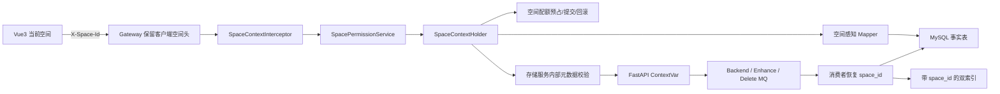

# PrivateCloudDisk 空间管理能力全量集成审计与实施报告

> 审计日期：2026-07-27  
> 涉及项目：`PrivateCloudDisk-web`、`PrivateCloudDisk-platform-service`、
> `PrivateCloudDisk-storage-service`、`PrivateCloudDisk-db`、边缘 Nginx 配置  
> 核心原则：接口路径、主要请求 DTO、响应体和原文件业务保持不变，仅叠加
> `X-Space-Id` 上下文、空间权限与资源归属校验。

## 1. 审计结论

原系统已经具备空间表、成员表、权限表、基础 CRUD、前端空间状态仓库和
`X-Space-Id` 请求拦截器雏形，但文件事实表、关联表、缓存键、内部回调、MQ 消息、
OpenSearch 索引和配额生命周期没有形成统一空间边界。仅在页面切换空间无法保证
数据隔离，存在跨空间串读、协作成员无法访问合法资源、异常分支回滚错误配额等风险。

本次改造已经建立一条统一链路：

## 2. 问题清单与严重程度

| 严重度 | 原有问题 | 影响 | 本次处理 |
|---|---|---|---|
| P0 | 文件、目录只按 `user_id + id` 查询 | 协作空间无法正常工作，错误兼容分支可能串读其他用户历史 NULL 记录 | 所有核心 Mapper 增加当前空间条件；历史 NULL 仅允许个人空间且必须匹配资源所有者 |
| P0 | 业务接口没有统一空间权限前置校验 | 可构造其他空间 ID 形成 IDOR 风险 | 新增统一上下文拦截器、权限服务与资源归属 Mapper |
| P0 | 内部合并回调、MQ 消费线程丢失 HTTP 上下文 | 文件可能写入 NULL 空间，最近访问和配额记入错误空间 | 上传会话作为事实源恢复上下文；所有文件事件携带 `space_id` |
| P1 | 根目录缓存键只有 `user_id` | 切换空间后可能返回上一个空间根目录 | 缓存键增加当前 `space_id` |
| P1 | 上传始终预占个人配额 | 团队/企业空间可能绕过空间容量限制 | 自定义空间使用原子空间配额预占、提交、回滚；个人空间保留旧逻辑 |
| P1 | OpenSearch 始终按上传者过滤 | 协作成员搜不到空间内文件；移除用户过滤又会泄漏 | 索引新增 `space_id`，查询严格按当前空间过滤，个人历史索引保留安全兼容 |
| P1 | 收藏、标签、分享、回收站、最近访问没有空间快照 | 页面切换后关联数据混合 | 关联表、实体、Mapper、Service 全部增加空间字段 |
| P1 | 空间 CRUD 不创建空间根目录 | 新空间进入后根目录不存在 | 创建空间时在同一事务创建根节点和闭包自关联 |
| P1 | 历史用户可能没有个人空间/空间根目录 | 老客户端无头请求失败 | 迁移脚本补建个人空间、成员、权限、根目录并回填数据 |
| P2 | 全量配额接口仍受当前空间头影响 | 当前空间失效时无法拉取可用空间列表 | 全量空间配额接口明确排除当前空间拦截 |
| P2 | 生产 Nginx CORS 未允许 `X-Space-Id` | 跨域部署预检失败 | 允许该请求头并暴露 `X-Resolved-Space-Id` |
| P2 | 空间管理页切换与路由跳转并发 | 目标页短暂加载旧空间数据 | 等待切换成功后跳转，失败自动回滚并提示 |

## 3. 后端公共空间校验设计

### 3.1 请求上下文

- `SpaceContextInterceptor` 统一读取 `X-User-Id` 与可选 `X-Space-Id`。
- 未携带 `X-Space-Id` 时，通过空间所有者查找唯一有效 `personal` 空间。
- 上下文包含空间 ID、用户 ID、空间名称、角色、是否显式传头、是否个人空间。
- 请求结束和异常分支均清理 `ThreadLocal`，避免线程池复用造成串空间。
- 缺失/非法用户头返回稳定的 400，不再由 `UUID.fromString(null)` 触发 500。

### 3.2 权限矩阵

| 操作 | viewer | editor | admin / owner | 细粒度权限可提升 |
|---|---:|---:|---:|---|
| 查看列表 / 读取 / 预览 / 下载 | 是 | 是 | 是 | `can_read` |
| 上传 / 新建 / 重命名 / 移动 / 标签变更 | 否 | 是 | 是 | `can_write` |
| 删除 / 回收站清理 | 否 | 是 | 是 | `can_delete` |
| 创建和管理分享 | 否 | 是 | 是 | `can_share` |
| 空间成员与设置管理 | 否 | 否 | 是 | `can_manage` |

收藏按用户自身偏好处理，要求至少具备空间查看权限。公开分享访问仍以分享令牌和分享
记录内的 `space_id` 为授权依据，不要求访问者携带空间头。

### 3.3 资源归属

- 文件：`(space_id, file_id)`。
- 目录：`(space_id, node_id)`。
- 上传会话：`(space_id, uploads_id)`。
- 个人空间历史 NULL 记录只在 `resource_owner_id = current_user_id` 时兼容。
- 自定义空间不接受 NULL 空间记录。
- 当前 UUID 是全局主键，因此系统不允许同一 `file_id` 在两个空间指向不同实体；
  `(space_id, file_id)` 是授权定位组合而非复合主键。跨空间使用同一 ID 会被归属校验拒绝。

## 4. 数据库与持久层变更

迁移脚本：`PrivateCloudDisk-db/007_space_context_full_integration.sql`。

新增/补齐空间字段：

- 核心表：文件、目录、目录闭包、上传会话。
- 关联表：收藏、标签、文件标签、回收站、分享链接、分享资源、最近访问。
- 媒体表：预览资源、视频观看进度。
- 配额：空间表新增 `space_reserved`。

迁移执行内容：

1. 为历史用户补建唯一个人空间、owner 成员和完整权限。
2. 按资源原所有者回填文件、目录、上传会话到个人空间。
3. 按目标文件/目录回填关联表空间，无法解析时仅回退到记录用户个人空间。
4. 为缺少根目录的所有有效空间补建根节点和闭包自关联。
5. 收藏、标签唯一键增加空间维度。
6. 增加核心定位与列表查询组合索引。

推荐部署顺序：

1. 备份 MySQL 和 OpenSearch。
2. 依次确认 `003_share_resource_migration.sql`、
   `005_preview_resource_persistence.sql`、`006_tag_color_and_preview_resource_cleanup.sql` 已执行。
3. 执行 `007_space_context_full_integration.sql`。
4. 执行脚本末尾的 NULL 记录核查 SQL，目标核心表 NULL 数为 0。
5. 先发布兼容新旧消息的消费者，再发布生产者和 Web 客户端。

## 5. 上传、存储与 MQ 链路

### 5.1 上传与物理命名

- 上传会话创建时保存 `uploads_space_id`。
- 内部开始合并时从上传会话恢复空间上下文，协作成员可正确访问由空间所有者创建的根目录。
- 文件记录继承目标目录的空间 ID，避免信任客户端重复传值。
- 非个人空间物理文件命名为
  `{space_id}-{uploads_id}-{total_chunks}.cloud`；个人空间保持旧命名，兼容已有路径和备份。

### 5.2 配额生命周期

- 个人空间：继续使用原用户配额表和 Redis 锁 + 乐观锁流程。
- 自定义空间：使用空间表原子条件更新：
  `available = space_quota - space_used - space_reserved`。
- 创建上传会话预占；文件可用事件提交；合并失败、扫毒失败、取消或过期删除回滚。
- 永久删除文件在同一事务中减少对应个人/空间已用容量。
- 配额展示使用文件事实表实时聚合，空空间稳定返回 0。

### 5.3 事件拓扑

以下事件均已携带空间：

- Backend 顺序事件：merge → hash → virus scan → mark active。
- Enhance 并行事件及 DLQ：thumbnail、视频转码、HLS、内容索引等。
- 文件可用、下载完成、合并失败、扫毒失败。
- 上传会话删除/删除完成。
- 文件永久删除和预览资源清理。
- 旧配额更新消息增加可选 `space_id`，为空时保留原个人配额逻辑。

消费者从消息恢复空间上下文并在 `finally` 清理。日志已增加空间 ID，便于通过
`space_id + file_id + task_id` 追踪完整流水线。

## 6. 搜索与预览资源

- OpenSearch 基础索引、内容索引映射均新增 keyword 类型 `space_id`。
- 内容索引流水线从 Enhance 事件写入空间 ID。
- 自定义空间查询严格过滤 `space_id`；个人空间兼容迁移前缺少该字段且上传者为当前用户的文档。
- 新增 `scripts/backfill_search_space_id.py`，默认 dry-run，使用 `--apply` 才更新已有索引文档。
- 历史预览资源入库脚本现在同时读取并写入文件的 `space_id`。
- 预览资源数据库查询和 Redis 缓存键包含空间；显式空间请求严格匹配。
- 存储服务调用主业务元数据接口时透传 `X-Space-Id` 和 `X-Space-Operation`，
  读取方再次执行权限与资源归属校验。

## 7. Vue3 客户端改造

- Axios 拦截器统一注入当前 `X-Space-Id`，API SDK 路径、参数和响应体无需改造。
- 空间仓库增加切换中状态、修订号、后端确认后提交、失败回滚和轻量提示。
- 空间列表刷新后若当前空间已失效，自动回退个人空间/首个可用空间。
- 左侧选择器在列表异常或历史用户尚未迁移时仍展示“我的网盘”提示，不出现空白。
- 文件浏览器切换空间后清空旧选择和旧路径，重新加载根目录；面包屑首级显示空间名。
- 首页、收藏、标签、回收站、分享、最近访问、搜索均显示当前空间标识并监听空间修订号刷新。
- 配额组件随空间切换更新；空间管理页展示全部空间的总量、已用、文件数和使用率，支持名称筛选与排序。
- 进入空间时等待切换请求完成后再导航，避免旧数据闪烁。

## 8. 兼容性

- 不传 `X-Space-Id`：后端解析当前用户个人空间；原路径、方法、DTO、响应体不变。
- 传入个人空间 ID：与无头行为等价，但返回 `X-Resolved-Space-Id` 便于诊断。
- 传入无权限、禁用或不存在空间：返回明确 403/400，不降级到个人空间，避免掩盖越权。
- 旧 MQ 消息没有空间字段时按个人空间兼容；新消息完整传播空间。
- 数据库保留 nullable 字段用于滚动升级和历史恢复，但迁移后正常业务写入均为非空。

## 9. 已完成验证

| 验证项 | 结果 |
|---|---|
| Vue3/Vite 生产构建 | 通过，1832 个模块完成转换与产物压缩 |
| Java 主业务服务编译 | 通过 |
| `SpacePermissionServiceImplTest` | 通过，覆盖个人空间回退、非成员拒绝、角色全操作矩阵、跨空间资源拒绝 |
| Python `compileall` | 通过 |
| 存储服务契约测试 | 12 项通过：DLQ、Preview Token、Backend/Enhance 空间传播、搜索索引字段 |
| MyBatis Mapper XML 语法 | 全部通过 `xmllint` |

未在本机伪造通过的项目：

- MySQL 迁移未连接真实业务库执行。
- OpenSearch 历史索引回填未连接真实集群执行。
- RabbitMQ、Redis、MySQL、OpenSearch 全容器端到端测试需要在集成环境完成。
- Safari/Chrome/移动端视觉回归需要启动真实服务并使用测试账号执行。

## 10. 联调测试建议

### 10.1 权限与隔离

1. owner、admin、editor、viewer 各创建账号并加入同一团队空间。
2. 对查看、预览、下载、上传、重命名、移动、删除、分享、标签逐项验证矩阵。
3. 使用空间 A 的头访问空间 B 的 file/node/uploads ID，统一期望资源不存在或无权限。
4. 移除成员后重放旧请求，确认立即失效。
5. 删除/禁用当前空间后刷新全量配额，确认仍能加载其余空间。

### 10.2 兼容性

1. 使用不发送 `X-Space-Id` 的旧客户端回归全部个人网盘接口。
2. 分别发送个人空间 ID 和不发送头，对比响应数据。
3. 迁移前保留一条 NULL 历史资源，确认只有原所有者个人空间可见。

### 10.3 上传与 MQ

1. editor 向空间所有者创建的根目录上传文件。
2. 验证上传会话、文件、预览资源、OpenSearch 文档空间一致。
3. 人为触发合并失败、扫毒失败、取消和过期，检查 `space_reserved` 回到原值。
4. 重放同一事件，确认幂等键阻止重复提交。
5. 永久删除文件，确认关联记录、预览实体、搜索索引和空间配额最终一致。

### 10.4 前端

1. 在文件浏览器、收藏、标签、回收站、分享、最近访问、搜索之间切换空间。
2. 确认页面顶部标识、面包屑、列表、配额同步更新且无旧数据闪烁。
3. 验证无自建空间账号始终显示并选中“我的网盘”。
4. 在 360/768/1024/1440px 宽度和 Safari、Chrome、微信内置浏览器回归。

## 11. 风险与规避措施

- **迁移锁表风险**：大表回填和建索引应在低峰期执行；先在从库统计行数和预计耗时。
- **滚动升级消息兼容**：先发消费者、后发生产者；本次所有新增消息字段均可选。
- **OpenSearch 历史文档不可见**：发布后先运行 dry-run，再使用 `--apply` 回填；缺失文档需重新投递内容索引任务。
- **配额历史偏差**：展示以活跃文件事实表聚合为准；上线后对 `space_used` 做一次对账并保留告警。
- **ThreadLocal 泄漏**：HTTP 拦截器和 MQ 消费者均在 `finally` 清理，后续新增异步执行器不得直接继承线程上下文。
- **空间删除竞态**：切换和业务请求以服务端权限校验为最终判定；前端失败时回退并刷新空间列表。
- **全局 UUID 约束**：当前不支持两个空间复用相同资源 UUID；若未来改为租户内局部 ID，需要单独迁移为复合唯一键，不能仅放宽现表主键。

## 12. 上线检查清单

- [ ] 备份 MySQL、OpenSearch、Redis 关键元数据。
- [ ] 执行 007 迁移并确认核心资源空间 NULL 数为 0。
- [ ] 先发布兼容新旧字段的消费者。
- [ ] 发布 platform-service 与 storage-service。
- [ ] 启动 Worker，确认 OpenSearch mapping 自动增加 `space_id`。
- [ ] dry-run 并执行历史预览资源、搜索索引空间回填。
- [ ] 发布 Web/Nginx，确认 CORS 允许 `X-Space-Id`。
- [ ] 执行权限矩阵、旧客户端、跨空间 IDOR 和异常回滚测试。
- [ ] 观察 24 小时空间配额差异、DLQ、403/404 比率与上传失败率。
