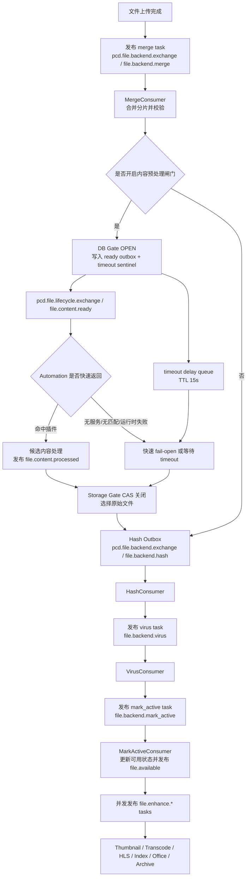
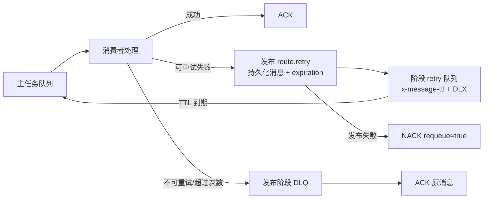

# Storage Worker Task Bus 审计与文件后处理流水线

> 需求编号：`REQ-WORKER-TASKBUS-2026-07`  
> 本文以当前代码为准，说明文件后台处理、内容预处理闸门和文件增强的任务编排、重试、死信与快速降级边界。

## 1. 结论

文件后台处理和文件增强是有明确先后关系或明确执行目标的任务流水线，恢复使用 Task Bus。发布者知道下一步要执行的任务路由，消费者完成任务后再投递下一阶段；这与“事实事件广播”的 Event Bus 语义不同。

当前实现不再使用 backend Event Bus 的事件适配消费者、统一消息契约包或 `pcd.file.backend.event.*` 拓扑。`file.available` 和 `file.content.*` 仍是跨服务生命周期/领域事件，但它们不承担 backend 阶段任务编排。

## 2. Task Bus 拓扑

### 2.1 Backend 顺序任务

| 阶段 | 交换机 | 任务路由键 | 消费队列 | retry 队列 | DLX / DLQ |
|---|---|---|---|---|---|
| Merge | `pcd.file.backend.exchange` DIRECT | `file.backend.merge` | `pcd.file.backend.merge.queue` | `pcd.file.backend.merge.queue.retry` | `pcd.file.backend.dlx` / `pcd.file.backend.merge.dlq` |
| Hash | `pcd.file.backend.exchange` DIRECT | `file.backend.hash` | `pcd.file.backend.hash.queue` | `pcd.file.backend.hash.queue.retry` | `pcd.file.backend.dlx` / `pcd.file.backend.hash.dlq` |
| Virus | `pcd.file.backend.exchange` DIRECT | `file.backend.virus` | `pcd.file.backend.virus.queue` | `pcd.file.backend.virus.queue.retry` | `pcd.file.backend.dlx` / `pcd.file.backend.virus.dlq` |
| Mark active | `pcd.file.backend.exchange` DIRECT | `file.backend.mark_active` | `pcd.file.backend.mark_active.queue` | `pcd.file.backend.mark_active.queue.retry` | `pcd.file.backend.dlx` / `pcd.file.backend.mark_active.dlq` |

每个主队列都绑定同一个 backend DLX，主队列消息 TTL 为 7 天。每个 retry 队列是持久队列，设置 7 天队列 TTL，并通过 `x-dead-letter-exchange=pcd.file.backend.exchange` 和原任务 routing key 回流主队列。

### 2.2 Enhancement 并发任务

交换机为 `pcd.file.enhance.exchange`（DIRECT），任务路由键为 `file.enhance.thumbnail`、`file.enhance.transcode`、`file.enhance.hls`、`file.enhance.index`、`file.enhance.office_to_pdf` 和 `file.enhance.archive_parse`。每个阶段拥有独立主队列、独立 `<queue>.retry` 队列和独立 DLQ，互不阻塞。

`mark_active` 完成后按文件类型向对应增强任务队列投递 `FileEnhanceEvent`。这表示“请执行增强任务”，不是向未知订阅者广播事实。

## 3. 完整文件生命周期

### 3.1 每一步的发布者和消费者

1. 上传接口创建 `FileBackendEvent(stage=merge)`，发布到 `pcd.file.backend.exchange`，路由键 `file.backend.merge`。
2. `MergeConsumer` 完成合并后，如果启用内容闸门，只创建 Gate 和两个 Outbox；Gate 的正常关闭、超时、DLQ 和 sweeper 都通过同一个 CAS 继续 hash。否则直接投递 `file.backend.hash`。
3. `HashConsumer` 计算哈希后投递 `file.backend.virus`；`VirusConsumer` 完成扫描后投递 `file.backend.mark_active`。
4. `MarkActiveConsumer` 更新文件为可用并发布既有 `file.available` 领域事件，然后由它按文件类型投递增强任务。
5. 每个消费者只负责自己的任务和下一阶段任务，不创建 Event Bus 订阅适配层。

## 4. 重试与死信

重试的正确顺序是：先把带递增 `retry_count` 的任务发布到 `<原路由>.retry`，等待 Broker 发布完成，再 ACK 原消息。消费者不 `asyncio.sleep`，也不把带延迟的消息直接投递主队列。

RabbitMQ 的队列参数 `x-message-ttl` 使用毫秒，因此 `x-message-ttl=604800000` 是 7 天。AMQP 协议层的 `expiration` 也是毫秒字符串，但本项目的 `aio-pika 9.6.2` `Message(expiration=...)` 接口按秒接收并在编码时自动转换：`publish_message(delay_seconds=5)` 传入 `5`，线上属性为约 `5000` 毫秒。消息先进入阶段专属 retry 队列，约 5 秒后由该队列的 DLX 以原 routing key 回流主队列；只设置 `expiration` 而没有 retry 队列的 DLX/回流键，不能形成完整重试链路。

此前消息停在 retry 队列的根因有三点：

- 部分旧增强消费者等待后把消息发回主 routing key，`.retry` 路由被注释或未使用；
- retry 队列没有同时声明 TTL、DLX 和原 routing key，因此没有回流路径；
- 已存在但参数不一致的 RabbitMQ 队列不能被无损自动改造，`_declare_queue_safe` 会在队列非空时沿用旧参数。

当前代码已统一调用 `publish_retry_message()`，并为 backend、enhancement、file delete 和 processed lifecycle retry 队列补齐回流参数。部署时若 RabbitMQ 中已经存在旧参数队列，应在停 Worker、核对待处理消息并完成备份后，由运维按变更单清空/删除并重建对应 retry 队列；代码不会静默删除非空队列。

## 5. 内容预处理的快速降级

内容预处理不是 backend Task Bus 的一个新阶段，而是 merge 与 hash 之间的可选生命周期闸门：

- `pcd.file.lifecycle.exchange`（TOPIC）发布 `file.content.ready`，由 `pcd.automation.file.content.ready.q` 消费。
- Storage 同事务写入 `pcd.storage.file.content.timeout.delay.q`。该队列 TTL 当前为 15 秒，到期后通过 `file.content.timeout` 投递 `pcd.storage.file.content.timeout.q`。
- 没有 Automation 消费者时，不是等待 MQ 队列自己熔断，而是 timeout sentinel 到期；Storage timeout consumer 调用 Gate CAS，选择原始文件并继续发布 hash。数据库 sweeper 每 3 秒检查一次 OPEN Gate，作为第二逃生路径。
- processed 消费失败使用固定 `5/30/120` 秒 retry 队列；超过 retry 或进入 processed DLQ 时，专属 DLQ consumer 仍调用 Gate CAS fail-open。ready DLQ 同样走 ready 专属 fallback。
- Automation 的插件目录匹配默认连接/读取超时为 500ms。没有匹配插件时返回空匹配，不阻塞 Gate；目录服务不可用时也在短超时内进入无匹配/失败结果。
- 插件运行时默认超时为 8 秒，Automation 使用持久化 processed 结果让 Storage 继续推进；这使正常的“无插件/服务未启动”路径明显短于原来的长连接等待。

因此，当前降级手段是三层组合：插件 HTTP 应用级短超时、RabbitMQ TTL timeout sentinel、数据库 sweeper/CAS。普通 Task Bus retry TTL 只用于任务失败重试，不承担内容预处理的业务熔断。

## 6. OpenSearch 降级

Worker 启动调用 `ensure_indices()`。如果连接失败，本进程记录 `_opensearch_available=False`。内容索引流水线入口和 `IndexService` 双重检查该状态，直接返回 `success=True, skipped=True` 或安全跳过写入，不再在后续增强中重新创建客户端并抛异常。因此 OpenSearch 不可用只影响内容搜索索引，不会制造无意义的增强重试或 DLQ；重新启用通过重启 Worker 重新探测。

## 7. 运行与验收要点

- 验证 RabbitMQ 中四个 backend retry 队列和六个 enhancement retry 队列都存在 `x-message-ttl`、`x-dead-letter-exchange`、`x-dead-letter-routing-key`。
- 投递一条可重试任务，确认它先出现在 `<queue>.retry`，TTL 到期后回到原主队列，而不是永久停留或直接进入主队列。
- 停止 Automation，上传文件，确认约 15 秒内 Gate 走 timeout/fallback 并发布 hash；不应等待 180 秒级连接超时。
- 停止 OpenSearch 后重启 Worker，确认内容 index 任务显示 skipped/success，merge/hash/virus/mark_active 仍继续。
- 清理或迁移旧的 `pcd.file.backend.event.*` exchange、queue、binding 前，先核对消息数量和消费者，避免误删未处理任务。
